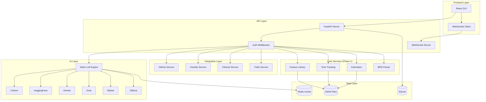

# Design Document: AITEA AI Agent (Phase 2)

## Overview

AITEA AI Agent extends the Phase 1 estimation engine with AI-powered capabilities, external integrations, and a graphical user interface. The system uses a multi-LLM architecture with fallback support, connects to GitHub for automatic feature extraction, integrates with time tracking tools (Clockify, ClickUp, Trello), and provides a modern web-based GUI built with FastAPI and React.

### Design Decisions

1. **Multi-LLM Architecture**: Support for 6 LLM providers with automatic fallback ensures reliability and flexibility
2. **FastAPI Backend**: High-performance async Python backend that extends Phase 1 services
3. **React Frontend**: Modern, responsive UI with real-time updates
4. **SQLite + JSON Hybrid**: SQLite for relational data (users, audit), JSON for estimation data (compatibility with Phase 1)
5. **Async Integration Layer**: Non-blocking external API calls for GitHub and time tracking services
6. **LangChain Integration**: Unified LLM interface with built-in retry and fallback logic

## Architecture



## Components and Interfaces

### 1. Multi-LLM Engine

Unified interface for multiple LLM providers with automatic fallback.

```python
from abc import ABC, abstractmethod
from typing import List, Optional, Dict, Any
from dataclasses import dataclass
from enum import Enum

class LLMProvider(Enum):
    COHERE = "cohere"
    HUGGINGFACE = "huggingface"
    GEMINI = "gemini"
    GROK = "grok"
    MISTRAL = "mistral"
    OLLAMA = "ollama"

@dataclass
class LLMConfig:
    provider: LLMProvider
    api_key: str
    model: str
    base_url: Optional[str] = None
    max_tokens: int = 4096
    temperature: float = 0.7

@dataclass
class LLMResponse:
    content: str
    provider: LLMProvider
    model: str
    tokens_used: int
    latency_ms: float

class ILLMEngine(ABC):
    @abstractmethod
    async def complete(self, prompt: str, system_prompt: Optional[str] = None) -> LLMResponse: ...
    
    @abstractmethod
    async def extract_features(self, text: str) -> List[ExtractedFeature]: ...
    
    @abstractmethod
    async def analyze_code(self, code: str, language: str) -> CodeAnalysis: ...
    
    @abstractmethod
    async def generate_questions(self, context: str, ambiguities: List[str]) -> List[str]: ...
    
    @abstractmethod
    def set_fallback_chain(self, providers: List[LLMProvider]) -> None: ...
    
    @abstractmethod
    async def test_provider(self, provider: LLMProvider) -> bool: ...
```

### 2. LLM Provider Implementations

```python
class CohereProvider:
    """Cohere API integration using cohere-python SDK."""
    def __init__(self, config: LLMConfig): ...
    async def complete(self, prompt: str) -> str: ...

class HuggingFaceProvider:
    """HuggingFace Inference API integration."""
    def __init__(self, config: LLMConfig): ...
    async def complete(self, prompt: str) -> str: ...

class GeminiProvider:
    """Google Gemini API integration using google-generativeai SDK."""
    def __init__(self, config: LLMConfig): ...
    async def complete(self, prompt: str) -> str: ...

class GrokProvider:
    """xAI Grok API integration."""
    def __init__(self, config: LLMConfig): ...
    async def complete(self, prompt: str) -> str: ...

class MistralProvider:
    """Mistral AI API integration using mistralai SDK."""
    def __init__(self, config: LLMConfig): ...
    async def complete(self, prompt: str) -> str: ...

class OllamaProvider:
    """Local Ollama integration."""
    def __init__(self, config: LLMConfig): ...
    async def complete(self, prompt: str) -> str: ...
```

### 3. GitHub Integration Service

```python
from dataclasses import dataclass
from typing import List, Optional
from datetime import datetime

@dataclass
class GitHubRepo:
    owner: str
    name: str
    default_branch: str
    languages: Dict[str, int]
    last_updated: datetime

@dataclass
class CodeAnalysis:
    features: List[ExtractedFeature]
    components: List[str]
    tech_stack: List[str]
    architecture_patterns: List[str]
    confidence: float

class IGitHubService(ABC):
    @abstractmethod
    async def authenticate(self, token: str) -> bool: ...
    
    @abstractmethod
    async def list_repos(self, org: Optional[str] = None) -> List[GitHubRepo]: ...
    
    @abstractmethod
    async def analyze_repo(self, owner: str, repo: str) -> CodeAnalysis: ...
    
    @abstractmethod
    async def get_file_contents(self, owner: str, repo: str, path: str) -> str: ...
    
    @abstractmethod
    async def watch_repo(self, owner: str, repo: str, callback: Callable) -> None: ...
```

### 4. Time Tracking Integration Services

```python
@dataclass
class TimeEntry:
    id: str
    source: str  # clockify, clickup, trello
    user_name: str
    project_name: str
    task_name: str
    hours: float
    date: datetime
    tags: List[str]

class ITimeTrackingIntegration(ABC):
    @abstractmethod
    async def authenticate(self, credentials: Dict[str, str]) -> bool: ...
    
    @abstractmethod
    async def fetch_entries(self, since: Optional[datetime] = None) -> List[TimeEntry]: ...
    
    @abstractmethod
    async def map_to_features(self, entries: List[TimeEntry]) -> List[TrackedTimeEntry]: ...
    
    @abstractmethod
    async def get_sync_status(self) -> SyncStatus: ...

class ClockifyService(ITimeTrackingIntegration):
    """Clockify API integration."""
    BASE_URL = "https://api.clockify.me/api/v1"
    ...

class ClickUpService(ITimeTrackingIntegration):
    """ClickUp API integration."""
    BASE_URL = "https://api.clickup.com/api/v2"
    ...

class TrelloService(ITimeTrackingIntegration):
    """Trello API integration with time tracking power-ups."""
    BASE_URL = "https://api.trello.com/1"
    ...
```

### 5. Continuous Learning Service

```python
@dataclass
class TrainingDataset:
    entries: List[TrackedTimeEntry]
    features: List[Feature]
    created_at: datetime
    entry_count: int

@dataclass
class EstimationModel:
    id: str
    version: str
    trained_at: datetime
    entry_count: int
    accuracy_metrics: Dict[str, float]

class IContinuousLearningService(ABC):
    @abstractmethod
    def get_training_readiness(self) -> TrainingReadiness: ...
    
    @abstractmethod
    async def train_model(self, dataset: TrainingDataset) -> EstimationModel: ...
    
    @abstractmethod
    def predict(self, feature: Feature) -> EstimationPrediction: ...
    
    @abstractmethod
    def compare_with_llm(self, feature: Feature, llm_estimate: float) -> ComparisonResult: ...
    
    @abstractmethod
    def add_training_data(self, entries: List[TrackedTimeEntry]) -> None: ...
```

### 6. FastAPI Backend

```python
from fastapi import FastAPI, Depends, HTTPException
from fastapi.middleware.cors import CORSMiddleware
from fastapi.websockets import WebSocket

app = FastAPI(title="AITEA AI Agent", version="2.0.0")

# Feature Library Endpoints
@app.get("/api/features")
async def list_features(): ...

@app.post("/api/features")
async def create_feature(feature: FeatureInput): ...

# Estimation Endpoints
@app.post("/api/estimate/brd")
async def estimate_from_brd(brd: BRDInput): ...

@app.post("/api/estimate/features")
async def estimate_features(features: List[str]): ...

# Integration Endpoints
@app.post("/api/integrations/github/connect")
async def connect_github(token: str): ...

@app.post("/api/integrations/clockify/connect")
async def connect_clockify(api_key: str): ...

@app.post("/api/integrations/clickup/connect")
async def connect_clickup(token: str): ...

@app.post("/api/integrations/trello/connect")
async def connect_trello(api_key: str, token: str): ...

@app.post("/api/integrations/sync")
async def sync_integrations(): ...

# LLM Endpoints
@app.get("/api/llm/providers")
async def list_providers(): ...

@app.post("/api/llm/test")
async def test_provider(provider: LLMProvider): ...

@app.post("/api/llm/analyze")
async def analyze_with_llm(text: str): ...

# WebSocket for real-time updates
@app.websocket("/ws")
async def websocket_endpoint(websocket: WebSocket): ...
```

### 7. React Frontend Structure

```
frontend/
├── src/
│   ├── components/
│   │   ├── Dashboard/
│   │   ├── FeatureLibrary/
│   │   ├── Estimation/
│   │   ├── Integrations/
│   │   ├── Settings/
│   │   └── common/
│   ├── hooks/
│   │   ├── useFeatures.ts
│   │   ├── useEstimation.ts
│   │   ├── useWebSocket.ts
│   │   └── useLLM.ts
│   ├── services/
│   │   ├── api.ts
│   │   └── websocket.ts
│   ├── store/
│   │   └── index.ts
│   └── App.tsx
├── package.json
└── vite.config.ts
```

## Data Models

### LLM Configuration

```python
@dataclass
class LLMProviderConfig:
    provider: LLMProvider
    api_key: str
    model: str
    enabled: bool = True
    priority: int = 0  # Lower = higher priority in fallback chain
    rate_limit: int = 60  # Requests per minute
    timeout_seconds: int = 30

@dataclass
class LLMEngineConfig:
    providers: List[LLMProviderConfig]
    fallback_enabled: bool = True
    retry_attempts: int = 3
    retry_delay_seconds: float = 1.0
```

### Integration Credentials

```python
@dataclass
class GitHubCredentials:
    token: str
    token_type: str = "pat"  # pat or oauth

@dataclass
class ClockifyCredentials:
    api_key: str
    workspace_id: Optional[str] = None

@dataclass
class ClickUpCredentials:
    api_token: str
    team_id: Optional[str] = None

@dataclass
class TrelloCredentials:
    api_key: str
    token: str
    board_ids: List[str] = field(default_factory=list)
```

### Sync Status

```python
@dataclass
class SyncStatus:
    integration: str
    last_sync: Optional[datetime]
    entries_synced: int
    status: Literal["connected", "disconnected", "syncing", "error"]
    error_message: Optional[str] = None
```

### User and Audit

```python
@dataclass
class User:
    id: str
    email: str
    name: str
    role: Literal["admin", "manager", "viewer"]
    created_at: datetime

@dataclass
class AuditEntry:
    id: str
    user_id: str
    action: str
    entity_type: str
    entity_id: str
    changes: Dict[str, Any]
    timestamp: datetime
```

## Correctness Properties

*A property is a characteristic or behavior that should hold true across all valid executions of a system-essentially, a formal statement about what the system should do. Properties serve as the bridge between human-readable specifications and machine-verifiable correctness guarantees.*

### Property 23: LLM fallback chain execution
*For any* LLM request where the primary provider fails, the system should attempt each provider in the fallback chain in priority order until one succeeds or all fail.
**Validates: Requirements 9.2**

### Property 24: LLM provider configuration validation
*For any* LLM provider configuration, the system should validate the API key format and test connectivity before accepting the configuration.
**Validates: Requirements 9.4**

### Property 25: Rate limiting enforcement
*For any* sequence of LLM requests exceeding the configured rate limit, the system should delay subsequent requests to stay within limits.
**Validates: Requirements 9.5**

### Property 26: GitHub feature extraction consistency
*For any* repository analysis, extracted features should be deterministic given the same repository state and LLM responses.
**Validates: Requirements 11.3**

### Property 27: Time tracking entry mapping
*For any* imported time entry from external integrations, the system should map it to a feature library entry or mark it as unmapped.
**Validates: Requirements 12.4**

### Property 28: Sync timestamp tracking
*For any* integration synchronization, the system should only fetch entries newer than the last sync timestamp.
**Validates: Requirements 12.5**

### Property 29: Training data threshold
*For any* training request, the system should only proceed if the dataset contains at least 100 tracked time entries.
**Validates: Requirements 13.1**

### Property 30: Model prediction comparison
*For any* feature with both custom model and LLM estimates, the system should flag discrepancies exceeding 30% difference.
**Validates: Requirements 13.5**

### Property 31: Optimistic locking consistency
*For any* concurrent modification attempt, the system should detect conflicts and prevent data loss.
**Validates: Requirements 16.1**

### Property 32: Audit trail completeness
*For any* data modification, the system should create an audit entry with user, timestamp, and change details.
**Validates: Requirements 16.5**

## Error Handling

### LLM Errors

```python
class LLMError(Exception):
    """Base class for LLM-related errors."""
    pass

class ProviderUnavailableError(LLMError):
    """Raised when an LLM provider is unavailable."""
    provider: LLMProvider
    
class RateLimitError(LLMError):
    """Raised when rate limit is exceeded."""
    retry_after: float

class AllProvidersFailedError(LLMError):
    """Raised when all providers in fallback chain fail."""
    failures: Dict[LLMProvider, Exception]
```

### Integration Errors

```python
class IntegrationError(Exception):
    """Base class for integration errors."""
    integration: str

class AuthenticationError(IntegrationError):
    """Raised when authentication fails."""
    pass

class SyncError(IntegrationError):
    """Raised when synchronization fails."""
    last_successful_entry: Optional[str]
```

## Testing Strategy

### Unit Testing

Use **pytest** with **pytest-asyncio** for async service testing.

### Property-Based Testing

Use **Hypothesis** for property-based testing of:
- LLM fallback chain behavior
- Data mapping consistency
- Concurrent modification handling

### Integration Testing

- Mock external APIs (GitHub, Clockify, ClickUp, Trello) using **responses** or **aioresponses**
- Test LLM providers with recorded responses
- End-to-end GUI testing with **Playwright**

### Dependencies

```
# requirements.txt (Phase 2 additions)
fastapi>=0.100.0
uvicorn>=0.23.0
websockets>=11.0
httpx>=0.24.0
cohere>=4.0.0
google-generativeai>=0.3.0
mistralai>=0.0.7
langchain>=0.1.0
sqlalchemy>=2.0.0
alembic>=1.12.0
redis>=5.0.0
python-jose>=3.3.0
passlib>=1.7.4
aioresponses>=0.7.4
playwright>=1.40.0
```


### 8. Additional Repository Integration Services

```python
class IGitLabService(ABC):
    """GitLab API integration supporting gitlab.com and self-hosted."""
    @abstractmethod
    async def authenticate(self, token: str, base_url: str = "https://gitlab.com") -> bool: ...
    
    @abstractmethod
    async def list_projects(self, group: Optional[str] = None) -> List[GitLabProject]: ...
    
    @abstractmethod
    async def analyze_project(self, project_id: int) -> CodeAnalysis: ...

class IBitbucketService(ABC):
    """Bitbucket API integration supporting Cloud and Server."""
    @abstractmethod
    async def authenticate(self, credentials: BitbucketCredentials) -> bool: ...
    
    @abstractmethod
    async def list_repositories(self, workspace: str) -> List[BitbucketRepo]: ...
    
    @abstractmethod
    async def analyze_repository(self, workspace: str, repo_slug: str) -> CodeAnalysis: ...
```

### 9. Additional Time Tracking Integration Services

```python
class JiraService(ITimeTrackingIntegration):
    """Jira API integration with worklog support."""
    BASE_URL = "https://{domain}.atlassian.net/rest/api/3"
    
    async def fetch_worklogs(self, project_key: str, since: datetime) -> List[TimeEntry]: ...
    async def get_issue_hierarchy(self, issue_key: str) -> IssueHierarchy: ...

class AsanaService(ITimeTrackingIntegration):
    """Asana API integration."""
    BASE_URL = "https://app.asana.com/api/1.0"
    
    async def fetch_time_entries(self, workspace_gid: str) -> List[TimeEntry]: ...

class MondayService(ITimeTrackingIntegration):
    """Monday.com API integration."""
    BASE_URL = "https://api.monday.com/v2"
    
    async def fetch_time_tracking_columns(self, board_id: str) -> List[TimeEntry]: ...

class LinearService(ITimeTrackingIntegration):
    """Linear API integration."""
    BASE_URL = "https://api.linear.app/graphql"
    
    async def fetch_issue_estimates(self, team_id: str) -> List[TimeEntry]: ...
```

### 10. Project Management Service

```python
@dataclass
class SprintPlan:
    sprint_name: str
    capacity_hours: float
    features: List[str]
    total_estimated_hours: float
    utilization_percentage: float

@dataclass
class ResourceAllocation:
    member_name: str
    assigned_features: List[str]
    total_hours: float
    skill_match_score: float

@dataclass
class GanttItem:
    feature: str
    start_date: datetime
    end_date: datetime
    dependencies: List[str]
    assigned_to: Optional[str]

@dataclass
class RiskAssessment:
    feature: str
    risk_level: Literal["low", "medium", "high"]
    factors: List[str]
    mitigation_suggestions: List[str]

class IProjectManagementService(ABC):
    @abstractmethod
    def suggest_sprint_plan(self, features: List[str], capacity_hours: float) -> SprintPlan: ...
    
    @abstractmethod
    def allocate_resources(self, features: List[str], team: List[TeamMember]) -> List[ResourceAllocation]: ...
    
    @abstractmethod
    def generate_gantt(self, estimate: ProjectEstimate) -> List[GanttItem]: ...
    
    @abstractmethod
    def assess_risks(self, estimate: ProjectEstimate) -> List[RiskAssessment]: ...
    
    @abstractmethod
    def suggest_deferrals(self, sprint: SprintPlan, priority_order: List[str]) -> List[str]: ...
```

### 11. Analytics Service

```python
@dataclass
class AccuracyTrend:
    period: str
    estimated_hours: float
    actual_hours: float
    accuracy_percentage: float

@dataclass
class VelocityData:
    period: str
    hours_completed: float
    features_completed: int

@dataclass
class ComplexityDistribution:
    feature_type: str
    count: int
    avg_hours: float
    std_dev: float

class IAnalyticsService(ABC):
    @abstractmethod
    def get_accuracy_trends(self, date_range: DateRange) -> List[AccuracyTrend]: ...
    
    @abstractmethod
    def get_velocity_data(self, date_range: DateRange, granularity: str) -> List[VelocityData]: ...
    
    @abstractmethod
    def get_complexity_distribution(self) -> List[ComplexityDistribution]: ...
    
    @abstractmethod
    def compare_periods(self, period1: DateRange, period2: DateRange) -> PeriodComparison: ...
    
    @abstractmethod
    def generate_pdf_report(self, date_range: DateRange) -> bytes: ...
```

### 12. Notification Service

```python
class NotificationType(Enum):
    ESTIMATE_COMPLETE = "estimate_complete"
    SYNC_FAILURE = "sync_failure"
    DISCREPANCY_ALERT = "discrepancy_alert"
    DAILY_DIGEST = "daily_digest"
    WEEKLY_REPORT = "weekly_report"

@dataclass
class NotificationConfig:
    slack_webhook_url: Optional[str] = None
    teams_webhook_url: Optional[str] = None
    email_recipients: List[str] = field(default_factory=list)
    enabled_types: List[NotificationType] = field(default_factory=list)

class INotificationService(ABC):
    @abstractmethod
    async def send_slack(self, message: str, channel: Optional[str] = None) -> bool: ...
    
    @abstractmethod
    async def send_teams(self, message: str) -> bool: ...
    
    @abstractmethod
    async def send_email(self, subject: str, body: str, recipients: List[str]) -> bool: ...
    
    @abstractmethod
    async def notify(self, notification_type: NotificationType, data: Dict[str, Any]) -> None: ...
    
    @abstractmethod
    def schedule_digest(self, frequency: str, time: str) -> None: ...
```

### 13. Multi-tenancy Service

```python
@dataclass
class Organization:
    id: str
    name: str
    slug: str
    created_at: datetime

@dataclass
class Workspace:
    id: str
    organization_id: str
    name: str
    settings: Dict[str, Any]

class Role(Enum):
    ADMIN = "admin"
    MANAGER = "manager"
    VIEWER = "viewer"

@dataclass
class UserMembership:
    user_id: str
    workspace_id: str
    role: Role

class SSOProvider(Enum):
    GOOGLE = "google"
    MICROSOFT = "microsoft"
    SAML = "saml"

class IMultiTenancyService(ABC):
    @abstractmethod
    def create_organization(self, name: str) -> Organization: ...
    
    @abstractmethod
    def create_workspace(self, org_id: str, name: str) -> Workspace: ...
    
    @abstractmethod
    def add_user_to_workspace(self, user_id: str, workspace_id: str, role: Role) -> UserMembership: ...
    
    @abstractmethod
    def check_permission(self, user_id: str, workspace_id: str, action: str) -> bool: ...
    
    @abstractmethod
    async def configure_sso(self, org_id: str, provider: SSOProvider, config: Dict) -> bool: ...
    
    @abstractmethod
    def get_audit_log(self, workspace_id: str, date_range: DateRange) -> List[AuditEntry]: ...
```

### 14. Advanced AI Service

```python
@dataclass
class PromptTemplate:
    id: str
    name: str
    template: str
    variables: List[str]
    scenario: str

@dataclass
class EstimationReasoning:
    feature: str
    estimate_hours: float
    reasoning_steps: List[str]
    similar_features: List[Tuple[str, float]]  # (feature_name, similarity_score)
    confidence_factors: Dict[str, float]

class IAdvancedAIService(ABC):
    @abstractmethod
    async def rag_query(self, query: str, context_limit: int = 5) -> str: ...
    
    @abstractmethod
    async def explain_estimate(self, feature: str, estimate: float) -> EstimationReasoning: ...
    
    @abstractmethod
    def save_prompt_template(self, template: PromptTemplate) -> None: ...
    
    @abstractmethod
    def list_prompt_templates(self, scenario: Optional[str] = None) -> List[PromptTemplate]: ...
    
    @abstractmethod
    async def find_similar_features(self, feature_description: str, top_k: int = 5) -> List[Tuple[Feature, float]]: ...
    
    @abstractmethod
    async def suggest_data_collection(self, feature: str, current_confidence: float) -> List[str]: ...
```

## Additional Data Models

### Additional Integration Credentials

```python
@dataclass
class GitLabCredentials:
    token: str
    base_url: str = "https://gitlab.com"

@dataclass
class BitbucketCredentials:
    username: str
    app_password: str
    is_cloud: bool = True
    server_url: Optional[str] = None

@dataclass
class JiraCredentials:
    email: str
    api_token: str
    domain: str

@dataclass
class AsanaCredentials:
    personal_access_token: str

@dataclass
class MondayCredentials:
    api_token: str

@dataclass
class LinearCredentials:
    api_key: str
```

## Additional Correctness Properties

### Property 33: Multi-platform repository search
*For any* search query across multiple connected repository platforms, the system should return unified results from all platforms.
**Validates: Requirements 17.4**

### Property 34: Time entry deduplication
*For any* time entries from multiple sources with matching date, user, and task similarity above 90%, the system should identify them as duplicates.
**Validates: Requirements 18.5**

### Property 35: Sprint capacity validation
*For any* sprint plan, the total estimated hours should not exceed the configured capacity without explicit user override.
**Validates: Requirements 19.5**

### Property 36: Analytics date range consistency
*For any* analytics query with a date range, all returned data points should fall within the specified range.
**Validates: Requirements 20.4**

### Property 37: Notification delivery confirmation
*For any* notification sent, the system should track delivery status and retry failed deliveries up to 3 times.
**Validates: Requirements 21.1, 21.2**

### Property 38: Workspace isolation
*For any* data access request, the system should only return data belonging to workspaces the user has access to.
**Validates: Requirements 22.4**

### Property 39: RAG context relevance
*For any* RAG query, the retrieved context should have a minimum similarity score of 0.7 to the query.
**Validates: Requirements 23.1**

### Property 40: Estimation reasoning traceability
*For any* estimate with reasoning, each reasoning step should reference specific data points or rules used.
**Validates: Requirements 23.2**

## Additional Dependencies

```
# requirements.txt (additional Phase 2 dependencies)
# Repository integrations
python-gitlab>=3.15.0
atlassian-python-api>=3.41.0

# Time tracking integrations
asana>=3.2.0
monday>=1.3.0

# Analytics and reporting
matplotlib>=3.8.0
reportlab>=4.0.0
openpyxl>=3.1.0

# Notifications
slack-sdk>=3.23.0
pymsteams>=0.2.2

# Multi-tenancy and auth
python-saml>=1.15.0
authlib>=1.2.0

# AI/ML
chromadb>=0.4.0
sentence-transformers>=2.2.0
scikit-learn>=1.3.0
```

