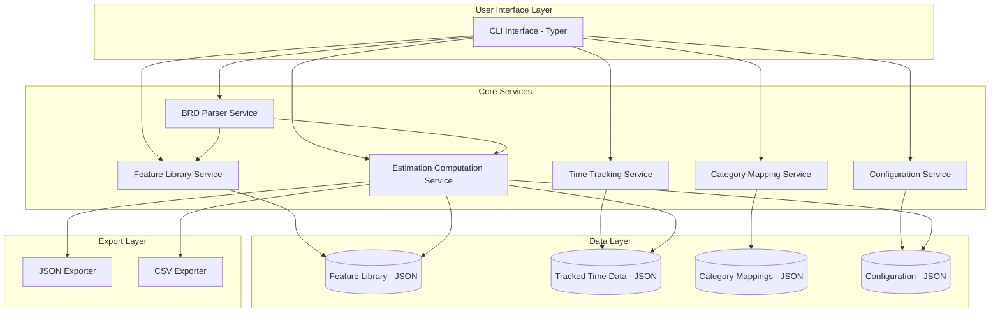

# Design Document: AITEA Estimation Agent

## Overview

AITEA (AI Time Estimation Agent for Web Projects) is a Python-based estimation workflow system that learns from real time-tracking data to improve project estimates. The system provides a CLI interface for feature library management, time tracking import, statistical computation, and project estimation from BRDs. Phase 2 will extend this with AI/LLM capabilities and GUI.

### Design Decisions

1. **Python Implementation**: Chosen for data processing capabilities, rich ecosystem (pandas, numpy), and user familiarity. Enables future AI/ML integration.
2. **JSON-based Persistence**: Simple, human-readable storage format that supports version control and easy debugging.
3. **Modular Architecture**: Separation of concerns enables independent testing and future extensibility.
4. **Statistical Engine**: Built-in computation of mean, median, P80, and standard deviation using numpy/pandas.
5. **CLI-First Design**: Command-line interface using Click/Typer for immediate usability, preparing for Phase 2 GUI.

## Architecture



### Component Interaction Flow

1. **CLI Entry Point**: User interacts via Typer-based CLI commands
2. **Data Ingestion**: CSV imports flow through Time Tracking Service with validation
3. **Feature Matching**: BRD Parser uses Feature Library Service for synonym-based matching
4. **Estimation Pipeline**: Estimation Computation Service aggregates data from all sources
5. **Output Generation**: Results exported via JSON/CSV exporters or displayed in terminal

## Components and Interfaces

### 1. Feature Library Service

Manages the feature library with CRUD operations and synonym-based search.

```python
from abc import ABC, abstractmethod
from typing import List, Optional
from models import Feature, FeatureLibrary, FeatureInput, ValidationError, Result

class IFeatureLibraryService(ABC):
    @abstractmethod
    def create_library(self) -> FeatureLibrary: ...
    
    @abstractmethod
    def add_feature(self, feature: FeatureInput) -> Result[Feature, ValidationError]: ...
    
    @abstractmethod
    def update_feature(self, id: str, updates: dict) -> Result[Feature, Exception]: ...
    
    @abstractmethod
    def search_features(self, query: str) -> List[Feature]: ...
    
    @abstractmethod
    def get_feature_by_name_or_synonym(self, name: str) -> Optional[Feature]: ...
    
    @abstractmethod
    def list_features(self) -> List[Feature]: ...
    
    @abstractmethod
    def delete_feature(self, id: str) -> Result[None, Exception]: ...
```

### 2. Time Tracking Service

Handles CSV import, validation, and time unit conversion.

```python
class ITimeTrackingService(ABC):
    @abstractmethod
    def import_csv(self, file_path: str, options: Optional[ImportOptions] = None) -> ImportResult: ...
    
    @abstractmethod
    def validate_schema(self, headers: List[str]) -> SchemaValidationResult: ...
    
    @abstractmethod
    def convert_to_hours(self, value: float, unit: TimeUnit) -> float: ...
    
    @abstractmethod
    def get_tracked_time_by_feature(self, feature_name: str) -> List[TrackedTimeEntry]: ...
    
    @abstractmethod
    def get_all_tracked_time(self) -> List[TrackedTimeEntry]: ...
```

### 3. Estimation Computation Service

Computes statistics and generates project estimates.

```python
class IEstimationComputationService(ABC):
    @abstractmethod
    def compute_statistics(self, feature_name: str) -> FeatureStatistics: ...
    
    @abstractmethod
    def compute_estimation_table(self) -> List[EstimationTableEntry]: ...
    
    @abstractmethod
    def generate_project_estimate(self, features: List[ExtractedFeature]) -> ProjectEstimate: ...
    
    @abstractmethod
    def detect_overlaps(self, features: List[str]) -> List[OverlapWarning]: ...
    
    @abstractmethod
    def apply_experience_multiplier(self, hours: float, level: ExperienceLevel) -> float: ...
```

### 4. BRD Parser Service

Extracts features from business requirements documents.

```python
class IBRDParserService(ABC):
    @abstractmethod
    def parse_requirements(self, text: str) -> ParseResult: ...
    
    @abstractmethod
    def extract_features(self, text: str) -> List[ExtractedFeature]: ...
    
    @abstractmethod
    def generate_clarifying_questions(self, ambiguities: List[Ambiguity]) -> List[str]: ...
    
    @abstractmethod
    def match_to_library(self, extracted: List[ExtractedFeature], library: List[Feature]) -> MatchResult: ...
```

### 5. Category Mapping Service

Manages feature-to-category relationships.

```python
class ICategoryMappingService(ABC):
    @abstractmethod
    def create_category(self, name: str) -> Result[Category, ValidationError]: ...
    
    @abstractmethod
    def map_feature_to_category(self, feature_id: str, category_id: str, priority: Priority) -> Result[None, Exception]: ...
    
    @abstractmethod
    def get_features_by_category(self, category_id: str) -> List[CategoryFeature]: ...
    
    @abstractmethod
    def get_categories_for_feature(self, feature_id: str) -> List[Category]: ...
    
    @abstractmethod
    def list_categories(self) -> List[Category]: ...
```

### 6. Configuration Service

Manages estimation preferences and settings. Configuration changes trigger recalculation of all derived estimates.

```python
class IConfigurationService(ABC):
    @abstractmethod
    def get_config(self) -> EstimationConfig: ...
    
    @abstractmethod
    def set_estimation_style(self, style: EstimationStyle) -> None: ...
    
    @abstractmethod
    def set_working_hours_per_day(self, hours: int) -> None: ...
    
    @abstractmethod
    def set_experience_multipliers(self, multipliers: ExperienceMultipliers) -> None: ...
    
    @abstractmethod
    def set_buffer_percentage(self, percentage: float) -> None: ...
    
    @abstractmethod
    def on_config_change(self, callback: Callable[[EstimationConfig], None]) -> None: ...
    
    @abstractmethod
    def invalidate_cached_estimates(self) -> None: ...
```

### 7. Persistence Service

Handles data storage and retrieval.

```python
class IPersistenceService(ABC):
    @abstractmethod
    def save_feature_library(self, library: FeatureLibrary) -> Result[None, Exception]: ...
    
    @abstractmethod
    def load_feature_library(self) -> Result[FeatureLibrary, Exception]: ...
    
    @abstractmethod
    def save_tracked_time(self, data: TrackedTimeData) -> Result[None, Exception]: ...
    
    @abstractmethod
    def load_tracked_time(self) -> Result[TrackedTimeData, Exception]: ...
    
    @abstractmethod
    def export_estimation(self, estimate: ProjectEstimate, format: ExportFormat) -> str: ...
    
    @abstractmethod
    def validate_file_integrity(self, content: str) -> ValidationResult: ...
```

### 8. CLI Interface

Command-line interface using Typer for user interaction.

```python
import typer
from rich.console import Console
from rich.table import Table

app = typer.Typer(help="AITEA - AI Time Estimation Agent for Web Projects")
console = Console()

# Feature Library Commands
@app.command()
def add_feature(name: str, team: str, seed_hours: float, synonyms: str = ""): ...

@app.command()
def list_features(): ...

@app.command()
def search_feature(query: str): ...

# Time Tracking Commands
@app.command()
def import_csv(file_path: str): ...

@app.command()
def show_tracked_time(feature: str = None): ...

# Estimation Commands
@app.command()
def estimate(brd_file: str = None, features: str = None): ...

@app.command()
def show_statistics(feature: str = None): ...

# Configuration Commands
@app.command()
def config(key: str = None, value: str = None): ...

# Export Commands
@app.command()
def export(format: str = "json", output: str = None): ...
```

## Data Models

### Process (Middle-tier categorization)

```python
from dataclasses import dataclass, field
from datetime import datetime
from typing import List, Optional, Literal
from enum import Enum

class Process(Enum):
    """Middle-tier categorization between Team and Feature."""
    USER_MANAGEMENT = "User Management"
    CONTENT_MANAGEMENT = "Content Management"
    COMMUNICATION = "Communication"
    DATA_OPERATIONS = "Data Operations"
    MEDIA_HANDLING = "Media Handling"
    INTEGRATION = "Integration"
    REAL_TIME = "Real-time"
    BACKGROUND_PROCESSING = "Background Processing"
    VISUAL_ENHANCEMENT = "Visual Enhancement"
```

### Feature

```python
class Team(Enum):
    FRONTEND = "frontend"
    BACKEND = "backend"
    BOTH = "both"

@dataclass
class SeedTimeHistoryEntry:
    previous_value: float
    new_value: float
    changed_at: datetime

@dataclass
class Feature:
    id: str
    name: str
    team: Team
    process: Process
    seed_time_hours: float
    notes: str = ""
    synonyms: List[str] = field(default_factory=list)
    seed_time_history: List[SeedTimeHistoryEntry] = field(default_factory=list)
    created_at: datetime = field(default_factory=datetime.now)
    updated_at: datetime = field(default_factory=datetime.now)
```

### Feature Library

```python
@dataclass
class FeatureLibrary:
    id: str
    features: List[Feature] = field(default_factory=list)
    created_at: datetime = field(default_factory=datetime.now)
    updated_at: datetime = field(default_factory=datetime.now)
```

### Tracked Time Entry

```python
@dataclass
class TrackedTimeEntry:
    id: str
    team: Literal["frontend", "backend"]
    member_name: str
    feature: str
    tracked_time_hours: float
    process: Optional[Process] = None  # Middle-tier categorization
    category: Optional[str] = None     # Project type (Ecommerce, SaaS, etc.)
    date: Optional[datetime] = None
    imported_at: datetime = field(default_factory=datetime.now)
```

### Category Mapping

```python
class Priority(Enum):
    CORE = "core"
    COMMON = "common"
    OPTIONAL = "optional"

@dataclass
class Category:
    id: str
    name: str
    created_at: datetime = field(default_factory=datetime.now)

@dataclass
class CategoryMapping:
    category_id: str
    feature_id: str
    priority: Priority
    notes: Optional[str] = None
```

### Feature Statistics

```python
@dataclass
class OutlierFlag:
    entry_id: str
    value: float
    threshold: float

@dataclass
class RobustStatistics:
    mean_hours: float
    median_hours: float
    p80_hours: float
    std_dev: float

@dataclass
class FeatureStatistics:
    feature_name: str
    team: Team
    count_entries: int
    mean_hours: float
    median_hours: float
    p80_hours: float
    std_dev: float
    data_coverage: Literal["tracked", "seed"]
    outlier_flags: List[OutlierFlag] = field(default_factory=list)
    robust_statistics: Optional[RobustStatistics] = None
```

### Project Estimate

```python
class Basis(Enum):
    TRACKED_MEAN = "tracked_mean"
    TRACKED_MEDIAN = "tracked_median"
    TRACKED_P80 = "tracked_p80"
    SEED = "seed"

class Confidence(Enum):
    HIGH = "high"
    MEDIUM = "medium"
    LOW = "low"

@dataclass
class EstimateLineItem:
    feature: str
    team: Team
    estimated_hours: float
    basis: Basis
    confidence: Confidence
    category: Optional[str] = None
    notes: Optional[str] = None
    is_new_feature: bool = False

@dataclass
class OverlapWarning:
    features: List[str]
    suggestion: str

@dataclass
class ProjectEstimate:
    id: str
    breakdown: List[EstimateLineItem]
    frontend_total_hours: float
    backend_total_hours: float
    grand_total_hours: float
    buffer_hours: Optional[float] = None
    overlap_warnings: List[OverlapWarning] = field(default_factory=list)
    created_at: datetime = field(default_factory=datetime.now)
```

### Configuration

```python
@dataclass
class ExperienceMultipliers:
    junior: float = 1.5
    mid: float = 1.0
    senior: float = 0.8

@dataclass
class TimeConversion:
    minutes_per_hour: int = 60
    hours_per_day: int = 8

class EstimationStyle(Enum):
    MEAN = "mean"
    MEDIAN = "median"
    P80 = "p80"

@dataclass
class EstimationConfig:
    estimation_style: EstimationStyle = EstimationStyle.MEDIAN
    working_hours_per_day: Literal[6, 8] = 8
    experience_multipliers: ExperienceMultipliers = field(default_factory=ExperienceMultipliers)
    buffer_percentage: float = 0.0
    time_conversion: TimeConversion = field(default_factory=TimeConversion)
```

### Import Result

```python
@dataclass
class ImportError:
    row_number: int
    field: str
    message: str
    raw_value: Optional[str] = None

@dataclass
class ImportResult:
    total_rows: int
    successful_imports: int
    failed_imports: int
    errors: List[ImportError] = field(default_factory=list)
```

### Extracted Feature

```python
@dataclass
class ExtractedFeature:
    name: str
    matched_library_feature: Optional[Feature] = None
    is_new_feature: bool = False
    confidence: float = 0.0
    source_text: str = ""
```

## Correctness Properties

*A property is a characteristic or behavior that should hold true across all valid executions of a system-essentially, a formal statement about what the system should do. Properties serve as the bridge between human-readable specifications and machine-verifiable correctness guarantees.*

### Property 1: Feature validation rejects incomplete inputs
*For any* feature input missing required fields (name, team, or seedTimeHours), the system should reject the input and return a validation error without modifying the library.
**Validates: Requirements 1.2**

### Property 2: Feature search is case-insensitive and synonym-aware
*For any* feature with synonyms and any search query matching the feature name or any synonym (regardless of case), the search should return that feature.
**Validates: Requirements 1.3, 5.2**

### Property 3: Seed time history preservation
*For any* feature update that changes the seed time, the previous seed time value should be preserved in the history array, and the new value should be applied.
**Validates: Requirements 1.4**

### Property 4: Feature library alphabetical sorting
*For any* feature library with multiple features, listing features should return them sorted alphabetically by name.
**Validates: Requirements 1.5**

### Property 5: CSV schema validation
*For any* CSV content, the system should accept schemas containing required columns (team, member_name, feature, tracked_time_hours) and reject schemas missing any required column.
**Validates: Requirements 2.1**

### Property 6: Time unit conversion round-trip
*For any* time value in hours, converting to minutes then back to hours should produce the original value (within floating-point precision).
**Validates: Requirements 2.3**

### Property 7: Import count consistency
*For any* CSV import, the sum of successful imports and failed imports should equal the total rows processed.
**Validates: Requirements 2.5**

### Property 8: Category uniqueness
*For any* attempt to create a category with a name that already exists, the system should reject the creation and return an error.
**Validates: Requirements 3.4**

### Property 9: Category feature priority sorting
*For any* category with mapped features, querying features by category should return them sorted by priority (core first, then common, then optional).
**Validates: Requirements 3.3**

### Property 10: Statistics computation correctness
*For any* set of tracked time entries for a feature, the computed mean should equal the sum of values divided by count, and median should be the middle value when sorted.
**Validates: Requirements 4.1**

### Property 11: Feature name normalization
*For any* tracked time entries with feature names differing only in whitespace or case, they should be grouped together when computing statistics.
**Validates: Requirements 4.2**

### Property 12: Outlier detection threshold
*For any* tracked time entry exceeding 3x the median for that feature, the entry should be flagged as a potential outlier.
**Validates: Requirements 4.3**

### Property 13: Seed fallback for missing data
*For any* feature with no tracked time data, the estimation should use the seed time and mark the basis as "seed".
**Validates: Requirements 4.4**

### Property 14: Confidence level assignment
*For any* feature estimate, confidence should be "high" when entries >= 5 and std_dev < 20% of mean, "medium" for 2-4 entries, and "low" for seed-based or single-entry estimates.
**Validates: Requirements 6.2**

### Property 15: Estimate totals consistency
*For any* project estimate, the grand total should equal the sum of all line item estimated hours, and frontend/backend totals should equal the sum of their respective line items.
**Validates: Requirements 6.1**

### Property 16: Buffer separation
*For any* estimate with buffer configured, the buffer amount should be calculated separately and clearly distinguished from base estimates.
**Validates: Requirements 6.5**

### Property 17: Data persistence round-trip
*For any* feature library or tracked time data, saving to JSON and loading back should produce an equivalent data structure.
**Validates: Requirements 7.1, 7.2**

### Property 18: Numeric precision preservation
*For any* serialized estimation table, all numeric values should be preserved to exactly 2 decimal places.
**Validates: Requirements 7.5**

### Property 19: Configuration application
*For any* configuration change to estimation style, all subsequent estimates should use the newly configured method (mean, median, or P80).
**Validates: Requirements 8.1**

### Property 20: Experience multiplier application
*For any* estimate with team composition factors configured, the estimated hours should be multiplied by the appropriate experience level factor.
**Validates: Requirements 8.3**

### Property 21: Clarifying questions limit
*For any* ambiguous BRD, the system should generate at most 3 clarifying questions before proceeding with assumptions.
**Validates: Requirements 5.5**

### Property 22: Configuration change triggers recalculation
*For any* configuration change (estimation style, working hours, experience multipliers, or buffer percentage), all subsequently retrieved estimates should reflect the new configuration values.
**Validates: Requirements 8.5**

## Error Handling

### Validation Errors

```python
from dataclasses import dataclass
from typing import Any, Optional, TypeVar, Generic, Union

T = TypeVar('T')
E = TypeVar('E')

@dataclass
class ValidationError(Exception):
    field: str
    message: str
    value: Optional[Any] = None
    
    def __str__(self) -> str:
        return f"Validation failed for {self.field}: {self.message}"

@dataclass
class Result(Generic[T, E]):
    """Result type for operations that can fail."""
    value: Optional[T] = None
    error: Optional[E] = None
    
    @property
    def is_ok(self) -> bool:
        return self.error is None
    
    @classmethod
    def ok(cls, value: T) -> "Result[T, E]":
        return cls(value=value)
    
    @classmethod
    def err(cls, error: E) -> "Result[T, E]":
        return cls(error=error)
```

### Import Errors

- Invalid CSV format: Return error with line number and expected format
- Missing required columns: List missing columns in error message
- Invalid data types: Log row number, field, and actual value
- Continue processing after row-level errors

### Persistence Errors

- File not found: Return empty/default data structure
- Corrupted JSON: Return detailed parse error with position
- Schema mismatch: Attempt migration or return version error

### Computation Errors

- Division by zero: Return 0 for mean/std_dev when no entries
- Invalid percentile: Clamp to valid range [0, 100]
- Overflow: Handle with numpy's built-in overflow protection

## Testing Strategy

### Unit Testing Framework

Use **pytest** for unit testing due to its simplicity, powerful fixtures, and excellent Python ecosystem support.

Unit tests will cover:
- Individual service method behavior
- Edge cases (empty inputs, boundary values)
- Error conditions and validation logic
- Data transformation functions

### Property-Based Testing Framework

Use **Hypothesis** for property-based testing to verify universal properties across random inputs.

Configuration:
- Minimum 100 iterations per property test (`@settings(max_examples=100)`)
- Seed logging for reproducibility
- Shrinking enabled for minimal failing examples

Each property test must be tagged with:
```python
# **Feature: aitea-estimation-agent, Property {number}: {property_text}**
```

### Test Organization

```
src/
├── services/
│   ├── feature_library.py
│   ├── test_feature_library.py           # Unit tests
│   ├── test_feature_library_props.py     # Property tests
│   ├── time_tracking.py
│   ├── test_time_tracking.py
│   ├── test_time_tracking_props.py
│   └── ...
├── utils/
│   ├── statistics.py
│   ├── test_statistics.py
│   └── test_statistics_props.py
├── cli/
│   ├── __init__.py
│   ├── main.py                           # Typer CLI entry point
│   └── test_cli.py
└── ...
```

### Test Coverage Goals

- Unit tests: Specific examples, error conditions, integration points
- Property tests: Universal invariants, round-trip consistency, mathematical properties
- CLI tests: Command execution, output formatting, error handling
- Both test types are complementary and required for comprehensive coverage

### Dependencies

```
# requirements.txt
typer[all]>=0.9.0
rich>=13.0.0
pandas>=2.0.0
numpy>=1.24.0
pydantic>=2.0.0
pytest>=7.0.0
hypothesis>=6.0.0
pytest-cov>=4.0.0
```


### 9. Data Quality Service

Validates and scores imported data quality.

```python
@dataclass
class DataQualityScore:
    completeness: float  # 0-100%
    consistency: float   # 0-100%
    overall: float       # 0-100%
    duplicate_count: int
    anomaly_count: int

@dataclass
class DuplicateEntry:
    original_id: str
    duplicate_id: str
    feature: str
    member_name: str
    date: Optional[datetime]

@dataclass
class AnomalyAlert:
    feature: str
    entry_id: str
    value: float
    median: float
    variance_percentage: float

class IDataQualityService(ABC):
    @abstractmethod
    def compute_quality_score(self, entries: List[TrackedTimeEntry]) -> DataQualityScore: ...
    
    @abstractmethod
    def detect_duplicates(self, entries: List[TrackedTimeEntry]) -> List[DuplicateEntry]: ...
    
    @abstractmethod
    def detect_anomalies(self, entries: List[TrackedTimeEntry]) -> List[AnomalyAlert]: ...
    
    @abstractmethod
    def merge_duplicates(self, original_id: str, duplicate_id: str) -> Result[TrackedTimeEntry, Exception]: ...
```

### 10. Reporting Service

Generates reports and CLI visualizations.

```python
@dataclass
class TimeDistributionReport:
    feature_hours: Dict[str, float]
    chart_data: List[Tuple[str, float]]

@dataclass
class EstimationComparisonReport:
    comparisons: List[Dict[str, Any]]  # feature, seed_hours, tracked_hours, variance_pct

@dataclass
class TeamProductivityReport:
    member_stats: Dict[str, Dict[str, float]]  # member -> {avg_hours, total_features, etc.}

class IReportingService(ABC):
    @abstractmethod
    def generate_time_distribution(self) -> TimeDistributionReport: ...
    
    @abstractmethod
    def generate_estimation_comparison(self) -> EstimationComparisonReport: ...
    
    @abstractmethod
    def generate_team_productivity(self) -> TeamProductivityReport: ...
    
    @abstractmethod
    def render_bar_chart(self, data: List[Tuple[str, float]], title: str) -> None: ...
    
    @abstractmethod
    def export_report(self, report: Any, format: str) -> str: ...
```

### 11. Template Service

Manages feature library templates.

```python
class ProjectType(Enum):
    ECOMMERCE = "ecommerce"
    SAAS = "saas"
    CMS = "cms"
    MOBILE_APP = "mobile_app"
    API_ONLY = "api_only"

@dataclass
class FeatureTemplate:
    id: str
    name: str
    project_type: ProjectType
    features: List[Feature]
    version: str
    description: str

class ITemplateService(ABC):
    @abstractmethod
    def list_templates(self) -> List[FeatureTemplate]: ...
    
    @abstractmethod
    def get_template(self, project_type: ProjectType) -> FeatureTemplate: ...
    
    @abstractmethod
    def apply_template(self, project_type: ProjectType) -> FeatureLibrary: ...
    
    @abstractmethod
    def export_as_template(self, library: FeatureLibrary, name: str) -> FeatureTemplate: ...
    
    @abstractmethod
    def import_template(self, template: FeatureTemplate, merge: bool = True) -> FeatureLibrary: ...
```

### 12. Scenario Service

Manages estimation scenarios and what-if analysis.

```python
@dataclass
class TeamComposition:
    junior_count: int = 0
    mid_count: int = 0
    senior_count: int = 0

@dataclass
class ScenarioEstimate:
    best_case_hours: float   # P20
    likely_case_hours: float  # Median
    worst_case_hours: float   # P80

@dataclass
class Scenario:
    id: str
    name: str
    team_composition: TeamComposition
    features: List[str]
    estimate: ScenarioEstimate
    created_at: datetime

@dataclass
class ScenarioComparison:
    scenarios: List[Scenario]
    comparison_table: List[Dict[str, Any]]

class IScenarioService(ABC):
    @abstractmethod
    def create_scenario(self, name: str, features: List[str], team: TeamComposition) -> Scenario: ...
    
    @abstractmethod
    def compute_scenario_estimate(self, scenario: Scenario) -> ScenarioEstimate: ...
    
    @abstractmethod
    def what_if_analysis(self, base_scenario: Scenario, new_team: TeamComposition) -> Scenario: ...
    
    @abstractmethod
    def compare_scenarios(self, scenario_ids: List[str]) -> ScenarioComparison: ...
    
    @abstractmethod
    def save_scenario(self, scenario: Scenario) -> Result[None, Exception]: ...
    
    @abstractmethod
    def list_scenarios(self) -> List[Scenario]: ...
```

## Additional Correctness Properties

### Property 23: Data quality score calculation
*For any* set of tracked time entries, the overall quality score should be the weighted average of completeness and consistency scores.
**Validates: Requirements 9.1**

### Property 24: Duplicate detection accuracy
*For any* two entries with identical feature, member_name, and date, the system should flag them as duplicates.
**Validates: Requirements 9.2**

### Property 25: Anomaly detection threshold
*For any* feature with entries where variance exceeds 200% of median, the system should generate an anomaly alert.
**Validates: Requirements 9.3**

### Property 26: Template application preserves structure
*For any* template applied to create a library, all template features should be present in the resulting library with identical properties.
**Validates: Requirements 11.2**

### Property 27: Scenario estimate consistency
*For any* scenario, best_case_hours <= likely_case_hours <= worst_case_hours should always hold.
**Validates: Requirements 12.1**

### Property 28: What-if team composition impact
*For any* what-if analysis with changed team composition, the resulting estimate should differ from the base scenario proportionally to the experience multiplier changes.
**Validates: Requirements 12.2**


### 13. Streamlit GUI (Optional)

Web-based graphical interface using Streamlit for visual interaction with all AITEA features.

```python
import streamlit as st
import pandas as pd
import plotly.express as px
from services import (
    FeatureLibraryService,
    TimeTrackingService,
    EstimationService,
    ReportingService,
    ConfigurationService
)

# Page configuration
st.set_page_config(
    page_title="AITEA - AI Time Estimation Agent",
    page_icon="⏱️",
    layout="wide"
)

# Sidebar navigation
page = st.sidebar.selectbox(
    "Navigation",
    ["Dashboard", "Feature Library", "Import Data", "Estimation", "Reports", "Settings"]
)

# Dashboard page
def dashboard_page():
    st.title("📊 Dashboard")
    col1, col2, col3, col4 = st.columns(4)
    with col1:
        st.metric("Total Features", feature_count)
    with col2:
        st.metric("Tracked Entries", entry_count)
    with col3:
        st.metric("Data Quality", f"{quality_score}%")
    with col4:
        st.metric("Avg Confidence", confidence_level)
    
    # Recent activity
    st.subheader("Recent Activity")
    st.dataframe(recent_activity_df)

# Feature Library page
def feature_library_page():
    st.title("📚 Feature Library")
    
    # Search functionality
    search_query = st.text_input("🔍 Search features", placeholder="Search by name or synonym...")
    
    # Add new feature form
    with st.expander("➕ Add New Feature"):
        name = st.text_input("Feature Name")
        team = st.selectbox("Team", ["frontend", "backend", "both"])
        seed_hours = st.number_input("Seed Time (hours)", min_value=0.0)
        synonyms = st.text_input("Synonyms (comma-separated)")
        notes = st.text_area("Notes", height=100)
        if st.button("Add Feature"):
            # Add feature logic
            passre table with editing
    st.dataframe(
        features_df,
        use_container_width=True,
        column_config={
            "name": st.column_config.TextColumn("Name"),
            "team": st.column_config.SelectboxColumn("Team", options=["frontend", "backend", "both"]),
            "seed_time_hours": st.column_config.NumberColumn("Seed Hours"),
        }
    )

# Import Data page
def import_data_page():
    st.title("📥 Import Time Tracking Data")
    
    uploaded_file = st.file_uploader(
        "Drop CSV file here or click to upload",
        type=["csv"],
        accept_multiple_files=False
    )
    
    if uploaded_file:
        # Preview and validation
        df = pd.read_csv(uploaded_file)
        st.subheader("Preview")
        st.dataframe(df.head(10))
        
        # Quality metrics
        col1, col2, col3 = st.columns(3)
        with col1:
            st.metric("Total Rows", len(df))
        with col2:
            st.metric("Quality Score", f"{quality_score}%")
        with col3:
            st.metric("Duplicates Found", duplicate_count)
        
        if st.button("Import Data"):
            # Import logic with progress bar
            progress = st.progress(0)
            # ... import process
            st.success(f"Imported {success_count} entries!")

# Estimation page
def estimation_page():
    st.title("🎯 Project Estimation")
    
    tab1, tab2 = st.tabs(["From BRD", "Select Features"])
    
    with tab1:
        brd_text = st.text_area("Paste BRD or User Story", height=200)
        if st.button("Analyze & Estimate"):
            # BRD analysis and estimation
            st.subheader("Extracted Features")
            st.dataframe(extracted_features_df)
            st.subheader("Estimation Results")
            st.dataframe(estimate_df)
    
    with tab2:
        selected_features = st.multiselect("Select Features", feature_names)
        if st.button("Generate Estimate"):
            st.dataframe(estimate_df)
    
    # Export buttons
    col1, col2, col3 = st.columns(3)
    with col1:
        st.download_button("📄 Export JSON", json_data, "estimate.json")
    with col2:
        st.download_button("📊 Export CSV", csv_data, "estimate.csv")
    with col3:
        st.download_button("📑 Export PDF", pdf_data, "estimate.pdf")

# Reports page
def reports_page():
    st.title("📈 Reports & Analytics")
    
    # Date range filter
    col1, col2 = st.columns(2)
    with col1:
        start_date = st.date_input("Start Date")
    with col2:
        end_date = st.date_input("End Date")
    
    # Time Distribution Chart
    st.subheader("Time Distribution by Feature")
    fig = px.bar(distribution_df, x="feature", y="hours", color="team")
    st.plotly_chart(fig, use_container_width=True)
    
    # Estimation Comparison
    st.subheader("Seed vs Tracked Comparison")
    fig = px.scatter(comparison_df, x="seed_hours", y="tracked_hours", 
                     hover_data=["feature"], trendline="ols")
    st.plotly_chart(fig, use_container_width=True)
    
    # Team Productivity
    st.subheader("Team Productivity")
    fig = px.bar(productivity_df, x="member", y="avg_hours", color="team")
    st.plotly_chart(fig, use_container_width=True)

# Settings page
def settings_page():
    st.title("⚙️ Settings")
    
    st.subheader("Estimation Style")
    estimation_style = st.selectbox(
        "Default Estimation Method",
        ["median", "mean", "p80"],
        index=["median", "mean", "p80"].index(current_config.estimation_style)
    )
    
    st.subheader("Working Hours")
    working_hours = st.radio("Hours per Day", [6, 8], index=0 if current_config.working_hours == 6 else 1)
    
    st.subheader("Experience Multipliers")
    col1, col2, col3 = st.columns(3)
    with col1:
        junior_mult = st.number_input("Junior", value=1.5, step=0.1)
    with col2:
        mid_mult = st.number_input("Mid", value=1.0, step=0.1)
    with col3:
        senior_mult = st.number_input("Senior", value=0.8, step=0.1)
    
    st.subheader("Buffer")
    buffer_pct = st.slider("Buffer Percentage", 0, 50, int(current_config.buffer_percentage))
    
    if st.button("Save Settings"):
        # Save configuration
        st.success("Settings saved!")
```

### Streamlit App Structure

```
src/
├── gui/
│   ├── __init__.py
│   ├── app.py                    # Main Streamlit entry point
│   ├── pages/
│   │   ├── __init__.py
│   │   ├── dashboard.py          # Dashboard page
│   │   ├── feature_library.py    # Feature library management
│   │   ├── import_data.py        # CSV import with drag-drop
│   │   ├── estimation.py         # Estimation interface
│   │   ├── reports.py            # Reports and charts
│   │   └── settings.py           # Configuration settings
│   ├── components/
│   │   ├── __init__.py
│   │   ├── feature_table.py      # Reusable feature table component
│   │   ├── estimate_table.py     # Estimation results table
│   │   └── charts.py             # Chart components
│   └── utils/
│       ├── __init__.py
│       └── session.py            # Session state management
└── ...
```

### Additional Dependencies for Streamlit GUI

```
# requirements.txt (additions)
streamlit>=1.28.0
plotly>=5.18.0
streamlit-aggrid>=0.3.4  # Enhanced data tables
watchdog>=3.0.0          # For development hot-reload
```

### Running the Streamlit App

```bash
# Development
streamlit run src/gui/app.py --server.runOnSave true

# Production
streamlit run src/gui/app.py --server.port 8501 --server.headless true
```

