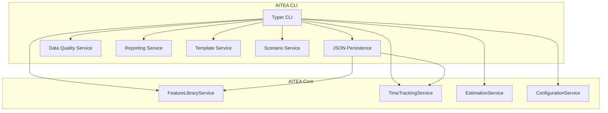

# Design Document: AITEA CLI

## Overview

AITEA CLI is a command-line tool built with Typer and Rich for terminal UI. It uses aitea-core for all business logic and provides JSON-based persistence.

## Architecture



## CLI Structure

```python
import typer
from rich.console import Console
from rich.table import Table

app = typer.Typer(help="AITEA - AI Time Estimation Agent")
console = Console()

# Sub-commands
feature_app = typer.Typer(help="Feature library management")
tracked_app = typer.Typer(help="Time tracking data")
estimate_app = typer.Typer(help="Estimation commands")
config_app = typer.Typer(help="Configuration")
quality_app = typer.Typer(help="Data quality")
report_app = typer.Typer(help="Reports")
template_app = typer.Typer(help="Templates")
scenario_app = typer.Typer(help="Scenarios")

app.add_typer(feature_app, name="feature")
app.add_typer(tracked_app, name="tracked")
app.add_typer(estimate_app, name="estimate")
app.add_typer(config_app, name="config")
app.add_typer(quality_app, name="quality")
app.add_typer(report_app, name="report")
app.add_typer(template_app, name="template")
app.add_typer(scenario_app, name="scenario")
```

## Commands

### Feature Commands

```python
@feature_app.command("add")
def add_feature(
    name: str,
    team: str = typer.Option(..., help="frontend/backend/both"),
    process: str = typer.Option(..., help="Process category"),
    seed_hours: float = typer.Option(..., help="Seed time in hours"),
    synonyms: str = typer.Option("", help="Comma-separated synonyms"),
    notes: str = typer.Option("", help="Notes")
): ...

@feature_app.command("list")
def list_features(
    format: str = typer.Option("table", help="table/json")
): ...

@feature_app.command("search")
def search_features(query: str): ...

@feature_app.command("update")
def update_feature(
    id: str,
    name: str = typer.Option(None),
    seed_hours: float = typer.Option(None)
): ...

@feature_app.command("delete")
def delete_feature(id: str): ...
```

### Import Command

```python
@app.command("import")
def import_csv(
    file_path: str,
    dry_run: bool = typer.Option(False, help="Preview without saving")
): ...
```

### Estimation Commands

```python
@estimate_app.command("brd")
def estimate_from_brd(file: str): ...

@estimate_app.command("features")
def estimate_features(features: str): ...

@estimate_app.command("table")
def show_estimation_table(): ...

@estimate_app.command("export")
def export_estimate(
    format: str = typer.Option("json", help="json/csv"),
    output: str = typer.Option(None, help="Output file")
): ...
```

## Persistence Service

```python
from pathlib import Path
import json
from aitea_core.models import FeatureLibrary, TrackedTimeEntry

class JSONPersistenceService:
    def __init__(self, data_dir: Path = Path("data")):
        self.data_dir = data_dir
        self.data_dir.mkdir(exist_ok=True)
    
    def save_feature_library(self, library: FeatureLibrary) -> None:
        path = self.data_dir / "feature_library.json"
        with open(path, "w") as f:
            json.dump(asdict(library), f, indent=2, default=str)
    
    def load_feature_library(self) -> FeatureLibrary:
        path = self.data_dir / "feature_library.json"
        if not path.exists():
            return FeatureLibrary(id=str(uuid.uuid4()))
        with open(path) as f:
            data = json.load(f)
        return FeatureLibrary(**data)
    
    def save_tracked_time(self, entries: List[TrackedTimeEntry]) -> None:
        path = self.data_dir / "tracked_time.json"
        with open(path, "w") as f:
            json.dump([asdict(e) for e in entries], f, indent=2, default=str)
    
    def load_tracked_time(self) -> List[TrackedTimeEntry]:
        path = self.data_dir / "tracked_time.json"
        if not path.exists():
            return []
        with open(path) as f:
            data = json.load(f)
        return [TrackedTimeEntry(**e) for e in data]
```

## Data Quality Service

```python
@dataclass
class DataQualityScore:
    completeness: float
    consistency: float
    overall: float
    duplicate_count: int
    anomaly_count: int

class DataQualityService:
    def compute_quality_score(self, entries: List[TrackedTimeEntry]) -> DataQualityScore: ...
    def detect_duplicates(self, entries: List[TrackedTimeEntry]) -> List[DuplicateEntry]: ...
    def detect_anomalies(self, entries: List[TrackedTimeEntry]) -> List[AnomalyAlert]: ...
```

## Reporting Service

```python
class ReportingService:
    def generate_time_distribution(self) -> TimeDistributionReport: ...
    def generate_estimation_comparison(self) -> EstimationComparisonReport: ...
    def generate_team_productivity(self) -> TeamProductivityReport: ...
    def render_bar_chart(self, data: List[Tuple[str, float]], title: str) -> None: ...
```

## Template Service

```python
class TemplateService:
    TEMPLATES = {
        "ecommerce": [...],
        "saas": [...],
        "cms": [...],
        "mobile_app": [...],
        "api_only": [...]
    }
    
    def list_templates(self) -> List[str]: ...
    def apply_template(self, template_name: str) -> FeatureLibrary: ...
    def export_as_template(self, library: FeatureLibrary) -> dict: ...
```

## Scenario Service

```python
@dataclass
class Scenario:
    id: str
    name: str
    features: List[str]
    team_composition: TeamComposition
    best_case_hours: float
    likely_case_hours: float
    worst_case_hours: float

class ScenarioService:
    def create_scenario(self, name: str, features: List[str], team: TeamComposition) -> Scenario: ...
    def what_if_analysis(self, scenario: Scenario, new_team: TeamComposition) -> Scenario: ...
    def compare_scenarios(self, scenarios: List[Scenario]) -> ScenarioComparison: ...
```

## Package Structure

```
aitea_cli/
├── __init__.py
├── __main__.py
├── cli/
│   ├── __init__.py
│   ├── main.py              # Main Typer app
│   ├── feature.py           # Feature commands
│   ├── tracked.py           # Tracked time commands
│   ├── estimate.py          # Estimation commands
│   ├── config.py            # Config commands
│   ├── quality.py           # Quality commands
│   ├── report.py            # Report commands
│   ├── template.py          # Template commands
│   └── scenario.py          # Scenario commands
├── services/
│   ├── __init__.py
│   ├── persistence.py       # JSON persistence
│   ├── data_quality.py      # Quality scoring
│   ├── reporting.py         # Reports
│   ├── template.py          # Templates
│   └── scenario.py          # Scenarios
├── templates/
│   ├── ecommerce.json
│   ├── saas.json
│   ├── cms.json
│   ├── mobile_app.json
│   └── api_only.json
└── data/                    # Default data directory
    ├── feature_library.json
    ├── tracked_time.json
    └── scenarios.json
```

## Dependencies

```
# requirements.txt
aitea-core>=0.1.0
typer[all]>=0.9.0
rich>=13.0.0
```
