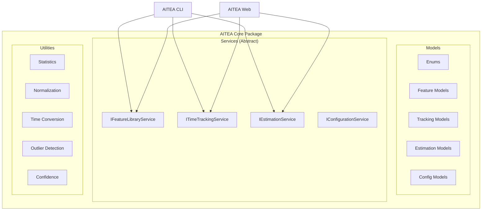

# Design Document: AITEA Core

## Overview

AITEA Core is the shared foundation library providing data models, core services, and utilities for the AITEA ecosystem. It is designed to be imported by both the CLI tool and Web application.

## Architecture



## Data Models

### Enums

```python
from enum import Enum

class Team(Enum):
    FRONTEND = "frontend"
    BACKEND = "backend"
    BOTH = "both"

class Process(Enum):
    USER_MANAGEMENT = "User Management"
    CONTENT_MANAGEMENT = "Content Management"
    COMMUNICATION = "Communication"
    DATA_OPERATIONS = "Data Operations"
    MEDIA_HANDLING = "Media Handling"
    INTEGRATION = "Integration"
    REAL_TIME = "Real-time"
    BACKGROUND_PROCESSING = "Background Processing"
    VISUAL_ENHANCEMENT = "Visual Enhancement"

class Priority(Enum):
    CORE = "core"
    COMMON = "common"
    OPTIONAL = "optional"

class Basis(Enum):
    TRACKED_MEAN = "tracked_mean"
    TRACKED_MEDIAN = "tracked_median"
    TRACKED_P80 = "tracked_p80"
    SEED = "seed"

class Confidence(Enum):
    HIGH = "high"
    MEDIUM = "medium"
    LOW = "low"

class EstimationStyle(Enum):
    MEAN = "mean"
    MEDIAN = "median"
    P80 = "p80"

class TimeUnit(Enum):
    HOURS = "hours"
    MINUTES = "minutes"
    DAYS = "days"

class ExperienceLevel(Enum):
    JUNIOR = "junior"
    MID = "mid"
    SENIOR = "senior"
```

### Feature Models

```python
from dataclasses import dataclass, field
from datetime import datetime
from typing import List, Optional

@dataclass
class SeedTimeHistoryEntry:
    previous_value: float
    new_value: float
    changed_at: datetime

@dataclass
class Feature:
    id: str
    name: str
    team: Team
    process: Process
    seed_time_hours: float
    notes: str = ""
    synonyms: List[str] = field(default_factory=list)
    seed_time_history: List[SeedTimeHistoryEntry] = field(default_factory=list)
    created_at: datetime = field(default_factory=datetime.now)
    updated_at: datetime = field(default_factory=datetime.now)

@dataclass
class FeatureLibrary:
    id: str
    features: List[Feature] = field(default_factory=list)
    created_at: datetime = field(default_factory=datetime.now)
    updated_at: datetime = field(default_factory=datetime.now)
```

### Tracking Models

```python
@dataclass
class TrackedTimeEntry:
    id: str
    team: str  # "frontend" or "backend"
    member_name: str
    feature: str
    tracked_time_hours: float
    process: Optional[Process] = None
    category: Optional[str] = None
    date: Optional[datetime] = None
    imported_at: datetime = field(default_factory=datetime.now)

@dataclass
class ImportError:
    row_number: int
    field: str
    message: str
    raw_value: Optional[str] = None

@dataclass
class ImportResult:
    total_rows: int
    successful_imports: int
    failed_imports: int
    errors: List[ImportError] = field(default_factory=list)
```

### Estimation Models

```python
@dataclass
class OutlierFlag:
    entry_id: str
    value: float
    threshold: float

@dataclass
class RobustStatistics:
    mean_hours: float
    median_hours: float
    p80_hours: float
    std_dev: float

@dataclass
class FeatureStatistics:
    feature_name: str
    team: Team
    count_entries: int
    mean_hours: float
    median_hours: float
    p80_hours: float
    std_dev: float
    data_coverage: str  # "tracked" or "seed"
    outlier_flags: List[OutlierFlag] = field(default_factory=list)
    robust_statistics: Optional[RobustStatistics] = None

@dataclass
class EstimateLineItem:
    feature: str
    team: Team
    estimated_hours: float
    basis: Basis
    confidence: Confidence
    process: Optional[Process] = None
    category: Optional[str] = None
    notes: Optional[str] = None
    is_new_feature: bool = False

@dataclass
class OverlapWarning:
    features: List[str]
    suggestion: str

@dataclass
class ProjectEstimate:
    id: str
    breakdown: List[EstimateLineItem]
    frontend_total_hours: float
    backend_total_hours: float
    grand_total_hours: float
    buffer_hours: Optional[float] = None
    overlap_warnings: List[OverlapWarning] = field(default_factory=list)
    created_at: datetime = field(default_factory=datetime.now)
```

### Configuration Models

```python
@dataclass
class ExperienceMultipliers:
    junior: float = 1.5
    mid: float = 1.0
    senior: float = 0.8

@dataclass
class TimeConversion:
    minutes_per_hour: int = 60
    hours_per_day: int = 8

@dataclass
class EstimationConfig:
    estimation_style: EstimationStyle = EstimationStyle.MEDIAN
    working_hours_per_day: int = 8
    experience_multipliers: ExperienceMultipliers = field(default_factory=ExperienceMultipliers)
    buffer_percentage: float = 0.0
    time_conversion: TimeConversion = field(default_factory=TimeConversion)
```

## Service Interfaces

### Feature Library Service

```python
from abc import ABC, abstractmethod
from typing import List, Optional
from .models import Feature, FeatureLibrary, Process
from .errors import Result, ValidationError

class IFeatureLibraryService(ABC):
    @abstractmethod
    def create_library(self) -> FeatureLibrary: ...
    
    @abstractmethod
    def add_feature(self, name: str, team: Team, process: Process, 
                    seed_time_hours: float, **kwargs) -> Result[Feature, ValidationError]: ...
    
    @abstractmethod
    def update_feature(self, id: str, **updates) -> Result[Feature, Exception]: ...
    
    @abstractmethod
    def delete_feature(self, id: str) -> Result[None, Exception]: ...
    
    @abstractmethod
    def search_features(self, query: str) -> List[Feature]: ...
    
    @abstractmethod
    def get_feature_by_name_or_synonym(self, name: str) -> Optional[Feature]: ...
    
    @abstractmethod
    def list_features(self) -> List[Feature]: ...
    
    @abstractmethod
    def list_processes(self) -> List[Process]: ...
    
    @abstractmethod
    def get_features_by_process(self, process: Process) -> List[Feature]: ...
```

### Time Tracking Service

```python
class ITimeTrackingService(ABC):
    @abstractmethod
    def import_csv(self, file_path: str) -> ImportResult: ...
    
    @abstractmethod
    def validate_schema(self, headers: List[str]) -> bool: ...
    
    @abstractmethod
    def get_entries_by_feature(self, feature_name: str) -> List[TrackedTimeEntry]: ...
    
    @abstractmethod
    def get_all_entries(self) -> List[TrackedTimeEntry]: ...
    
    @abstractmethod
    def add_entry(self, entry: TrackedTimeEntry) -> Result[TrackedTimeEntry, Exception]: ...
```

### Estimation Service

```python
class IEstimationService(ABC):
    @abstractmethod
    def compute_statistics(self, feature_name: str) -> FeatureStatistics: ...
    
    @abstractmethod
    def compute_estimation_table(self) -> List[FeatureStatistics]: ...
    
    @abstractmethod
    def generate_estimate(self, features: List[str]) -> ProjectEstimate: ...
    
    @abstractmethod
    def detect_overlaps(self, features: List[str]) -> List[OverlapWarning]: ...
    
    @abstractmethod
    def apply_experience_multiplier(self, hours: float, level: ExperienceLevel) -> float: ...
```

### Configuration Service

```python
class IConfigurationService(ABC):
    @abstractmethod
    def get_config(self) -> EstimationConfig: ...
    
    @abstractmethod
    def set_estimation_style(self, style: EstimationStyle) -> None: ...
    
    @abstractmethod
    def set_working_hours_per_day(self, hours: int) -> None: ...
    
    @abstractmethod
    def set_experience_multipliers(self, multipliers: ExperienceMultipliers) -> None: ...
    
    @abstractmethod
    def set_buffer_percentage(self, percentage: float) -> None: ...
    
    @abstractmethod
    def on_config_change(self, callback: Callable[[EstimationConfig], None]) -> None: ...
```

## Utility Functions

### Statistics

```python
# src/aitea_core/utils/statistics.py
import numpy as np
from typing import List

def compute_mean(values: List[float]) -> float:
    return float(np.mean(values)) if values else 0.0

def compute_median(values: List[float]) -> float:
    return float(np.median(values)) if values else 0.0

def compute_p80(values: List[float]) -> float:
    return float(np.percentile(values, 80)) if values else 0.0

def compute_p20(values: List[float]) -> float:
    return float(np.percentile(values, 20)) if values else 0.0

def compute_std_dev(values: List[float]) -> float:
    return float(np.std(values)) if len(values) > 1 else 0.0
```

### Normalization

```python
# src/aitea_core/utils/normalization.py
def normalize_feature_name(name: str) -> str:
    return name.strip().lower()

def match_feature_with_synonyms(name: str, features: List[Feature]) -> Optional[Feature]:
    normalized = normalize_feature_name(name)
    for feature in features:
        if normalize_feature_name(feature.name) == normalized:
            return feature
        for synonym in feature.synonyms:
            if normalize_feature_name(synonym) == normalized:
                return feature
    return None
```

### Outlier Detection

```python
# src/aitea_core/utils/outlier_detection.py
def detect_outliers(values: List[float], threshold: float = 3.0) -> List[int]:
    if not values:
        return []
    median = compute_median(values)
    return [i for i, v in enumerate(values) if v > threshold * median]
```

### Confidence Assignment

```python
# src/aitea_core/utils/confidence.py
def assign_confidence(count: int, std_dev: float, mean: float, data_coverage: str) -> Confidence:
    if data_coverage == "seed" or count == 1:
        return Confidence.LOW
    if count >= 5 and (mean == 0 or std_dev / mean < 0.2):
        return Confidence.HIGH
    if 2 <= count <= 4:
        return Confidence.MEDIUM
    return Confidence.LOW
```

## Error Handling

```python
from dataclasses import dataclass
from typing import TypeVar, Generic, Optional, Any

T = TypeVar('T')
E = TypeVar('E')

@dataclass
class ValidationError(Exception):
    field: str
    message: str
    value: Optional[Any] = None

@dataclass
class Result(Generic[T, E]):
    value: Optional[T] = None
    error: Optional[E] = None
    
    @property
    def is_ok(self) -> bool:
        return self.error is None
    
    @classmethod
    def ok(cls, value: T) -> "Result[T, E]":
        return cls(value=value)
    
    @classmethod
    def err(cls, error: E) -> "Result[T, E]":
        return cls(error=error)
```

## Package Structure

```
aitea_core/
├── __init__.py
├── models/
│   ├── __init__.py
│   ├── enums.py
│   ├── feature.py
│   ├── tracking.py
│   ├── estimation.py
│   ├── config.py
│   └── errors.py
├── services/
│   ├── __init__.py
│   ├── feature_library.py      # IFeatureLibraryService + implementation
│   ├── time_tracking.py        # ITimeTrackingService + implementation
│   ├── estimation.py           # IEstimationService + implementation
│   └── configuration.py        # IConfigurationService + implementation
└── utils/
    ├── __init__.py
    ├── statistics.py
    ├── normalization.py
    ├── outlier_detection.py
    ├── confidence.py
    └── time_conversion.py
```

## Dependencies

```
# requirements.txt
numpy>=1.24.0
pandas>=2.0.0
pydantic>=2.0.0
```

## Correctness Properties

*A property is a characteristic or behavior that should hold true across all valid executions of a system—essentially, a formal statement about what the system should do. Properties serve as the bridge between human-readable specifications and machine-verifiable correctness guarantees.*

### Property 1: Feature validation rejects incomplete inputs
*For any* feature input missing one or more required fields (name, team, process, or seed_time_hours), the add_feature method should reject the input and return a Result with a ValidationError identifying the missing field.
**Validates: Requirements 2.1**

### Property 2: Feature search is case-insensitive and synonym-aware
*For any* feature with a name or synonym, searching with that name or synonym in any case combination (uppercase, lowercase, mixed) should return that feature in the results.
**Validates: Requirements 2.2**

### Property 3: Seed time history preservation
*For any* feature with an existing seed time, when updating the seed time to a new value, the previous seed time value should appear in the seed_time_history list with the correct timestamp.
**Validates: Requirements 2.3**

### Property 4: Feature listing is grouped and sorted
*For any* set of features across multiple processes, the list_features method should return features grouped by process, with features within each process sorted alphabetically by name.
**Validates: Requirements 2.4**

### Property 5: CSV schema validation detects missing columns
*For any* CSV header list, the validate_schema method should return false if and only if at least one required column (team, member_name, feature, tracked_time_hours) is missing.
**Validates: Requirements 3.1**

### Property 6: CSV import processes optional columns
*For any* CSV row containing optional columns (process, category, date), the import should successfully create a TrackedTimeEntry with those fields populated, and time values should be converted to hours using the configured conversion factors.
**Validates: Requirements 3.2**

### Property 7: Import error handling continues processing
*For any* CSV import with both valid and invalid rows, the import should record errors for invalid rows while successfully importing valid rows, such that successful_imports + failed_imports = total_rows.
**Validates: Requirements 3.3, 3.4**

### Property 8: Statistics computation correctness
*For any* non-empty list of time values, the computed mean should equal the sum divided by count, the median should be the middle value when sorted, and P80 should be the value at the 80th percentile.
**Validates: Requirements 4.1**

### Property 9: Confidence assignment based on data quality
*For any* feature, the assigned confidence should be HIGH when there are 5+ entries with coefficient of variation < 0.2, MEDIUM when there are 2-4 entries, and LOW when using seed-based estimates or having a single entry.
**Validates: Requirements 4.3**

### Property 10: Estimation style selection
*For any* project estimate generation with a configured estimation style (mean, median, or P80), each feature's estimated hours should match the corresponding statistical value from its FeatureStatistics.
**Validates: Requirements 4.4**

### Property 11: Configuration validation
*For any* attempt to set estimation style, the service should accept only the valid values (mean, median, P80) and reject any other values.
**Validates: Requirements 5.1**

### Property 12: Experience multiplier application
*For any* time estimate in hours and experience level (junior, mid, senior), applying the experience multiplier should multiply the hours by the correct factor (1.5x, 1.0x, 0.8x respectively).
**Validates: Requirements 5.2**

### Property 13: Configuration change notifications
*For any* configuration change, all registered callback functions should be invoked exactly once with the updated configuration object.
**Validates: Requirements 5.3**

### Property 14: Feature name normalization
*For any* string with leading/trailing whitespace and mixed case characters, normalizing the feature name should produce a string with no leading/trailing whitespace and all lowercase characters.
**Validates: Requirements 6.1**

### Property 15: Outlier detection threshold
*For any* list of time values, the detect_outliers function should flag and return the indices of exactly those entries that exceed 3 times the median value.
**Validates: Requirements 6.2**

### Property 16: Time conversion round-trip
*For any* time value in hours, converting to minutes and back to hours (or to days and back to hours) should preserve the original value within floating-point precision.
**Validates: Requirements 6.3**

## Error Handling

The system uses a Result type for operations that can fail, providing type-safe error handling:

- **ValidationError**: Raised when input validation fails, includes field name and error message
- **Result[T, E]**: Generic result type that either contains a value (success) or an error (failure)
- All service methods that can fail return Result types rather than raising exceptions
- Import operations collect errors and continue processing rather than failing fast

## Testing Strategy

### Unit Testing

Unit tests will verify specific examples and integration points:

- **Model validation**: Test that dataclass constructors accept valid inputs and handle edge cases
- **Service integration**: Test that services correctly interact with each other (e.g., EstimationService using FeatureLibraryService)
- **Error conditions**: Test specific error scenarios (e.g., missing CSV columns, invalid configuration values)
- **Edge cases**: Test boundary conditions (e.g., empty lists, single-element lists, zero values)

### Property-Based Testing

Property-based tests will verify universal properties across all inputs using **Hypothesis** (Python's property-based testing library):

- **Configuration**: Each property test should run a minimum of 100 iterations to ensure thorough coverage
- **Tagging**: Each property-based test must include a comment tag in the format: `# Feature: aitea-core, Property {number}: {property_text}`
- **One test per property**: Each correctness property listed above should be implemented as exactly one property-based test
- **Generator strategies**: Use Hypothesis strategies to generate random but valid test data (features, time entries, configurations)
- **Shrinking**: Leverage Hypothesis's automatic shrinking to find minimal failing examples when tests fail

**Example property test structure:**

```python
from hypothesis import given, strategies as st

# Feature: aitea-core, Property 1: Feature validation rejects incomplete inputs
@given(st.dictionaries(
    st.sampled_from(['name', 'team', 'process', 'seed_time_hours']),
    st.text(),
    max_size=3  # Ensure at least one field is missing
))
def test_feature_validation_rejects_incomplete_inputs(partial_feature_data):
    result = service.add_feature(**partial_feature_data)
    assert not result.is_ok
    assert isinstance(result.error, ValidationError)
```

### Test Organization

- Unit tests: `tests/test_{module_name}.py` (e.g., `tests/test_feature_library.py`)
- Property tests: `tests/properties/test_{module_name}_properties.py`
- Test fixtures: `tests/conftest.py` for shared test data and utilities
