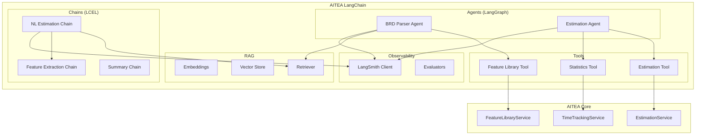

# Design Document: AITEA LangChain

## Overview

AITEA LangChain provides AI-powered estimation capabilities using the LangChain ecosystem. It wraps aitea-core services as LLM tools and implements intelligent BRD parsing, natural language estimation, and RAG-based feature matching.

## Architecture



## Component Design

### 1. BRD Parser Agent (LangGraph)

```python
from langgraph.graph import StateGraph, END
from typing import TypedDict, List, Annotated
from operator import add

class BRDParserState(TypedDict):
    document_text: str
    extracted_features: Annotated[List[str], add]
    matched_features: List[dict]
    unmatched_features: List[str]
    estimation: dict | None
    messages: Annotated[List[str], add]

def create_brd_parser_agent():
    workflow = StateGraph(BRDParserState)

    # Define nodes
    workflow.add_node("extract_features", extract_features_node)
    workflow.add_node("match_features", match_features_node)
    workflow.add_node("handle_unmatched", handle_unmatched_node)
    workflow.add_node("generate_estimate", generate_estimate_node)

    # Define edges
    workflow.set_entry_point("extract_features")
    workflow.add_edge("extract_features", "match_features")
    workflow.add_conditional_edges(
        "match_features",
        has_unmatched_features,
        {True: "handle_unmatched", False: "generate_estimate"}
    )
    workflow.add_edge("handle_unmatched", "generate_estimate")
    workflow.add_edge("generate_estimate", END)

    return workflow.compile()
```

### 2. LCEL Chains

```python
from langchain_core.prompts import ChatPromptTemplate
from langchain_core.output_parsers import PydanticOutputParser
from langchain_openai import ChatOpenAI

# Feature Extraction Chain
feature_extraction_prompt = ChatPromptTemplate.from_messages([
    ("system", """You are a software project analyst. Extract features from the project description.

Available features in our library:
{feature_library}

Output format: {format_instructions}"""),
    ("human", "{project_description}")
])

feature_extraction_chain = (
    feature_extraction_prompt
    | ChatOpenAI(model="gpt-4")
    | PydanticOutputParser(pydantic_object=ExtractedFeatures)
)

# Natural Language Estimation Chain
estimation_chain = (
    {"project_description": RunnablePassthrough(), "context": retriever}
    | estimation_prompt
    | llm
    | estimation_parser
)
```

### 3. RAG System

```python
from langchain_openai import OpenAIEmbeddings
from langchain_community.vectorstores import Chroma
from langchain.text_splitter import RecursiveCharacterTextSplitter

class FeatureRAG:
    def __init__(self, feature_library_service: IFeatureLibraryService):
        self.feature_service = feature_library_service
        self.embeddings = OpenAIEmbeddings()
        self.vector_store = None

    def build_index(self):
        """Build vector store from feature library."""
        features = self.feature_service.list_features()
        documents = [self._feature_to_document(f) for f in features]
        self.vector_store = Chroma.from_documents(
            documents,
            self.embeddings,
            collection_name="features"
        )

    def search(self, query: str, k: int = 5) -> List[Feature]:
        """Semantic search for features."""
        results = self.vector_store.similarity_search_with_score(query, k=k)
        return [(self._document_to_feature(doc), score) for doc, score in results]

    def get_retriever(self, k: int = 5):
        """Get a retriever for use in chains."""
        return self.vector_store.as_retriever(search_kwargs={"k": k})
```

### 4. Custom Tools

```python
from langchain.tools import tool
from langchain_core.tools import StructuredTool

@tool
def search_features(query: str) -> str:
    """Search the feature library for features matching the query.

    Args:
        query: Natural language description of the feature to find

    Returns:
        JSON string with matching features and their details
    """
    results = feature_rag.search(query, k=5)
    return json.dumps([{
        "name": f.name,
        "team": f.team.value,
        "process": f.process.value,
        "seed_time_hours": f.seed_time_hours,
        "score": score
    } for f, score in results])

@tool
def get_feature_statistics(feature_name: str) -> str:
    """Get statistics for a specific feature from tracked time data.

    Args:
        feature_name: Name of the feature to get statistics for

    Returns:
        JSON string with mean, median, P80, and confidence
    """
    stats = estimation_service.compute_statistics(feature_name)
    return json.dumps(asdict(stats))

@tool
def generate_estimate(features: List[str]) -> str:
    """Generate a project estimate for a list of features.

    Args:
        features: List of feature names to estimate

    Returns:
        JSON string with estimation breakdown and totals
    """
    estimate = estimation_service.generate_estimate(features)
    return json.dumps(asdict(estimate))

# Tool registry
estimation_tools = [
    search_features,
    get_feature_statistics,
    generate_estimate,
]
```

### 5. LangSmith Integration

```python
from langsmith import Client
from langchain.callbacks import LangChainTracer

class ObservabilityService:
    def __init__(self, project_name: str = "aitea"):
        self.client = Client()
        self.project_name = project_name
        self.tracer = LangChainTracer(project_name=project_name)

    def get_callbacks(self):
        """Get callbacks for tracing."""
        return [self.tracer]

    def evaluate_run(self, run_id: str, score: float, comment: str = ""):
        """Add feedback to a run."""
        self.client.create_feedback(
            run_id=run_id,
            key="accuracy",
            score=score,
            comment=comment
        )

    def create_dataset(self, name: str, examples: List[dict]):
        """Create evaluation dataset."""
        dataset = self.client.create_dataset(name)
        for example in examples:
            self.client.create_example(
                inputs=example["input"],
                outputs=example["output"],
                dataset_id=dataset.id
            )
        return dataset
```

## Package Structure

```
aitea_langchain/
├── __init__.py
├── agents/
│   ├── __init__.py
│   ├── brd_parser.py          # BRD Parser Agent (LangGraph)
│   ├── estimation_agent.py    # Estimation Agent (LangGraph)
│   └── states.py              # State definitions
├── chains/
│   ├── __init__.py
│   ├── feature_extraction.py  # Feature extraction chain
│   ├── estimation.py          # Estimation chain
│   └── summary.py             # Summary generation chain
├── rag/
│   ├── __init__.py
│   ├── embeddings.py          # Embedding configuration
│   ├── vector_store.py        # Vector store management
│   └── retriever.py           # Custom retrievers
├── tools/
│   ├── __init__.py
│   ├── feature_tools.py       # Feature library tools
│   ├── estimation_tools.py    # Estimation tools
│   └── statistics_tools.py    # Statistics tools
├── prompts/
│   ├── __init__.py
│   ├── extraction.py          # Extraction prompts
│   ├── estimation.py          # Estimation prompts
│   └── templates/
│       ├── brd_parser.txt
│       └── estimation.txt
├── observability/
│   ├── __init__.py
│   ├── tracing.py             # LangSmith tracing
│   ├── evaluation.py          # Evaluation metrics
│   └── datasets.py            # Test datasets
└── config.py                  # Configuration
```

## Dependencies

```
# requirements.txt
aitea-core>=0.1.0
langchain>=0.1.0
langchain-openai>=0.0.5
langchain-community>=0.0.20
langgraph>=0.0.20
langsmith>=0.0.80
chromadb>=0.4.0
tiktoken>=0.5.0
```

## Configuration

```python
from pydantic_settings import BaseSettings

class LangChainConfig(BaseSettings):
    # LLM Settings
    openai_api_key: str
    model_name: str = "gpt-4"
    temperature: float = 0.0

    # Vector Store Settings
    chroma_persist_directory: str = "./data/chroma"
    embedding_model: str = "text-embedding-3-small"

    # LangSmith Settings
    langsmith_api_key: str | None = None
    langsmith_project: str = "aitea"
    langsmith_tracing: bool = True

    # RAG Settings
    retriever_k: int = 5
    similarity_threshold: float = 0.7

    class Config:
        env_file = ".env"
```

## Learning Objectives

This module teaches:

1. **LCEL (LangChain Expression Language)**

   - Composable chain syntax with `|` operator
   - RunnablePassthrough, RunnableLambda
   - Prompt templates and output parsers

2. **LangGraph**

   - State management with TypedDict
   - Graph-based workflow definition
   - Conditional edges and routing
   - Tool calling within agents

3. **RAG Fundamentals**

   - Document loading and splitting
   - Embedding generation
   - Vector store operations
   - Retriever patterns

4. **LangSmith**
   - Tracing and debugging
   - Evaluation datasets
   - Feedback collection
   - Prompt versioning
