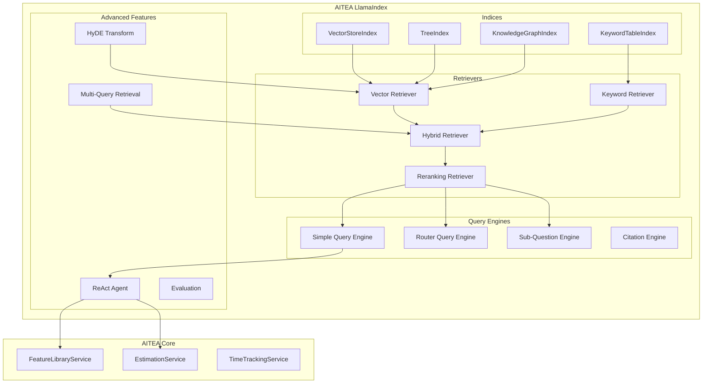

# Design Document: AITEA LlamaIndex

## Overview

AITEA LlamaIndex provides advanced RAG capabilities using LlamaIndex's specialized indexing, retrieval, and query engine features. This module serves as a learning platform for mastering LlamaIndex's unique strengths in document processing and retrieval.

## Architecture



## Component Design

### 1. Multi-Index Architecture

```python
from llama_index.core import (
    VectorStoreIndex,
    TreeIndex,
    KeywordTableIndex,
    KnowledgeGraphIndex,
    StorageContext,
    load_index_from_storage
)
from llama_index.core.schema import Document, TextNode

class MultiIndexManager:
    """Manages multiple index types for different retrieval strategies."""

    def __init__(self, storage_dir: str = "./data/indices"):
        self.storage_dir = Path(storage_dir)
        self.indices: dict[str, BaseIndex] = {}

    def build_vector_index(self, documents: List[Document]) -> VectorStoreIndex:
        """Build vector index for semantic search."""
        index = VectorStoreIndex.from_documents(
            documents,
            show_progress=True
        )
        self.indices["vector"] = index
        return index

    def build_tree_index(self, documents: List[Document]) -> TreeIndex:
        """Build tree index for hierarchical summarization."""
        index = TreeIndex.from_documents(
            documents,
            num_children=10,
            build_tree=True
        )
        self.indices["tree"] = index
        return index

    def build_keyword_index(self, documents: List[Document]) -> KeywordTableIndex:
        """Build keyword index for exact matching."""
        index = KeywordTableIndex.from_documents(documents)
        self.indices["keyword"] = index
        return index

    def build_knowledge_graph(self, documents: List[Document]) -> KnowledgeGraphIndex:
        """Build knowledge graph for relationship-based retrieval."""
        index = KnowledgeGraphIndex.from_documents(
            documents,
            max_triplets_per_chunk=10,
            include_embeddings=True
        )
        self.indices["kg"] = index
        return index

    def persist_all(self):
        """Persist all indices to storage."""
        for name, index in self.indices.items():
            index.storage_context.persist(
                persist_dir=self.storage_dir / name
            )

    def load_all(self):
        """Load all indices from storage."""
        for name in ["vector", "tree", "keyword", "kg"]:
            path = self.storage_dir / name
            if path.exists():
                storage_context = StorageContext.from_defaults(persist_dir=path)
                self.indices[name] = load_index_from_storage(storage_context)
```

### 2. Advanced Retrievers

```python
from llama_index.core.retrievers import (
    VectorIndexRetriever,
    KeywordTableSimpleRetriever,
    QueryFusionRetriever
)
from llama_index.core.postprocessor import (
    SentenceTransformerRerank,
    LLMRerank,
    SimilarityPostprocessor
)

class HybridRetriever:
    """Combines vector and keyword retrieval with reranking."""

    def __init__(
        self,
        vector_index: VectorStoreIndex,
        keyword_index: KeywordTableIndex,
        rerank_top_n: int = 5
    ):
        self.vector_retriever = VectorIndexRetriever(
            index=vector_index,
            similarity_top_k=10
        )
        self.keyword_retriever = KeywordTableSimpleRetriever(
            index=keyword_index
        )
        self.reranker = SentenceTransformerRerank(
            model="cross-encoder/ms-marco-MiniLM-L-6-v2",
            top_n=rerank_top_n
        )

    def retrieve(self, query: str) -> List[NodeWithScore]:
        """Hybrid retrieval with reranking."""
        # Get results from both retrievers
        vector_results = self.vector_retriever.retrieve(query)
        keyword_results = self.keyword_retriever.retrieve(query)

        # Merge and deduplicate
        all_nodes = self._merge_results(vector_results, keyword_results)

        # Rerank
        reranked = self.reranker.postprocess_nodes(
            all_nodes, query_str=query
        )

        return reranked

    def _merge_results(self, *result_lists) -> List[NodeWithScore]:
        """Merge results from multiple retrievers."""
        seen_ids = set()
        merged = []
        for results in result_lists:
            for node in results:
                if node.node.node_id not in seen_ids:
                    seen_ids.add(node.node.node_id)
                    merged.append(node)
        return merged


class QueryTransformRetriever:
    """Retriever with query transformation (HyDE, multi-query)."""

    def __init__(self, base_retriever: BaseRetriever, llm: LLM):
        self.base_retriever = base_retriever
        self.llm = llm
        self.hyde_prompt = PromptTemplate(
            "Write a hypothetical document that would answer: {query}"
        )

    def retrieve_with_hyde(self, query: str) -> List[NodeWithScore]:
        """Hypothetical Document Embeddings retrieval."""
        # Generate hypothetical answer
        hypothetical_doc = self.llm.complete(
            self.hyde_prompt.format(query=query)
        ).text

        # Retrieve using hypothetical document
        return self.base_retriever.retrieve(hypothetical_doc)

    def retrieve_multi_query(self, query: str, num_queries: int = 3) -> List[NodeWithScore]:
        """Generate multiple query variations and merge results."""
        # Generate query variations
        variations = self._generate_query_variations(query, num_queries)

        # Retrieve for each variation
        all_results = []
        for variation in variations:
            results = self.base_retriever.retrieve(variation)
            all_results.extend(results)

        # Deduplicate and rank
        return self._deduplicate_and_rank(all_results)
```

### 3. Query Engines

```python
from llama_index.core.query_engine import (
    RetrieverQueryEngine,
    RouterQueryEngine,
    SubQuestionQueryEngine,
    CitationQueryEngine
)
from llama_index.core.tools import QueryEngineTool

class QueryEngineFactory:
    """Factory for creating different query engine types."""

    def __init__(self, index_manager: MultiIndexManager, llm: LLM):
        self.index_manager = index_manager
        self.llm = llm

    def create_simple_engine(self, index_name: str = "vector") -> RetrieverQueryEngine:
        """Create a simple query engine."""
        index = self.index_manager.indices[index_name]
        return index.as_query_engine(
            llm=self.llm,
            similarity_top_k=5
        )

    def create_router_engine(self) -> RouterQueryEngine:
        """Create a router that selects the best index for each query."""
        tools = [
            QueryEngineTool.from_defaults(
                query_engine=self.index_manager.indices["vector"].as_query_engine(),
                description="Best for semantic similarity and concept matching"
            ),
            QueryEngineTool.from_defaults(
                query_engine=self.index_manager.indices["keyword"].as_query_engine(),
                description="Best for exact keyword matching and specific terms"
            ),
            QueryEngineTool.from_defaults(
                query_engine=self.index_manager.indices["tree"].as_query_engine(),
                description="Best for summarization and hierarchical queries"
            ),
        ]
        return RouterQueryEngine.from_defaults(
            query_engine_tools=tools,
            llm=self.llm,
            select_multi=False
        )

    def create_sub_question_engine(self) -> SubQuestionQueryEngine:
        """Create engine that breaks complex queries into sub-questions."""
        tools = [
            QueryEngineTool.from_defaults(
                query_engine=self.index_manager.indices["vector"].as_query_engine(),
                description="Feature library with development time estimates"
            ),
        ]
        return SubQuestionQueryEngine.from_defaults(
            query_engine_tools=tools,
            llm=self.llm,
            use_async=True
        )

    def create_citation_engine(self) -> CitationQueryEngine:
        """Create engine that provides citations for answers."""
        return CitationQueryEngine.from_args(
            index=self.index_manager.indices["vector"],
            llm=self.llm,
            citation_chunk_size=512
        )
```

### 4. ReAct Agent

```python
from llama_index.core.agent import ReActAgent
from llama_index.core.tools import FunctionTool

class EstimationAgent:
    """ReAct agent for interactive estimation."""

    def __init__(
        self,
        feature_service: IFeatureLibraryService,
        estimation_service: IEstimationService,
        query_engine: BaseQueryEngine,
        llm: LLM
    ):
        self.feature_service = feature_service
        self.estimation_service = estimation_service
        self.query_engine = query_engine
        self.llm = llm
        self.agent = self._build_agent()

    def _build_agent(self) -> ReActAgent:
        """Build ReAct agent with tools."""
        tools = [
            FunctionTool.from_defaults(
                fn=self._search_features,
                name="search_features",
                description="Search for features in the library by name or description"
            ),
            FunctionTool.from_defaults(
                fn=self._get_statistics,
                name="get_statistics",
                description="Get time statistics for a specific feature"
            ),
            FunctionTool.from_defaults(
                fn=self._generate_estimate,
                name="generate_estimate",
                description="Generate a project estimate for a list of features"
            ),
            QueryEngineTool.from_defaults(
                query_engine=self.query_engine,
                name="feature_knowledge",
                description="Query the feature knowledge base for detailed information"
            ),
        ]

        return ReActAgent.from_tools(
            tools=tools,
            llm=self.llm,
            verbose=True,
            max_iterations=10
        )

    def chat(self, message: str) -> str:
        """Chat with the agent."""
        response = self.agent.chat(message)
        return str(response)

    def _search_features(self, query: str) -> str:
        """Search features tool implementation."""
        results = self.feature_service.search_features(query)
        return json.dumps([asdict(f) for f in results[:5]])

    def _get_statistics(self, feature_name: str) -> str:
        """Get statistics tool implementation."""
        stats = self.estimation_service.compute_statistics(feature_name)
        return json.dumps(asdict(stats))

    def _generate_estimate(self, features: str) -> str:
        """Generate estimate tool implementation."""
        feature_list = [f.strip() for f in features.split(",")]
        estimate = self.estimation_service.generate_estimate(feature_list)
        return json.dumps(asdict(estimate))
```

### 5. Evaluation Framework

```python
from llama_index.core.evaluation import (
    FaithfulnessEvaluator,
    RelevancyEvaluator,
    CorrectnessEvaluator,
    SemanticSimilarityEvaluator,
    BatchEvalRunner
)

class RAGEvaluator:
    """Comprehensive RAG evaluation framework."""

    def __init__(self, llm: LLM):
        self.faithfulness = FaithfulnessEvaluator(llm=llm)
        self.relevancy = RelevancyEvaluator(llm=llm)
        self.correctness = CorrectnessEvaluator(llm=llm)
        self.similarity = SemanticSimilarityEvaluator()

    async def evaluate_response(
        self,
        query: str,
        response: str,
        contexts: List[str],
        reference: str | None = None
    ) -> dict:
        """Evaluate a single response."""
        results = {}

        # Faithfulness: Is the response grounded in the context?
        faith_result = await self.faithfulness.aevaluate(
            query=query,
            response=response,
            contexts=contexts
        )
        results["faithfulness"] = faith_result.score

        # Relevancy: Is the response relevant to the query?
        rel_result = await self.relevancy.aevaluate(
            query=query,
            response=response,
            contexts=contexts
        )
        results["relevancy"] = rel_result.score

        # Correctness: Is the response correct? (requires reference)
        if reference:
            corr_result = await self.correctness.aevaluate(
                query=query,
                response=response,
                reference=reference
            )
            results["correctness"] = corr_result.score

        return results

    async def evaluate_retrieval(
        self,
        queries: List[str],
        retriever: BaseRetriever,
        expected_ids: List[List[str]]
    ) -> dict:
        """Evaluate retrieval quality."""
        metrics = {
            "precision": [],
            "recall": [],
            "mrr": []  # Mean Reciprocal Rank
        }

        for query, expected in zip(queries, expected_ids):
            results = retriever.retrieve(query)
            retrieved_ids = [r.node.node_id for r in results]

            # Calculate metrics
            relevant_retrieved = set(retrieved_ids) & set(expected)
            precision = len(relevant_retrieved) / len(retrieved_ids) if retrieved_ids else 0
            recall = len(relevant_retrieved) / len(expected) if expected else 0

            # MRR
            mrr = 0
            for i, rid in enumerate(retrieved_ids):
                if rid in expected:
                    mrr = 1 / (i + 1)
                    break

            metrics["precision"].append(precision)
            metrics["recall"].append(recall)
            metrics["mrr"].append(mrr)

        return {k: sum(v) / len(v) for k, v in metrics.items()}
```

## Package Structure

```
aitea_llamaindex/
├── __init__.py
├── indices/
│   ├── __init__.py
│   ├── manager.py             # MultiIndexManager
│   ├── vector.py              # VectorStoreIndex setup
│   ├── tree.py                # TreeIndex setup
│   ├── keyword.py             # KeywordTableIndex setup
│   └── knowledge_graph.py     # KnowledgeGraphIndex setup
├── retrievers/
│   ├── __init__.py
│   ├── hybrid.py              # HybridRetriever
│   ├── transform.py           # QueryTransformRetriever (HyDE, multi-query)
│   └── rerank.py              # Reranking utilities
├── query_engines/
│   ├── __init__.py
│   ├── factory.py             # QueryEngineFactory
│   ├── router.py              # RouterQueryEngine setup
│   └── sub_question.py        # SubQuestionQueryEngine setup
├── agents/
│   ├── __init__.py
│   ├── estimation_agent.py    # ReAct agent for estimation
│   └── tools.py               # Custom tools
├── evaluation/
│   ├── __init__.py
│   ├── evaluator.py           # RAGEvaluator
│   ├── datasets.py            # Evaluation datasets
│   └── metrics.py             # Custom metrics
├── ingestion/
│   ├── __init__.py
│   ├── loaders.py             # Document loaders
│   ├── transformations.py     # Node transformations
│   └── pipeline.py            # Ingestion pipeline
└── config.py                  # Configuration
```

## Dependencies

```
# requirements.txt
aitea-core>=0.1.0
llama-index>=0.10.0
llama-index-llms-openai>=0.1.0
llama-index-embeddings-openai>=0.1.0
llama-index-postprocessor-cohere-rerank>=0.1.0
llama-index-graph-stores-neo4j>=0.1.0
sentence-transformers>=2.2.0
chromadb>=0.4.0
```

## Learning Objectives

This module teaches:

1. **Index Types**

   - VectorStoreIndex for semantic search
   - TreeIndex for hierarchical summarization
   - KeywordTableIndex for exact matching
   - KnowledgeGraphIndex for relationship-based retrieval

2. **Advanced Retrieval**

   - Hybrid search combining multiple strategies
   - Query transformation (HyDE, multi-query)
   - Reranking with cross-encoders
   - Fusion retrieval

3. **Query Engines**

   - Router engines for query routing
   - Sub-question engines for complex queries
   - Citation engines for grounded responses

4. **Agents**

   - ReAct agent pattern
   - Tool integration
   - Multi-step reasoning

5. **Evaluation**
   - Faithfulness, relevancy, correctness metrics
   - Retrieval evaluation (precision, recall, MRR)
   - Comparative benchmarking
