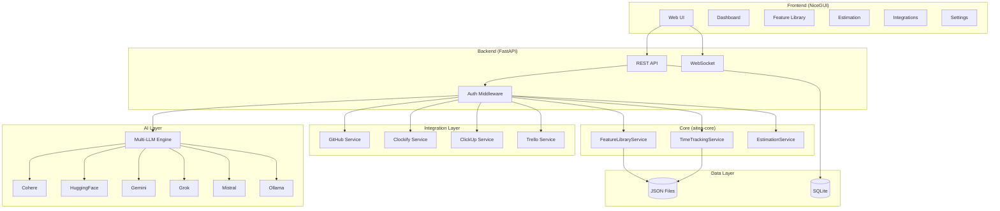

# Design Document: AITEA Web

## Overview

AITEA Web is an AI-powered web application built with FastAPI (backend) and NiceGUI (frontend). It extends aitea-core with multi-LLM capabilities, external integrations, and a modern web interface.

## Why NiceGUI?

| Feature | NiceGUI | Streamlit |
|---------|---------|-----------|
| Async support | Native (works with FastAPI) | Limited |
| Customization | High (Vue.js-based) | Limited |
| State management | Explicit, predictable | Reruns on interaction |
| Component library | Rich, modern | Good for data apps |
| Integration | Easy FastAPI mount | Separate process |

NiceGUI provides better control, async support, and integrates seamlessly with FastAPI.

## Architecture



## Multi-LLM Engine

### Provider Interface

```python
from abc import ABC, abstractmethod
from dataclasses import dataclass
from enum import Enum
from typing import List, Optional

class LLMProvider(Enum):
    COHERE = "cohere"
    HUGGINGFACE = "huggingface"
    GEMINI = "gemini"
    GROK = "grok"
    MISTRAL = "mistral"
    OLLAMA = "ollama"

@dataclass
class LLMConfig:
    provider: LLMProvider
    api_key: str
    model: str
    base_url: Optional[str] = None
    max_tokens: int = 4096
    temperature: float = 0.7
    priority: int = 0  # Lower = higher priority

@dataclass
class LLMResponse:
    content: str
    provider: LLMProvider
    model: str
    tokens_used: int
    latency_ms: float

class ILLMProvider(ABC):
    @abstractmethod
    async def complete(self, prompt: str, system_prompt: Optional[str] = None) -> str: ...
    
    @abstractmethod
    async def test_connection(self) -> bool: ...

class ILLMEngine(ABC):
    @abstractmethod
    async def complete(self, prompt: str, system_prompt: Optional[str] = None) -> LLMResponse: ...
    
    @abstractmethod
    async def extract_features(self, text: str) -> List[ExtractedFeature]: ...
    
    @abstractmethod
    async def analyze_code(self, code: str, language: str) -> CodeAnalysis: ...
    
    @abstractmethod
    def set_fallback_chain(self, providers: List[LLMProvider]) -> None: ...
    
    @abstractmethod
    async def test_provider(self, provider: LLMProvider) -> bool: ...
```

### Provider Implementations

```python
class CohereProvider(ILLMProvider):
    """Cohere API using cohere-python SDK."""
    async def complete(self, prompt: str, system_prompt: Optional[str] = None) -> str:
        import cohere
        client = cohere.AsyncClient(api_key=self.config.api_key)
        response = await client.chat(
            message=prompt,
            model=self.config.model,
            preamble=system_prompt
        )
        return response.text

class GeminiProvider(ILLMProvider):
    """Google Gemini API using google-generativeai SDK."""
    async def complete(self, prompt: str, system_prompt: Optional[str] = None) -> str:
        import google.generativeai as genai
        genai.configure(api_key=self.config.api_key)
        model = genai.GenerativeModel(self.config.model)
        full_prompt = f"{system_prompt}\n\n{prompt}" if system_prompt else prompt
        response = await model.generate_content_async(full_prompt)
        return response.text

class MistralProvider(ILLMProvider):
    """Mistral AI API using mistralai SDK."""
    async def complete(self, prompt: str, system_prompt: Optional[str] = None) -> str:
        from mistralai.async_client import MistralAsyncClient
        from mistralai.models.chat_completion import ChatMessage
        client = MistralAsyncClient(api_key=self.config.api_key)
        messages = []
        if system_prompt:
            messages.append(ChatMessage(role="system", content=system_prompt))
        messages.append(ChatMessage(role="user", content=prompt))
        response = await client.chat(model=self.config.model, messages=messages)
        return response.choices[0].message.content

class OllamaProvider(ILLMProvider):
    """Local Ollama API."""
    async def complete(self, prompt: str, system_prompt: Optional[str] = None) -> str:
        import httpx
        async with httpx.AsyncClient() as client:
            response = await client.post(
                f"{self.config.base_url}/api/generate",
                json={"model": self.config.model, "prompt": prompt, "system": system_prompt}
            )
            return response.json()["response"]
```

### LLM Engine with Fallback

```python
class LLMEngine(ILLMEngine):
    def __init__(self, configs: List[LLMConfig]):
        self.providers = self._init_providers(configs)
        self.fallback_chain = sorted(configs, key=lambda c: c.priority)
    
    async def complete(self, prompt: str, system_prompt: Optional[str] = None) -> LLMResponse:
        errors = {}
        for config in self.fallback_chain:
            provider = self.providers.get(config.provider)
            if not provider:
                continue
            try:
                start = time.time()
                content = await provider.complete(prompt, system_prompt)
                latency = (time.time() - start) * 1000
                return LLMResponse(
                    content=content,
                    provider=config.provider,
                    model=config.model,
                    tokens_used=len(content.split()),  # Approximate
                    latency_ms=latency
                )
            except Exception as e:
                errors[config.provider] = e
                continue
        raise AllProvidersFailedError(errors)
```

## Integration Services

### GitHub Service

```python
@dataclass
class GitHubRepo:
    owner: str
    name: str
    default_branch: str
    languages: Dict[str, int]

@dataclass
class CodeAnalysis:
    features: List[ExtractedFeature]
    components: List[str]
    tech_stack: List[str]
    confidence: float

class GitHubService:
    def __init__(self, token: str):
        self.client = httpx.AsyncClient(
            headers={"Authorization": f"token {token}"}
        )
    
    async def list_repos(self, org: Optional[str] = None) -> List[GitHubRepo]: ...
    async def get_file_contents(self, owner: str, repo: str, path: str) -> str: ...
    async def analyze_repo(self, owner: str, repo: str, llm: ILLMEngine) -> CodeAnalysis: ...
```

### Time Tracking Services

```python
@dataclass
class TimeEntry:
    id: str
    source: str  # clockify, clickup, trello
    user_name: str
    project_name: str
    task_name: str
    hours: float
    date: datetime

class ClockifyService:
    BASE_URL = "https://api.clockify.me/api/v1"
    
    async def authenticate(self, api_key: str) -> bool: ...
    async def fetch_entries(self, workspace_id: str, since: datetime) -> List[TimeEntry]: ...

class ClickUpService:
    BASE_URL = "https://api.clickup.com/api/v2"
    
    async def authenticate(self, token: str) -> bool: ...
    async def fetch_entries(self, team_id: str, since: datetime) -> List[TimeEntry]: ...

class TrelloService:
    BASE_URL = "https://api.trello.com/1"
    
    async def authenticate(self, api_key: str, token: str) -> bool: ...
    async def fetch_entries(self, board_ids: List[str], since: datetime) -> List[TimeEntry]: ...
```

## FastAPI Backend

```python
from fastapi import FastAPI, Depends, HTTPException
from fastapi.middleware.cors import CORSMiddleware

app = FastAPI(title="AITEA Web API", version="2.0.0")

# Feature endpoints
@app.get("/api/features")
async def list_features(): ...

@app.post("/api/features")
async def create_feature(feature: FeatureInput): ...

# Estimation endpoints
@app.post("/api/estimate/brd")
async def estimate_from_brd(brd: BRDInput): ...

@app.post("/api/estimate/features")
async def estimate_features(features: List[str]): ...

# LLM endpoints
@app.get("/api/llm/providers")
async def list_providers(): ...

@app.post("/api/llm/test/{provider}")
async def test_provider(provider: LLMProvider): ...

@app.post("/api/llm/analyze")
async def analyze_with_llm(text: str): ...

# Integration endpoints
@app.post("/api/integrations/github/connect")
async def connect_github(token: str): ...

@app.post("/api/integrations/clockify/connect")
async def connect_clockify(api_key: str): ...

@app.post("/api/integrations/sync")
async def sync_integrations(): ...

# WebSocket for real-time updates
@app.websocket("/ws")
async def websocket_endpoint(websocket: WebSocket): ...
```

## NiceGUI Frontend

```python
from nicegui import ui, app
import httpx

# Mount FastAPI
app.mount("/api", fastapi_app)

# Dashboard Page
@ui.page("/")
async def dashboard():
    with ui.header():
        ui.label("AITEA").classes("text-2xl font-bold")
        with ui.row():
            ui.link("Dashboard", "/")
            ui.link("Features", "/features")
            ui.link("Estimation", "/estimation")
            ui.link("Integrations", "/integrations")
            ui.link("Settings", "/settings")
    
    with ui.row().classes("w-full gap-4"):
        with ui.card():
            ui.label("Total Features")
            ui.label(str(feature_count)).classes("text-3xl")
        with ui.card():
            ui.label("Tracked Entries")
            ui.label(str(entry_count)).classes("text-3xl")
        with ui.card():
            ui.label("Data Quality")
            ui.label(f"{quality_score}%").classes("text-3xl")

# Feature Library Page
@ui.page("/features")
async def features_page():
    ui.label("Feature Library").classes("text-2xl")
    
    # Search
    search = ui.input("Search features").classes("w-64")
    
    # Add feature dialog
    with ui.dialog() as dialog:
        with ui.card():
            ui.label("Add Feature")
            name = ui.input("Name")
            team = ui.select("Team", options=["frontend", "backend", "both"])
            process = ui.select("Process", options=[p.value for p in Process])
            seed_hours = ui.number("Seed Hours")
            ui.button("Add", on_click=lambda: add_feature(name.value, team.value, process.value, seed_hours.value))
    
    ui.button("Add Feature", on_click=dialog.open)
    
    # Feature table
    columns = [
        {"name": "name", "label": "Name", "field": "name", "sortable": True},
        {"name": "team", "label": "Team", "field": "team"},
        {"name": "process", "label": "Process", "field": "process"},
        {"name": "seed_hours", "label": "Seed Hours", "field": "seed_hours"},
    ]
    table = ui.table(columns=columns, rows=features, row_key="id")

# Estimation Page
@ui.page("/estimation")
async def estimation_page():
    ui.label("Project Estimation").classes("text-2xl")
    
    with ui.tabs() as tabs:
        ui.tab("From BRD")
        ui.tab("Select Features")
    
    with ui.tab_panels(tabs):
        with ui.tab_panel("From BRD"):
            brd_text = ui.textarea("Paste BRD or User Story").classes("w-full h-48")
            ui.button("Analyze & Estimate", on_click=lambda: analyze_brd(brd_text.value))
            
            # Results
            with ui.card().classes("w-full"):
                ui.label("Extracted Features")
                features_table = ui.table(columns=feature_columns, rows=[])
            
            with ui.card().classes("w-full"):
                ui.label("Estimation Results")
                estimate_table = ui.table(columns=estimate_columns, rows=[])
        
        with ui.tab_panel("Select Features"):
            feature_select = ui.select("Select Features", options=feature_names, multiple=True)
            ui.button("Generate Estimate", on_click=lambda: estimate_selected(feature_select.value))
    
    # Export buttons
    with ui.row():
        ui.button("Export JSON", on_click=export_json)
        ui.button("Export CSV", on_click=export_csv)

# Integrations Page
@ui.page("/integrations")
async def integrations_page():
    ui.label("Integrations").classes("text-2xl")
    
    with ui.card():
        ui.label("GitHub").classes("text-xl")
        github_token = ui.input("Personal Access Token", password=True)
        ui.button("Connect", on_click=lambda: connect_github(github_token.value))
        ui.label("Status: Not connected").bind_text_from(github_status)
    
    with ui.card():
        ui.label("Clockify").classes("text-xl")
        clockify_key = ui.input("API Key", password=True)
        ui.button("Connect", on_click=lambda: connect_clockify(clockify_key.value))
    
    with ui.card():
        ui.label("LLM Providers").classes("text-xl")
        for provider in LLMProvider:
            with ui.row():
                ui.label(provider.value)
                ui.input(f"{provider.value} API Key", password=True)
                ui.button("Test", on_click=lambda p=provider: test_llm(p))

# Settings Page
@ui.page("/settings")
async def settings_page():
    ui.label("Settings").classes("text-2xl")
    
    with ui.card():
        ui.label("Estimation Style")
        ui.radio(["mean", "median", "p80"], value="median")
    
    with ui.card():
        ui.label("Working Hours per Day")
        ui.radio([6, 8], value=8)
    
    with ui.card():
        ui.label("Experience Multipliers")
        ui.number("Junior", value=1.5)
        ui.number("Mid", value=1.0)
        ui.number("Senior", value=0.8)
    
    with ui.card():
        ui.label("Buffer Percentage")
        ui.slider(min=0, max=50, value=0)
    
    ui.button("Save Settings", on_click=save_settings)

# Run
ui.run(title="AITEA Web", port=8080)
```

## Package Structure

```
aitea_web/
├── __init__.py
├── main.py                    # Entry point
├── api/
│   ├── __init__.py
│   ├── app.py                 # FastAPI app
│   ├── routes/
│   │   ├── features.py
│   │   ├── estimation.py
│   │   ├── llm.py
│   │   ├── integrations.py
│   │   └── auth.py
│   └── middleware/
│       ├── auth.py
│       └── error_handler.py
├── ui/
│   ├── __init__.py
│   ├── app.py                 # NiceGUI app
│   ├── pages/
│   │   ├── dashboard.py
│   │   ├── features.py
│   │   ├── estimation.py
│   │   ├── integrations.py
│   │   └── settings.py
│   └── components/
│       ├── feature_table.py
│       ├── estimate_table.py
│       └── charts.py
├── llm/
│   ├── __init__.py
│   ├── engine.py              # Multi-LLM engine
│   ├── providers/
│   │   ├── cohere.py
│   │   ├── huggingface.py
│   │   ├── gemini.py
│   │   ├── grok.py
│   │   ├── mistral.py
│   │   └── ollama.py
│   └── prompts/
│       ├── feature_extraction.py
│       └── code_analysis.py
├── integrations/
│   ├── __init__.py
│   ├── github.py
│   ├── clockify.py
│   ├── clickup.py
│   └── trello.py
├── services/
│   ├── __init__.py
│   ├── persistence.py         # SQLite + JSON
│   ├── analytics.py
│   └── notifications.py
└── data/
    ├── aitea.db               # SQLite database
    ├── feature_library.json
    └── tracked_time.json
```

## Dependencies

```
# requirements.txt
aitea-core>=0.1.0
fastapi>=0.100.0
uvicorn>=0.23.0
nicegui>=1.4.0
httpx>=0.24.0
sqlalchemy>=2.0.0
alembic>=1.12.0

# LLM providers
cohere>=4.0.0
google-generativeai>=0.3.0
mistralai>=0.0.7
huggingface-hub>=0.19.0

# Auth
python-jose>=3.3.0
passlib>=1.7.4
```

## Correctness Properties

### Property 1: LLM fallback chain execution
*For any* LLM request where the primary provider fails, the system should try each provider in priority order until one succeeds or all fail.

### Property 2: Rate limiting enforcement
*For any* sequence of LLM requests exceeding the rate limit, the system should delay subsequent requests.

### Property 3: GitHub feature extraction consistency
*For any* repository analysis, extracted features should be deterministic given the same repository state.

### Property 4: Time tracking entry mapping
*For any* imported time entry, the system should map it to a feature or mark it as unmapped.

### Property 5: Sync timestamp tracking
*For any* integration sync, the system should only fetch entries newer than the last sync.

### Property 6: Optimistic locking consistency
*For any* concurrent modification, the system should detect conflicts and prevent data loss.

### Property 7: Audit trail completeness
*For any* data modification, the system should create an audit entry with user, timestamp, and changes.
