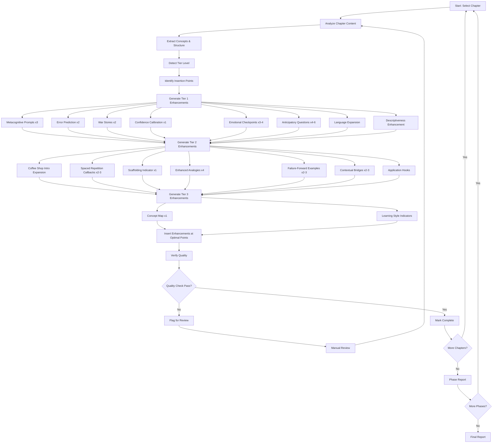

# Design Document: Curriculum Pedagogical Enhancement

## Overview

This design specifies a systematic approach to applying 17 research-backed pedagogical enhancements to curriculum chapters. The enhancement system transforms scaffolded chapters (output from curriculum-scaffolding-conversion spec) into high-quality educational content by adding metacognitive prompts, real-world war stories, enhanced analogies, emotional checkpoints, learning style indicators, and 12 other pedagogical improvements.

The system processes chapters across 11 phases, applying tier-appropriate enhancements (TIER_1: detailed, TIER_2: moderate, TIER_3: minimal) while maintaining context-awareness. Each enhancement references actual chapter content rather than using generic templates, ensuring educational relevance and quality.

### Key Design Goals

1. **Context-Aware Enhancement**: All enhancements reference actual chapter concepts, functions, and examples
2. **Tier-Appropriate Detail**: Enhancement detail scales with difficulty level (TIER_1 > TIER_2 > TIER_3)
3. **Quality Assurance**: 85% minimum quality score required before marking chapters complete
4. **Comprehensive Coverage**: All 17 enhancement types applied systematically to every chapter
5. **Batch Processing**: Efficient processing of ~55 chapters across 11 phases with error resilience

### Design Principles

**Context-First Generation**: Every enhancement analyzes chapter content before generation, ensuring relevance and avoiding generic templates.

**Tier-Adaptive Detail**: Enhancement verbosity and scaffolding automatically adjust based on detected tier level, providing appropriate guidance for each difficulty.

**Quality-Gated Completion**: No chapter marked complete without passing all quality checks (17 enhancement types present, 85% quality score, context-awareness validation).

**Fail-Safe Batch Processing**: Batch processing continues when individual chapters fail, maximizing progress while capturing errors for review.

## Requirements Mapping

This section maps each requirement from the requirements document to specific design components and decisions.

### Requirement 1-17: Individual Enhancement Types

**Addressed by**: `EnhancementGenerator` component with 17 specialized generators

**Design Decisions**:

- Each enhancement type (metacognitive prompts, war stories, analogies, etc.) has dedicated generation logic
- Context analyzer extracts chapter concepts, functions, and structure before generation
- Insertion point detector identifies optimal placement locations
- Tier-specific templates adjust detail level automatically

**Rationale**: Separate generators for each enhancement type ensure appropriate content and formatting. Context analysis before generation prevents generic templates and ensures relevance.

### Requirement 18: Context-Aware Enhancement Generation

**Addressed by**: `ContextAnalyzer` module with concept extraction and reference validation

**Design Decisions**:

- AST parsing extracts functions, classes, and code structure
- NLP-based concept extraction identifies key terms and topics
- Reference validator ensures enhancements mention actual chapter content
- Placeholder detection flags generic template text

**Rationale**: Context-awareness is the primary quality differentiator. Automated validation ensures every enhancement references real chapter content.

### Requirement 19: Tier-Appropriate Enhancement Application

**Addressed by**: `TierLevel` enum, tier-specific generation logic in each enhancement generator

**Design Decisions**:

- Three tier levels: TIER_1 (detailed), TIER_2 (moderate), TIER_3 (minimal)
- Tier detection from chapter metadata with Tier 2 default
- Enhancement detail scales automatically: hint length, explanation depth, example count
- All 17 enhancement types applied regardless of tier (only detail varies)

**Rationale**: Consistent enhancement types across tiers ensure uniform structure. Variable detail provides appropriate scaffolding for each difficulty level.

### Requirement 20: Quality Verification

**Addressed by**: `QualityVerification` module with multi-faceted checks

**Design Decisions**:

- Enhancement presence check: verify all 17 types exist
- Context-awareness check: validate enhancements reference chapter content
- Quality score calculation: 0-100% based on multiple factors
- Placeholder detection: flag generic template text
- 85% minimum threshold enforced before completion

**Rationale**: Multi-faceted verification catches different quality issues. Automated checks ensure consistent standards without manual review overhead.

### Requirement 21: Comprehensive Coverage

**Addressed by**: `ChapterDiscovery` module, `BatchProcessor` class

**Design Decisions**:

- Dynamic chapter discovery scans all 11 phase directories
- Status tracking for each chapter (not_started → in_progress → completed → verified)
- Phase-by-phase processing with progress reporting
- Error resilience: continue processing on failures

**Rationale**: Dynamic discovery adapts to curriculum changes. Phase-based processing provides natural checkpoints. Error resilience maximizes progress in single run.

### Requirement 22: Merge Utility Integration

**Addressed by**: `MergeUtility` class for handling large chapter enhancements

**Design Decisions**:

- Continuation file support for chapters exceeding size limits
- Merge functionality preserves content order and formatting
- Markdown validation after merge
- Integration with existing merge_chapter.py utility

**Rationale**: Large chapters (>10,000 lines) require chunked processing. Merge utility enables working in manageable pieces while maintaining final quality.

### Requirement 23: Progress Tracking

**Addressed by**: `ProgressTracking` module with task list integration

**Design Decisions**:

- Task list organized by phase for visibility
- Automatic checkbox updates when chapters complete
- Progress summary with enhanced vs remaining counts
- Phase reports with enhancement statistics

**Rationale**: Granular tracking enables monitoring across large enhancement effort. Task list integration provides visual progress indicators.

### Requirement 24: Batch Processing Efficiency

**Addressed by**: `BatchProcessor` class with error resilience

**Design Decisions**:

- Sequential processing within phases
- Context maintained across chapters in same phase
- Progress reporting after each chapter
- Continue on errors, don't halt batch
- Batch completion summaries with success/failure counts

**Rationale**: Sequential processing maintains context. Error resilience maximizes conversion progress. Detailed reporting enables identifying and fixing failures.

## Architecture

### Design Philosophy

The architecture follows a **modular pipeline design** where each component has a single, well-defined responsibility. This enables:

- **Independent testing**: Each module can be tested in isolation
- **Flexible composition**: Components can be combined in different ways
- **Error isolation**: Failures in one component don't cascade
- **Incremental development**: Modules can be built and validated independently

### System Components

```
Curriculum Pedagogical Enhancement System
│
├── Chapter Discovery Module
│   ├── Phase Scanner: Identifies all scaffolded chapter files
│   ├── Content Analyzer: Extracts concepts, functions, structure
│   └── Tier Detector: Determines appropriate enhancement detail level
│
├── Context Analysis Module
│   ├── Concept Extractor: Identifies key terms and topics
│   ├── Code Structure Analyzer: Parses functions, classes, algorithms
│   ├── Section Identifier: Maps chapter structure
│   └── Reference Validator: Ensures enhancements reference actual content
│
├── Insertion Point Detection Module
│   ├── Section Boundary Detector: Finds major conceptual sections
│   ├── Cognitive Load Analyzer: Identifies demanding sections
│   ├── Concept Introduction Detector: Finds new concept locations
│   └── Placement Optimizer: Determines optimal enhancement positions
│
├── Enhancement Generator Module
│   ├── Metacognitive Prompt Generator (3 per chapter)
│   ├── Error Prediction Generator (2 per chapter)
│   ├── War Story Generator (2 per chapter)
│   ├── Confidence Calibration Generator (1 per chapter)
│   ├── Emotional Checkpoint Generator (3-4 per chapter)
│   ├── Anticipatory Question Generator (4-6 per chapter)
│   ├── Language Expander (abbreviations, descriptiveness)
│   ├── Coffee Shop Intro Expander (250-350 words)
│   ├── Spaced Repetition Generator (2-3 per chapter)
│   ├── Scaffolding Indicator Generator (1 per chapter)
│   ├── Analogy Generator (4 per chapter)
│   ├── Failure-Forward Generator (2-3 per chapter)
│   ├── Contextual Bridge Generator (2-3 per chapter)
│   ├── Application Hook Generator (section ends)
│   ├── Concept Map Generator (1 per chapter)
│   └── Learning Style Indicator Generator (throughout)
│
├── Quality Verification Module
│   ├── Enhancement Presence Checker: Verifies all 17 types exist
│   ├── Context-Awareness Validator: Checks content references
│   ├── Quality Score Calculator: Computes 0-100% score
│   └── Placeholder Detector: Flags generic template text
│
├── Merge Utility Module
│   ├── Continuation File Manager: Handles large chapter splits
│   ├── Content Merger: Combines continuation files
│   └── Markdown Validator: Verifies merged result validity
│
├── Progress Tracking Module
│   ├── Status Manager: Maintains enhancement status per chapter
│   ├── Task List Updater: Syncs with tasks.md
│   └── Report Generator: Produces phase and final reports
│
├── Chapter Enhancement Orchestrator
│   ├── Workflow Coordinator: Sequences all enhancement steps
│   ├── Backup Manager: Creates/restores chapter backups
│   └── Error Handler: Manages failures and rollback
│
└── Batch Processing Module
    ├── Phase Processor: Processes all chapters in a phase
    ├── Multi-Phase Processor: Processes entire curriculum
    ├── Error Resilience Handler: Continues on individual failures
    └── Batch Reporter: Generates aggregated statistics
```

### Enhancement Workflow

**Design Decision**: The workflow follows a linear pipeline with quality gates at each step. This ensures:

- Early detection of issues before expensive processing
- Clear failure points for debugging
- Ability to resume from checkpoints
- Consistent processing across all chapters

**Rationale**: Linear workflow with gates prevents propagation of errors and ensures quality at each step. Manual review queue handles edge cases without blocking batch processing.



### Key Design Decisions

#### 1. Context Analysis Strategy

**Decision**: Use AST parsing + NLP-based concept extraction for context analysis.

**Rationale**:

- AST parsing reliably extracts code structure (functions, classes, algorithms)
- NLP concept extraction identifies key terms and topics from prose
- Combined approach provides both technical and conceptual context
- Enables validation that enhancements reference actual chapter content

**Trade-off**: More complex than template-based generation, but provides significantly better educational value.

#### 2. Tier Detection Strategy

**Decision**: Detect tier from chapter metadata with Tier 2 default.

**Rationale**:

- Tier information typically in chapter frontmatter or metadata
- Tier 2 provides balanced enhancement detail when tier is ambiguous
- Allows manual tier override via configuration
- Consistent fallback behavior across all chapters

**Trade-off**: May require manual tier correction for some chapters, but this is preferable to incorrect enhancement detail.

#### 3. Enhancement Generation Approach

**Decision**: Generate enhancements from chapter analysis, not templates.

**Rationale**:

- Context-specific enhancements are more valuable than generic ones
- References to chapter concepts reinforce learning
- Adapts to different chapter topics automatically
- Maintains educational coherence

**Trade-off**: More complex than template-based generation, but ensures quality and relevance.

#### 4. Insertion Point Detection

**Decision**: Use heuristic-based detection for optimal enhancement placement.

**Rationale**:

- Section boundaries identified by markdown headers
- Cognitive load estimated by code complexity and explanation density
- Concept introductions detected by keyword patterns
- Placement optimization balances distribution and relevance

**Trade-off**: Heuristics may not be perfect, but provide good results without manual annotation.

#### 5. Quality Thresholds

**Decision**: Enforce 85% minimum quality score before completion.

**Rationale**:

- Ensures consistent quality across all enhancements
- Prevents incomplete enhancements from being marked complete
- Provides objective quality metrics
- Enables quality trend tracking over time

**Trade-off**: May require manual intervention for edge cases, but ensures high standards.

#### 6. Batch Processing with Error Resilience

**Decision**: Continue processing remaining chapters when one fails.

**Rationale**:

- Maximizes enhancement progress in single run
- Isolates failures to individual chapters
- Enables parallel processing in future
- Provides complete error report at end

**Trade-off**: May process chapters that depend on failed chapters, but dependency tracking adds complexity.

## Components and Interfaces

### 1. Chapter Discovery Module

**Purpose**: Identify and catalog all scaffolded chapter files requiring enhancement.

**Interface**:

```python
class ChapterDiscovery:
    def scan_phase(self, phase_path: Path) -> List[ChapterFile]:
        """Scan a phase directory for scaffolded chapter files.

        Args:
            phase_path: Path to phase directory (e.g., curriculum/chapters/phase-0-foundations)

        Returns:
            List of ChapterFile objects with metadata
        """
        pass

    def detect_tier(self, chapter_content: str) -> TierLevel:
        """Determine the tier level for enhancement detail.

        Args:
            chapter_content: Full chapter markdown content

        Returns:
            TierLevel enum (TIER_1, TIER_2, TIER_3)
        """
        pass

    def analyze_content(self, chapter_content: str) -> ContentAnalysis:
        """Analyze chapter to extract concepts and structure.

        Args:
            chapter_content: Full chapter markdown content

        Returns:
            ContentAnalysis with concepts, functions, sections
        """
        pass
```

**Data Models**:

```python
from enum import Enum
from dataclasses import dataclass
from pathlib import Path
from typing import List, Dict

class TierLevel(Enum):
    TIER_1 = "foundations"  # Detailed enhancements
    TIER_2 = "intermediate"  # Moderate enhancements
    TIER_3 = "advanced"  # Minimal enhancements

@dataclass
class ChapterFile:
    path: Path
    phase: str
    chapter_number: str
    title: str
    tier: TierLevel
    is_scaffolded: bool

@dataclass
class ContentAnalysis:
    concepts: List[str]  # Key terms and topics
    functions: List[str]  # Function names
    classes: List[str]  # Class names
    sections: List[Section]  # Chapter structure
    code_blocks: List[CodeBlock]

@dataclass
class Section:
    title: str
    level: int  # Header level (2, 3, 4)
    start_line: int
    end_line: int
    content: str

@dataclass
class CodeBlock:
    content: str
    language: str
    start_line: int
    end_line: int
```

### 2. Context Analysis Module

**Purpose**: Extract concepts, structure, and context from chapter content to enable context-aware enhancement generation.

**Interface**:

```python
class ContextAnalyzer:
    def extract_concepts(self, chapter_content: str) -> List[str]:
        """Extract key concepts and terms from chapter.

        Args:
            chapter_content: Full chapter markdown content

        Returns:
            List of key concepts (e.g., ["error handling", "exceptions", "Result type"])
        """
        pass

    def parse_code_structure(self, code_blocks: List[CodeBlock]) -> CodeStructure:
        """Parse code blocks to extract functions, classes, algorithms.

        Args:
            code_blocks: All code blocks in chapter

        Returns:
            CodeStructure with parsed elements
        """
        pass

    def identify_sections(self, chapter_content: str) -> List[Section]:
        """Identify chapter sections and structure.

        Args:
            chapter_content: Full chapter markdown content

        Returns:
            List of Section objects with boundaries
        """
        pass

    def validate_references(
        self,
        enhancement_text: str,
        chapter_context: ContentAnalysis
    ) -> bool:
        """Validate that enhancement references actual chapter content.

        Args:
            enhancement_text: Generated enhancement content
            chapter_context: Chapter analysis with concepts and structure

        Returns:
            True if enhancement references chapter content, False otherwise
        """
        pass
```

**Data Models**:

```python
@dataclass
class CodeStructure:
    functions: List[FunctionInfo]
    classes: List[ClassInfo]
    algorithms: List[AlgorithmInfo]

@dataclass
class FunctionInfo:
    name: str
    signature: str
    docstring: str
    line_number: int

@dataclass
class ClassInfo:
    name: str
    methods: List[str]
    docstring: str
    line_number: int

@dataclass
class AlgorithmInfo:
    name: str
    complexity: str  # e.g., "O(n log n)"
    description: str
    line_number: int
```

### 3. Enhancement Generator Module

**Purpose**: Generate all 17 enhancement types with context-awareness and tier-appropriate detail.

**Interface**:

```python
class EnhancementGenerator:
    def __init__(self, context: ContentAnalysis, tier: TierLevel):
        self.context = context
        self.tier = tier

    def generate_metacognitive_prompts(self, count: int = 3) -> List[Enhancement]:
        """Generate metacognitive reflection prompts.

        Args:
            count: Number of prompts to generate (default 3)

        Returns:
            List of Enhancement objects with prompts
        """
        pass

    def generate_error_predictions(self, count: int = 2) -> List[Enhancement]:
        """Generate error prediction exercises with code snippets.

        Args:
            count: Number of exercises to generate (default 2)

        Returns:
            List of Enhancement objects with exercises
        """
        pass

    def generate_war_stories(self, count: int = 2) -> List[Enhancement]:
        """Generate real-world war stories with cost calculations.

        Args:
            count: Number of stories to generate (default 2)

        Returns:
            List of Enhancement objects with stories
        """
        pass

    def generate_confidence_calibration(self) -> Enhancement:
        """Generate confidence calibration check."""
        pass

    def generate_emotional_checkpoints(self, count: int = 3) -> List[Enhancement]:
        """Generate emotional support checkpoints."""
        pass

    def generate_anticipatory_questions(self, count: int = 5) -> List[Enhancement]:
        """Generate anticipatory questions before concepts."""
        pass

    def expand_language(self, chapter_content: str) -> str:
        """Expand abbreviations and add explanatory context."""
        pass

    def increase_descriptiveness(self, chapter_content: str) -> str:
        """Add 'why' and 'how' explanations to technical statements."""
        pass

    def expand_coffee_shop_intro(self, intro_content: str) -> str:
        """Expand Coffee Shop Intro to 250-350 words."""
        pass

    def generate_spaced_repetition(self, count: int = 2) -> List[Enhancement]:
        """Generate spaced repetition callbacks to earlier chapters."""
        pass

    def generate_scaffolding_indicator(self) -> Enhancement:
        """Generate graduated scaffolding indicator."""
        pass

    def generate_analogies(self, count: int = 4) -> List[Enhancement]:
        """Generate enhanced analogies with varied complexity."""
        pass

    def generate_failure_forward(self, count: int = 2) -> List[Enhancement]:
        """Generate failure-forward learning examples."""
        pass

    def generate_contextual_bridges(self, count: int = 2) -> List[Enhancement]:
        """Generate contextual bridges to prior chapters."""
        pass

    def generate_application_hooks(self) -> List[Enhancement]:
        """Generate practical application hooks for section ends."""
        pass

    def generate_concept_map(self) -> Enhancement:
        """Generate concept map showing chapter connections."""
        pass

    def generate_learning_style_indicators(self) -> List[Enhancement]:
        """Generate learning style icons throughout chapter."""
        pass
```

**Data Models**:

```python
from enum import Enum
from dataclasses import dataclass
from typing import Optional

class EnhancementType(Enum):
    METACOGNITIVE_PROMPT = "metacognitive_prompt"
    ERROR_PREDICTION = "error_prediction"
    WAR_STORY = "war_story"
    CONFIDENCE_CALIBRATION = "confidence_calibration"
    EMOTIONAL_CHECKPOINT = "emotional_checkpoint"
    ANTICIPATORY_QUESTION = "anticipatory_question"
    LANGUAGE_EXPANSION = "language_expansion"
    DESCRIPTIVENESS = "descriptiveness"
    COFFEE_SHOP_INTRO = "coffee_shop_intro"
    SPACED_REPETITION = "spaced_repetition"
    SCAFFOLDING_INDICATOR = "scaffolding_indicator"
    ANALOGY = "analogy"
    FAILURE_FORWARD = "failure_forward"
    CONTEXTUAL_BRIDGE = "contextual_bridge"
    APPLICATION_HOOK = "application_hook"
    CONCEPT_MAP = "concept_map"
    LEARNING_STYLE_INDICATOR = "learning_style_indicator"

@dataclass
class Enhancement:
    type: EnhancementType
    content: str
    insertion_point: Optional[int]  # Line number for insertion
    tier_specific: bool
    references_concepts: List[str]  # Concepts referenced from chapter

@dataclass
class EnhancementSet:
    """Complete set of enhancements for a chapter."""
    metacognitive_prompts: List[Enhancement]
    error_predictions: List[Enhancement]
    war_stories: List[Enhancement]
    confidence_calibration: Enhancement
    emotional_checkpoints: List[Enhancement]
    anticipatory_questions: List[Enhancement]
    language_expansions: List[Enhancement]
    descriptiveness_enhancements: List[Enhancement]
    coffee_shop_intro: Enhancement
    spaced_repetition: List[Enhancement]
    scaffolding_indicator: Enhancement
    analogies: List[Enhancement]
    failure_forward: List[Enhancement]
    contextual_bridges: List[Enhancement]
    application_hooks: List[Enhancement]
    concept_map: Enhancement
    learning_style_indicators: List[Enhancement]
```

### 4. Insertion Point Detection Module

**Purpose**: Identify optimal locations in chapter for each enhancement type.

**Interface**:

```python
class InsertionPointDetector:
    def find_section_boundaries(self, chapter_content: str) -> List[int]:
        """Find major conceptual section boundaries.

        Args:
            chapter_content: Full chapter markdown content

        Returns:
            List of line numbers marking section boundaries
        """
        pass

    def find_cognitive_load_points(
        self,
        chapter_content: str,
        code_blocks: List[CodeBlock]
    ) -> List[int]:
        """Find cognitively demanding sections for emotional checkpoints.

        Args:
            chapter_content: Full chapter markdown content
            code_blocks: All code blocks in chapter

        Returns:
            List of line numbers marking high cognitive load sections
        """
        pass

    def find_concept_introductions(
        self,
        sections: List[Section],
        concepts: List[str]
    ) -> Dict[str, int]:
        """Find where new concepts are introduced.

        Args:
            sections: Chapter sections
            concepts: Key concepts to locate

        Returns:
            Dict mapping concept to line number of introduction
        """
        pass

    def find_section_ends(self, sections: List[Section]) -> List[int]:
        """Find section endings for application hooks.

        Args:
            sections: Chapter sections

        Returns:
            List of line numbers marking section ends
        """
        pass

    def find_final_project_location(self, chapter_content: str) -> Optional[int]:
        """Find location of final project or major exercise.

        Args:
            chapter_content: Full chapter markdown content

        Returns:
            Line number before final project, or None if not found
        """
        pass
```

### 5. Quality Verification Module

**Purpose**: Ensure all enhancements meet quality standards before marking chapter complete.

**Interface**:

```python
class QualityVerification:
    def verify_enhancement_presence(
        self,
        enhanced_content: str
    ) -> EnhancementPresenceReport:
        """Verify all 17 enhancement types are present.

        Args:
            enhanced_content: Enhanced chapter content

        Returns:
            Report showing which enhancements are present/missing
        """
        pass

    def verify_context_awareness(
        self,
        enhancements: EnhancementSet,
        chapter_context: ContentAnalysis
    ) -> ContextAwarenessReport:
        """Verify enhancements reference actual chapter content.

        Args:
            enhancements: All generated enhancements
            chapter_context: Chapter analysis with concepts

        Returns:
            Report showing context-awareness for each enhancement
        """
        pass

    def calculate_quality_score(
        self,
        enhanced_content: str,
        enhancements: EnhancementSet,
        chapter_context: ContentAnalysis
    ) -> QualityScore:
        """Calculate overall quality score (0-100%).

        Args:
            enhanced_content: Enhanced chapter content
            enhancements: All generated enhancements
            chapter_context: Chapter analysis

        Returns:
            QualityScore with overall score and breakdown
        """
        pass

    def detect_placeholders(self, enhanced_content: str) -> List[PlaceholderViolation]:
        """Detect generic template text or placeholders.

        Args:
            enhanced_content: Enhanced chapter content

        Returns:
            List of placeholder violations with line numbers
        """
        pass
```

**Data Models**:

```python
@dataclass
class EnhancementPresenceReport:
    total_expected: int  # Should be 17
    total_found: int
    missing_types: List[EnhancementType]
    present_types: List[EnhancementType]

@dataclass
class ContextAwarenessReport:
    total_enhancements: int
    context_aware_count: int
    generic_count: int
    violations: List[ContextViolation]

@dataclass
class ContextViolation:
    enhancement_type: EnhancementType
    content_snippet: str
    reason: str  # Why it's not context-aware

@dataclass
class QualityScore:
    overall_score: float  # 0.0-1.0
    enhancement_presence_score: float
    context_awareness_score: float
    formatting_score: float
    tier_consistency_score: float
    breakdown: Dict[str, float]

@dataclass
class PlaceholderViolation:
    line_number: int
    content: str
    placeholder_pattern: str  # e.g., "[concept]", "TODO", "example here"
```

### 6. Merge Utility Module

**Purpose**: Handle large chapter enhancements that exceed size limits by supporting continuation files and merging.

**Interface**:

```python
class MergeUtility:
    def create_continuation_file(
        self,
        chapter_path: Path,
        continuation_content: str,
        continuation_number: int = 1
    ) -> Path:
        """Create a continuation file for large chapter enhancements.

        Args:
            chapter_path: Path to main chapter file
            continuation_content: Content for continuation file
            continuation_number: Continuation file number (1, 2, 3...)

        Returns:
            Path to created continuation file
        """
        pass

    def merge_continuations(
        self,
        main_file: Path,
        continuation_files: List[Path]
    ) -> str:
        """Merge continuation files into main chapter.

        Args:
            main_file: Path to main chapter file
            continuation_files: List of continuation file paths in order

        Returns:
            Merged content as string
        """
        pass

    def validate_markdown(self, content: str) -> MarkdownValidationReport:
        """Validate that merged content is valid markdown.

        Args:
            content: Merged chapter content

        Returns:
            Validation report with any issues found
        """
        pass
```

**Data Models**:

```python
@dataclass
class MarkdownValidationReport:
    is_valid: bool
    errors: List[str]
    warnings: List[str]
    line_numbers: List[int]  # Lines with issues
```

### 7. Progress Tracking Module

**Purpose**: Maintain enhancement status and generate progress reports.

**Interface**:

```python
class ProgressTracking:
    def update_chapter_status(
        self,
        chapter: ChapterFile,
        status: EnhancementStatus
    ) -> None:
        """Update enhancement status for a chapter.

        Args:
            chapter: Chapter being enhanced
            status: New status (in_progress, completed, verified)
        """
        pass

    def generate_phase_report(self, phase: str) -> PhaseReport:
        """Generate enhancement report for a phase.

        Args:
            phase: Phase name (e.g., 'phase-0-foundations')

        Returns:
            Report with enhancement statistics
        """
        pass

    def generate_final_report(self) -> FinalReport:
        """Generate overall enhancement report.

        Returns:
            Complete report across all phases
        """
        pass

    def update_task_list(self, chapter: ChapterFile, completed: bool) -> None:
        """Update tasks.md with chapter completion status.

        Args:
            chapter: Chapter that was enhanced
            completed: Whether enhancement is complete
        """
        pass
```

**Data Models**:

```python
class EnhancementStatus(Enum):
    NOT_STARTED = "not_started"
    IN_PROGRESS = "in_progress"
    COMPLETED = "completed"
    NEEDS_REVIEW = "needs_review"
    VERIFIED = "verified"

@dataclass
class PhaseReport:
    phase_name: str
    total_chapters: int
    completed_chapters: int
    chapters_needing_review: int
    enhancement_rate: float
    quality_metrics: Dict[str, float]

@dataclass
class FinalReport:
    total_chapters: int
    completed_chapters: int
    total_enhancements_added: int
    phase_reports: List[PhaseReport]
    overall_quality_score: float
    enhancement_breakdown: Dict[EnhancementType, int]
```

### 8. Chapter Enhancement Orchestrator

**Purpose**: Coordinate all enhancement modules to process a single chapter from analysis through quality verification.

**Interface**:

```python
class ChapterEnhancer:
    def __init__(self, config: EnhancementConfig):
        """Initialize orchestrator with configuration.

        Args:
            config: Enhancement configuration settings
        """
        self.config = config
        self.discovery = ChapterDiscovery()
        self.context_analyzer = ContextAnalyzer()
        self.insertion_detector = InsertionPointDetector()
        self.quality_verifier = QualityVerification()
        self.progress_tracker = ProgressTracking()
        self.merge_utility = MergeUtility()

    def enhance_chapter(
        self,
        chapter_path: Path,
        tier_override: Optional[TierLevel] = None
    ) -> EnhancementResult:
        """Enhance a single chapter with all 17 enhancement types.

        Args:
            chapter_path: Path to chapter file to enhance
            tier_override: Optional tier level override (default: auto-detect)

        Returns:
            EnhancementResult with enhanced content and metrics

        Raises:
            ChapterNotFoundError: If chapter file doesn't exist
            EnhancementError: If enhancement generation fails
            QualityError: If quality verification fails below threshold
        """
        pass

    def create_backup(self, chapter_path: Path) -> Path:
        """Create backup of original chapter before enhancement.

        Args:
            chapter_path: Path to chapter file

        Returns:
            Path to backup file
        """
        pass

    def rollback(self, chapter_path: Path, backup_path: Path) -> None:
        """Restore chapter from backup after failed enhancement.

        Args:
            chapter_path: Path to chapter file
            backup_path: Path to backup file
        """
        pass
```

**Data Models**:

```python
@dataclass
class EnhancementResult:
    chapter_path: Path
    enhanced_content: str
    enhancements_applied: EnhancementSet
    quality_score: QualityScore
    tier_used: TierLevel
    processing_time: float
    success: bool
    error_message: Optional[str] = None
```

**Design Rationale**: The orchestrator encapsulates the complete enhancement workflow, coordinating all modules in the correct sequence. This provides a single entry point for chapter enhancement, simplifying error handling and ensuring consistent processing. The orchestrator handles backup/rollback for safety and integrates quality verification as a gate before completion.

_Requirements: 18.1, 18.2, 18.5, 19.1, 19.2, 19.3, 19.4, 19.5, 20.5_

### 9. Batch Processing Module

**Purpose**: Process multiple chapters efficiently with error resilience and progress reporting.

**Interface**:

```python
class BatchProcessor:
    def __init__(self, config: EnhancementConfig):
        """Initialize batch processor with configuration.

        Args:
            config: Enhancement configuration settings
        """
        self.config = config
        self.enhancer = ChapterEnhancer(config)
        self.progress_tracker = ProgressTracking()

    def process_phase(
        self,
        phase_path: Path,
        continue_on_error: bool = True
    ) -> BatchResult:
        """Process all chapters in a phase directory.

        Args:
            phase_path: Path to phase directory (e.g., curriculum/chapters/phase-0-foundations)
            continue_on_error: Whether to continue processing after individual chapter failures

        Returns:
            BatchResult with success/failure counts and detailed results
        """
        pass

    def process_all_phases(
        self,
        curriculum_path: Path,
        continue_on_error: bool = True
    ) -> List[BatchResult]:
        """Process all phases in the curriculum.

        Args:
            curriculum_path: Path to curriculum root directory
            continue_on_error: Whether to continue processing after phase failures

        Returns:
            List of BatchResult objects, one per phase
        """
        pass

    def generate_batch_report(
        self,
        results: List[EnhancementResult]
    ) -> BatchReport:
        """Generate summary report for batch processing.

        Args:
            results: List of enhancement results from batch

        Returns:
            BatchReport with aggregated statistics
        """
        pass
```

**Data Models**:

```python
@dataclass
class BatchResult:
    phase_name: str
    total_chapters: int
    successful_enhancements: int
    failed_enhancements: int
    chapters_needing_review: int
    results: List[EnhancementResult]
    processing_time: float
    average_quality_score: float

@dataclass
class BatchReport:
    batch_results: List[BatchResult]
    total_chapters_processed: int
    total_successful: int
    total_failed: int
    overall_quality_score: float
    processing_time: float
    failed_chapters: List[Path]  # Chapters that need attention
```

**Design Rationale**: The batch processor enables efficient processing of multiple chapters while maintaining error resilience. By continuing on individual failures, it maximizes progress in a single run. Progress reporting after each chapter provides visibility into long-running batch operations. The separation from the orchestrator allows independent testing and reuse of the single-chapter enhancement logic.

_Requirements: 21.1, 21.2, 21.4, 21.5, 24.1, 24.2, 24.3, 24.4, 24.5_

## Data Models

### Core Data Structures

```python
from typing import List, Dict, Optional
from dataclasses import dataclass
from pathlib import Path
from enum import Enum

# Tier and Status Enums
class TierLevel(Enum):
    TIER_1 = "foundations"  # Detailed enhancements
    TIER_2 = "intermediate"  # Moderate enhancements
    TIER_3 = "advanced"  # Minimal enhancements

class EnhancementStatus(Enum):
    NOT_STARTED = "not_started"
    IN_PROGRESS = "in_progress"
    COMPLETED = "completed"
    NEEDS_REVIEW = "needs_review"
    VERIFIED = "verified"

class EnhancementType(Enum):
    METACOGNITIVE_PROMPT = "metacognitive_prompt"
    ERROR_PREDICTION = "error_prediction"
    WAR_STORY = "war_story"
    CONFIDENCE_CALIBRATION = "confidence_calibration"
    EMOTIONAL_CHECKPOINT = "emotional_checkpoint"
    ANTICIPATORY_QUESTION = "anticipatory_question"
    LANGUAGE_EXPANSION = "language_expansion"
    DESCRIPTIVENESS = "descriptiveness"
    COFFEE_SHOP_INTRO = "coffee_shop_intro"
    SPACED_REPETITION = "spaced_repetition"
    SCAFFOLDING_INDICATOR = "scaffolding_indicator"
    ANALOGY = "analogy"
    FAILURE_FORWARD = "failure_forward"
    CONTEXTUAL_BRIDGE = "contextual_bridge"
    APPLICATION_HOOK = "application_hook"
    CONCEPT_MAP = "concept_map"
    LEARNING_STYLE_INDICATOR = "learning_style_indicator"

# Chapter and Content Models
@dataclass
class ChapterFile:
    path: Path
    phase: str
    chapter_number: str
    title: str
    tier: TierLevel
    is_scaffolded: bool
    status: EnhancementStatus = EnhancementStatus.NOT_STARTED

@dataclass
class Section:
    title: str
    level: int  # Header level (2, 3, 4)
    start_line: int
    end_line: int
    content: str

@dataclass
class CodeBlock:
    content: str
    language: str
    start_line: int
    end_line: int

@dataclass
class ContentAnalysis:
    concepts: List[str]
    functions: List[str]
    classes: List[str]
    sections: List[Section]
    code_blocks: List[CodeBlock]

# Enhancement Models
@dataclass
class Enhancement:
    type: EnhancementType
    content: str
    insertion_point: Optional[int]
    tier_specific: bool
    references_concepts: List[str]

@dataclass
class EnhancementSet:
    """Complete set of enhancements for a chapter."""
    metacognitive_prompts: List[Enhancement]
    error_predictions: List[Enhancement]
    war_stories: List[Enhancement]
    confidence_calibration: Enhancement
    emotional_checkpoints: List[Enhancement]
    anticipatory_questions: List[Enhancement]
    language_expansions: List[Enhancement]
    descriptiveness_enhancements: List[Enhancement]
    coffee_shop_intro: Enhancement
    spaced_repetition: List[Enhancement]
    scaffolding_indicator: Enhancement
    analogies: List[Enhancement]
    failure_forward: List[Enhancement]
    contextual_bridges: List[Enhancement]
    application_hooks: List[Enhancement]
    concept_map: Enhancement
    learning_style_indicators: List[Enhancement]

# Quality and Verification Models
@dataclass
class QualityScore:
    overall_score: float  # 0.0-1.0
    enhancement_presence_score: float
    context_awareness_score: float
    formatting_score: float
    tier_consistency_score: float
    breakdown: Dict[str, float]

@dataclass
class EnhancementPresenceReport:
    total_expected: int  # Should be 17
    total_found: int
    missing_types: List[EnhancementType]
    present_types: List[EnhancementType]

@dataclass
class ContextAwarenessReport:
    total_enhancements: int
    context_aware_count: int
    generic_count: int
    violations: List['ContextViolation']

@dataclass
class ContextViolation:
    enhancement_type: EnhancementType
    content_snippet: str
    reason: str

@dataclass
class PlaceholderViolation:
    line_number: int
    content: str
    placeholder_pattern: str

# Progress and Reporting Models
@dataclass
class PhaseReport:
    phase_name: str
    total_chapters: int
    completed_chapters: int
    chapters_needing_review: int
    enhancement_rate: float
    quality_metrics: Dict[str, float]

@dataclass
class FinalReport:
    total_chapters: int
    completed_chapters: int
    total_enhancements_added: int
    phase_reports: List[PhaseReport]
    overall_quality_score: float
    enhancement_breakdown: Dict[EnhancementType, int]

# Configuration Models
@dataclass
class EnhancementConfig:
    tier_override: Optional[TierLevel]
    quality_threshold: float  # Default 0.85
    enable_merge_utility: bool
    batch_size: int
    continue_on_error: bool

# Orchestrator and Batch Processing Models
@dataclass
class EnhancementResult:
    chapter_path: Path
    enhanced_content: str
    enhancements_applied: EnhancementSet
    quality_score: QualityScore
    tier_used: TierLevel
    processing_time: float
    success: bool
    error_message: Optional[str] = None

@dataclass
class BatchResult:
    phase_name: str
    total_chapters: int
    successful_enhancements: int
    failed_enhancements: int
    chapters_needing_review: int
    results: List[EnhancementResult]
    processing_time: float
    average_quality_score: float

@dataclass
class BatchReport:
    batch_results: List[BatchResult]
    total_chapters_processed: int
    total_successful: int
    total_failed: int
    overall_quality_score: float
    processing_time: float
    failed_chapters: List[Path]  # Chapters that need attention
```

## Correctness Properties

A property is a characteristic or behavior that should hold true across all valid executions of a system—essentially, a formal statement about what the system should do. Properties serve as the bridge between human-readable specifications and machine-verifiable correctness guarantees.

The following properties define the correctness criteria for the curriculum pedagogical enhancement system. Each property is universally quantified and references the specific requirements it validates.

### Property 1: Enhancement Count Compliance

_For any_ chapter and enhancement type, when the enhancement system processes the chapter, the output should contain the exact count specified for that enhancement type (3 metacognitive prompts, 2 error predictions, 2 war stories, 1 confidence calibration, 3-4 emotional checkpoints, 4-6 anticipatory questions, 1 scaffolding indicator, 4 analogies, 2-3 failure-forward examples, 2-3 contextual bridges, 1 concept map).

**Validates: Requirements 1.1, 2.1, 3.1, 4.1, 5.1, 6.1, 11.1, 12.1, 13.1, 14.1, 16.1**

### Property 2: Enhancement Formatting Compliance

_For any_ enhancement in an enhanced chapter, the enhancement should have the correct icon and header format as specified for its type (🤔 "Metacognitive Checkpoint", 🔍 "Error Prediction Challenge", ⚠️ "Production War Story", 🎯 "Confidence Calibration Check", ☕ Coffee Shop icon, 🔄 "Quick Recall", 🎓 Scaffolding icon, 💡 Application icon, 🗺️ "Concept Map").

**Validates: Requirements 1.5, 2.5, 3.5, 4.5, 9.5, 10.5, 11.5, 12.5, 15.5, 16.5**

### Property 3: Context-Aware Enhancement Generation

_For any_ generated enhancement and its source chapter, the enhancement content should reference at least one concept, function, or example from the actual chapter content, not generic placeholder text.

**Validates: Requirements 1.4, 3.3, 9.3, 18.1, 18.2, 18.3, 18.4, 18.5, 20.2**

### Property 4: Tier-Appropriate Enhancement Application

_For any_ chapter with a detected tier level, all 17 enhancement types should be present, and the detail level (hint length, explanation depth, example count) should match the tier level (TIER_1: detailed, TIER_2: moderate, TIER_3: minimal).

**Validates: Requirements 19.1, 19.2, 19.3, 19.4, 19.5**

### Property 5: Enhancement Placement Correctness

_For any_ enhancement with placement requirements, the enhancement should appear at the correct location: metacognitive prompts after major sections, emotional checkpoints at cognitively demanding sections, anticipatory questions before new concepts, confidence calibration before final projects, application hooks at section ends, concept map after "Where This Leads", scaffolding indicator early in chapter.

**Validates: Requirements 1.2, 4.2, 5.2, 6.2, 11.4, 14.5, 15.1, 16.4**

### Property 6: Enhancement Content Quality

_For any_ enhancement of a specific type, the enhancement should meet its content requirements: metacognitive prompts encourage reflection not recall, error predictions include code with bugs and collapsible explanations, war stories include cost calculations and four sections (result/cost/fix/lesson), confidence calibration includes before/after ratings, emotional checkpoints use supportive language, analogies map technical to everyday concepts, failure-forward examples show mistakes and corrections.

**Validates: Requirements 1.3, 2.2, 2.3, 2.4, 3.2, 3.4, 4.3, 4.4, 5.3, 5.4, 5.5, 6.3, 6.4, 6.5, 10.3, 10.4, 12.2, 12.3, 12.4, 13.2, 13.3, 13.4, 13.5, 14.2, 14.3, 14.4, 15.2, 15.3, 15.4, 16.2, 16.3**

### Property 7: Language Enhancement Preservation

_For any_ chapter undergoing language expansion and descriptiveness enhancement, code blocks should remain unchanged, technical accuracy should be maintained, and text length should increase by less than 50% to avoid excessive verbosity.

**Validates: Requirements 7.1, 7.2, 7.3, 7.4, 7.5, 8.1, 8.2, 8.3, 8.4, 8.5**

### Property 8: Coffee Shop Intro Word Count

_For any_ enhanced chapter, the Coffee Shop Intro section should contain between 250 and 350 words, include specific details, and connect to chapter concepts.

**Validates: Requirements 9.1, 9.2, 9.3, 9.4**

### Property 9: Learning Style Indicator Coverage

_For any_ enhanced chapter, all five learning style icons (📖 reading, 👁️ visual, 💻 hands-on, 🎧 auditory, 🤝 social) should appear at least once, icons should be placed on section headers, and a legend should explain the icons.

**Validates: Requirements 17.1, 17.2, 17.3, 17.4, 17.5**

### Property 10: Quality Score Threshold Enforcement

_For any_ chapter marked as complete, the quality score should be at least 85%, all 17 enhancement types should be present, and no generic placeholders should remain.

**Validates: Requirements 20.1, 20.3, 20.4, 20.5**

### Property 11: Batch Processing Resilience

_For any_ batch of chapters being processed, if one chapter fails enhancement, the system should continue processing remaining chapters, report progress after each chapter, and provide a batch completion summary with success and failure counts.

**Validates: Requirements 21.4, 21.5, 24.1, 24.2, 24.3, 24.4, 24.5**

### Property 12: Progress Tracking Accuracy

_For any_ phase or overall curriculum, the sum of completed chapters and remaining chapters should equal the total chapter count, and progress reports should accurately reflect enhancement status.

**Validates: Requirements 21.2, 21.3, 23.1, 23.2, 23.3, 23.4, 23.5**

### Property 13: Merge Utility Correctness

_For any_ chapter split into continuation files, merging the files should preserve content order, maintain valid markdown formatting, and produce a result equivalent to a single-file enhancement.

**Validates: Requirements 22.1, 22.2, 22.3, 22.4**

## Error Handling

### Error Categories

**1. Content Analysis Errors**

- Malformed markdown (missing headers, broken code fences)
- Invalid chapter structure (missing required sections)
- Unparseable code blocks (syntax errors in Python code)

**Handling Strategy**: Log error with chapter path and line number, attempt partial analysis, flag chapter for manual review.

**2. Enhancement Generation Errors**

- Insufficient context for generation (chapter too short, no concepts found)
- LLM API failures (rate limits, timeouts, invalid responses)
- Context extraction failures (no functions/classes found)

**Handling Strategy**: Retry with exponential backoff for API errors, use fallback templates for insufficient context, log detailed error context.

**3. Quality Verification Failures**

- Missing enhancement types (< 17 types found)
- Quality score below threshold (< 85%)
- Generic placeholders detected

**Handling Strategy**: Mark chapter as needs_review, generate detailed quality report, provide specific remediation suggestions.

**4. File System Errors**

- Chapter file not found
- Permission denied for writing
- Disk space exhausted

**Handling Strategy**: Fail fast with clear error message, don't attempt recovery, ensure no partial writes.

**5. Batch Processing Errors**

- Individual chapter failures during batch
- Phase directory not found
- Concurrent access conflicts

**Handling Strategy**: Continue processing remaining chapters, collect all errors, generate error summary report at end.

### Error Recovery Strategies

**Retry with Backoff**: For transient errors (API rate limits, network issues)

- Initial retry after 1 second
- Exponential backoff: 2s, 4s, 8s, 16s
- Maximum 5 retries before giving up

**Fallback Templates**: For context extraction failures

- Use generic enhancement templates when chapter analysis fails
- Mark enhancements as needing manual review
- Ensure all 17 types still present

**Partial Success**: For batch processing

- Complete as many chapters as possible
- Track successes and failures separately
- Generate detailed error report for failures

**Manual Review Queue**: For quality failures

- Mark chapter with needs_review status
- Generate quality report with specific issues
- Provide remediation suggestions

### Logging Strategy

**Log Levels**:

- DEBUG: Detailed enhancement generation steps
- INFO: Chapter processing start/complete, progress updates
- WARNING: Quality issues, missing context, fallback usage
- ERROR: Enhancement failures, file system errors
- CRITICAL: System-level failures, batch processing halts

**Log Content**:

- Timestamp and log level
- Chapter path and phase
- Error message and exception traceback
- Context information (tier, concepts found, enhancement counts)
- Remediation suggestions

## Testing Strategy

### Dual Testing Approach

The testing strategy combines unit tests for specific examples and edge cases with property-based tests for universal correctness properties. Both are complementary and necessary for comprehensive coverage.

**Unit Tests**: Verify specific examples, edge cases, and error conditions

- Test individual enhancement generators with known inputs
- Test insertion point detection with sample chapters
- Test quality verification with known violations
- Test error handling with malformed inputs

**Property Tests**: Verify universal properties across all inputs

- Test enhancement count compliance with random chapters
- Test context-awareness with generated content
- Test tier-appropriate detail with all tier levels
- Test batch processing resilience with random failures

### Property-Based Testing Configuration

**Testing Library**: Use `hypothesis` for Python property-based testing

**Test Configuration**:

- Minimum 100 iterations per property test (due to randomization)
- Each property test references its design document property
- Tag format: `# Feature: curriculum-pedagogical-enhancement, Property {number}: {property_text}`

**Example Property Test Structure**:

```python
from hypothesis import given, strategies as st
import pytest

# Feature: curriculum-pedagogical-enhancement, Property 1: Enhancement Count Compliance
@given(chapter_content=st.text(min_size=1000, max_size=10000))
@pytest.mark.property_test
def test_enhancement_count_compliance(chapter_content):
    """For any chapter, enhancement counts should match specifications."""
    # Generate enhancements
    enhancer = EnhancementGenerator(chapter_content, TierLevel.TIER_2)
    enhancements = enhancer.generate_all()

    # Verify counts
    assert len(enhancements.metacognitive_prompts) == 3
    assert len(enhancements.error_predictions) == 2
    assert len(enhancements.war_stories) == 2
    assert enhancements.confidence_calibration is not None
    assert 3 <= len(enhancements.emotional_checkpoints) <= 4
    assert 4 <= len(enhancements.anticipatory_questions) <= 6
    # ... verify all 17 types
```

### Unit Testing Strategy

**Test Organization**:

- `tests/curriculum_enhancer/discovery/` - Chapter discovery tests
- `tests/curriculum_enhancer/context/` - Context analysis tests
- `tests/curriculum_enhancer/generators/` - Enhancement generator tests
- `tests/curriculum_enhancer/insertion/` - Insertion point detection tests
- `tests/curriculum_enhancer/verification/` - Quality verification tests
- `tests/curriculum_enhancer/tracking/` - Progress tracking tests
- `tests/curriculum_enhancer/integration/` - End-to-end tests

**Test Coverage Goals**:

- 90%+ code coverage for core modules
- 100% coverage for quality verification logic
- All error paths tested with specific error cases
- Integration tests with real curriculum chapters

### Integration Testing

**Test Scenarios**:

1. **Full Chapter Enhancement**: Process a complete chapter from phase-0-foundations
2. **Batch Processing**: Process multiple chapters in sequence
3. **Error Recovery**: Test with malformed chapters and verify recovery
4. **Quality Verification**: Test with chapters missing enhancements
5. **Merge Utility**: Test with large chapters requiring continuation files

**Test Data**:

- Use actual curriculum chapters as test fixtures
- Create synthetic chapters with known properties
- Generate edge cases (very short chapters, chapters with no code, etc.)

### Performance Testing

**Benchmarks**:

- Single chapter enhancement: < 5 minutes
- Batch of 10 chapters: < 45 minutes
- Full phase (5-8 chapters): < 30 minutes
- Quality verification: < 30 seconds per chapter

**Performance Monitoring**:

- Track enhancement generation time per type
- Monitor API call latency and retry rates
- Measure quality verification execution time
- Profile memory usage for large chapters
