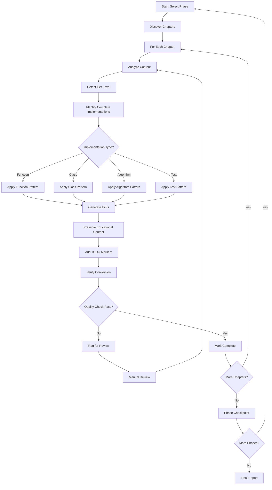

# Design Document: Curriculum Scaffolding Conversion

## Overview

This design specifies a systematic approach to converting curriculum chapter files from complete code solutions to educational scaffolding. The conversion will transform chapters containing working implementations into learning-focused materials that guide students through implementation rather than providing ready-made solutions.

The system will process chapters across 11 phases (phase-0 through phase-10), applying four distinct conversion patterns (functions, classes, algorithms, tests) while maintaining tier-appropriate scaffolding levels. Each conversion will preserve all educational content while replacing complete implementations with function signatures, type hints, TODO markers, and strategic hints.

### Key Design Goals

1. **Systematic Conversion**: Process all chapters consistently using defined patterns
2. **Educational Integrity**: Preserve all learning objectives and conceptual explanations
3. **Quality Assurance**: Implement verification checkpoints to ensure no complete solutions remain
4. **Tier Awareness**: Apply appropriate scaffolding levels based on difficulty tier
5. **Traceability**: Maintain clear progress tracking throughout the conversion process

### Design Principles

**Dynamic Discovery Over Static Configuration**: The system discovers chapters dynamically rather than relying on hardcoded lists. This ensures the system adapts to curriculum changes without code modifications.

**Fail-Safe Processing**: Batch processing continues even when individual chapters fail, ensuring maximum progress while capturing all errors for review.

**Quality-First Approach**: No chapter is marked complete without passing all quality verification checks, ensuring consistent educational standards.

**Tier-Adaptive Scaffolding**: Scaffolding detail automatically adjusts based on detected tier level, providing appropriate guidance for each difficulty level.

## Requirements Mapping

This section maps each requirement from the requirements document to specific design components and decisions.

### Requirement 1: Scaffolding Conversion

**Addressed by**: `ConversionEngine` component with four pattern implementations (Pattern A-D)

**Design Decisions**:

- Each pattern (function, class, algorithm, test) has dedicated conversion logic
- AST parsing extracts signatures and structure without executing code
- TODO markers and hints replace implementation bodies
- `pass` statements maintain valid Python syntax

**Rationale**: Separate patterns for each code type ensures appropriate scaffolding for different programming constructs. AST parsing provides reliable extraction even from complex code.

### Requirement 2: Content Preservation

**Addressed by**: `ContentPreservation` module with section extraction and validation

**Design Decisions**:

- Educational sections identified by markdown headers and content patterns
- Byte-for-byte comparison validates preservation
- Only code blocks within markdown fences are modified
- Preservation rate calculated and reported

**Rationale**: Strict preservation ensures educational value remains intact. Automated validation catches accidental modifications during conversion.

### Requirement 3: Tier-Appropriate Scaffolding

**Addressed by**: `TierLevel` enum, `HintGenerator` class, tier-specific conversion logic

**Design Decisions**:

- Three tier levels: TIER_1 (foundations), TIER_2 (intermediate), TIER_3 (advanced)
- Hint detail scales with tier: detailed → moderate → minimal
- Tier detection from chapter metadata with Tier 2 default
- Consistent scaffolding within each tier

**Rationale**: Explicit tier levels ensure consistent scaffolding. Defaulting to Tier 2 provides balanced guidance when tier is unknown.

### Requirement 4: Template Compliance

**Addressed by**: Pattern implementations in `ConversionEngine`, quality verification checks

**Design Decisions**:

- Each pattern follows template structure exactly
- Quality metrics validate template compliance
- Consistency checks ensure uniform application

**Rationale**: Template compliance ensures predictable, high-quality scaffolding across all chapters.

### Requirement 5: Comprehensive Coverage

**Addressed by**: `ChapterDiscovery` module, `BatchProcessor` class

**Design Decisions**:

- Dynamic chapter discovery scans phase directories
- No hardcoded chapter lists or counts
- Processes all discovered chapters regardless of quantity
- Phase-by-phase processing with progress tracking

**Rationale**: Dynamic discovery adapts to curriculum changes automatically. Phase-based processing provides natural checkpoints and organization.

### Requirement 6: Quality Verification

**Addressed by**: `QualityVerification` module with four verification checks

**Design Decisions**:

- Solution detection scans for >5 lines of logic
- Type hint validation checks all parameters and returns
- Hint quality assessment prevents solution revelation
- Tier consistency validation ensures appropriate scaffolding
- Verification checklist generated for each chapter

**Rationale**: Multi-faceted verification catches different quality issues. Automated checks ensure consistent standards without manual review overhead.

### Requirement 7: Progress Tracking

**Addressed by**: `ProgressTracking` module, `ConversionStatus` enum

**Design Decisions**:

- Status tracking for each chapter (not_started → in_progress → completed → verified)
- Phase reports aggregate chapter statistics
- Final report provides overall conversion metrics
- Task list integration for visibility

**Rationale**: Granular status tracking enables monitoring across large conversion effort. Phase-level reporting provides natural progress milestones.

### Requirement 8: Hint Quality Standards

**Addressed by**: `HintGenerator` class, hint quality assessment in `QualityVerification`

**Design Decisions**:

- Four hint categories: conceptual, approach, implementation, resource
- Hints reference chapter concepts explicitly
- No copy-paste-ready code in hints
- Actionable and specific guidance without revealing solutions

**Rationale**: Categorized hints ensure comprehensive guidance. Quality checks prevent hints from becoming solutions.

### Requirement 9: Type Hint Completeness

**Addressed by**: Type hint extraction in `ConversionEngine`, validation in `QualityVerification`

**Design Decisions**:

- All parameters require type hints
- All functions require return type hints
- Support for complex types (List, Dict, Optional, Union, etc.)
- Type aliases for complex type expressions
- 95% coverage threshold enforced

**Rationale**: Complete type hints provide clear contracts and enable static analysis. High coverage threshold ensures consistency.

### Requirement 10: Batch Processing Efficiency

**Addressed by**: `BatchProcessor` class with error resilience

**Design Decisions**:

- Sequential processing within phases
- Continue on errors, don't halt batch
- Conversion context maintained across chapters
- Progress reporting after each chapter
- Batch completion summaries with success/failure counts

**Rationale**: Error resilience maximizes conversion progress. Sequential processing within phases maintains context while enabling parallelization across phases if needed.

## Architecture

### Design Philosophy

The architecture follows a **modular pipeline design** where each component has a single, well-defined responsibility. This enables:

- **Independent testing**: Each module can be tested in isolation
- **Flexible composition**: Components can be combined in different ways
- **Error isolation**: Failures in one component don't cascade
- **Incremental development**: Modules can be built and validated independently

### System Components

```
Curriculum Scaffolding Conversion System
│
├── Chapter Discovery Module
│   ├── Phase Scanner: Identifies all chapter files in each phase directory
│   ├── Content Analyzer: Detects complete implementations vs scaffolding
│   └── Tier Detector: Determines appropriate scaffolding level
│
├── Conversion Engine
│   ├── Pattern Matcher: Identifies which conversion pattern to apply
│   ├── Function Converter: Handles function implementation conversions
│   ├── Class Converter: Handles class/method conversions
│   ├── Algorithm Converter: Handles algorithm conversions
│   ├── Test Converter: Handles test case conversions
│   └── Hint Generator: Creates strategic hints based on context
│
├── Content Preservation Module
│   ├── Section Extractor: Identifies educational content to preserve
│   ├── Structure Validator: Ensures learning flow is maintained
│   └── Metadata Preserver: Maintains learning objectives and key concepts
│
├── Quality Verification Module
│   ├── Solution Detector: Scans for remaining complete implementations
│   ├── Type Hint Validator: Ensures all signatures have type hints
│   ├── Hint Quality Checker: Verifies hints guide without revealing solutions
│   └── Consistency Validator: Checks tier-appropriate scaffolding levels
│
└── Progress Tracking Module
    ├── Task Manager: Maintains conversion status for each chapter
    ├── Checkpoint Handler: Manages phase-level verification points
    └── Report Generator: Produces conversion summaries
```

### Conversion Workflow

**Design Decision**: The workflow follows a linear pipeline with quality gates at each step. This ensures:

- Early detection of issues before expensive processing
- Clear failure points for debugging
- Ability to resume from checkpoints
- Consistent processing across all chapters

**Rationale**: Linear workflow with gates prevents propagation of errors and ensures quality at each step. Manual review queue handles edge cases without blocking batch processing.



### Key Design Decisions

#### 1. AST-Based Parsing vs Regex

**Decision**: Use Python's `ast` module for code parsing instead of regex patterns.

**Rationale**:

- AST parsing handles complex Python syntax reliably
- Extracts type hints, signatures, and structure accurately
- Avoids false matches from comments or strings
- Provides structured access to code elements

**Trade-off**: Requires valid Python syntax, but this is acceptable since curriculum code should be syntactically correct.

#### 2. Tier Detection Strategy

**Decision**: Detect tier from chapter metadata/content with Tier 2 default.

**Rationale**:

- Tier information may be in frontmatter, headers, or filenames
- Tier 2 provides balanced scaffolding when tier is ambiguous
- Allows manual tier override via configuration
- Consistent fallback behavior across all chapters

**Trade-off**: May require manual tier correction for some chapters, but this is preferable to incorrect scaffolding.

#### 3. Backup and Rollback

**Decision**: Create backups before conversion with rollback capability.

**Rationale**:

- Protects against data loss from conversion errors
- Enables comparison of before/after for validation
- Supports iterative refinement of conversion logic
- Provides audit trail for conversion process

**Trade-off**: Requires additional disk space, but this is minimal compared to risk of data loss.

#### 4. Batch Processing with Error Resilience

**Decision**: Continue processing remaining chapters when one fails.

**Rationale**:

- Maximizes conversion progress in single run
- Isolates failures to individual chapters
- Enables parallel processing in future
- Provides complete error report at end

**Trade-off**: May process chapters that depend on failed chapters, but dependency tracking adds complexity.

#### 5. Quality Thresholds

**Decision**: Enforce minimum thresholds (95% type hint coverage, 0.80 quality score).

**Rationale**:

- Ensures consistent quality across all conversions
- Prevents incomplete conversions from being marked complete
- Provides objective quality metrics
- Enables quality trend tracking over time

**Trade-off**: May require manual intervention for edge cases, but this ensures high standards.

#### 6. Hint Generation Approach

**Decision**: Generate hints from code analysis and chapter context, not templates.

**Rationale**:

- Context-specific hints are more valuable than generic ones
- References to chapter concepts reinforce learning
- Adapts to different code patterns automatically
- Maintains educational coherence

**Trade-off**: More complex than template-based hints, but provides better educational value.

## Components and Interfaces

### 1. Chapter Discovery Module

**Purpose**: Identify and catalog all chapter files requiring conversion.

**Interface**:

```python
class ChapterDiscovery:
    def scan_phase(self, phase_path: Path) -> List[ChapterFile]:
        """Scan a phase directory for chapter files.

        Args:
            phase_path: Path to phase directory (e.g., phase-0-foundations)

        Returns:
            List of ChapterFile objects with metadata
        """
        pass

    def detect_tier(self, chapter_content: str) -> TierLevel:
        """Determine the tier level for scaffolding.

        Args:
            chapter_content: Full chapter markdown content

        Returns:
            TierLevel enum (TIER_1, TIER_2, TIER_3)
        """
        pass

    def analyze_content(self, chapter_content: str) -> ContentAnalysis:
        """Analyze chapter to identify conversion needs.

        Args:
            chapter_content: Full chapter markdown content

        Returns:
            ContentAnalysis with implementation counts and types
        """
        pass
```

**Data Models**:

```python
from enum import Enum
from dataclasses import dataclass
from pathlib import Path
from typing import List, Dict

class TierLevel(Enum):
    TIER_1 = "foundations"  # More scaffolding
    TIER_2 = "intermediate"  # Balanced scaffolding
    TIER_3 = "advanced"  # Minimal scaffolding

@dataclass
class ChapterFile:
    path: Path
    phase: str
    chapter_number: str
    title: str
    tier: TierLevel
    has_complete_solutions: bool

@dataclass
class ContentAnalysis:
    function_count: int
    class_count: int
    algorithm_count: int
    test_count: int
    educational_sections: List[str]
    code_blocks: List[CodeBlock]
```

### 2. Conversion Engine

**Purpose**: Apply conversion patterns to transform complete implementations into scaffolding.

**Interface**:

```python
class ConversionEngine:
    def convert_function(
        self,
        function_code: str,
        tier: TierLevel
    ) -> ScaffoldedCode:
        """Convert a complete function to scaffolding.

        Args:
            function_code: Complete function implementation
            tier: Scaffolding level to apply

        Returns:
            ScaffoldedCode with signature, TODOs, and hints
        """
        pass

    def convert_class(
        self,
        class_code: str,
        tier: TierLevel
    ) -> ScaffoldedCode:
        """Convert a complete class to scaffolding.

        Args:
            class_code: Complete class implementation
            tier: Scaffolding level to apply

        Returns:
            ScaffoldedCode with class structure and method scaffolding
        """
        pass

    def convert_algorithm(
        self,
        algorithm_code: str,
        tier: TierLevel
    ) -> ScaffoldedCode:
        """Convert a complete algorithm to scaffolding.

        Args:
            algorithm_code: Complete algorithm implementation
            tier: Scaffolding level to apply

        Returns:
            ScaffoldedCode with pseudocode and implementation hints
        """
        pass

    def convert_test(
        self,
        test_code: str,
        tier: TierLevel
    ) -> ScaffoldedCode:
        """Convert a complete test to scaffolding.

        Args:
            test_code: Complete test implementation
            tier: Scaffolding level to apply

        Returns:
            ScaffoldedCode with test structure and assertion hints
        """
        pass
```

**Data Models**:

```python
@dataclass
class CodeBlock:
    content: str
    language: str
    start_line: int
    end_line: int
    block_type: str  # 'function', 'class', 'algorithm', 'test'

@dataclass
class ScaffoldedCode:
    signature: str
    docstring: str
    type_hints: Dict[str, str]
    todo_markers: List[str]
    hints: List[Hint]
    preserved_code: str  # Imports, constants, etc.

@dataclass
class Hint:
    category: str  # 'conceptual', 'approach', 'implementation', 'resource'
    content: str
    tier_specific: bool
```

### 3. Pattern Implementations

#### Pattern A: Function Conversion

**Input**: Complete function implementation
**Output**: Function signature + docstring + TODOs + hints

**Conversion Steps**:

1. Extract function signature (name, parameters, return type)
2. Preserve docstring or generate from implementation
3. Extract type hints from parameters and return
4. Identify key implementation steps
5. Generate TODO markers for each step
6. Create tier-appropriate hints
7. Remove implementation body, replace with `pass`

**Tier-Specific Behavior**:

- **Tier 1**: Include detailed step-by-step hints, show example patterns
- **Tier 2**: Provide strategic hints about approach and key concepts
- **Tier 3**: Minimal hints, focus on requirements and expected behavior

#### Pattern B: Class Conversion

**Input**: Complete class with methods
**Output**: Class structure + method signatures + TODOs + hints

**Conversion Steps**:

1. Preserve class definition and `__init__` signature
2. Extract all method signatures
3. Preserve class-level docstring
4. For each method:
   - Keep signature and docstring
   - Generate method-specific TODOs
   - Add hints about method's role in class
5. Remove all method implementations
6. Add class-level hints about architecture

**Tier-Specific Behavior**:

- **Tier 1**: Show relationships between methods, provide implementation order
- **Tier 2**: Explain method responsibilities and interactions
- **Tier 3**: Provide interface contract, minimal implementation guidance

#### Pattern C: Algorithm Conversion

**Input**: Complete algorithm implementation
**Output**: Pseudocode + implementation hints + complexity notes

**Conversion Steps**:

1. Analyze algorithm logic and identify key steps
2. Convert implementation to pseudocode comments
3. Preserve function signature
4. Add hints about algorithm approach
5. Include complexity considerations (time/space)
6. Provide example input/output
7. Remove implementation, keep structure

**Tier-Specific Behavior**:

- **Tier 1**: Detailed pseudocode, show similar examples
- **Tier 2**: High-level pseudocode, strategic hints
- **Tier 3**: Algorithm requirements, expected complexity

#### Pattern D: Test Conversion

**Input**: Complete test with assertions
**Output**: Test structure + assertion hints + expected outcomes

**Conversion Steps**:

1. Preserve test function signature
2. Keep test setup code (creating test data)
3. Remove complete assertions
4. Add TODO markers for each assertion
5. Provide hints about what to verify
6. Include expected outcomes as comments
7. Keep test structure intact

**Tier-Specific Behavior**:

- **Tier 1**: Show assertion patterns, provide examples
- **Tier 2**: Describe what to test, hint at assertion methods
- **Tier 3**: State requirements, minimal assertion guidance

### 4. Hint Generation System

**Purpose**: Create strategic hints that guide without revealing solutions.

**Hint Categories**:

1. **Conceptual Hints**: What to think about
   - Connect to chapter concepts
   - Reference relevant theory
   - Highlight key considerations

2. **Approach Hints**: How to solve
   - Suggest problem-solving strategies
   - Recommend data structures
   - Outline high-level steps

3. **Implementation Hints**: Specific guidance
   - Point to relevant APIs
   - Suggest helper functions
   - Provide formula references

4. **Resource Hints**: Where to learn more
   - Link to documentation
   - Reference related chapters
   - Point to external resources

**Hint Quality Rules**:

- Never include copy-paste-ready code
- Guide thinking, don't provide answers
- Be specific enough to help, vague enough to require thought
- Reference concepts already taught in the chapter
- Scale detail based on tier level

### 5. Content Preservation Module

**Purpose**: Ensure all educational content remains intact during conversion.

**Preserved Elements**:

- Learning objectives
- Conceptual explanations
- Architecture diagrams
- Key concepts lists
- "Why This Matters" sections
- Common pitfalls warnings
- Best practices notes
- Example outputs
- Resource links

**Interface**:

```python
class ContentPreservation:
    def extract_educational_sections(
        self,
        chapter_content: str
    ) -> List[Section]:
        """Identify sections to preserve unchanged.

        Args:
            chapter_content: Full chapter markdown

        Returns:
            List of Section objects marking preserved content
        """
        pass

    def validate_preservation(
        self,
        original: str,
        converted: str
    ) -> PreservationReport:
        """Verify educational content was preserved.

        Args:
            original: Original chapter content
            converted: Converted chapter content

        Returns:
            Report showing preserved vs modified sections
        """
        pass
```

### 6. Quality Verification Module

**Purpose**: Ensure conversion meets quality standards.

**Verification Checks**:

1. **Solution Detection**: Scan for remaining complete implementations
   - Check for function bodies with >5 lines of logic
   - Detect complete algorithm implementations
   - Find full assertion statements in tests
   - Flag suspicious code patterns

2. **Type Hint Validation**: Ensure all signatures have type hints
   - Verify parameter type hints
   - Check return type hints
   - Validate complex types (List, Dict, Optional, etc.)
   - Ensure consistency with Python typing standards

3. **Hint Quality**: Verify hints guide without revealing
   - Check hints don't contain complete code
   - Ensure hints reference chapter concepts
   - Validate tier-appropriate detail level
   - Confirm hints are actionable

4. **Consistency Validation**: Check tier-appropriate scaffolding
   - Verify Tier 1 has detailed guidance
   - Ensure Tier 3 has minimal scaffolding
   - Check consistency within same tier
   - Validate scaffolding patterns match template

**Interface**:

```python
class QualityVerification:
    def detect_complete_solutions(
        self,
        chapter_content: str
    ) -> List[SolutionViolation]:
        """Find remaining complete implementations.

        Args:
            chapter_content: Converted chapter content

        Returns:
            List of violations with line numbers and descriptions
        """
        pass

    def validate_type_hints(
        self,
        code_blocks: List[CodeBlock]
    ) -> TypeHintReport:
        """Check type hint completeness.

        Args:
            code_blocks: All code blocks in chapter

        Returns:
            Report of missing or incomplete type hints
        """
        pass

    def assess_hint_quality(
        self,
        hints: List[Hint]
    ) -> HintQualityReport:
        """Evaluate hint quality and appropriateness.

        Args:
            hints: All hints in converted chapter

        Returns:
            Report of hint quality issues
        """
        pass

    def verify_tier_consistency(
        self,
        chapter: ChapterFile,
        scaffolding: ScaffoldedCode
    ) -> ConsistencyReport:
        """Check tier-appropriate scaffolding.

        Args:
            chapter: Chapter metadata including tier
            scaffolding: Converted scaffolding code

        Returns:
            Report of tier consistency issues
        """
        pass
```

**Data Models**:

```python
@dataclass
class SolutionViolation:
    line_number: int
    code_snippet: str
    violation_type: str
    severity: str  # 'critical', 'warning', 'info'

@dataclass
class TypeHintReport:
    total_functions: int
    functions_with_hints: int
    missing_parameter_hints: List[str]
    missing_return_hints: List[str]
    issues: List[str]

@dataclass
class HintQualityReport:
    total_hints: int
    hints_with_code: List[Hint]
    vague_hints: List[Hint]
    tier_mismatches: List[Hint]
    quality_score: float

@dataclass
class ConsistencyReport:
    expected_tier: TierLevel
    detected_tier: TierLevel
    matches: bool
    issues: List[str]
```

### 7. Progress Tracking Module

**Purpose**: Maintain conversion status and generate reports.

**Interface**:

```python
class ProgressTracking:
    def update_chapter_status(
        self,
        chapter: ChapterFile,
        status: ConversionStatus
    ) -> None:
        """Update conversion status for a chapter.

        Args:
            chapter: Chapter being converted
            status: New status (in_progress, completed, needs_review)
        """
        pass

    def generate_phase_report(
        self,
        phase: str
    ) -> PhaseReport:
        """Generate conversion report for a phase.

        Args:
            phase: Phase name (e.g., 'phase-0-foundations')

        Returns:
            Report with conversion statistics
        """
        pass

    def generate_final_report(self) -> FinalReport:
        """Generate overall conversion report.

        Returns:
            Complete report across all phases
        """
        pass
```

**Data Models**:

```python
class ConversionStatus(Enum):
    NOT_STARTED = "not_started"
    IN_PROGRESS = "in_progress"
    COMPLETED = "completed"
    NEEDS_REVIEW = "needs_review"
    VERIFIED = "verified"

@dataclass
class PhaseReport:
    phase_name: str
    total_chapters: int
    completed_chapters: int
    chapters_needing_review: int
    conversion_rate: float
    quality_metrics: Dict[str, float]

@dataclass
class FinalReport:
    total_chapters: int
    completed_chapters: int
    total_functions_converted: int
    total_classes_converted: int
    total_algorithms_converted: int
    total_tests_converted: int
    phase_reports: List[PhaseReport]
    overall_quality_score: float
```

## Data Models

### Core Data Structures

```python
from typing import List, Dict, Optional
from dataclasses import dataclass
from pathlib import Path
from enum import Enum

# Tier and Status Enums
class TierLevel(Enum):
    TIER_1 = "foundations"
    TIER_2 = "intermediate"
    TIER_3 = "advanced"

class ConversionStatus(Enum):
    NOT_STARTED = "not_started"
    IN_PROGRESS = "in_progress"
    COMPLETED = "completed"
    NEEDS_REVIEW = "needs_review"
    VERIFIED = "verified"

# Chapter and Content Models
@dataclass
class ChapterFile:
    path: Path
    phase: str
    chapter_number: str
    title: str
    tier: TierLevel
    has_complete_solutions: bool
    status: ConversionStatus = ConversionStatus.NOT_STARTED

@dataclass
class CodeBlock:
    content: str
    language: str
    start_line: int
    end_line: int
    block_type: str  # 'function', 'class', 'algorithm', 'test'

@dataclass
class ContentAnalysis:
    function_count: int
    class_count: int
    algorithm_count: int
    test_count: int
    educational_sections: List[str]
    code_blocks: List[CodeBlock]

# Scaffolding Models
@dataclass
class Hint:
    category: str  # 'conceptual', 'approach', 'implementation', 'resource'
    content: str
    tier_specific: bool

@dataclass
class ScaffoldedCode:
    signature: str
    docstring: str
    type_hints: Dict[str, str]
    todo_markers: List[str]
    hints: List[Hint]
    preserved_code: str

# Quality and Verification Models
@dataclass
class SolutionViolation:
    line_number: int
    code_snippet: str
    violation_type: str
    severity: str

@dataclass
class TypeHintReport:
    total_functions: int
    functions_with_hints: int
    missing_parameter_hints: List[str]
    missing_return_hints: List[str]
    issues: List[str]

@dataclass
class HintQualityReport:
    total_hints: int
    hints_with_code: List[Hint]
    vague_hints: List[Hint]
    tier_mismatches: List[Hint]
    quality_score: float

@dataclass
class ConsistencyReport:
    expected_tier: TierLevel
    detected_tier: TierLevel
    matches: bool
    issues: List[str]

# Progress Tracking Models
@dataclass
class PhaseReport:
    phase_name: str
    total_chapters: int
    completed_chapters: int
    chapters_needing_review: int
    conversion_rate: float
    quality_metrics: Dict[str, float]

@dataclass
class FinalReport:
    total_chapters: int
    completed_chapters: int
    total_functions_converted: int
    total_classes_converted: int
    total_algorithms_converted: int
    total_tests_converted: int
    phase_reports: List[PhaseReport]
    overall_quality_score: float

# Section Preservation Models
@dataclass
class Section:
    title: str
    content: str
    start_line: int
    end_line: int
    section_type: str  # 'learning_objectives', 'concepts', 'explanation', etc.

@dataclass
class PreservationReport:
    preserved_sections: List[Section]
    modified_sections: List[Section]
    preservation_rate: float
    issues: List[str]
```

### Conversion Configuration

```python
@dataclass
class ConversionConfig:
    """Configuration for conversion behavior."""

    # Tier-specific settings
    tier_1_hint_detail: str = "detailed"  # detailed, moderate, minimal
    tier_2_hint_detail: str = "moderate"
    tier_3_hint_detail: str = "minimal"

    # Quality thresholds
    max_implementation_lines: int = 5  # Max lines before flagging as solution
    min_type_hint_coverage: float = 0.95  # 95% of functions must have hints
    min_quality_score: float = 0.80  # Minimum acceptable quality score

    # Processing settings
    batch_size: int = 5  # Chapters to process before checkpoint
    auto_verify: bool = True  # Run verification after each conversion

    # Output settings
    create_backup: bool = True  # Backup original before conversion
    output_suffix: str = "-SCAFFOLDED"  # Suffix for converted files
```

## Implementation Considerations

### Technology Choices

**Python with Type Hints**:

- Native AST parsing capabilities
- Rich typing system for data models
- Excellent testing libraries (pytest, hypothesis)
- Curriculum is Python-based, enabling self-hosting

**Dataclasses for Models**:

- Clean, readable data structures
- Automatic `__init__`, `__repr__`, `__eq__`
- Type hints integrated naturally
- Immutability options available

**Hypothesis for Property Testing**:

- Industry-standard property-based testing library
- Excellent shrinking for minimal counterexamples
- Composable strategies for complex data generation
- Integrates seamlessly with pytest

### Performance Considerations

**Expected Scale**:

- ~60 chapters across 11 phases
- Each chapter: 200-1000 lines of markdown
- 5-20 code blocks per chapter
- Total processing time: <10 minutes for full curriculum

**Optimization Strategies**:

- Process chapters sequentially within phases (simple, reliable)
- Cache parsed ASTs to avoid re-parsing
- Lazy loading of chapter content
- Parallel phase processing possible in future

**Trade-off**: Sequential processing is slower than parallel, but simpler and sufficient for current scale.

### Extensibility

**Future Enhancements**:

- Support for additional programming languages (JavaScript, TypeScript)
- Custom conversion patterns beyond the four core patterns
- Integration with LMS or curriculum management systems
- Automated hint quality improvement via LLM

**Design Supports**:

- Plugin architecture for new patterns
- Configuration-driven behavior
- Clear module boundaries
- Comprehensive test coverage enables safe refactoring

## Correctness Properties

_A property is a characteristic or behavior that should hold true across all valid executions of a system—essentially, a formal statement about what the system should do. Properties serve as the bridge between human-readable specifications and machine-verifiable correctness guarantees._

### Property 1: Complete Solution Elimination

_For any_ converted chapter, scanning the chapter content should find zero complete implementations (functions with >5 lines of logic, complete algorithms, full test assertions, or working class methods).

**Validates: Requirements 1.5, 6.1**

### Property 2: Educational Content Preservation

_For any_ chapter conversion, all non-code sections (learning objectives, conceptual explanations, theory sections, example outputs, diagrams, and educational context) should remain byte-for-byte identical between the original and converted versions.

**Validates: Requirements 2.1, 2.2, 2.3, 2.4, 2.5**

### Property 3: Conversion Pattern Application

_For any_ code implementation (function, class, algorithm, or test), the converted output should match the corresponding pattern from the Conversion_Template (Pattern A for functions, Pattern B for classes, Pattern C for algorithms, Pattern D for tests).

**Validates: Requirements 1.1, 1.2, 1.3, 1.4, 4.1, 4.2, 4.3, 4.4**

### Property 4: Tier-Appropriate Scaffolding

_For any_ chapter with a known tier level, the scaffolding detail should match the tier expectations: Tier 1 chapters should have detailed hints and step-by-step guidance, Tier 2 should have moderate hints, and Tier 3 should have minimal hints and basic signatures only.

**Validates: Requirements 3.1, 3.2, 3.3, 3.4**

### Property 5: Type Hint Completeness

_For any_ converted function or method, all parameters should have type hints and the function should have a return type hint using appropriate Python typing constructs (List, Dict, Optional, Union, etc.).

**Validates: Requirements 6.2, 9.1, 9.2, 9.3**

### Property 6: Hint Quality Standards

_For any_ hint generated during conversion, the hint should: (1) not contain copy-paste-ready code snippets, (2) reference concepts that appear in the chapter's educational content, (3) guide toward solution approach without revealing implementation details, and (4) be actionable and specific.

**Validates: Requirements 8.1, 8.2, 8.3, 8.4, 8.5**

### Property 7: Conversion Status Tracking

_For any_ chapter that undergoes conversion, the task list should be updated to reflect the new status (in_progress → completed), and the status change should be immediately queryable from the progress tracking system.

**Validates: Requirements 7.1, 7.2**

### Property 8: Batch Processing Resilience

_For any_ batch of chapters being converted, if one chapter encounters an error, the system should continue processing the remaining chapters and the final summary should accurately report both successful conversions and failures.

**Validates: Requirements 10.2, 10.4, 10.5**

### Property 9: Progress Reporting Accuracy

_For any_ point during conversion, querying the progress tracking system should return accurate counts of total chapters, completed chapters, and remaining chapters, with the sum of completed and remaining always equaling the total.

**Validates: Requirements 7.5, 10.3**

### Property 10: Quality Metrics Application

_For any_ converted chapter, all quality metrics from the Conversion_Template (solution detection, type hint validation, hint quality assessment, consistency validation) should be calculated and recorded, with any metric below threshold flagged for review.

**Validates: Requirements 4.5, 6.3, 6.4**

## Error Handling

### Error Handling Philosophy

**Design Decision**: Implement graceful degradation with comprehensive error reporting rather than fail-fast behavior.

**Rationale**:

- Batch processing should maximize progress even with errors
- Detailed error reports enable efficient debugging
- Rollback capability provides safety net
- Manual review queue handles edge cases

**Trade-off**: More complex error handling logic, but essential for processing large curriculum.

### Error Categories

1. **File System Errors**
   - Missing chapter files
   - Permission issues
   - Corrupted file content
   - **Handling**: Log error, skip chapter, continue batch processing

2. **Parsing Errors**
   - Malformed markdown
   - Invalid code blocks
   - Unparseable Python syntax
   - **Handling**: Flag chapter for manual review, preserve original

3. **Conversion Errors**
   - Unable to extract function signature
   - Complex code patterns not matching templates
   - Ambiguous tier detection
   - **Handling**: Apply conservative conversion, flag for review

4. **Validation Errors**
   - Complete solutions detected after conversion
   - Missing type hints
   - Poor quality hints
   - **Handling**: Mark chapter as needs_review, provide detailed report

5. **Quality Threshold Violations**
   - Type hint coverage below 95%
   - Quality score below 0.80
   - Tier consistency mismatch
   - **Handling**: Prevent marking as complete, require manual verification

### Error Recovery Strategies

**Graceful Degradation**:

- If tier detection fails → default to Tier 2
- If hint generation fails → use generic hints from template
- If type hint extraction fails → preserve original signature

**Rollback Capability**:

- Maintain backup of original chapter before conversion
- Support reverting to original if conversion fails validation
- Track conversion history for audit trail

**Manual Review Queue**:

- Chapters with errors go to review queue
- Provide detailed error reports with line numbers
- Support re-running conversion after manual fixes

### Error Reporting

```python
@dataclass
class ConversionError:
    chapter: ChapterFile
    error_type: str
    error_message: str
    line_number: Optional[int]
    code_snippet: Optional[str]
    severity: str  # 'critical', 'warning', 'info'
    suggested_action: str

@dataclass
class ErrorReport:
    total_errors: int
    critical_errors: List[ConversionError]
    warnings: List[ConversionError]
    chapters_affected: List[ChapterFile]
    recovery_suggestions: List[str]
```

## Testing Strategy

### Testing Philosophy

**Design Decision**: Combine property-based testing with traditional unit tests for comprehensive coverage.

**Rationale**:

- Property tests verify universal correctness across all inputs
- Unit tests validate specific examples and edge cases
- Together they provide confidence in correctness
- Property tests catch unexpected edge cases

**Trade-off**: Property tests require more setup, but provide significantly better coverage than unit tests alone.

### Dual Testing Approach

This system requires both unit tests and property-based tests for comprehensive coverage:

**Unit Tests**: Focus on specific examples, edge cases, and error conditions

- Test each conversion pattern with known inputs
- Verify error handling for specific failure scenarios
- Test tier detection with example chapters
- Validate quality metrics with sample code

**Property Tests**: Verify universal properties across all inputs

- Generate random function/class/algorithm implementations
- Test conversion properties hold for all generated inputs
- Verify preservation properties across diverse chapter structures
- Validate tier consistency across random scaffolding levels

### Property-Based Testing Configuration

**Testing Library**: Use `hypothesis` for Python property-based testing

**Test Configuration**:

- Minimum 100 iterations per property test
- Each test tagged with: **Feature: curriculum-scaffolding-conversion, Property {number}: {property_text}**

**Example Property Test Structure**:

```python
from hypothesis import given, strategies as st
import pytest

@given(st.text(min_size=10), st.lists(st.text()))
def test_property_1_solution_elimination(function_impl, hints):
    """
    Feature: curriculum-scaffolding-conversion
    Property 1: Complete Solution Elimination

    For any converted chapter, no complete implementations should remain.
    """
    # Generate a complete function implementation
    chapter_content = generate_chapter_with_function(function_impl)

    # Convert the chapter
    converted = convert_chapter(chapter_content)

    # Verify no complete solutions remain
    violations = detect_complete_solutions(converted)
    assert len(violations) == 0, f"Found {len(violations)} complete solutions"
```

### Unit Test Coverage Areas

1. **Conversion Pattern Tests**
   - Test Pattern A (functions) with various function types
   - Test Pattern B (classes) with different class structures
   - Test Pattern C (algorithms) with common algorithm patterns
   - Test Pattern D (tests) with different test frameworks

2. **Tier Detection Tests**
   - Test Tier 1 detection from chapter content
   - Test Tier 2 detection
   - Test Tier 3 detection
   - Test default to Tier 2 when tier unknown

3. **Content Preservation Tests**
   - Test learning objectives preservation
   - Test conceptual explanation preservation
   - Test diagram preservation
   - Test example output preservation

4. **Quality Verification Tests**
   - Test solution detection with known violations
   - Test type hint validation with missing hints
   - Test hint quality assessment with poor hints
   - Test tier consistency validation

5. **Error Handling Tests**
   - Test file system error handling
   - Test parsing error recovery
   - Test conversion error handling
   - Test validation error reporting

6. **Progress Tracking Tests**
   - Test status updates
   - Test phase report generation
   - Test final report accuracy
   - Test batch processing progress

### Integration Tests

1. **End-to-End Conversion**
   - Convert a complete test chapter through entire pipeline
   - Verify all quality checks pass
   - Validate final output matches expectations

2. **Batch Processing**
   - Convert multiple chapters in sequence
   - Verify progress tracking accuracy
   - Test error recovery in batch mode

3. **Quality Verification Pipeline**
   - Run full quality verification on converted chapters
   - Test all quality metrics
   - Verify threshold enforcement

### Test Data Strategy

**Synthetic Test Chapters**:

- Create minimal test chapters for each pattern
- Include edge cases (empty functions, complex types, nested classes)
- Generate chapters with known violations for negative testing

**Real Chapter Samples**:

- Use actual curriculum chapters as test data
- Verify conversions on real-world complexity
- Validate preservation of actual educational content

**Property Test Generators**:

- Generate random Python functions with various signatures
- Generate random class structures with methods
- Generate random algorithm implementations
- Generate random test cases

### Verification Checklist

After each conversion, verify:

- [ ] No complete implementations remain (Property 1)
- [ ] All educational content preserved (Property 2)
- [ ] Conversion patterns correctly applied (Property 3)
- [ ] Tier-appropriate scaffolding (Property 4)
- [ ] All type hints present (Property 5)
- [ ] Hint quality standards met (Property 6)
- [ ] Status tracking updated (Property 7)
- [ ] Quality metrics calculated (Property 10)

### Continuous Validation

**During Development**:

- Run property tests on every code change
- Maintain >95% type hint coverage
- Keep quality score >0.80

**During Conversion**:

- Run verification after each chapter
- Generate quality reports for each phase
- Flag issues immediately for review

**Post-Conversion**:

- Run full test suite on all converted chapters
- Generate final quality report
- Verify all properties hold across entire curriculum

## Design Summary

This design provides a comprehensive, quality-focused approach to converting curriculum chapters from complete solutions to educational scaffolding. Key strengths:

1. **Modular Architecture**: Independent components enable isolated testing and flexible composition
2. **Quality-First**: Multi-layered verification ensures no complete solutions remain and all scaffolding meets standards
3. **Tier-Adaptive**: Automatic scaffolding adjustment based on difficulty level provides appropriate guidance
4. **Error-Resilient**: Graceful degradation and comprehensive error reporting maximize conversion progress
5. **Property-Verified**: Correctness properties provide formal guarantees about system behavior
6. **Traceable**: Clear mapping from requirements to design components ensures complete coverage

The design balances automation with quality control, enabling efficient batch processing while maintaining high educational standards. The modular architecture supports incremental development and future enhancements while the comprehensive testing strategy provides confidence in correctness.

### Success Criteria

The design will be considered successful when:

- All ~60 chapters across 11 phases are converted
- Zero complete solutions remain in converted chapters
- All educational content is preserved byte-for-byte
- 95%+ type hint coverage across all scaffolding
- Quality score >0.80 for all converted chapters
- All 10 correctness properties verified via property tests
- Conversion process completes in <10 minutes for full curriculum
- Manual review required for <5% of chapters

### Next Steps

1. Implement core data models and project structure (Task 1)
2. Build Chapter Discovery module (Task 2)
3. Implement conversion patterns incrementally (Tasks 4-7)
4. Add quality verification (Task 10)
5. Integrate progress tracking (Task 11)
6. Build orchestrator and batch processor (Tasks 13-14)
7. Create CLI and documentation (Tasks 15, 18)
8. Validate with end-to-end testing (Task 17)
