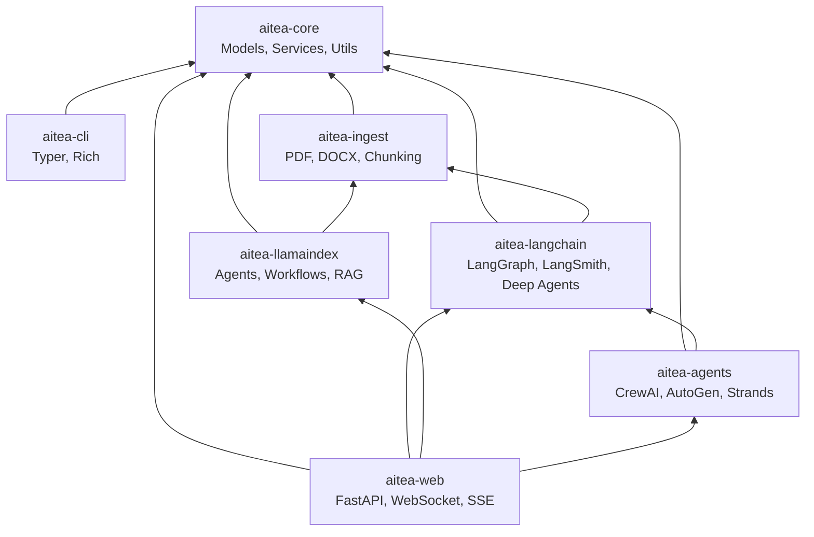

# Design Document: AITEA Curriculum

## Overview

The AITEA (AI Time Estimation Agent) curriculum is a project-based learning system that teaches AI agent development through building a real-world estimation tool. The curriculum spans 58 chapters across 10 phases, progressively building 7 Python packages while teaching concepts from Python fundamentals to production-ready AI systems.

The design follows a "learn by building" philosophy where each chapter delivers both educational content and working code increments. The curriculum supports learners without API keys through a MockLLM fallback system and covers all major agent frameworks (LangChain, LlamaIndex, CrewAI, AutoGen, Strands).

## Architecture

```mermaid
graph TB
    subgraph "Curriculum Structure"
        P1[Phase 1: Python Foundations]
        P2[Phase 2: CLI Development]
        P3[Phase 3: LLM Fundamentals]
        P4[Phase 4: Document Processing]
        P5[Phase 5: Agent Foundations]
        P6[Phase 6: LangChain Track]
        P7[Phase 7: Multi-Agent Frameworks]
        P8[Phase 8: LlamaIndex & Advanced RAG]
        P9[Phase 9: Production Hardening]
        P10[Phase 10: Deployment]
    end

    subgraph "Package Outputs"
        CORE[aitea-core]
        CLI[aitea-cli]
        INGEST[aitea-ingest]
        LC[aitea-langchain]
        AGENTS[aitea-agents]
        LI[aitea-llamaindex]
        WEB[aitea-web]
    end

    subgraph "Content Types"
        NB[Jupyter Notebooks]
        PY[Python Modules]
        TEST[Test Suites]
        DATA[Sample Data]
    end

    P1 --> CORE
    P2 --> CLI
    P3 --> CORE
    P4 --> INGEST
    P5 --> CORE
    P6 --> LC
    P7 --> AGENTS
    P8 --> LI
    P9 --> WEB
    P10 --> WEB

    P1 --> NB
    P1 --> PY
    P1 --> TEST
```



### Package Dependency Graph



## Components and Interfaces

### 1. Chapter Content Generator

Responsible for producing consistent chapter content following the defined structure.

```python
@dataclass
class ChapterMetadata:
    number: int
    title: str
    difficulty: Literal["Beginner", "Intermediate", "Advanced"]
    time_hours: float
    prerequisites: List[int]
    aitea_component: str
    phase: int

@dataclass
class ChapterContent:
    metadata: ChapterMetadata
    learning_objectives: List[str]
    key_concepts: List[KeyConcept]
    from_scratch_impl: Optional[CodeSection]
    framework_impl: Optional[CodeSection]
    exercises: List[Exercise]
    debugging_scenario: DebuggingScenario
    quick_check_questions: List[Question]
    mini_project: MiniProject
    aitea_integration: AITEAIntegration
```

### 2. Core Data Models (aitea-core)

```python
@dataclass
class Feature:
    id: str
    name: str
    team: TeamType
    process: str
    seed_time_hours: float
    synonyms: List[str]
    notes: str

@dataclass
class TrackedTimeEntry:
    id: str
    team: TeamType
    member_name: str
    feature: str
    tracked_time_hours: float
    process: str
    date: date

@dataclass
class ProjectEstimate:
    features: List[FeatureEstimate]
    total_hours: float
    confidence: ConfidenceLevel

@dataclass
class EstimationConfig:
    use_outlier_detection: bool = True
    outlier_threshold_std: float = 2.0
    min_data_points_for_stats: int = 3
```

### 3. Service Interfaces

```python
class IFeatureLibraryService(ABC):
    @abstractmethod
    def add_feature(self, feature: Feature) -> Result[Feature, ValidationError]: ...

    @abstractmethod
    def get_feature(self, feature_id: str) -> Result[Feature, NotFoundError]: ...

    @abstractmethod
    def search_features(self, query: str) -> List[Feature]: ...

    @abstractmethod
    def list_features(self, team: Optional[TeamType] = None) -> List[Feature]: ...

class ITimeTrackingService(ABC):
    @abstractmethod
    def add_entry(self, entry: TrackedTimeEntry) -> Result[TrackedTimeEntry, ValidationError]: ...

    @abstractmethod
    def import_csv(self, path: Path) -> Result[ImportResult, ImportError]: ...

    @abstractmethod
    def get_entries_for_feature(self, feature_name: str) -> List[TrackedTimeEntry]: ...

class IEstimationService(ABC):
    @abstractmethod
    def estimate_feature(self, feature_name: str) -> Result[FeatureEstimate, EstimationError]: ...

    @abstractmethod
    def estimate_project(self, features: List[str]) -> Result[ProjectEstimate, EstimationError]: ...

    @abstractmethod
    def compute_statistics(self, entries: List[TrackedTimeEntry]) -> FeatureStatistics: ...
```

### 4. Multi-Provider LLM System

```python
class LLMProvider(ABC):
    """Abstract base for LLM providers."""

    @abstractmethod
    async def complete(self, prompt: str, **kwargs) -> str: ...

    @abstractmethod
    async def stream(self, prompt: str, **kwargs) -> AsyncIterator[str]: ...

    @abstractmethod
    def count_tokens(self, text: str) -> int: ...

class OpenAIProvider(LLMProvider):
    """OpenAI GPT models (gpt-4o, gpt-4o-mini)."""
    ...

class AnthropicProvider(LLMProvider):
    """Anthropic Claude models (claude-3.5-sonnet, claude-3-haiku)."""
    ...

class BedrockProvider(LLMProvider):
    """AWS Bedrock models (Claude, Titan, Llama)."""
    ...

class MockLLM(LLMProvider):
    """Deterministic LLM simulator for no-key learning."""

    RESPONSES: Dict[str, Any] = {
        "extract_features": {...},
        "estimate_project": {...},
        "parse_brd": {...}
    }

def get_llm_provider(provider: str = "auto") -> LLMProvider:
    """Returns appropriate provider based on available API keys."""
    ...
```

### 5. Document Processing Pipeline (aitea-ingest)

```python
class DocumentLoader(ABC):
    """Abstract base for document loaders."""

    @abstractmethod
    def load(self, path: Path) -> List[Document]: ...

class PDFLoader(DocumentLoader):
    """Load PDF documents with optional OCR."""
    ...

class DOCXLoader(DocumentLoader):
    """Load Microsoft Word documents."""
    ...

class ChunkingStrategy(ABC):
    """Abstract base for chunking strategies."""

    @abstractmethod
    def chunk(self, document: Document) -> List[Chunk]: ...

class RecursiveChunker(ChunkingStrategy):
    """Recursively split by separators (paragraphs, sentences, words)."""
    chunk_size: int = 1000
    chunk_overlap: int = 200
    separators: List[str] = ["\n\n", "\n", ". ", " "]

class SemanticChunker(ChunkingStrategy):
    """Split based on semantic similarity between sentences."""
    embedding_model: str = "text-embedding-3-small"
    similarity_threshold: float = 0.8

class ParentDocumentRetriever:
    """Store small chunks but retrieve parent documents."""
    child_splitter: ChunkingStrategy
    parent_splitter: ChunkingStrategy
```

### 6. CLI Interface (aitea-cli)

```python
# Typer application structure
app = typer.Typer()

@app.command()
def feature_add(name: str, team: TeamType, seed_hours: float): ...

@app.command()
def feature_list(team: Optional[TeamType] = None): ...

@app.command()
def import_csv(path: Path): ...

@app.command()
def estimate(features: List[str]): ...
```

### 7. Multi-Agent Frameworks (aitea-agents)

```python
# CrewAI Implementation
from crewai import Agent, Task, Crew

analyst_agent = Agent(
    role="Requirements Analyst",
    goal="Extract and clarify features from BRD documents",
    backstory="Expert at understanding business requirements",
    tools=[feature_search_tool, clarification_tool]
)

estimator_agent = Agent(
    role="Estimation Specialist",
    goal="Provide accurate time estimates based on historical data",
    backstory="Senior developer with years of estimation experience",
    tools=[estimation_tool, statistics_tool]
)

reviewer_agent = Agent(
    role="Estimate Reviewer",
    goal="Validate estimates and identify risks",
    backstory="Project manager focused on realistic planning",
    tools=[validation_tool, risk_assessment_tool]
)

estimation_crew = Crew(
    agents=[analyst_agent, estimator_agent, reviewer_agent],
    tasks=[analyze_task, estimate_task, review_task],
    process=Process.sequential
)

# AutoGen Implementation
from autogen import AssistantAgent, UserProxyAgent, GroupChat

assistant = AssistantAgent(
    name="EstimationAssistant",
    llm_config=llm_config,
    system_message="You help estimate software development time."
)

user_proxy = UserProxyAgent(
    name="ProjectManager",
    human_input_mode="TERMINATE",
    code_execution_config={"work_dir": "workspace"}
)

# Strands Agents SDK Implementation
from strands import Agent, tool

@tool
def search_features(query: str) -> List[Feature]:
    """Search the feature library for matching features."""
    ...

strands_agent = Agent(
    model="us.anthropic.claude-3-5-sonnet-20241022-v2:0",
    tools=[search_features, estimate_feature],
    system_prompt="You are an AI estimation assistant."
)

# MCP Tool Definitions
class MCPToolDefinition:
    """Model Context Protocol tool for cross-framework sharing."""
    name: str
    description: str
    input_schema: Dict[str, Any]

    def to_mcp_format(self) -> Dict: ...
    def to_langchain_tool(self) -> BaseTool: ...
    def to_crewai_tool(self) -> Tool: ...
```

### 8. Advanced Patterns (Phase 9)

```python
# Multi-Agent Coordination
class SupervisorAgent:
    """Coordinates specialist agents for complex estimation tasks."""
    specialists: Dict[str, BaseAgent]

    def route_task(self, task: Task) -> str:
        """Determine which specialist should handle the task."""
        ...

    def handoff(self, from_agent: str, to_agent: str, context: Dict) -> None:
        """Transfer conversation context between agents."""
        ...

# Reliability Patterns
class RetryConfig:
    max_retries: int = 3
    backoff_factor: float = 2.0
    retry_exceptions: Tuple[Type[Exception], ...] = (TimeoutError, RateLimitError)

class FallbackChain:
    """Chain of fallback providers for LLM calls."""
    providers: List[LLMProvider]

    def call(self, prompt: str) -> str:
        """Try providers in order until one succeeds."""
        ...

# Cost Optimization
class LLMCache:
    """Semantic cache for LLM responses."""

    def get(self, prompt: str, similarity_threshold: float = 0.95) -> Optional[str]: ...
    def set(self, prompt: str, response: str) -> None: ...

class BatchProcessor:
    """Batch multiple LLM calls for efficiency."""
    batch_size: int = 10

    def add(self, request: LLMRequest) -> Future[str]: ...
    def flush(self) -> List[str]: ...
```

### 9. Agentic RAG Patterns

```python
# Self-RAG: Self-reflective retrieval
class SelfRAG:
    """Agent decides when retrieval is needed and validates relevance."""

    def query(self, question: str) -> str:
        # Step 1: Decide if retrieval is needed
        needs_retrieval = self.assess_retrieval_need(question)

        if needs_retrieval:
            # Step 2: Retrieve documents
            docs = self.retriever.retrieve(question)

            # Step 3: Grade relevance
            relevant_docs = [d for d in docs if self.grade_relevance(d, question)]

            # Step 4: Generate with relevant docs
            response = self.generate(question, relevant_docs)

            # Step 5: Check for hallucination
            if self.detect_hallucination(response, relevant_docs):
                return self.regenerate(question, relevant_docs)
        else:
            response = self.generate(question, [])

        return response

# Corrective RAG (CRAG)
class CorrectiveRAG:
    """Corrects retrieval results before generation."""

    def query(self, question: str) -> str:
        docs = self.retriever.retrieve(question)

        # Grade each document
        grades = [self.grade_document(d, question) for d in docs]

        if all(g == "incorrect" for g in grades):
            # All docs irrelevant - use web search fallback
            docs = self.web_search(question)
        elif any(g == "ambiguous" for g in grades):
            # Some ambiguous - refine query and re-retrieve
            refined_query = self.refine_query(question)
            docs = self.retriever.retrieve(refined_query)

        return self.generate(question, docs)

# Adaptive RAG
class AdaptiveRAG:
    """Routes queries to appropriate retrieval strategy."""

    def query(self, question: str) -> str:
        # Classify query complexity
        complexity = self.classify_query(question)

        if complexity == "simple":
            return self.direct_answer(question)
        elif complexity == "moderate":
            return self.single_retrieval(question)
        else:  # complex
            return self.multi_step_retrieval(question)
```

### 10. Web Application (aitea-web)

```python
# FastAPI Application with WebSocket and SSE
from fastapi import FastAPI, WebSocket, Depends
from fastapi.responses import StreamingResponse
from sse_starlette.sse import EventSourceResponse

app = FastAPI()

@app.post("/api/estimate")
async def estimate_project(
    features: List[str],
    estimation_service: IEstimationService = Depends(get_estimation_service)
) -> ProjectEstimate:
    """REST endpoint for project estimation."""
    ...

@app.get("/api/estimate/stream")
async def estimate_stream(features: str) -> EventSourceResponse:
    """SSE endpoint for streaming estimation progress."""
    async def generate():
        async for update in estimation_service.estimate_stream(features.split(",")):
            yield {"event": "progress", "data": update.json()}
        yield {"event": "complete", "data": "done"}
    return EventSourceResponse(generate())

@app.websocket("/ws/agent")
async def agent_websocket(websocket: WebSocket):
    """WebSocket for bidirectional agent communication."""
    await websocket.accept()
    while True:
        data = await websocket.receive_json()
        async for response in agent.stream(data["message"]):
            await websocket.send_json({"type": "chunk", "content": response})
        await websocket.send_json({"type": "complete"})

# Guardrails Integration
from nemoguardrails import RailsConfig, LLMRails

rails_config = RailsConfig.from_path("./config")
rails = LLMRails(rails_config)

@app.post("/api/chat")
async def chat_with_guardrails(message: str):
    """Chat endpoint with input/output guardrails."""
    response = await rails.generate_async(messages=[{"role": "user", "content": message}])
    return {"response": response}

# Observability with LangFuse
from langfuse import Langfuse
from langfuse.decorators import observe

langfuse = Langfuse()

@observe()
async def traced_estimation(features: List[str]) -> ProjectEstimate:
    """Estimation with automatic tracing."""
    ...
```

### 11. Vector Database Abstraction

```python
class VectorStore(ABC):
    """Abstract base for vector stores."""

    @abstractmethod
    async def add_documents(self, documents: List[Document]) -> List[str]: ...

    @abstractmethod
    async def similarity_search(self, query: str, k: int = 4) -> List[Document]: ...

    @abstractmethod
    async def hybrid_search(self, query: str, k: int = 4, alpha: float = 0.5) -> List[Document]: ...

class ChromaDBStore(VectorStore):
    """ChromaDB implementation - good for development."""
    ...

class PineconeStore(VectorStore):
    """Pinecone implementation - managed, scalable."""
    ...

class QdrantStore(VectorStore):
    """Qdrant implementation - hybrid search native."""
    ...

class WeaviateStore(VectorStore):
    """Weaviate implementation - GraphQL API."""
    ...

class PGVectorStore(VectorStore):
    """PostgreSQL pgvector - SQL-native vector search."""
    ...
```

## Data Models

### Enumerations

```python
class TeamType(str, Enum):
    BACKEND = "backend"
    FRONTEND = "frontend"
    FULLSTACK = "fullstack"
    DESIGN = "design"
    QA = "qa"
    DEVOPS = "devops"

class ProcessType(str, Enum):
    DATA_OPERATIONS = "Data Operations"
    CONTENT_MANAGEMENT = "Content Management"
    REAL_TIME = "Real-time"
    AUTHENTICATION = "Authentication"
    INTEGRATION = "Integration"

class ConfidenceLevel(str, Enum):
    LOW = "low"      # 1-2 data points
    MEDIUM = "medium"  # 3-9 data points
    HIGH = "high"    # 10+ data points
```

### JSON Persistence Schema

```json
{
  "features": [
    {
      "id": "feat_001",
      "name": "CRUD",
      "team": "backend",
      "process": "Data Operations",
      "seed_time_hours": 4.0,
      "synonyms": ["crud-api", "rest-crud"],
      "notes": "Create/Read/Update/Delete API endpoints"
    }
  ],
  "tracked_time": [
    {
      "id": "track_001",
      "team": "backend",
      "member_name": "BE-1",
      "feature": "CRUD",
      "tracked_time_hours": 4.5,
      "process": "Data Operations",
      "date": "2025-01-15"
    }
  ]
}
```

### Chapter Content Schema

```python
@dataclass
class CodeSection:
    """Code implementation section with optional framework comparison."""
    language: str
    code: str
    explanation: str
    line_annotations: Dict[int, str]  # Line number -> annotation

@dataclass
class Exercise:
    title: str
    description: str
    starter_code: str
    expected_output: str
    hints: List[str]

@dataclass
class DebuggingScenario:
    broken_code: str
    bug_description: str
    fixed_code: str
    explanation: str

@dataclass
class MiniProject:
    title: str
    requirements: List[str]
    acceptance_criteria: List[str]
    starter_scaffold: str
    rubric: Dict[str, int]
    extensions: List[str]

@dataclass
class AITEAIntegration:
    """Links chapter content to AITEA requirements."""
    requirement_refs: List[str]  # e.g., ["1.2", "8.4"]
    component_built: str  # e.g., "aitea-core/models"
    integration_notes: str
```

## Correctness Properties

_A property is a characteristic or behavior that should hold true across all valid executions of a system-essentially, a formal statement about what the system should do. Properties serve as the bridge between human-readable specifications and machine-verifiable correctness guarantees._

### Property 1: Enum Completeness and Type Safety

_For any_ TeamType, ProcessType, or ConfidenceLevel enum, all defined members SHALL be accessible by name and value, and mypy SHALL report no type errors when using these enums.
**Validates: Requirements 1.2**

### Property 2: Dataclass Instantiation Validity

_For any_ valid combination of field values for Feature, TrackedTimeEntry, ProjectEstimate, or EstimationConfig, the dataclass SHALL instantiate without error and all fields SHALL be accessible with correct types.
**Validates: Requirements 1.3**

### Property 3: Service Result Pattern Consistency

_For any_ service method call on FeatureLibraryService, TimeTrackingService, or EstimationService, the return value SHALL be a Result type that can be pattern-matched for success or error cases.
**Validates: Requirements 1.5, 1.8**

### Property 4: Statistics Mathematical Correctness

_For any_ non-empty list of tracked time entries:

- Mean SHALL equal sum of values divided by count
- Median SHALL equal the middle value (or average of two middle values)
- P80 SHALL be greater than or equal to median
- Standard deviation SHALL be non-negative
  **Validates: Requirements 1.6, 9.1**

### Property 5: Model Serialization Round-Trip

_For any_ valid Feature, TrackedTimeEntry, or ProjectEstimate instance, serializing to JSON and deserializing back SHALL produce an equivalent instance with all field values preserved.
**Validates: Requirements 2.3, 8.4**

### Property 6: CSV Import Validation

_For any_ CSV file with tracked time data:

- Valid rows SHALL be imported successfully
- Invalid rows SHALL be collected with specific error messages
- The import result SHALL report counts of successful and failed rows
  **Validates: Requirements 2.4**

### Property 7: Output Parser Round-Trip

_For any_ valid Pydantic model instance used for LLM output parsing, serializing to JSON string and parsing back SHALL produce an equivalent model instance.
**Validates: Requirements 3.3**

### Property 8: Agent Loop State Transitions

_For any_ SimpleAgent execution, the agent SHALL progress through Observe → Think → Act → Reflect states in order, and each state transition SHALL be logged.
**Validates: Requirements 4.2**

### Property 9: Tool Registry Operations

_For any_ tool registered with ToolRegistry:

- The tool SHALL be retrievable by name
- The tool's JSON schema SHALL be valid
- Invoking the tool with valid arguments SHALL succeed
  **Validates: Requirements 4.3**

### Property 10: Memory Capacity Constraints

_For any_ short-term memory instance with capacity N, adding more than N items SHALL result in exactly N items being retained (oldest items removed).
**Validates: Requirements 4.5**

### Property 11: Prompt Injection Detection

_For any_ input string containing known injection patterns (e.g., "ignore previous instructions"), the safety check SHALL flag the input as potentially malicious.
**Validates: Requirements 4.6**

### Property 12: RAG Retrieval Relevance

_For any_ document stored in the vector store, querying with the document's content or semantically similar text SHALL return that document in the top-k results.
**Validates: Requirements 5.3**

### Property 13: Prompt Template Variable Substitution

_For any_ PromptTemplate with variables, formatting with a dictionary containing all required variables SHALL produce a string with all variables replaced.
**Validates: Requirements 5.6**

### Property 14: Hybrid Retriever Result Quality

_For any_ query to the hybrid retriever, results SHALL be ordered by relevance score, and the top result SHALL have the highest score.
**Validates: Requirements 6.2**

### Property 15: Retry Pattern Behavior

_For any_ operation wrapped with retry logic, if the operation fails N times and succeeds on attempt N+1 (where N < max_retries), the overall operation SHALL succeed.
**Validates: Requirements 7.2**

### Property 16: Cache Hit Consistency

_For any_ cached LLM call, subsequent calls with identical inputs SHALL return the cached result without invoking the LLM.
**Validates: Requirements 7.3**

### Property 16a: Multi-Agent Message Routing

_For any_ multi-agent system with supervisor, messages routed to specialist agents SHALL be received by the correct agent based on task type, and handoff transitions SHALL preserve conversation context.
**Validates: Requirements 7.1**

### Property 17: JSON Validation Error Specificity

_For any_ JSON input missing required fields or containing invalid types, parsing SHALL raise a ValidationError that identifies the specific field and error type.
**Validates: Requirements 8.5**

### Property 18: Low Data Point Fallback

_For any_ feature with fewer than 3 tracked time entries, the estimation SHALL use the seed time and return ConfidenceLevel.LOW.
**Validates: Requirements 9.2**

### Property 19: Outlier Detection Accuracy

_For any_ set of tracked time entries, entries with values exceeding 2 standard deviations from the mean SHALL be flagged as outliers.
**Validates: Requirements 9.3**

### Property 20: Project Estimate Aggregation

_For any_ project estimate, the total_hours SHALL equal the sum of all feature estimate hours.
**Validates: Requirements 9.4**

### Property 21: Confidence Level Thresholds

_For any_ feature estimation:

- 1-2 data points → ConfidenceLevel.LOW
- 3-9 data points → ConfidenceLevel.MEDIUM
- 10+ data points → ConfidenceLevel.HIGH
  **Validates: Requirements 9.5**

### Property 22: MockLLM Determinism

_For any_ task type, calling MockLLM.complete() multiple times with the same prompt and task SHALL return identical responses.
**Validates: Requirements 10.3**

### Property 23: Chapter Header Completeness

_For any_ chapter content, the header section SHALL contain difficulty level, time estimate, prerequisites list, and AITEA component fields.
**Validates: Requirements 11.1**

### Property 24: Learning Objectives Count

_For any_ chapter, the learning objectives section SHALL contain between 3 and 5 objectives, each starting with an action verb.
**Validates: Requirements 11.2**

### Property 25: Exercise Minimum Count

_For any_ chapter, there SHALL be at least 2 interactive exercises, each with expected output shown.
**Validates: Requirements 11.4**

### Property 26: Debugging Scenario Structure

_For any_ chapter, the debugging scenario SHALL contain broken code, bug description, fixed code, and explanation sections.
**Validates: Requirements 11.5**

### Property 27: Mini-Project Completeness

_For any_ chapter, the mini-project SHALL contain requirements list and acceptance criteria list.
**Validates: Requirements 11.6**

### Property 28: AITEA Integration Reference

_For any_ chapter, the AITEA integration section SHALL reference at least one requirement number from the requirements document.
**Validates: Requirements 11.7**

### Property 29: API Endpoint Response Consistency

_For any_ FastAPI endpoint in aitea-web, the response SHALL conform to the declared Pydantic response model, and error responses SHALL include appropriate HTTP status codes and error details.
**Validates: Requirements 10.1**

### Property 30: Streaming Response Completeness

_For any_ streaming LLM response, all chunks SHALL be delivered in order, and the concatenation of all chunks SHALL equal the complete response that would be returned by a non-streaming call.
**Validates: Requirements 3.6**

### Property 31: Multi-Provider Fallback Consistency

_For any_ LLM call with fallback chain configured, if the primary provider fails, the fallback provider SHALL be invoked, and the response format SHALL be consistent regardless of which provider succeeded.
**Validates: Requirements 3.5, 9.3**

### Property 32: Chunk Boundary Integrity

_For any_ document chunked with overlap, the overlap region SHALL contain complete words/sentences (no mid-word splits), and adjacent chunks SHALL share exactly the configured overlap content.
**Validates: Requirements 4.2, 4.3**

### Property 33: Embedding Similarity Transitivity

_For any_ three documents A, B, C where similarity(A,B) > threshold and similarity(B,C) > threshold, the retrieval system SHALL return all three when querying with content similar to any one of them.
**Validates: Requirements 6.3, 8.3**

### Property 34: Guardrail Trigger Determinism

_For any_ input containing known harmful patterns, the guardrail system SHALL consistently block the input across multiple invocations with identical configuration.
**Validates: Requirements 9.1**

### Property 35: Async Task Ordering

_For any_ set of concurrent async operations with dependencies, dependent operations SHALL complete after their dependencies, and independent operations MAY complete in any order.
**Validates: Requirements 9.4**

### Property 36: CrewAI Agent Role Isolation

_For any_ CrewAI crew execution, each agent SHALL only use tools assigned to its role, and task outputs SHALL flow correctly between agents in the defined process order.
**Validates: Requirements 7.1**

### Property 37: MCP Tool Schema Compatibility

_For any_ MCP tool definition, the schema SHALL be convertible to LangChain, CrewAI, and Strands tool formats without loss of parameter information.
**Validates: Requirements 7.4**

### Property 38: Graph RAG Relationship Preservation

_For any_ knowledge graph constructed from documents, entity relationships extracted SHALL be queryable via graph traversal, and retrieved subgraphs SHALL maintain referential integrity.
**Validates: Requirements 8.5**

### Property 39: Agentic RAG Self-Correction

_For any_ Self-RAG or CRAG query where initial retrieval is graded as irrelevant, the system SHALL attempt correction (re-retrieval or web search) before generating a response.
**Validates: Requirements 8.4**

### Property 40: WebSocket Message Ordering

_For any_ WebSocket agent session, messages sent by the server SHALL arrive at the client in the same order they were sent, and client messages SHALL be processed in arrival order.
**Validates: Requirements 10.1**

## Error Handling

### Validation Errors

```python
@dataclass
class ValidationError:
    field: str
    message: str
    value: Any

@dataclass
class ImportError:
    row_number: int
    errors: List[ValidationError]

class Result(Generic[T, E]):
    """Discriminated union for success/error handling."""

    @staticmethod
    def ok(value: T) -> "Result[T, E]": ...

    @staticmethod
    def err(error: E) -> "Result[T, E]": ...

    def is_ok(self) -> bool: ...
    def is_err(self) -> bool: ...
    def unwrap(self) -> T: ...
    def unwrap_err(self) -> E: ...
```

### Error Categories

| Category   | Examples                      | Handling Strategy                      |
| ---------- | ----------------------------- | -------------------------------------- |
| Validation | Missing fields, invalid types | Return Result.err with ValidationError |
| Not Found  | Feature/entry not found       | Return Result.err with NotFoundError   |
| Import     | CSV parsing failures          | Collect errors, continue processing    |
| LLM        | API failures, timeout         | Retry with backoff, fallback to mock   |
| File I/O   | Permission denied, not found  | Raise with descriptive message         |

### Multi-Provider Fallback System

The system supports automatic fallback across multiple LLM providers for resilience and flexibility.

**Provider Priority Chain:**

1. OpenAI (GPT-4o, GPT-4o-mini)
2. Cohere (Command R+, Command R)
3. Google Gemini (Gemini 1.5 Pro, Gemini 1.5 Flash)
4. Grok (xAI)
5. Mistral AI
6. HuggingFace (Inference API)
7. Ollama (local models)
8. MockLLM (deterministic fallback)

**Fallback Logic:**

```python
class LLMFallbackChain:
    """Manages automatic provider fallback."""

    def __init__(self):
        self.providers = self._initialize_providers()
        self.current_provider = None

    def _initialize_providers(self) -> List[LLMProvider]:
        """Initialize providers based on available API keys."""
        providers = []

        if os.getenv("OPENAI_API_KEY"):
            providers.append(OpenAIProvider())
        if os.getenv("COHERE_API_KEY"):
            providers.append(CohereProvider())
        if os.getenv("GOOGLE_API_KEY"):
            providers.append(GeminiProvider())
        if os.getenv("XAI_API_KEY"):
            providers.append(GrokProvider())
        if os.getenv("MISTRAL_API_KEY"):
            providers.append(MistralProvider())
        if os.getenv("HUGGINGFACE_API_KEY"):
            providers.append(HuggingFaceProvider())
        if self._check_ollama_available():
            providers.append(OllamaProvider())

        # Always add MockLLM as final fallback
        providers.append(MockLLM())

        return providers

    async def complete(self, prompt: str, **kwargs) -> str:
        """Try providers in order until one succeeds."""
        last_error = None

        for provider in self.providers:
            try:
                logger.info(f"Attempting LLM call with {provider.name}")
                response = await provider.complete(prompt, **kwargs)
                self.current_provider = provider.name
                logger.info(f"✅ LLM call succeeded with {provider.name}")
                return response
            except Exception as e:
                logger.warning(f"Provider {provider.name} failed: {e}")
                last_error = e
                continue

        # All providers failed (shouldn't happen with MockLLM)
        raise RuntimeError(f"All LLM providers failed. Last error: {last_error}")
```

**Provider Configuration:**

Each provider implements the `LLMProvider` interface:

```python
class CohereProvider(LLMProvider):
    """Cohere Command models."""
    name = "Cohere"

    def __init__(self):
        self.api_key = os.getenv("COHERE_API_KEY")
        self.client = cohere.Client(self.api_key)

    async def complete(self, prompt: str, **kwargs) -> str:
        response = self.client.generate(
            prompt=prompt,
            model=kwargs.get("model", "command-r-plus"),
            max_tokens=kwargs.get("max_tokens", 1000)
        )
        return response.generations[0].text

class GeminiProvider(LLMProvider):
    """Google Gemini models."""
    name = "Gemini"

    def __init__(self):
        self.api_key = os.getenv("GOOGLE_API_KEY")
        genai.configure(api_key=self.api_key)
        self.model = genai.GenerativeModel("gemini-1.5-pro")

    async def complete(self, prompt: str, **kwargs) -> str:
        response = await self.model.generate_content_async(prompt)
        return response.text
```

**Logging and Observability:**

```python
# Log which provider handled each request
logger.info(f"LLM Request: {prompt[:100]}...")
logger.info(f"Provider: {fallback_chain.current_provider}")
logger.info(f"Response: {response[:100]}...")

# Track provider usage metrics
metrics.increment(f"llm.provider.{provider_name}.success")
metrics.increment(f"llm.provider.{provider_name}.tokens", token_count)
```

**MockLLM Fallback:**

When no API keys are set OR all real providers fail:

1. Log warning: "⚠️ Running in MOCK mode - set API keys for real LLM providers"
2. Use MockLLM for all LLM operations
3. Return deterministic responses from predefined response map
4. Display mock mode indicator in CLI/UI

## Testing Strategy

### Dual Testing Approach

The curriculum uses both unit tests and property-based tests:

- **Unit tests**: Verify specific examples, edge cases, and integration points
- **Property-based tests**: Verify universal properties across many random inputs

### Property-Based Testing with Hypothesis

All property-based tests use the Hypothesis library with minimum 100 iterations per test.

```python
from hypothesis import given, settings, strategies as st

@settings(max_examples=100)
@given(st.lists(st.floats(min_value=0.1, max_value=100.0), min_size=1))
def test_mean_calculation(values: List[float]):
    """
    **Feature: curriculum, Property 4: Statistics Mathematical Correctness**
    **Validates: Requirements 1.6, 9.1**
    """
    result = calculate_mean(values)
    assert result == sum(values) / len(values)
```

### Custom Strategies

```python
# Strategy for generating valid Feature instances
feature_strategy = st.builds(
    Feature,
    id=st.text(min_size=1, max_size=20),
    name=st.text(min_size=1, max_size=100),
    team=st.sampled_from(TeamType),
    process=st.text(min_size=1, max_size=50),
    seed_time_hours=st.floats(min_value=0.5, max_value=200.0),
    synonyms=st.lists(st.text(min_size=1, max_size=50), max_size=10),
    notes=st.text(max_size=500)
)

# Strategy for generating valid TrackedTimeEntry instances
tracked_time_strategy = st.builds(
    TrackedTimeEntry,
    id=st.text(min_size=1, max_size=20),
    team=st.sampled_from(TeamType),
    member_name=st.text(min_size=1, max_size=50),
    feature=st.text(min_size=1, max_size=100),
    tracked_time_hours=st.floats(min_value=0.1, max_value=100.0),
    process=st.text(min_size=1, max_size=50),
    date=st.dates()
)
```

### Test Organization

```
tests/
├── conftest.py              # Shared fixtures and strategies
├── unit/
│   ├── test_models.py       # Model unit tests
│   ├── test_services.py     # Service unit tests
│   ├── test_utils.py        # Utility unit tests
│   └── test_agents.py       # Agent pattern unit tests
├── properties/
│   ├── test_model_props.py  # Model property tests
│   ├── test_stats_props.py  # Statistics property tests
│   ├── test_serial_props.py # Serialization property tests
│   ├── test_chapter_props.py # Chapter structure property tests
│   ├── test_agent_props.py  # Agent loop property tests
│   └── test_memory_props.py # Memory capacity property tests
└── integration/
    ├── test_cli.py          # CLI integration tests
    ├── test_persistence.py  # Persistence integration tests
    └── test_api.py          # FastAPI endpoint tests
```

### Test Tagging Convention

Each property-based test MUST include a docstring with:

- Feature name and property number
- Requirements reference

Example:

```python
def test_serialization_round_trip(feature: Feature):
    """
    **Feature: curriculum, Property 5: Model Serialization Round-Trip**
    **Validates: Requirements 2.3, 8.4**
    """
```
