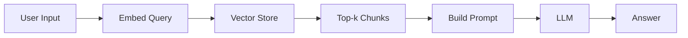
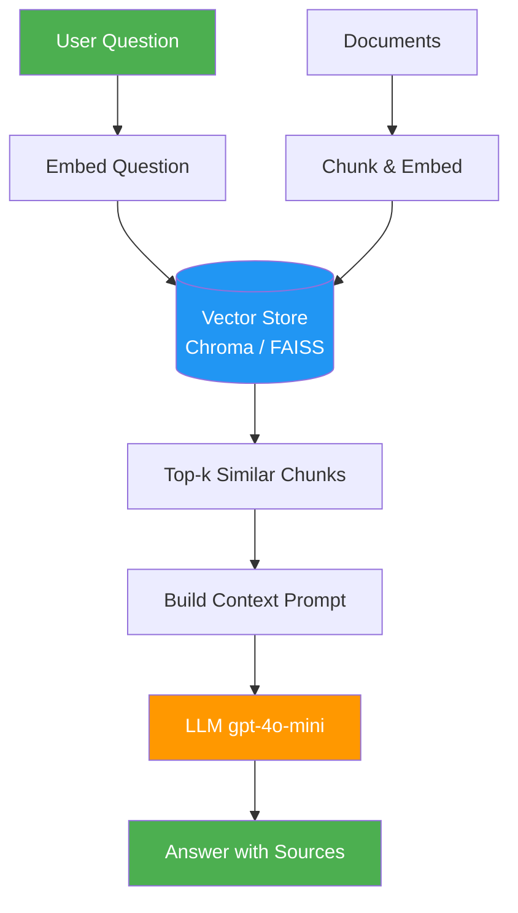

# Visual Enhancement Guide for Layer 1

## Diagrams, ASCII Art, and Visual Aids for the Mechanic-Level AI Engineering Curriculum

**Layer**: Layer 1 — The Mechanic Level
**Last Updated**: 2026-02-25
**Philosophy**: Visuals in Layer 1 serve one of two purposes — making a process concrete before code, or making a broken state diagnosable. Decoration has no place here.

---

## Why Visuals Matter in Layer 1

Most Layer 1 concepts involve data flowing through a pipeline. The pipeline is invisible in the code — it only becomes visible when you see it diagrammed. Learners who can picture the message list evolving turn by turn understand statelessness. Learners who can see the RAG pipeline as a flow diagram understand what to build.

Three things visuals do in Layer 1 that text alone cannot:

1. **Make invisible data structures visible** — the messages list, the chunk stream, the vector similarity computation
2. **Show the pipeline before the code** — a diagram of the RAG flow gives the learner a mental model of what they are about to build
3. **Diagnose broken states** — side-by-side "working vs. broken" ASCII can show exactly where a pipeline breaks

---

## Visual Types and When to Use Each

### Type 1: ASCII Data Structure Evolution
**Use for**: Showing how data changes over time (messages list, chunk pipeline, agent loop)
**When**: Inside scaffold files (in concept comments), in Tighten the Bolts sections of README
**Format**: Monospace ASCII, fits in a code comment block

```
Turn 0 (init):
  messages = [{"role": "system", "content": "You are..."}]

Turn 1 (user: "Hello"):
  messages = [
    {"role": "system", ...},
    {"role": "user", "content": "Hello"}       ← appended BEFORE API call
  ]
  → API call →
  messages = [
    {"role": "system", ...},
    {"role": "user", "content": "Hello"},
    {"role": "assistant", "content": "Hi!"}    ← appended AFTER API call
  ]
```

**Rule**: Show the state BEFORE and AFTER each operation. Make the append timing explicit.

---

### Type 2: Pipeline Flow Diagrams (ASCII)
**Use for**: RAG pipeline, agent loop, streaming flow, multi-provider architecture
**When**: In README files, in the Tighten the Bolts section, after the First Wrench Turn
**Format**: ASCII box-and-arrow, keeps the diagram renderable in any terminal or editor

```
RAG Pipeline — Day 5

  User Query
      │
      ▼
  ┌─────────────────┐
  │  Embed Query    │  text-embedding-3-small
  └────────┬────────┘
           │  query vector [0.23, -0.45, ...]
           ▼
  ┌─────────────────┐
  │  Vector Search  │  cosine similarity → top-3 chunks
  └────────┬────────┘
           │  [chunk_1, chunk_2, chunk_3]
           ▼
  ┌─────────────────┐
  │ Build Prompt    │  system + context chunks + question
  └────────┬────────┘
           │  messages list
           ▼
  ┌─────────────────┐
  │   LLM Call      │  gpt-4o-mini
  └────────┬────────┘
           │
           ▼
      Answer + Sources
```

**Rule**: Label every arrow with what data is flowing. Label every box with the tool/step. This is the diagram the learner will draw on a whiteboard in an interview.

---

### Type 3: Broken vs. Working Side-by-Side (ASCII)
**Use for**: WHAT BROKEN LOOKS LIKE sections in scaffold files
**When**: Near the top of SELF-CHECK sections, referenced inline from relevant TODOs
**Format**: Two-column terminal output comparison

```
WORKING (messages appended correctly):

  You: "My name is Ahmed"
  Assistant: "Nice to meet you, Ahmed!"
  You: "What's my name?"
  Assistant: "Your name is Ahmed."         ← memory works


BROKEN (assistant reply not appended):

  You: "My name is Ahmed"
  Assistant: "Nice to meet you, Ahmed!"
  You: "What's my name?"
  Assistant: "I don't know your name."     ← memory missing
```

**Rule**: Show exact terminal output — the learner should be able to copy-paste their output and compare. Do not paraphrase what failure looks like; show it exactly.

---

### Type 4: Mermaid Flowcharts (README only)
**Use for**: Day-level architecture overviews, phase maps, pipeline diagrams
**When**: In README files only — NOT in `.py` scaffold files (mermaid does not render in editors)
**Format**: Standard mermaid fenced code block



**Usage notes**:
- Keep diagrams to 6–8 nodes maximum — beyond this, they lose clarity
- Use left-to-right (`LR`) for pipelines, top-down (`TD`) for hierarchies
- Label every arrow when the data type is non-obvious
- Always follow a mermaid diagram with one sentence naming what it shows: "This is the RAG pipeline you are about to build."

---

### Type 5: Cost Growth Visualization (ASCII)
**Use for**: Making the token cost implication of stateless APIs concrete
**When**: In the message history / stateless API concept sections
**Format**: Simple ASCII table or bar chart

```
Token cost grows with conversation length:

Turn  1:  ~50 tokens   ▌
Turn  5:  ~250 tokens  ▌▌▌▌▌
Turn 10:  ~500 tokens  ▌▌▌▌▌▌▌▌▌▌
Turn 25: ~1250 tokens  ▌▌▌▌▌▌▌▌▌▌▌▌▌▌▌▌▌▌▌▌▌▌▌▌▌
Turn 50: ~2500 tokens  ▌▌▌▌▌▌▌▌▌▌▌▌▌▌▌▌▌▌▌▌▌▌▌▌▌▌▌▌▌▌▌▌▌▌▌▌▌▌▌▌▌▌▌▌▌▌▌▌▌▌

At $0.15 per million tokens (gpt-4o-mini), turn 50 costs ~$0.0004
But with 1000 users each in 50-turn conversations: ~$0.40/hour just for history
This is why production systems implement context truncation.
```

**Rule**: Connect the visualization to a real cost implication. Make it concrete.

---

## Day-by-Day Visual Guide

### Day 1 — Hello LLM

**Use in README (Tighten the Bolts)**:
- ASCII: Messages list evolution across turns (Type 1)
- ASCII: Streaming chunk flow (Type 1 variant)

**Use in scaffold files**:
- ASCII: Broken vs. working memory (Type 3) in `chatbot.py` SELF-CHECK
- ASCII: Broken vs. working streaming (Type 3) in `chatbot.py` SELF-CHECK

**Messages list evolution (for chatbot.py concept comment)**:
```
messages list — how it grows each turn:

After init:
  [ {system} ]

After turn 1 (user: "Hello"):
  [ {system}, {user: Hello}, {assistant: Hi!} ]
        ↑ appended before call    ↑ appended after call

After turn 2 (user: "What's my name?"):
  [ {system}, {user: Hello}, {assistant: Hi!}, {user: What's my name?}, {assistant: ...} ]

The list grows by 2 every turn.
Cost grows proportionally.
```

---

### Day 2 — Prompt Engineering & Structured Output

**Use in README**:
- ASCII: Prompt structure (system / user / output schema)
- ASCII: Pydantic retry loop flow

**Pydantic retry loop (for README concept section)**:
```
Structured Output + Validation Loop:

  Prompt → LLM → Raw JSON
                     │
               Pydantic validates?
              /                   \
           YES                    NO
            │                      │
      Return typed object      Inject error into prompt
                                    │
                               Retry (max 3)
                                    │
                               If still failing → raise
```

---

### Day 3 — Embeddings & Similarity

**Use in README**:
- ASCII: Three distance metrics side by side
- Mermaid: Embedding pipeline flow (embed → store → query → similarity → results)

**Three distance metrics (ASCII)**:
```
Three ways to measure similarity between vectors A and B:

Cosine Similarity — measures ANGLE (direction)
  cos(θ) = (A·B) / (|A|×|B|)
  Range: -1 (opposite) to 1 (identical direction)
  Use: semantic similarity (ignores "length" of the signal)

L2 / Euclidean — measures DISTANCE (straight line between points)
  L2 = √(Σ(aᵢ - bᵢ)²)
  Range: 0 (identical) to ∞
  Use: when magnitude matters (rare in NLP)

Dot Product — measures DIRECTION × MAGNITUDE
  A·B = Σ(aᵢ × bᵢ)
  Equivalent to cosine similarity when vectors are unit-normalized
  Use: FAISS IndexFlatIP uses this by default

For semantic search: use cosine similarity.
For normalized vectors: dot product == cosine similarity.
```

---

### Day 4 — Vector Databases

**Use in README**:
- Mermaid: ChromaDB collection → embedding → persist → query flow
- ASCII: Chunking with overlap visualization

**Chunking with overlap (ASCII)**:
```
Document: "The RAG system retrieves relevant chunks. These chunks are injected
           into the prompt. The LLM generates an answer based on context."

Fixed chunking (500 chars, 100 overlap):

Chunk 1: "The RAG system retrieves relevant chunks. These chunks are injected"
                                                                         ↑
Chunk 2:                            "These chunks are injected into the prompt. The LLM generates"
         ↑ 100-char overlap here: "These chunks are injected"

The overlap ensures that "These chunks are injected" is retrievable from EITHER chunk.
Without overlap: a query about injection would only retrieve chunk 2.
With overlap: it is retrievable from both chunks.
```

---

### Day 5 — First RAG Pipeline

**Use in README**:
- Mermaid: Full RAG pipeline (required — this is the central diagram for the phase)
- ASCII: What happens when retrieval fails

**Full RAG pipeline (Mermaid, use in README)**:


**ASCII label for below the diagram**:
```
Green nodes: user-facing (input and output)
Blue node: your vector store (the "filing cabinet")
Orange node: the LLM (the "research assistant" who reads the retrieved docs)
```

---

## Visual Standards for Layer 1

### ASCII Art Rules
- Use box-drawing characters (`┌ ─ ┐ │ └ ┘ ├ ┤ ┬ ┴ ┼`) for boxes
- Use `→`, `↓`, `↑`, `←`, `▼`, `▲` for arrows in prose; `-->` or `│` in code comments
- Label every data flow — not just what the node is, but what data crosses the arrow
- Keep diagrams to 15 lines maximum in scaffold file comments; 30 lines maximum in README

### Mermaid Rules (README only)
- Always follow with one sentence: "This is the [name] pipeline you are about to build."
- 6–8 nodes maximum
- Use color sparingly: green for input/output, blue for storage, orange for LLM calls
- Include in `docs/` planning files and README — never inside `.py` files

### When to Skip Visuals
- When the concept is already concrete (no need to diagram `print()`)
- When a working code example is clearer than a diagram
- When the diagram would need 20+ nodes to be accurate (simplify first)

---

## Interview Whiteboard Diagrams

Layer 1 learners will be asked to draw diagrams on whiteboards. Every major pipeline in Phase 1 (Days 1–10) should have a whiteboard-ready diagram in the README. The criteria for a whiteboard-ready diagram:

1. The learner can reproduce it from memory in under 2 minutes
2. It shows the key components and their relationships
3. It has labels for what data flows between components
4. It fits on half a standard whiteboard

The RAG pipeline (Day 5), the agent loop (Day 26), and the multi-agent architecture (Day 43) are the three diagrams most likely to be asked for in interviews. Prioritize these.

---

## Related Guides

- `WRITING-STYLE-GUIDE.md` — When and how to use visuals within the Mechanic's Workflow
- `ANALOGY-LIBRARY.md` — Analogies that pair with visual diagrams
- `QUALITY-CHECKLIST.md` — Visual requirements per day (pipeline diagrams are required for Days 3, 5, 26)

---

**Layer**: Layer 1 — The Mechanic Level
**Last Updated**: 2026-02-25
**Adapted from**: Layer 2 Visual Enhancement Guide, refocused on scaffold-file ASCII art, broken-state diagnosis visuals, and interview whiteboard readiness
