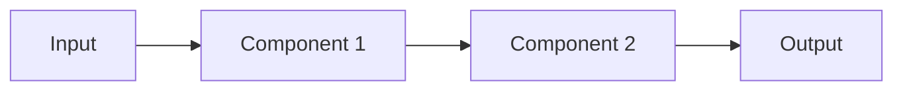

# Week-by-Week Content Creation Guide for Layer 1 v2.0

**Purpose**: Practical guide for creating weekly curriculum content
**Based On**: TEACHING-FRAMEWORK-V2.md + Layer1 teaching methodologies
**Target**: Curriculum creators building the 28-week plan
**Last Updated**: 2026-03-08

---

## 🎯 Quick Reference: What to Create Each Week

Every week needs these 5 deliverables:

1. **Weekly Guide** (`week-XX-guide.md`) - Main teaching document
2. **Scaffold Files** (starter code with TODOs) - 2-4 files per week
3. **Concept Notebooks** (optional) - Deep dives after success
4. **Test Scripts** - Verification scripts for learner code
5. **Demo Assets** - Example outputs, screenshots, video scripts

---

## 📝 Weekly Guide Template (Copy-Paste Ready)

```markdown
# Week X: [Feature Name]

**Phase**: [Foundation/LLM Integration/RAG Core/etc.]
**Estimated Time**: 24 hours (4h/day × 6 days)
**Checkpoint Gate**: [None / Gate N at end of week]

---

## 🔧 The Mechanic's Analogy

[50-100 words: One analogy framing the week's work]

Example (Week 3):
"Building an LLM client is like installing a new engine in your garage. You need
a reliable interface (API wrapper), safety systems (retries, timeouts), and
instrumentation (cost tracking). A mechanic doesn't just bolt in an engine and
hope—they test every connection, monitor performance, and plan for failures."

---

## 🎯 This Week's Build

By Day 6, you will have:
- [Concrete deliverable 1]
- [Concrete deliverable 2]
- [Concrete deliverable 3]

**Tagged Release**: `v0.X.0`
**Demo Video**: 60-120 seconds showing [specific feature]

---

## 📋 Prerequisites

Before starting this week:
- [ ] Completed Week [X-1]
- [ ] [Specific tool/library installed]
- [ ] [Specific concept understood]

**If you're missing prerequisites**: Review [specific week/resource]

---

## 📅 Day 1-2: First Wrench Turn

### Prime the Pump (15-30 minutes)

**Minimal concepts you need**:
1. [Concept 1 in 2-3 sentences]
2. [Concept 2 in 2-3 sentences]
3. [Concept 3 in 2-3 sentences]

**Watch first** (optional):
- [Video link] (X minutes) - [What to focus on]

**Read first** (optional):
- [Doc link] - [Specific section]

---

### Build Target (2-4 hours)

**Goal**: Get [specific feature] working in 2-4 hours.

**Scaffold file**: `src/week_X_first_turn.py`

**What you're building**:
[2-3 sentences describing the feature]

**Success looks like**:
```
[Expected output/behavior]
```

**Start here**:
```bash
# Setup commands
python -m venv .venv
source .venv/bin/activate  # Windows: .venv\Scripts\activate
pip install -r requirements.txt

# Run scaffold
python src/week_X_first_turn.py
```

**TODOs in scaffold file**:
1. `TODO 1`: [Brief description]
2. `TODO 2`: [Brief description]
3. `TODO 3`: [Brief description]

**Hints**:
- If you see [error X], it means [Y]. Fix by [Z].
- [Common pitfall and solution]

---

### Success Criteria (Day 2 end)

- [ ] Feature X works as expected
- [ ] Output matches example above
- [ ] Code committed to Git with message: "Week X: First wrench turn complete"
- [ ] No errors in console

**If stuck**: Review [specific resource] or check [common pitfall section]

---

## 📅 Day 3-4: Tighten the Bolts

### Extend the Build (4-6 hours)

**Goal**: Add [complexity/failure handling/feature Y]

**Scaffold file**: `src/week_X_tighten_bolts.py`

**What you're adding**:
1. [Extension 1]
2. [Extension 2]
3. [Failure handling for X]

**New TODOs**:
1. `TODO 4`: [Description]
2. `TODO 5`: [Description]
3. `TODO 6`: [Description]

---

### Deep Dive: [Concept Name]

**Now that it works, let's understand WHY.**

[Concept explanation - 200-400 words]

**Key insight**:
[One critical insight in 1-2 sentences]

**Common misconception**:
[What people get wrong + correction]

---

### Interview Anchor

**"How would you explain [concept] in an interview?"**

**Practice answer** (say out loud):
```
"[Concept] is [definition in 1 sentence].

In practice, [how you use it in 2-3 sentences].

The key trade-off is [trade-off in 1 sentence].

For example, in my Week X project, I [specific example]."
```

**Follow-up questions you might get**:
- Q: [Question 1]
  - A: [Answer in 2-3 sentences]
- Q: [Question 2]
  - A: [Answer in 2-3 sentences]

---

### Success Criteria (Day 4 end)

- [ ] Extensions 1-2 working
- [ ] Failure handling tested (deliberately break it, verify recovery)
- [ ] Code committed: "Week X: Tighten bolts complete"
- [ ] Can explain concept out loud in < 2 minutes

---

## 📅 Day 5: Road Test

### Testing Checklist (2-3 hours)

**Unit tests** (`tests/test_week_X.py`):
- [ ] Test [function/class X]
- [ ] Test [function/class Y]
- [ ] Test [edge case Z]

**Integration test**:
- [ ] Test [end-to-end flow]

**Property-based test** (optional):
- [ ] Test [invariant property]

**Run tests**:
```bash
pytest tests/test_week_X.py -v
```

**Expected**: All tests pass ✅

---

### Evaluation (1-2 hours)

**Measure**:
- [Metric 1]: [How to measure]
- [Metric 2]: [How to measure]
- [Metric 3]: [How to measure]

**Baseline results**:
| Metric | Value | Target |
|--------|-------|--------|
| [Metric 1] | [X] | [Y] |
| [Metric 2] | [X] | [Y] |

**If below target**: [Specific improvement to try]

---

### Improvement (1 hour)

**Goal**: Make one measurable improvement.

**Try**:
- [Improvement approach 1]
- [Improvement approach 2]

**Measure again**:
| Metric | Before | After | Change |
|--------|--------|-------|--------|
| [Metric 1] | [X] | [Y] | [+Z%] |

**Document**: Add results to README under "## Week X Results"

---

### Success Criteria (Day 5 end)

- [ ] All tests pass
- [ ] Metrics measured and documented
- [ ] At least one improvement made
- [ ] Code committed: "Week X: Road test complete"

---

## 📅 Day 6: Polish & Ship

### Refactor (1 hour)

**Clean up**:
- [ ] Remove commented-out code
- [ ] Extract repeated logic into functions
- [ ] Add type hints (run `mypy src/`)
- [ ] Format code (`black src/`)

---

### Documentation (1-2 hours)

**Update README.md**:
- [ ] Add "## Week X: [Feature Name]" section
- [ ] Include architecture diagram (Mermaid or screenshot)
- [ ] Document "What Failed & What Changed"
- [ ] Add setup instructions
- [ ] Include results table

**Architecture diagram template**:


**"What Failed & What Changed" template**:
```markdown
### What Failed & What Changed

**v1 (Day 1-2)**: [What you tried] → [What failed] → [Why it failed]
**v2 (Day 3-4)**: [What you changed] → [Result] → [Metric improvement]
**v3 (Day 5)**: [Final optimization] → [Final result]
```

---

### Demo Video (30-60 minutes)

**Script** (60-120 seconds):
1. (0-15s) Problem: "[What problem does this solve?]"
2. (15-45s) Solution: "[Show feature working]"
3. (45-75s) Results: "[Show metrics/improvements]"
4. (75-90s) Tech: "[Key technologies used]"

**Record**:
- Use Loom, OBS, or built-in screen recorder
- Show terminal + browser/UI
- Narrate what you're doing
- Upload to YouTube (unlisted) or Loom

**Add link to README**: `[Demo Video](URL)`

---

### Weekly Reflection (15 minutes)

**Use template from Appendix A**:

```markdown
## Week X Reflection

**Date**: YYYY-MM-DD

### What Worked Well
- [What went smoothly?]

### What Took Longer Than Expected
- [What was harder?]
- [Why?]

### Key Learning
- [One thing you can explain to someone else]

### Energy Level (1-10)
- **Score**: ___/10
- **Notes**: [If < 7, what's draining you?]

### Next Week Preview
- [What are you excited about?]
- [What are you nervous about?]
```

---

### Ship (30 minutes)

**Final checklist**:
- [ ] All tests pass (`pytest`)
- [ ] Type checking passes (`mypy src/`)
- [ ] Code formatted (`black src/`)
- [ ] README updated
- [ ] Demo video recorded and linked
- [ ] Weekly reflection completed

**Tag release**:
```bash
git add .
git commit -m "Week X: Complete - [Feature Name]"
git tag v0.X.0
git push origin main --tags
```

**Verify CI passes**: Check GitHub Actions

---

## 🎓 What Good Looks Like

### Code Quality
✅ **Good**: Typed, tested, formatted, documented
❌ **Bad**: Untyped, no tests, inconsistent style, no docs

### README Quality
✅ **Good**: Architecture diagram, results table, "What Failed & What Changed"
❌ **Bad**: Generic description, no visuals, no iteration evidence

### Demo Video Quality
✅ **Good**: Clear narration, shows working feature, includes metrics
❌ **Bad**: Silent, shaky recording, no context

---

## 🔍 Common Pitfalls

### Pitfall 1: [Common mistake]
**Symptom**: [What learner sees]
**Cause**: [Why it happens]
**Fix**: [How to resolve]

### Pitfall 2: [Common mistake]
**Symptom**: [What learner sees]
**Cause**: [Why it happens]
**Fix**: [How to resolve]

---

## 📚 Resources

### Official Documentation
- [Tool/Library X docs](URL) - [What to focus on]
- [Tool/Library Y docs](URL) - [What to focus on]

### Video Tutorials (Optional)
- [Video 1](URL) (X minutes) - [What it covers]
- [Video 2](URL) (X minutes) - [What it covers]

### Blog Posts / Articles
- [Article 1](URL) - [Key takeaway]
- [Article 2](URL) - [Key takeaway]

### Code Examples
- [GitHub repo](URL) - [What to look at]

---

## 🚨 Checkpoint Gate [N] (If Applicable)

**Pass Criteria**:
- [ ] [Criterion 1]
- [ ] [Criterion 2]
- [ ] [Criterion 3]
- [ ] [Criterion 4]
- [ ] [Criterion 5]

**If Failed**: Spend 2-3 extra days fixing. Quality > Speed.

**What to fix**:
- [Common gap 1] → [How to address]
- [Common gap 2] → [How to address]

---

**Week X Complete!** 🎉

**Next**: Week [X+1] - [Next feature name]
```

---

## 🛠️ Scaffold File Template

```python
"""
Week X: [Feature Name] - [First Wrench Turn / Tighten Bolts]

Learning objectives:
- [Objective 1]
- [Objective 2]
- [Objective 3]

Estimated time: [X] hours
"""

# ============================================================================
# SETUP
# ============================================================================

# TODO 1: Import required libraries
# WHY: [Explanation of why these imports matter]
# PATTERN: Standard imports at top, grouped by: stdlib, third-party, local
# HINT: You'll need [specific libraries]

# Your code here


# ============================================================================
# CONFIGURATION
# ============================================================================

# TODO 2: Set up configuration
# WHY: [Why configuration matters - environment variables, API keys, etc.]
# PATTERN: Use Pydantic settings or dataclasses for type safety
# HINT: Load from .env file using python-dotenv

# Your code here


# ============================================================================
# CORE FUNCTIONALITY
# ============================================================================

# TODO 3: Implement [core function/class]
# WHY: [What this does and why it's structured this way]
# PATTERN: [Design pattern being used]
# HINT: Start with the happy path, add error handling later
# EXPECTED OUTPUT:
#   [Show what success looks like]

# Your code here


# TODO 4: Add error handling
# WHY: Production code must handle failures gracefully
# PATTERN: Try-except with specific exceptions, log errors, return meaningful messages
# HINT: Common errors: [list 2-3 common errors]

# Your code here


# ============================================================================
# TESTING / DEMO
# ============================================================================

def main():
    """
    Demo the functionality.
    
    Expected output:
    [Show exactly what should print]
    """
    # TODO 5: Call your functions and print results
    # WHY: Verify everything works before moving on
    # HINT: Test with [specific example]
    
    # Your code here
    pass


if __name__ == "__main__":
    main()


# ============================================================================
# INTERVIEW ANCHOR
# ============================================================================

"""
How would you explain this in an interview?

"[Concept] is [definition].

In this implementation, I [what you did].

The key design decision was [decision] because [reasoning].

For example, [specific example from your code]."

Practice saying this out loud!
"""
```

---

## 📊 Content Creation Checklist

### Before Writing
- [ ] Read layer1-plan-v2-modified.md for week objectives
- [ ] Review TEACHING-FRAMEWORK-V2.md for pedagogical approach
- [ ] Check ACTION-FIRST-GUIDE.md for action-first principles
- [ ] Review WRITING-STYLE-GUIDE.md for voice/tone

### While Writing
- [ ] Follow weekly guide template above
- [ ] Create 2-4 scaffold files with TODOs
- [ ] Include "What Good Looks Like" examples
- [ ] Add "Common Pitfalls" section
- [ ] Write interview anchor for each major concept
- [ ] Create test scripts for verification

### After Writing
- [ ] Test all scaffold files (do they work?)
- [ ] Verify time estimates (actually time yourself)
- [ ] Check against QUALITY-CHECKLIST.md
- [ ] Get peer review
- [ ] Update based on feedback

---

## 🎯 Phase-Specific Guidance

### Phase 1-2 (Weeks 1-4): Heavy Scaffolding
- **TODOs**: Include WHY, PATTERN, HINT for every TODO
- **Success time**: 15-30 minutes for First Wrench Turn
- **Failure prevention**: Show common errors + fixes
- **Confidence building**: Celebrate small wins

### Phase 3-4 (Weeks 5-12): Moderate Scaffolding
- **TODOs**: Include WHY, PATTERN, fewer hints
- **Success time**: 30-60 minutes for First Wrench Turn
- **Productive failure**: Let them struggle a bit
- **Experimentation**: "Try 3 approaches, measure, compare"

### Phase 5+ (Weeks 13-28): Light Scaffolding
- **TODOs**: Goal-driven, minimal hints
- **Success time**: 1-2 hours for First Wrench Turn
- **Autonomous building**: Requirements + architecture, they design
- **Real-world constraints**: Multi-tenancy, security, performance

---

## 📚 Related Documents

- `TEACHING-FRAMEWORK-V2.md` - Overall teaching philosophy
- `ACTION-FIRST-GUIDE.md` - Action-first methodology
- `WRITING-STYLE-GUIDE.md` - Voice, tone, formatting
- `QUALITY-CHECKLIST.md` - Review criteria
- `layer1-plan-v2-modified.md` - Full 28-week plan

---

**Created**: 2026-03-08
**Version**: 2.0
**Status**: Ready for weekly content creation
