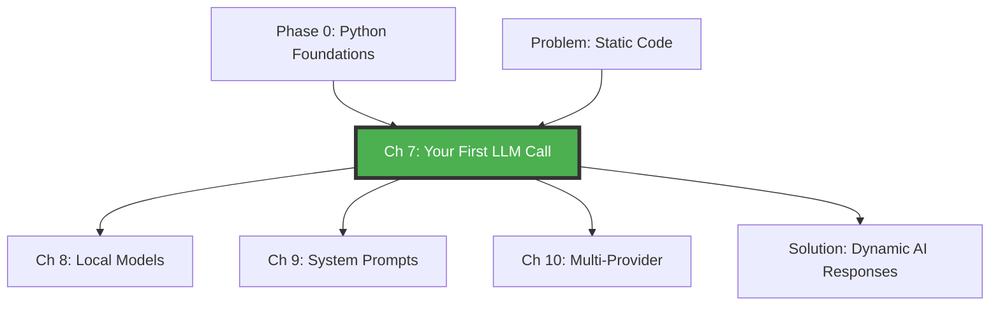

# Chapter 7: Your First LLM Call — The 15-Minute Success

<!--
METADATA
Phase: Phase 1 - LLM Fundamentals
Time: 1.5 hours (30 minutes reading + 60 minutes hands-on)
Difficulty: ⭐ (Absolute Beginner)
Type: Foundation
Prerequisites: Chapter 1-6 (Python Foundations)
Builds Toward: Chapters 8-16 (All LLM fundamentals)
Project Thread: Personal AI Assistant (connects to Ch 8, 9, 16)

NAVIGATION
→ Quick Reference: #quick-reference
→ Verification: #verification
→ What's Next: #whats-next

TEMPLATE VERSION: v2.2 (2026-01-20 - Enhanced Framework with 23 Principles)
-->

---

## ☕ Coffee Shop Intro

Picture this: You're sitting at a coffee shop with a friend who's curious about your AI studies. They lean in and ask, "So... what exactly do you *do* with AI?" Instead of launching into a technical lecture about transformer architectures, neural networks, or gradient descent, you pull out your laptop, open a single Python file, hit run, and within seconds an AI is telling jokes, answering complex questions, and helping solve problems. Your friend's eyes widen. "Wait... YOU built that?!"

That moment — that magical fifteen minutes from zero to working AI chatbot — is what this chapter is all about.

Here's the secret that nobody tells beginners: You can have a working AI chatbot running in about fifteen minutes. Not fifteen weeks of deep learning courses. Not after reading research papers. Not after mastering calculus and linear algebra. Fifteen minutes. Five lines of code.

Why does this matter so profoundly? Because motivation is everything in learning. When you see *your code* generating intelligent responses, something fundamental clicks in your brain. All those Python foundations from Phase 0 — those Pydantic models, those type hints, those validation utilities — suddenly they make perfect sense because now you have AI responses you want to validate, structure, and process. Abstract concepts become concrete reality.

Think of this chapter as your "Hello World" moment for AI engineering. Remember when you wrote your very first "Hello World" program? It wasn't about building production systems or following best practices. It was about that rush of seeing your code actually *work*. That's exactly what we're doing here — except instead of printing text, we're summoning an AI to have a conversation with us. It's like casting your first spell as a wizard.

We're intentionally keeping this stupidly simple. No multi-provider abstractions yet. No error handling. No streaming. No cost optimization. Just pure, unfiltered magic: you type a question, an AI answers it. The sophistication comes later in Chapters 8-16. Right now, we're here for that dopamine hit when you run your first LLM call and it works.

By the end of this chapter, you'll have made your first API call to GPT-4, received real AI-generated responses, and understood the fundamental pattern that powers every AI application: send a message, get a response. Everything you build from here — chatbots, agents, RAG systems, production applications — is just making this simple pattern more sophisticated.

Ready to cast your first AI spell? Let's make some magic happen.

---

## Prerequisites Check

Before we start, let's verify you have the Python foundations from Phase 0:

```bash
# Check Python version (should be 3.10 or higher)
python --version

# Check if you can create a virtual environment
python -m venv test_env

# Clean up test
rm -rf test_env  # Linux/Mac
# Or: rmdir /s test_env  (Windows)
```

✅ **If these work, you're ready!** The Python knowledge from Chapters 1-6 gives you everything you need.

Don't worry if you don't remember every detail from Phase 0. We'll review concepts as we need them, and you'll see how all those pieces connect to AI applications.

---

## What You Already Know 🧩

This chapter builds on your Phase 0 foundations:

| Previous Concept | From Chapter | How We'll Use It Here |
|-----------------|--------------|----------------------|
| **Virtual environments** | Ch 1 | Install OpenAI library in isolated environment |
| **Type hints** | Ch 2 | Understand API response structure |
| **Pydantic models** | Ch 3-4 | (Preview) Later we'll validate LLM outputs |
| **Python functions** | Ch 5 | Call the OpenAI API |
| **String manipulation** | Ch 5 | Extract AI responses from JSON |

**The Connection**: Phase 0 taught you Python fundamentals. Now we're using Python to talk to AI. Every skill you learned connects to building intelligent applications.

---

## 🗺️ Concept Map: Where We Are



**You are here** → Making your first connection to an AI model (the foundation of everything in Phase 1)

---

## The Story: Why Your First LLM Call Matters

### The Problem (Paint the Pain)

Traditional programming is deterministic and static:

```python
def get_capital(country: str) -> str:
    """Traditional function - you must code every answer."""
    capitals = {
        "France": "Paris",
        "Germany": "Berlin",
        "Japan": "Tokyo"
    }
    return capitals.get(country, "Unknown")

# What if user asks about a country you didn't program?
get_capital("Mongolia")  # Returns: "Unknown" ❌
```

To answer questions about 195 countries, you'd need to hardcode 195 entries. To add new knowledge, you'd need to redeploy your code. Your application is only as smart as the data you manually programmed.

### The Naive Solution (What Doesn't Scale)

You might think: "I'll just scrape Wikipedia for every country's capital!" But then:
- What about historical capitals?
- What about disputed territories?
- What about countries that no longer exist?
- What if the user asks in a different language?
- What if they make a typo?

You'd need thousands of lines of code, constant updates, and it still wouldn't feel intelligent.

### The Elegant Solution (The "Aha!" Moment)

With a Language Model, you write this:

```python
from openai import OpenAI

client = OpenAI(api_key="your-key")
response = client.chat.completions.create(
    model="gpt-4o-mini",
    messages=[{"role": "user", "content": "What's the capital of Mongolia?"}]
)
print(response.choices[0].message.content)
# Output: "The capital of Mongolia is Ulaanbaatar."
```

**Five lines of code.** The AI knows about every country, historical capitals, handles typos, understands context, and explains its answers. It's not a database lookup — it's *intelligence*.

That's the power we're unlocking today.

---

## Part 1: Making Your First API Call

### What is an LLM API Call?

**Progressive Complexity Layer 1 (Simple Mental Model)**:

Think of an LLM API call like sending a text message to an incredibly knowledgeable friend:
- **You**: Send a message (your question)
- **AI**: Reads it, thinks for a moment, sends a response
- **Cost**: You pay a tiny amount per message (fractions of a penny)

**Progressive Complexity Layer 2 (More Accurate View)**:

An API (Application Programming Interface) is a way for your code to talk to someone else's code over the internet. When you make an LLM API call:
1. Your Python code sends a message to OpenAI's servers
2. Their servers run your message through GPT-4 (a massive neural network)
3. GPT-4 generates a response
4. The response comes back to your code
5. You extract and use the text

**Progressive Complexity Layer 3 (Technical Reality)**:

```
Your Code                    OpenAI Servers
   │                               │
   │  HTTP POST Request            │
   │  ────────────────────>        │
   │  (JSON with your message)     │
   │                               │
   │                        [GPT-4 Processing]
   │                        [Neural network inference]
   │                        [Token generation]
   │                               │
   │  HTTP Response                │
   │  <────────────────────        │
   │  (JSON with AI response)      │
   │                               │
```

The entire round trip typically takes 1-3 seconds.

---

### Step 1: Getting Your OpenAI API Key

**You might be wondering**: "Why do I need an API key? Can't I just use ChatGPT?"

Great question! ChatGPT (the website) is for humans. The API (Application Programming Interface) is for code. The API key proves you're authorized to use OpenAI's servers programmatically and ensures they can bill you for usage.

**Get your API key** (takes 5 minutes):

1. **Go to** [platform.openai.com](https://platform.openai.com)
2. **Sign up** or log in (you can use your existing ChatGPT account)
3. **Navigate to** "API keys" in the left sidebar
4. **Click** "Create new secret key"
5. **Name it** something like "AI Learning Project"
6. **Copy the key** — it starts with `sk-proj-...`

⚠️ **CRITICAL SECURITY RULE**: Never commit API keys to GitHub! Never share them publicly! Treat them like passwords.

**How to store your API key safely**:

```bash
# Option 1: Environment variable (recommended for learning)
export OPENAI_API_KEY="sk-proj-your-key-here"

# Option 2: .env file (we'll use this)
echo 'OPENAI_API_KEY=sk-proj-your-key-here' > .env
# Add .env to .gitignore so it's never committed!
echo '.env' >> .gitignore
```

**Cost Reality Check**:

You might be worried: "How much will this cost me?"

For learning:
- **This entire chapter**: ~$0.01 (one penny)
- **All of Phase 1 practice**: ~$0.50 (fifty cents)
- **OpenAI gives you**: $5 free credit when you sign up

We'll use `gpt-4o-mini` (the cheapest model) which costs:
- $0.15 per 1 million input tokens
- $0.60 per 1 million output tokens

In human terms: **$0.00015 per 1,000 tokens** (roughly 750 words). Your entire chapter practice costs less than a cup of coffee.

---

### Step 2: Setting Up Your Environment

Create a new project directory:

```bash
# Create project folder
mkdir my-first-llm
cd my-first-llm

# Create Python file
touch hello_ai.py

# Install OpenAI library
pip install openai

# Or if you prefer pip (faster):
# pip install openai
```

**What we just installed**:

The `openai` library is a Python package that handles all the HTTP communication, request formatting, response parsing, and error handling for you. Without it, you'd need to manually craft HTTP requests — not fun for beginners!

```python
# What openai library does for you (simplified):
# Instead of this painful manual approach...
import requests
import json

response = requests.post(
    "https://api.openai.com/v1/chat/completions",
    headers={
        "Authorization": f"Bearer {api_key}",
        "Content-Type": "application/json"
    },
    data=json.dumps({
        "model": "gpt-4o-mini",
        "messages": [...]
    })
)

# ... you just write this:
from openai import OpenAI
client = OpenAI()
response = client.chat.completions.create(...)
```

Much better!

---

### Step 3: Your First LLM Call (The Magic Moment!)

Create `hello_ai.py`:

```python
"""
My First LLM API Call
=====================

This script makes a simple API call to GPT-4 and prints the response.
It's the "Hello World" of AI engineering!

Author: [Your Name]
Date: [Today's Date]
Purpose: Learn the fundamental pattern of LLM interaction
"""

from openai import OpenAI
import os

# Step 1: Initialize the client
# The OpenAI client handles all communication with OpenAI's servers.
# It automatically looks for the OPENAI_API_KEY environment variable.
client = OpenAI(
    api_key=os.environ.get("OPENAI_API_KEY")  # Get key from environment
)

# Step 2: Make the API call
# This is where the magic happens! We're sending a message to GPT-4.
response = client.chat.completions.create(
    # Which model to use (gpt-4o-mini is fastest and cheapest)
    model="gpt-4o-mini",

    # The conversation messages (just one user message for now)
    messages=[
        {
            "role": "user",              # We are the user
            "content": "Tell me a joke about programmers"  # Our question
        }
    ]
)

# Step 3: Extract the AI's response
# The response object contains lots of metadata, but we just want the text.
ai_message = response.choices[0].message.content

# Step 4: Print it!
print("🤖 AI Response:")
print(ai_message)
print("\n✅ Success! You just made your first LLM API call!")
```

**Run it**:

```bash
# Set your API key (if not already in environment)
export OPENAI_API_KEY="sk-proj-your-key-here"

# Run the script
python hello_ai.py
```

**Expected Output**:

```
🤖 AI Response:
Why do programmers prefer dark mode?

Because light attracts bugs! 🐛

✅ Success! You just made your first LLM API call!
```

---

### 🎉 Pause and Celebrate!

If you see the AI's response printed on your screen, **you are now officially an AI engineer**. You just:

1. ✅ Made an HTTP request to a cloud AI service
2. ✅ Sent a message in the correct format
3. ✅ Received an intelligently generated response
4. ✅ Parsed and displayed it

This is the exact same pattern used by:
- ChatGPT (the UI just makes it pretty)
- GitHub Copilot (for code suggestions)
- Customer support chatbots
- AI writing assistants
- Every LLM application in the world

**You've unlocked the foundation.** Everything else is building on this pattern.

---

## Part 2: Understanding What Just Happened

### Breaking Down the Code (Line by Line)

Let's deeply understand each piece:

#### Line 1: Import the Library

```python
from openai import OpenAI
```

**What this does**: Imports the `OpenAI` class from the `openai` library.

**Why we need it**: This class provides methods to communicate with OpenAI's API. It handles authentication, request formatting, response parsing, and error handling.

**Analogy**: Think of it like importing a translator. You speak Python, OpenAI's servers speak HTTP/JSON. The `OpenAI` class translates between these languages.

---

#### Line 2: Create the Client

```python
client = OpenAI(api_key=os.environ.get("OPENAI_API_KEY"))
```

**What this does**: Creates an instance of the OpenAI client, authenticated with your API key.

**Why we need it**: The client is your connection to OpenAI. Every API call goes through this object.

**Breakdown**:
- `OpenAI(...)`: Creates a new client instance
- `api_key=...`: Tells the client which API key to use for authentication
- `os.environ.get("OPENAI_API_KEY")`: Safely gets the API key from environment variables

**Security Note**: We use environment variables instead of hardcoding the key because:
1. Hardcoding leaks secrets if you commit to GitHub
2. Environment variables can be different per environment (dev/staging/prod)
3. It's a professional best practice you'll use in every production system

**Alternative (less secure but simpler for learning)**:

```python
# ⚠️ ONLY for local testing! Never commit this!
client = OpenAI(api_key="sk-proj-your-key-directly")
```

---

#### Lines 3-10: Make the API Call

```python
response = client.chat.completions.create(
    model="gpt-4o-mini",
    messages=[
        {"role": "user", "content": "Tell me a joke about programmers"}
    ]
)
```

This is the heart of every LLM application. Let's break it down:

**`client.chat.completions.create(...)`**

This method sends a "chat completion" request, which means:
- **Chat**: Conversational interface (not just text completion)
- **Completions**: The AI "completes" the conversation
- **Create**: Makes a new request

**`model="gpt-4o-mini"`**

Specifies which AI model to use. Options (as of 2026):

| Model | Speed | Quality | Cost (per 1M tokens) | Best For |
|-------|-------|---------|---------------------|----------|
| `gpt-4o-mini` | ⚡⚡⚡ Fastest | ⭐⭐⭐ Good | $0.15/$0.60 | Learning, simple tasks |
| `gpt-4o` | ⚡⚡ Fast | ⭐⭐⭐⭐⭐ Excellent | $2.50/$10.00 | Production apps |
| `gpt-4-turbo` | ⚡⚡ Fast | ⭐⭐⭐⭐ Very Good | $1.00/$3.00 | Balanced use cases |

For learning, stick with `gpt-4o-mini` — it's 16x cheaper than `gpt-4o` and still very capable!

**`messages=[...]`**

The conversation history. Each message is a dictionary with:
- `role`: Who sent the message ("user", "assistant", or "system")
- `content`: The actual text of the message

```python
# Simple example (what we're doing now)
messages = [
    {"role": "user", "content": "Tell me a joke"}
]

# Multi-turn conversation (coming in Chapter 9)
messages = [
    {"role": "system", "content": "You are a helpful assistant"},
    {"role": "user", "content": "What is Python?"},
    {"role": "assistant", "content": "Python is a programming language..."},
    {"role": "user", "content": "What can I build with it?"}
]
```

**Why the `messages` format?**

The chat models (GPT-4, Claude, etc.) are trained on conversations, not just single prompts. The list format lets the AI see:
1. System instructions (optional) - "You are a helpful tutor"
2. Previous turns in the conversation - for context
3. The current user message

Even for your first call with one message, you still use the list format for consistency.

---

#### Line 11: Extract the Response

```python
ai_message = response.choices[0].message.content
```

**What this does**: Navigates the response object to extract the AI's actual text.

**Why this path?** The response has this structure:

```python
{
    "id": "chatcmpl-ABC123",        # Unique request ID
    "object": "chat.completion",     # Type of response
    "created": 1234567890,           # Unix timestamp
    "model": "gpt-4o-mini",          # Model that was used

    "choices": [                     # List of possible responses (usually just 1)
        {
            "index": 0,              # Position in list
            "message": {             # The AI's message
                "role": "assistant", # Always "assistant" for AI responses
                "content": "Why do programmers prefer dark mode? Because..."
            },
            "finish_reason": "stop"  # Why the AI stopped (completed, length limit, etc.)
        }
    ],

    "usage": {                       # Token usage for billing
        "prompt_tokens": 15,         # Tokens in your input
        "completion_tokens": 25,     # Tokens in AI's output
        "total_tokens": 40           # Total tokens (what you pay for)
    }
}
```

So to get the actual text:
- `response.choices` → List of possible responses
- `[0]` → First (and usually only) response
- `.message` → The AI's message object
- `.content` → The actual text content

**You might be wondering**: "Why a *list* of choices?"

Great question! OpenAI's API can return multiple completions for one prompt (using the `n` parameter). This is useful for:
- Generating multiple creative variations
- Sampling different responses for quality checks
- Self-consistency prompting (generate 5 answers, pick the most common)

For now, we always use `[0]` to get the first response.

---

### The Response Object (Deep Dive)

Let's examine the full response object:

```python
# Add this to your hello_ai.py to inspect the response
print("\n📊 Full Response Object:")
print(f"Request ID: {response.id}")
print(f"Model Used: {response.model}")
print(f"Finish Reason: {response.choices[0].finish_reason}")
print(f"\n💰 Token Usage:")
print(f"  Input tokens: {response.usage.prompt_tokens}")
print(f"  Output tokens: {response.usage.completion_tokens}")
print(f"  Total tokens: {response.usage.total_tokens}")

# Calculate cost
cost_per_1k_input = 0.00015  # $0.15 per 1M tokens = $0.00015 per 1K
cost_per_1k_output = 0.00060  # $0.60 per 1M tokens = $0.00060 per 1K

input_cost = (response.usage.prompt_tokens / 1000) * cost_per_1k_input
output_cost = (response.usage.completion_tokens / 1000) * cost_per_1k_output
total_cost = input_cost + output_cost

print(f"  Cost: ${total_cost:.6f}")
```

**Sample output**:

```
📊 Full Response Object:
Request ID: chatcmpl-8x9y1z2a3b4c
Model Used: gpt-4o-mini-2024-07-18
Finish Reason: stop

💰 Token Usage:
  Input tokens: 14
  Output tokens: 23
  Total tokens: 37
  Cost: $0.000016
```

**Key Fields Explained**:

**`id`**: Unique identifier for this request. Use it for:
- Debugging (support can look up issues by ID)
- Logging (track which requests cost the most)
- Caching (avoid re-running identical requests)

**`finish_reason`**: Why the AI stopped generating. Options:

| Reason | Meaning |
|--------|---------|
| `"stop"` | AI naturally finished (most common) |
| `"length"` | Hit max token limit (need to increase `max_tokens`) |
| `"content_filter"` | Response blocked by safety filters |
| `"function_call"` | AI wants to call a tool (advanced - Chapter 29) |

**`usage.prompt_tokens`**: Number of tokens in your input.

**`usage.completion_tokens`**: Number of tokens in AI's output.

**`usage.total_tokens`**: Sum (what you pay for).

**What are tokens?**

Tokens are pieces of words that the AI processes. Roughly:
- 1 token ≈ 0.75 words in English
- 1,000 tokens ≈ 750 words
- 1 page of text ≈ 500-600 tokens

Examples:
- "Hello" = 1 token
- "Hello world" = 2 tokens
- "Hello, world!" = 4 tokens (punctuation counts!)
- "ChatGPT" = 2 tokens ("Chat" + "GPT")

We'll learn to count tokens precisely in Chapter 16.

---

## 🔬 Try This! Build Your First Custom Chatbot

**Challenge**: Modify the code to ask the AI something YOU want to know.

**Starter Code**:

```python
from openai import OpenAI
import os

client = OpenAI(api_key=os.environ.get("OPENAI_API_KEY"))

# TODO: Change this to ask something you're curious about!
response = client.chat.completions.create(
    model="gpt-4o-mini",
    messages=[
        {"role": "user", "content": "YOUR QUESTION HERE"}
    ]
)

print("🤖 AI Response:")
print(response.choices[0].message.content)
```

**Ideas to Try**:

1. **Learn something new**: "Explain quantum computing in simple terms"
2. **Get creative**: "Write a haiku about Python programming"
3. **Solve a problem**: "How do I center a div in CSS?"
4. **Debug code**: "Why does this error happen: NameError: name 'x' is not defined"
5. **Translate**: "Translate 'Hello, how are you?' to Japanese"
6. **Summarize**: "Summarize the plot of Harry Potter in 3 sentences"

<details>
<summary>💡 Hint #1 (Click if stuck)</summary>

Just replace `"YOUR QUESTION HERE"` with any question! The AI can:
- Answer factual questions
- Explain complex concepts
- Write creative content
- Debug code
- Translate languages
- Summarize text
- And much more!

Try asking it to explain something you've always been curious about.

</details>

<details>
<summary>💡 Hint #2 (Need more ideas?)</summary>

**For Learners**:
- "What's the difference between a list and a tuple in Python?"
- "Explain how the internet works to a 10-year-old"

**For Creators**:
- "Give me 5 startup ideas for AI applications"
- "Write a short story about a robot learning to cook"

**For Problem Solvers**:
- "How do I remove duplicates from a list in Python?"
- "Debug this code: for i in range(10) print(i)"

</details>

<details>
<summary>✅ Example Solutions</summary>

**Example 1: Learning**

```python
response = client.chat.completions.create(
    model="gpt-4o-mini",
    messages=[
        {"role": "user", "content": "What is machine learning in one simple paragraph?"}
    ]
)
```

**Possible AI Response**:
> Machine learning is a way of teaching computers to learn from experience, just like humans do. Instead of programming explicit rules, you show the computer many examples (like photos of cats and dogs), and it figures out the patterns on its own. Once trained, it can recognize new examples it has never seen before, like identifying whether a new photo contains a cat or a dog.

---

**Example 2: Creativity**

```python
response = client.chat.completions.create(
    model="gpt-4o-mini",
    messages=[
        {"role": "user", "content": "Write a limerick about debugging code"}
    ]
)
```

**Possible AI Response**:
> There once was a bug in my code,
> That caused my whole program to explode,
> I searched through the night,
> Till I found the bug's plight,
> A missing semicolon, I'm told!

---

**Example 3: Problem Solving**

```python
response = client.chat.completions.create(
    model="gpt-4o-mini",
    messages=[
        {"role": "user", "content": "Show me how to reverse a string in Python"}
    ]
)
```

**Possible AI Response**:
> Here are three ways to reverse a string in Python:
> ```python
> # Method 1: Slicing (most Pythonic)
> text = "hello"
> reversed_text = text[::-1]  # "olleh"
>
> # Method 2: reversed() function
> reversed_text = ''.join(reversed(text))
>
> # Method 3: Loop (explicit)
> reversed_text = ''
> for char in text:
>     reversed_text = char + reversed_text
> ```

</details>

---

### 🔍 Error Prediction Challenge #1

**Before you run this code**, predict what will happen:

```python
from openai import OpenAI

client = OpenAI(api_key="wrong-key-12345")
response = client.chat.completions.create(
    model="gpt-4o-mini",
    messages=[{"role": "user", "content": "Hello"}]
)
print(response.choices[0].message.content)
```

**Question**: What happens when you run this?

1. **Option A**: It prints "Hello" back
2. **Option B**: It raises an `AuthenticationError`
3. **Option C**: It hangs forever waiting for a response
4. **Option D**: It prints an empty string

<details>
<summary>🔎 Reveal Answer</summary>

**Answer: Option B** - It raises an `AuthenticationError`

**Why**:

The OpenAI API checks your API key on every request. If the key is invalid:
1. Your request reaches OpenAI's servers
2. The server verifies the key (`wrong-key-12345` is not valid)
3. The server rejects the request with HTTP 401 Unauthorized
4. The `openai` library raises: `openai.AuthenticationError: Incorrect API key provided`

**What you'll see**:

```
openai.AuthenticationError: Error code: 401 - {'error': {'message': 'Incorrect API key provided: wrong-key-12345. You can find your API key at https://platform.openai.com/account/api-keys.', 'type': 'invalid_request_error', 'param': None, 'code': 'invalid_api_key'}}
```

**How to fix**:
- Check your API key starts with `sk-proj-` or `sk-`
- Verify you copied the entire key (no spaces or line breaks)
- Make sure the key is still active on platform.openai.com

**Real-World Lesson**: Always validate authentication before making expensive operations. We'll learn proper error handling in Chapter 15.

</details>

---

### ⏸️ Pause and Reflect (Metacognitive Prompt #1)

Before continuing, take a moment to solidify your understanding:

**Questions to ask yourself**:

1. ✅ Can you explain to a friend what an API call is in simple terms?
2. ✅ Do you understand why we use `client.chat.completions.create()` instead of just a simple function?
3. ✅ Can you trace the path from your code to OpenAI's servers and back?

**If you answered "yes" to all three**, you've truly grasped the fundamentals! This is the foundation of every LLM application.

**If any are unclear**, re-read the "Breaking Down the Code" section. The investment in understanding now will pay off in every future chapter.

**Confidence Check** (Principle #19 - Calibration):

On a scale of 1-5, how confident are you that you could:
- **Modify the message**: [ 1  2  3  4  5 ]
- **Change the model**: [ 1  2  3  4  5 ]
- **Extract the response**: [ 1  2  3  4  5 ]
- **Explain it to someone**: [ 1  2  3  4  5 ]

If any score is below 3, practice with the "Try This!" exercises above before moving on.

---

## Part 3: Common Pitfalls & Troubleshooting

### Pitfall #1: "AuthenticationError: Incorrect API key"

**Symptoms**:
```python
openai.AuthenticationError: Incorrect API key provided
```

**Common Causes**:
1. **Typo in API key**: Check for extra spaces, missing characters
2. **Key not set in environment**: `echo $OPENAI_API_KEY` returns empty
3. **Using old key**: Key was revoked on platform.openai.com
4. **Wrong key format**: Old keys started with `sk-`, new ones start with `sk-proj-`

**Solutions**:

```bash
# Check if key is set
echo $OPENAI_API_KEY

# If empty, set it:
export OPENAI_API_KEY="sk-proj-your-actual-key"

# Or in Python, hardcode temporarily for debugging:
client = OpenAI(api_key="sk-proj-...")  # ⚠️ Remove before committing!
```

---

### Pitfall #2: "RateLimitError: Rate limit exceeded"

**Symptoms**:
```python
openai.RateLimitError: Rate limit reached for gpt-4o-mini
```

**What this means**:

OpenAI limits how many requests you can make per minute to prevent abuse. Free tier limits (as of 2026):
- **Tier 1** (new users): 200 requests per day, 3 requests per minute
- **Tier 2** ($5+ spent): 500 requests per day, 5 requests per minute

If you're running your code in a loop, you might hit the limit.

**Solutions**:

```python
# Solution 1: Add a delay between requests
import time

for i in range(10):
    response = client.chat.completions.create(...)
    print(response.choices[0].message.content)
    time.sleep(20)  # Wait 20 seconds between requests

# Solution 2: Catch the error and retry (we'll learn this in Chapter 15)
try:
    response = client.chat.completions.create(...)
except openai.RateLimitError:
    print("⚠️ Rate limit hit. Wait 60 seconds and try again.")
```

**Best Practice**: Don't make more than 3 requests per minute while learning. In production (Chapter 15), we'll implement smart retry logic with exponential backoff.

---

### Pitfall #3: "ModuleNotFoundError: No module named 'openai'"

**Symptoms**:
```python
ModuleNotFoundError: No module named 'openai'
```

**Cause**: The `openai` library isn't installed in your current environment.

**Solution**:

```bash
# Make sure you're in the right environment
python --version  # Verify Python 3.10+

# Install the library
pip install openai

# Verify installation
python -c "import openai; print(openai.__version__)"
# Should print: 1.54.0 (or similar)
```

**If you're using a virtual environment**:

```bash
# Activate environment first
source venv/bin/activate  # Linux/Mac
# Or: venv\Scripts\activate  (Windows)

# Then install
pip install openai
```

---

### Pitfall #4: "Model not found: gpt-5"

**Symptoms**:
```python
openai.NotFoundError: The model 'gpt-5' does not exist
```

**Cause**: You specified a model that doesn't exist or you don't have access to.

**Valid models** (as of 2026):
- ✅ `gpt-4o-mini`
- ✅ `gpt-4o`
- ✅ `gpt-4-turbo`
- ✅ `gpt-4`
- ❌ `gpt-5` (doesn't exist)
- ❌ `chatgpt` (not an API model name)

**Solution**: Use `gpt-4o-mini` for learning (cheapest and fastest).

---

### Pitfall #5: Empty or Strange Responses

**Symptoms**:
```python
# You get back empty string or weird output
print(response.choices[0].message.content)
# Output: "" (empty)
```

**Possible Causes**:

1. **Content filter blocked the response** (rare)
   ```python
   if response.choices[0].finish_reason == "content_filter":
       print("⚠️ Response blocked by content filter")
   ```

2. **Max tokens set too low**
   ```python
   # ❌ This limits response to 1 token (1 word!)
   response = client.chat.completions.create(
       model="gpt-4o-mini",
       messages=[{"role": "user", "content": "Write an essay"}],
       max_tokens=1  # Too low!
   )

   # ✅ Better (default is ~4096 for most models)
   response = client.chat.completions.create(
       model="gpt-4o-mini",
       messages=[{"role": "user", "content": "Write an essay"}],
       max_tokens=500  # Plenty of room
   )
   ```

3. **Extracting from wrong part of response**
   ```python
   # ❌ Wrong
   print(response.message.content)  # AttributeError!

   # ✅ Correct
   print(response.choices[0].message.content)
   ```

---

### 🚨 Real-World War Story (Principle #18)

**The $1,000 API Bill Accident**

A developer once hardcoded their API key in a Python script, committed it to GitHub, and pushed it public. Within 2 hours:
1. A bot scraped GitHub for exposed API keys
2. Found their key
3. Made thousands of expensive GPT-4 requests
4. Ran up a $1,000+ bill before the developer noticed

**The mistake**:
```python
# ❌ NEVER DO THIS
client = OpenAI(api_key="sk-proj-actual-key-here")  # Committed to GitHub!
```

**The fix**:
```python
# ✅ Always use environment variables or .env files
client = OpenAI()  # Automatically reads from OPENAI_API_KEY env var
```

**Lesson**: Security isn't optional. One careless commit can cost thousands. Always:
1. Use environment variables for secrets
2. Add `.env` to `.gitignore`
3. Never hardcode API keys
4. Set billing limits on platform.openai.com

**Good news**: OpenAI now detects exposed keys and automatically revokes them. But don't rely on this — practice good security from day one!

---

## 🧪 Verification: Does Your Setup Work?

Let's verify everything is working correctly with a comprehensive test:

**Create `verify_setup.py`**:

```python
"""
Setup Verification Script
=========================

Run this to verify your OpenAI API setup is working correctly.
It tests:
1. API key is valid
2. Can make successful requests
3. Can extract responses
4. Token counting works
"""

from openai import OpenAI
import os
import sys

def test_api_key():
    """Test 1: Verify API key exists and is valid."""
    print("🔑 Test 1: Checking API key...")

    api_key = os.environ.get("OPENAI_API_KEY")

    if not api_key:
        print("❌ FAILED: OPENAI_API_KEY environment variable not set")
        print("💡 Fix: export OPENAI_API_KEY='your-key-here'")
        return False

    if not api_key.startswith(("sk-", "sk-proj-")):
        print(f"❌ FAILED: API key has wrong format: {api_key[:10]}...")
        print("💡 Fix: Check your key on platform.openai.com")
        return False

    print(f"✅ PASSED: API key found ({api_key[:10]}...)")
    return True


def test_basic_call():
    """Test 2: Make a simple API call."""
    print("\n🤖 Test 2: Making API call...")

    try:
        client = OpenAI()

        response = client.chat.completions.create(
            model="gpt-4o-mini",
            messages=[
                {"role": "user", "content": "Say 'Hello!' in one word"}
            ],
            max_tokens=5
        )

        message = response.choices[0].message.content

        if not message:
            print("❌ FAILED: Empty response from API")
            return False

        print(f"✅ PASSED: Received response: '{message}'")
        return True

    except Exception as e:
        print(f"❌ FAILED: {type(e).__name__}: {e}")
        return False


def test_response_structure():
    """Test 3: Verify response structure."""
    print("\n📊 Test 3: Checking response structure...")

    try:
        client = OpenAI()

        response = client.chat.completions.create(
            model="gpt-4o-mini",
            messages=[{"role": "user", "content": "What is 2+2?"}]
        )

        # Check all expected fields exist
        assert hasattr(response, 'id'), "Missing 'id' field"
        assert hasattr(response, 'choices'), "Missing 'choices' field"
        assert hasattr(response, 'usage'), "Missing 'usage' field"
        assert len(response.choices) > 0, "No choices in response"
        assert hasattr(response.choices[0], 'message'), "Missing 'message' field"
        assert hasattr(response.choices[0].message, 'content'), "Missing 'content' field"

        print("✅ PASSED: All expected fields present")
        print(f"   - Request ID: {response.id}")
        print(f"   - Model: {response.model}")
        print(f"   - Tokens used: {response.usage.total_tokens}")

        return True

    except AssertionError as e:
        print(f"❌ FAILED: {e}")
        return False
    except Exception as e:
        print(f"❌ FAILED: {type(e).__name__}: {e}")
        return False


def test_cost_calculation():
    """Test 4: Calculate costs correctly."""
    print("\n💰 Test 4: Calculating costs...")

    try:
        client = OpenAI()

        response = client.chat.completions.create(
            model="gpt-4o-mini",
            messages=[{"role": "user", "content": "Hello"}]
        )

        # Calculate cost (gpt-4o-mini pricing as of 2026)
        cost_per_1k_input = 0.00015
        cost_per_1k_output = 0.00060

        input_cost = (response.usage.prompt_tokens / 1000) * cost_per_1k_input
        output_cost = (response.usage.completion_tokens / 1000) * cost_per_1k_output
        total_cost = input_cost + output_cost

        print(f"✅ PASSED: Cost calculation works")
        print(f"   - Input tokens: {response.usage.prompt_tokens} (${input_cost:.6f})")
        print(f"   - Output tokens: {response.usage.completion_tokens} (${output_cost:.6f})")
        print(f"   - Total cost: ${total_cost:.6f}")

        return True

    except Exception as e:
        print(f"❌ FAILED: {type(e).__name__}: {e}")
        return False


def main():
    """Run all verification tests."""
    print("=" * 60)
    print("🧪 OpenAI Setup Verification")
    print("=" * 60)

    tests = [
        test_api_key,
        test_basic_call,
        test_response_structure,
        test_cost_calculation
    ]

    results = []
    for test in tests:
        results.append(test())

    print("\n" + "=" * 60)
    print(f"📈 Results: {sum(results)}/{len(results)} tests passed")
    print("=" * 60)

    if all(results):
        print("\n🎉 SUCCESS! Your OpenAI setup is working perfectly.")
        print("✅ You're ready to continue with Chapter 7!")
        sys.exit(0)
    else:
        print("\n⚠️ Some tests failed. Please fix the issues above.")
        print("💡 Check the error messages for guidance.")
        sys.exit(1)


if __name__ == "__main__":
    main()
```

**Run the verification**:

```bash
python verify_setup.py
```

**Expected output** (if everything works):

```
============================================================
🧪 OpenAI Setup Verification
============================================================
🔑 Test 1: Checking API key...
✅ PASSED: API key found (sk-proj-AB...)

🤖 Test 2: Making API call...
✅ PASSED: Received response: 'Hello!'

📊 Test 3: Checking response structure...
✅ PASSED: All expected fields present
   - Request ID: chatcmpl-8x9y1z2a3b4c
   - Model: gpt-4o-mini-2024-07-18
   - Tokens used: 25

💰 Test 4: Calculating costs...
✅ PASSED: Cost calculation works
   - Input tokens: 12 ($0.000002)
   - Output tokens: 13 ($0.000008)
   - Total cost: $0.000010

============================================================
📈 Results: 4/4 tests passed
============================================================

🎉 SUCCESS! Your OpenAI setup is working perfectly.
✅ You're ready to continue with Chapter 7!
```

**If any test fails**, read the error message carefully — it will tell you exactly what to fix.

---

## 📊 Summary: What You Learned

Congratulations! You've completed Chapter 7 and unlocked the foundation of AI engineering. Here's what you mastered:

### Core Concepts ✅

1. **API Fundamentals**
   - What an API is (a way for code to talk to other code)
   - How LLM APIs work (send message → get response)
   - Request/response pattern (the foundation of all AI apps)

2. **OpenAI API**
   - Setting up API keys securely
   - Installing the `openai` library
   - Making your first chat completion call
   - Understanding the response structure

3. **Code Understanding**
   - `OpenAI()` client initialization
   - `chat.completions.create()` method
   - Message format (`role` + `content`)
   - Extracting responses (`choices[0].message.content`)

4. **Cost & Usage**
   - Token counting basics
   - Calculating API costs
   - Model selection (gpt-4o-mini vs gpt-4o)
   - Monitoring usage

5. **Troubleshooting**
   - Common errors (authentication, rate limits, module not found)
   - Security best practices (never hardcode keys!)
   - Debugging techniques

### Skills You Can Now Apply 💪

- ✅ Make LLM API calls to solve real problems
- ✅ Extract and use AI-generated text in your programs
- ✅ Estimate costs before making requests
- ✅ Debug common API errors
- ✅ Secure API keys properly

### The Pattern You've Learned 🎯

**Every LLM application follows this pattern**:

```python
1. Initialize client (with API key)
2. Prepare messages (what you want to ask)
3. Call the API (send messages to model)
4. Extract response (get AI's answer)
5. Use the result (in your application)
```

This pattern powers:
- ChatGPT (same API, different UI)
- GitHub Copilot (code suggestions)
- Customer support bots
- Content generation tools
- Every AI app in the world

**You now know the secret.** Everything else is making this pattern more sophisticated.

---

## 🎓 Confidence Calibration (Final Check)

**Before Chapter 7** (estimated):
- Understanding of LLM APIs: [ 0/5 ]
- Ability to make API calls: [ 0/5 ]
- Confidence building AI apps: [ 0/5 ]

**After Chapter 7** (self-assessment):

Rate yourself honestly (1-5):
- **I can explain what an LLM API call is**: [ 1  2  3  4  5 ]
- **I can write code to call GPT-4**: [ 1  2  3  4  5 ]
- **I understand the response structure**: [ 1  2  3  4  5 ]
- **I can debug common API errors**: [ 1  2  3  4  5 ]
- **I could teach this to someone else**: [ 1  2  3  4  5 ]

**If all scores are 3+**: Excellent! You're ready for Chapter 8.

**If any score is below 3**: That's okay! Practice with the "Try This!" exercises, re-run the verification script, and experiment with different prompts. Understanding comes with practice.

**Growth Mindset Reminder**: Every expert started exactly where you are now — making their first API call and feeling unsure. The difference between beginners and experts is just practice time. You're on the path.

---

## 🚀 What's Next: Chapter 8 Preview

In **Chapter 8: Local Models with Ollama**, you'll:

- Run AI models completely free (no API costs!)
- Learn how Llama 3, Mistral, and Phi work locally
- Compare local vs. cloud models
- Build the same chatbot but with $0 cost
- Understand model sizes (3B, 7B, 70B parameters)
- Experiment unlimited without paying per token

**The Connection**:
- Chapter 7: You learned the cloud API pattern (OpenAI)
- Chapter 8: Same pattern, but models run on YOUR computer
- Chapter 9: Add personality and memory to your chatbots

**One pattern, many implementations.** That's the power of abstraction you're building.

---

## 📚 Quick Reference

**Basic API Call Template**:

```python
from openai import OpenAI
import os

client = OpenAI(api_key=os.environ.get("OPENAI_API_KEY"))

response = client.chat.completions.create(
    model="gpt-4o-mini",
    messages=[
        {"role": "user", "content": "Your question here"}
    ]
)

print(response.choices[0].message.content)
```

**Environment Setup**:

```bash
# Set API key
export OPENAI_API_KEY="sk-proj-your-key"

# Install library
pip install openai

# Verify
python -c "import openai; print(openai.__version__)"
```

**Response Structure**:

```python
response.id                              # Request ID
response.model                           # Model used
response.choices[0].message.content      # AI's text response
response.choices[0].finish_reason        # Why AI stopped
response.usage.prompt_tokens             # Input tokens
response.usage.completion_tokens         # Output tokens
response.usage.total_tokens              # Total (for billing)
```

**Cost Calculation**:

```python
# gpt-4o-mini pricing (as of 2026)
cost_per_1k_input = 0.00015
cost_per_1k_output = 0.00060

total_cost = (
    (response.usage.prompt_tokens / 1000) * cost_per_1k_input +
    (response.usage.completion_tokens / 1000) * cost_per_1k_output
)
```

**Valid Models**:
- `gpt-4o-mini` - Fastest, cheapest (learning)
- `gpt-4o` - Best quality (production)
- `gpt-4-turbo` - Balanced

---

## 🎉 Final Words

**You did it!** You made your first LLM API call. You're no longer just learning *about* AI — you're *building* with AI.

This is the moment where abstract concepts become concrete reality. Every AI application, no matter how complex, starts with this simple pattern: send a message, get a response.

From here, we'll layer on:
- **Personality** (system prompts in Ch 9)
- **Memory** (conversation history in Ch 9)
- **Intelligence** (prompt engineering in Ch 11-12)
- **Structure** (Pydantic validation in Ch 14)
- **Reliability** (error handling in Ch 15)
- **Efficiency** (cost optimization in Ch 16)

But the foundation? That's what you learned today. And you'll use it in every single chapter from here forward.

**Welcome to AI engineering.** 🚀

---

**End of Chapter 7**

**Next**: [Chapter 8: Local Models with Ollama](chapter-08-local-models-ollama.md) →

---

## Appendix A: Additional Practice Exercises

Want more practice before moving on? Try these challenges:

### Exercise 1: Joke Generator

Build a joke generator that asks for a topic and returns a joke:

```python
from openai import OpenAI
import os

client = OpenAI(api_key=os.environ.get("OPENAI_API_KEY"))

topic = input("Enter a topic for a joke: ")

response = client.chat.completions.create(
    model="gpt-4o-mini",
    messages=[
        {"role": "user", "content": f"Tell me a clean, family-friendly joke about {topic}"}
    ]
)

print(f"\n😄 Here's a joke about {topic}:\n")
print(response.choices[0].message.content)
```

---

### Exercise 2: Language Translator

Build a simple translator:

```python
from openai import OpenAI
import os

client = OpenAI(api_key=os.environ.get("OPENAI_API_KEY"))

text = input("Enter English text to translate: ")
language = input("Translate to which language? ")

response = client.chat.completions.create(
    model="gpt-4o-mini",
    messages=[
        {"role": "user", "content": f"Translate this to {language}: {text}"}
    ]
)

print(f"\n🌍 Translation to {language}:\n")
print(response.choices[0].message.content)
```

---

### Exercise 3: Explain Like I'm 5

Build a simplification tool:

```python
from openai import OpenAI
import os

client = OpenAI(api_key=os.environ.get("OPENAI_API_KEY"))

concept = input("What concept do you want explained simply? ")

response = client.chat.completions.create(
    model="gpt-4o-mini",
    messages=[
        {"role": "user", "content": f"Explain {concept} like I'm 5 years old"}
    ]
)

print(f"\n🧒 Simple explanation of {concept}:\n")
print(response.choices[0].message.content)
```

---

### Exercise 4: Code Helper

Build a code debugging assistant:

```python
from openai import OpenAI
import os

client = OpenAI(api_key=os.environ.get("OPENAI_API_KEY"))

code = input("Paste your Python code: ")
error = input("What error are you getting? ")

response = client.chat.completions.create(
    model="gpt-4o-mini",
    messages=[
        {"role": "user", "content": f"""
I have this Python code:
{code}

And I'm getting this error:
{error}

Can you explain what's wrong and how to fix it?
"""}
    ]
)

print("\n🔧 Debugging help:\n")
print(response.choices[0].message.content)
```

---

## Appendix B: Resources for Further Learning

**Official Documentation**:
- [OpenAI API Docs](https://platform.openai.com/docs/introduction)
- [OpenAI Python Library](https://github.com/openai/openai-python)
- [OpenAI Cookbook](https://github.com/openai/openai-cookbook) (71k stars)

**Cost Management**:
- [OpenAI Pricing](https://openai.com/pricing)
- [Usage Dashboard](https://platform.openai.com/usage)
- [Set Billing Limits](https://platform.openai.com/account/billing/limits)

**Community**:
- [OpenAI Community Forum](https://community.openai.com/)
- [r/OpenAI on Reddit](https://reddit.com/r/OpenAI)
- [OpenAI Discord](https://discord.gg/openai)

**Continue Learning**:
- **This Curriculum**: Chapters 8-16 build on this foundation
- **OpenAI Cookbook**: Tons of examples and patterns
- **DeepLearning.AI**: Short courses on prompt engineering

---

**🎓 Remember**: Every expert was once a beginner who made their first API call. You're now one API call ahead of yesterday. Keep building! 🚀
