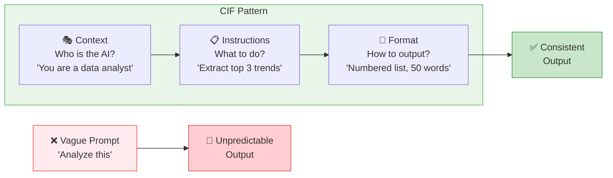
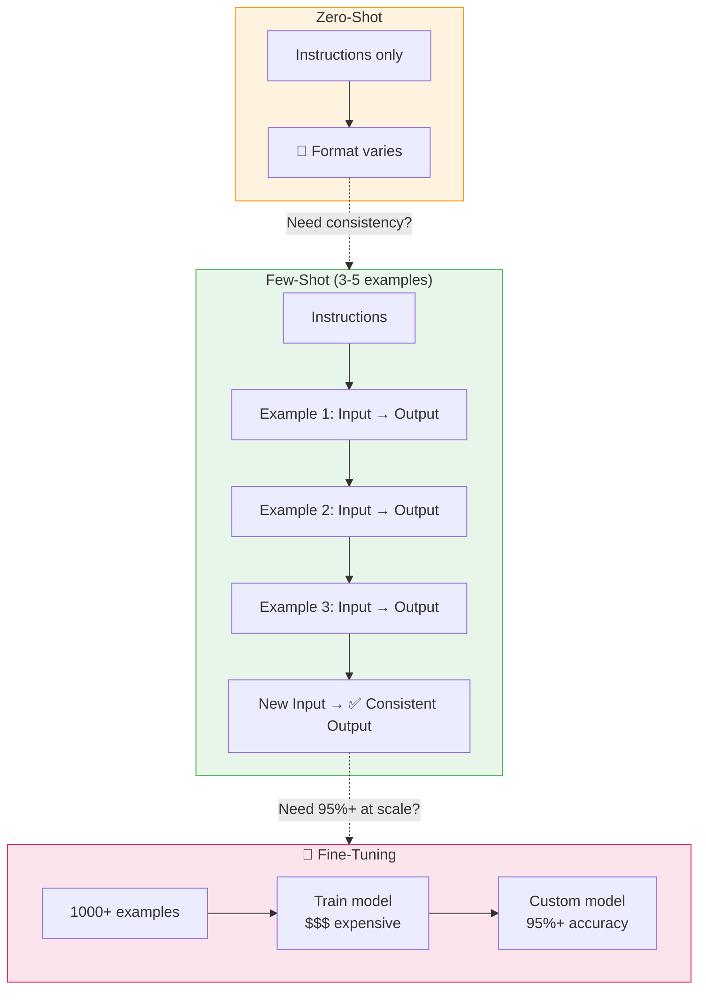
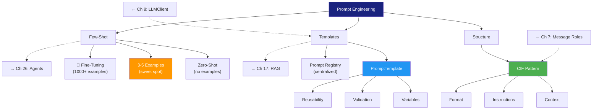

# Chapter 9: Prompt Engineering Basics — The Art of Instruction

<!--
METADATA
Phase: 1 - LLM Fundamentals
Time: 1.5 hours (30 min reading + 60 min hands-on)
Difficulty: ⭐
Type: Concept + Implementation
Prerequisites: Chapter 7 (LLM Call), Chapter 8 (Multi-Provider Client)
Builds Toward: Agents (Ch 26), RAG (Ch 17)
Correctness Properties: P4 (Prompt Variable Substitution)
Project Thread: Prompt Management

NAVIGATION
→ Quick Reference: #quick-reference-card
→ Verification: #verification-required-section
→ What's Next: #whats-next

TEMPLATE VERSION: v2.3 (2026-02-22)
ENHANCED VERSION: v9.2 - Action-First + Visual + Mini-Projects + Interview Corner + Cognitive Load Management
EDIT PASS 1: Full rewrite — removed triple duplication, fixed corrupted text, fixed API references to match Ch 8
EDIT PASS 2: Added time estimates, Mermaid diagrams, Interview Corner, Discussion Prompts, collapsible War Stories, 🔬 markers, SDK disclaimer
-->

---

## ☕ The Prompt That Saved $10,000 ~3 min

You're a junior developer building an email summarizer. Your first attempt:

```python
# ❌ Vague — no context, no format, no constraints.
# The LLM decides on its own how long, what format, and what tone to use.
prompt = "Summarize this email"
```

The result? Sometimes a paragraph, sometimes bullet points, sometimes a haiku. Your boss is not amused.

Your second attempt, after reading this chapter:

```python
# ✅ CIF pattern — Context (who), Instructions (what), Format (how).
# The LLM knows exactly what role to play, what to extract, and what shape
# the output should be. Result: consistent, parseable JSON every time.
prompt = """
[CONTEXT]
You are a customer support email classifier.

[INSTRUCTIONS]
Summarize the email in exactly 2 sentences.
Extract: category (Technical/Billing/Sales), priority (High/Medium/Low).

[FORMAT]
Return JSON only: {"summary": "...", "category": "...", "priority": "..."}
"""
```

The result? Consistent, parseable, production-ready — every single time.

**The difference:** 30 minutes learning prompt structure saved your team 2 weeks of debugging inconsistent output.

**What you'll build:** A `PromptTemplate` class with variable substitution, validation, and few-shot support — the foundation for every AI feature you'll build from here forward.

---

## Prerequisites Check ~2 min

> **SDK Versions**: Code examples tested with `openai>=1.30`, `anthropic>=0.30`. API interfaces evolve — if a method signature changes, check the provider's migration guide.

```bash
# Verify that Chapter 8's LLMClient is importable and can create a provider.
# If this fails, go back and complete Chapter 8 first — every exercise
# in this chapter depends on LLMClient and ChatMessage.
python -c "
from llm_client import LLMClient, ChatMessage
llm = LLMClient.from_provider('openai')
print('✅ LLM client ready')
"
```

| Prerequisite | From Chapter | Quick Self-Check |
|-------------|-------------|------------------|
| Message roles (system/user/assistant) | Ch 7 | Can you explain what each role does? |
| `LLMClient.from_provider()` factory | Ch 8 | Can you create a client for any provider? |
| `client.chat()` with `ChatMessage` | Ch 8 | Do you know the message list format? |

**If any feel shaky**, review that chapter first. This chapter calls the Ch 8 client in every exercise.

---

## Spaced Repetition: Chapters 7-8 Review ~2 min

**From Chapter 7 (Your First LLM Call):**
- ✅ Message roles: `system` (persistent behavior), `user` (task), `assistant` (response)
- ✅ Token economics: input + output tokens = cost
- ✅ Temperature: low (0.0-0.3) = consistent, high (0.7-1.0) = creative

**From Chapter 8 (Multi-Provider Client):**
- ✅ Provider abstraction: `LLMClient.from_provider("openai")`
- ✅ Unified interface: `client.chat([ChatMessage(role="user", content="...")])`
- ✅ Response format: `ChatResponse` with `.content`, `.tokens_used`, `.cost`

**Quick self-check:** Can you explain why `system` messages go first in the message list? If not, review Chapter 7 Section 2.

---

## Where You Are: Learning Progression

```
Phase 1: LLM Fundamentals
├── Chapter 7: Your First LLM Call ✅
├── Chapter 8: Multi-Provider Client ✅
├── Chapter 9: Prompt Engineering ⬅️ YOU ARE HERE
├── Chapter 10: Streaming Responses (next)
└── Chapter 11: Structured Output (coming soon)

Future connections:
→ Chapter 17: RAG — prompt templates for retrieval chains
→ Chapter 26: Agents — advanced prompt engineering for autonomous systems
```

**Scaffolding:** 🟢 Foundation ✅ → 🟡 **Intermediate (current)** → 🔴 Advanced (ahead)

---

## Part 1: The Anatomy of a Perfect Prompt ~15 min

Good prompts follow the **CIF** pattern:

1. **C**ontext: "You are a senior data analyst." (who acts)
2. **I**nstructions: "Extract the top 3 trends from this report." (what to do)
3. **F**ormat: "Return a numbered list, max 50 words each." (how output looks)

**Analogy — Prompts as Recipes** 🍳

Think of a prompt like a cooking recipe:
- **Context** = Kitchen setup (tools available, skill level)
- **Instructions** = Cooking steps ("dice onions, sauté 5 min")
- **Format** = Plating presentation ("serve in a bowl, garnish with parsley")

A vague recipe ("make dinner") is useless. A specific recipe ("spaghetti carbonara: 200g pasta, 2 eggs, 100g pecorino, 150g guanciale") works every time.

### CIF Pattern Flow



### Try This! (Hands-On Practice #1)

Compare a vague prompt vs. a CIF prompt using your Chapter 8 client.

**Create `test_prompting.py`:**

```python
"""
test_prompting.py — Compare vague vs. CIF prompts.

Demonstrates how the CIF pattern (Context, Instructions, Format) produces
more consistent, professional output than a vague one-liner.

Uses the LLMClient from Chapter 8 to send messages to OpenAI.
"""
from llm_client import LLMClient, ChatMessage

# Create an OpenAI client using the factory from Chapter 8.
# You can swap "openai" for "anthropic" to test cross-provider consistency.
llm = LLMClient.from_provider("openai")

# ────────────────────────────────────────────
# Attempt 1: VAGUE prompt — no context, no format constraint.
# The LLM has no guidance on tone, length, or structure.
# Result: conversational, unpredictable, often asks clarifying questions.
# ────────────────────────────────────────────
bad_result = llm.chat([
    ChatMessage(role="user", content="Fix this sentence: The party of the first part agrees to pay money.")
])
print("--- Vague Prompt ---")
print(bad_result.content)

# ────────────────────────────────────────────
# Attempt 2: CIF prompt — Context + Instructions + Format.
#   Context (system msg):  "You are a plain-English contract editor."
#   Instructions (user msg): "Rewrite this clause. Identify payer and payee."
#   Format (user msg):       "Return ONLY the rewritten text."
# Result: focused, professional, no filler — production-ready.
# ────────────────────────────────────────────
good_result = llm.chat([
    ChatMessage(role="system", content="You are a plain-English contract editor. Rewrite clauses to be clear and professional."),
    ChatMessage(role="user", content="""Rewrite this clause. Identify payer and payee clearly.

Clause: The party of the first part agrees to pay money.

Return ONLY the rewritten text. No commentary.""")
])
print("\n--- CIF Prompt ---")
print(good_result.content)
```

**Run:** `python test_prompting.py`

**Expected:** The CIF prompt returns a focused, professional rewrite. The vague prompt returns something conversational and unpredictable.

---

### The Specificity Spectrum

How specific should prompts be? It depends on context:

| Level | Example | Use Case |
|-------|---------|----------|
| **Vague** | "Write a summary" | Brainstorming, exploration |
| **Moderate** | "Summarize this document in 3 bullet points" | Internal tools, prototypes |
| **Specific** | Full CIF with examples, constraints, format | Production systems, APIs |

**Rule of thumb:** Production prompts need specificity. Exploration prompts can be loose.

> **Goldilocks Zone:** Specific enough for consistent output. General enough to handle input variations. Not so rigid that edge cases break it.

---

## Confidence Calibration (Part 1) ~1 min

Rate yourself (1-5) before continuing:

| Skill | Check |
|-------|-------|
| **CIF identification** | Can you label C, I, and F in any prompt? |
| **Specificity trade-off** | Do you know when vague vs. specific is appropriate? |

If either is below 3, re-read Part 1 before continuing.

---

## Part 2: The Template Engine ~20 min

### The Problem: Magic Strings Everywhere

You're building an email bot. In `email_bot.py`:

```python
# ❌ Hardcoded f-string — works for a one-off, but becomes unmanageable
# as you add more features. Can't version, can't test, can't reuse.
prompt = f"Summarize this email: {email_body}"
```

Then you add "Keep it professional." Then "Translate to Spanish." Suddenly your Python files are 90% text. You can't version them, can't test them, and if there's a bug in the text, you redeploy the whole app.

**The solution:** Treat prompts as **objects**, not strings.

**Analogy — Templates as Mad Libs** 📝

A `PromptTemplate` is like a Mad Libs game:
- The **template** is the story with blanks: "Dear {name}, your {item} is ready."
- The **variables** are the blanks: `name`, `item`
- **Validation** checks you filled in ALL blanks before sending

You wouldn't send a letter with `{name}` still in it. Your template class won't either.

<details>
<summary>⚠️ <strong>War Story: The $80,000 Prompt Versioning Disaster</strong></summary>

**Real incident from a healthcare AI company (2022)**

A medical documentation system had prompts hardcoded across 200+ Python files:

```python
# ❌ ANTI-PATTERN: Hardcoded prompts scattered across the codebase.
# Each file builds its own prompt string — no validation, no reuse,
# and changing the tone means editing EVERY file manually.

# In patient_summary.py
prompt = "Summarize this patient visit: " + visit_notes

# In diagnosis_helper.py
prompt = "Based on symptoms, suggest possible diagnoses: " + symptoms

# ... 200+ more files with the same pattern
```

**Month 1:** Marketing requested a tone change from "clinical" to "patient-friendly."

**The nightmare:** Engineers manually searched the codebase, found 237 prompts, missed 43 (discovered by users!). Updated them one by one over 4 weeks. Bug fixes took another 4 weeks. Total cost: ~$80,000 in engineering time + 150 support tickets.

**What they should have done (2 hours of work):**

```python
# ✅ CORRECT PATTERN: Centralized prompt registry.
# ALL prompts live in one file. The {tone} variable is loaded from config,
# so changing tone means editing ONE config value — not 200 Python files.

PROMPT_REGISTRY = {
    "patient_summary": PromptTemplate(
        template="You are a {tone} medical assistant.\n\nSummarize: {visit_notes}\n\nFormat: {format}",
        input_variables=["tone", "visit_notes", "format"]
    )
}

# config.yaml: tone: "clinical and technical"
# To change tone: edit ONE config line, redeploy. Done.
# Time to change: 5 minutes.  Cost: $0.  Risk: minimal.
```

**Lessons:** Prompts are configuration, not code. Centralize from day 1. The `PromptTemplate` you're building isn't over-engineering — it's the difference between $0 and $80,000 when requirements change.

</details>

### Try This! (Hands-On Practice #2)

Build a `PromptTemplate` class that handles variable substitution safely.

**Step 1: Create `shared/utils/prompting.py`:**

```python
"""
shared/utils/prompting.py — Reusable prompt template engine.

Why this exists:
  Hardcoding prompts as f-strings across your codebase leads to:
  - No validation (missing variables silently produce broken prompts)
  - No reusability (copy-paste the same prompt in 50 files)
  - No version control (changing tone means editing 200 files)

  PromptTemplate solves all three by treating prompts as validated objects.

Usage:
  pt = PromptTemplate("Hello {name}", ["name"])
  result = pt.format(name="World")  # "Hello World"
  pt.format()                        # raises ValueError — 'name' is missing
"""
from typing import List


class PromptTemplate:
    """A prompt template with variable substitution and validation.

    Attributes:
        template:        The prompt string with {variable} placeholders.
        input_variables: List of variable names the template expects.

    Raises:
        ValueError: At construction if a declared variable has no matching
                    {placeholder} in the template string.
    """

    def __init__(self, template: str, input_variables: List[str]):
        self.template = template
        self.input_variables = input_variables
        # Validate immediately — fail at definition time, not at call time.
        self._validate_template()

    def _validate_template(self):
        """Check that every declared variable appears as {var} in the template.

        This catches typos at import/startup time rather than at request time.
        Note: This uses substring search, so it won't catch conflicts with
        JSON braces — see the JSON escaping section for that pitfall.
        """
        for var in self.input_variables:
            if f"{{{var}}}" not in self.template:
                raise ValueError(
                    f"Variable '{var}' expected but not found in template."
                )

    def format(self, **kwargs) -> str:
        """Substitute variables and return the final prompt string.

        Args:
            **kwargs: Variable name-value pairs (e.g., name="Alice", age=30).

        Returns:
            The formatted prompt string with all variables replaced.

        Raises:
            ValueError: If any declared variable is missing from kwargs.
            ValueError: If str.format() encounters an unresolvable placeholder
                        (e.g., unescaped JSON braces).
        """
        # Step 1: Check for missing variables BEFORE formatting.
        # This gives a clear error ("Missing: ['age']") instead of a cryptic
        # KeyError from str.format().
        missing = [var for var in self.input_variables if var not in kwargs]
        if missing:
            raise ValueError(f"Missing required variables: {missing}")

        # Step 2: Perform the substitution.
        # Note: Extra kwargs (not in input_variables) are silently ignored
        # by str.format(). See the "strict mode" discussion in the chapter.
        try:
            return self.template.format(**kwargs)
        except KeyError as e:
            raise ValueError(f"Extra variable in template not provided: {e}")
```

**Step 2: Test it — create `test_template.py`:**

```python
"""
test_template.py — Verify that PromptTemplate substitution works.

This script creates a simple two-variable template and formats it.
After running, try removing one of the keyword arguments to see the
validation error in action.
"""
from shared.utils.prompting import PromptTemplate

# Define a reusable summarization prompt.
# {language} and {text} are the variables that callers must supply.
summary_prompt = PromptTemplate(
    template="Summarize the following text in {language}:\n\n{text}",
    input_variables=["language", "text"]
)

# Format the template by providing all required variables.
# If you forget one (e.g., remove language=), you'll get:
#   ValueError: Missing required variables: ['language']
result = summary_prompt.format(
    language="French",
    text="Hello world. This is a test."
)
print(result)
# Output:
#   Summarize the following text in French:
#
#   Hello world. This is a test.
```

**Run:** `python test_template.py`

**Expected output:**
```
Summarize the following text in French:

Hello world. This is a test.
```

**Now try removing `language="French"`** — you should get: `ValueError: Missing required variables: ['language']`

---

### Error Prediction: Template Debugging ~5 min

**Predict what happens in each scenario before checking:**

**Scenario 1: Missing Variable**
```python
pt = PromptTemplate("Hello {name}, you are {age} years old.", ["name", "age"])
result = pt.format(name="Alice")  # Missing 'age'
```

<details>
<summary>Answer</summary>

**`ValueError: Missing required variables: ['age']`** — The `format()` method checks for missing variables BEFORE calling `str.format()`. Fail fast, fail loud.

</details>

**Scenario 2: Extra Variable**
```python
pt = PromptTemplate("Hello {name}", ["name"])
result = pt.format(name="Bob", age=30)  # Extra 'age'
```

<details>
<summary>Answer</summary>

**Returns `"Hello Bob"`** — Python's `str.format()` silently ignores extra kwargs. This is flexible but risky: typos in variable names won't raise errors. For strict mode, check `set(kwargs.keys()) - set(self.input_variables)`.

</details>

**Scenario 3: JSON in Template (Tricky!)**
```python
pt = PromptTemplate(
    'Return JSON: {"name": "{name}", "age": {age}}',
    ["name", "age"]
)
result = pt.format(name="Diana", age=25)
```

<details>
<summary>Answer</summary>

**Validation passes, but `.format()` crashes with `KeyError` or `ValueError`.** The `_validate_template()` substring check finds `{name}` and `{age}` inside the string, so it doesn't raise. But when `.format()` runs, Python's string formatter treats every `{...}` as a format field — including the JSON braces `{"name":` — and chokes because `"name"` (with quotes) isn't a valid field name.

**The real error:** `KeyError: '"name"'` — Python tries to substitute a variable literally named `"name"` (with double quotes).

**Fix — escape literal braces with double braces:**
```python
pt = PromptTemplate(
    'Return JSON: {{"name": "{name}", "age": {age}}}',
    ["name", "age"]
)
# {{ becomes {, }} becomes } in output
```

**Memory trick:** "Double the braces to keep them literal."

</details>

---

### 🔬 Advanced: When Templates vs F-Strings

| Aspect | F-String | PromptTemplate |
|--------|----------|----------------|
| **Speed to write** | 1 line | 5 lines |
| **Validation** | None | Built-in |
| **Reusability** | Copy-paste | Import and reuse |
| **Version control** | Embedded in code | Separate file |
| **Team collaboration** | Merge conflicts | Clean separation |

**Rule of three:** If you use the same prompt structure 3+ times, extract it to a template.

---

## Part 3: Few-Shot Prompting ~20 min

The single most effective technique for improving LLM output: **give examples**.

**Analogy — Teaching by Showing** 👶

Zero-shot: "Clean your room." → Child puts toys under the bed, clothes still on floor.

Few-shot: "Clean your room like this: toys → toy box, dirty clothes → hamper, books → shelf by size." → Room is clean exactly how you want it.

**Examples show the pattern. The LLM learns by imitation.**

### Zero-Shot vs Few-Shot Flow



### Try This! (Hands-On Practice #3)

Compare zero-shot vs. few-shot for structured extraction.

**Create `few_shot_test.py`:**

```python
"""
few_shot_test.py — Compare zero-shot vs. few-shot extraction.

Zero-shot: LLM receives only instructions — output format is unpredictable.
Few-shot:  LLM receives instructions + 2 examples — output format matches
           the examples exactly, making it safe to parse programmatically.

Run: python few_shot_test.py
"""
from llm_client import LLMClient, ChatMessage

# Create client (swap "openai" → "anthropic" to test cross-provider behavior)
llm = LLMClient.from_provider("openai")

# ────────────────────────────────────────────
# Zero-Shot: No examples provided.
# The LLM might return "PROJ-ALPHA-01" or "The project code is PROJ-ALPHA-01"
# — you can't predict or parse the format reliably.
# ────────────────────────────────────────────
zero_result = llm.chat([
    ChatMessage(
        role="user",
        content="Extract the project code from: 'The file is in folder 2024/PROJ-ALPHA-01/docs'. Return only the code."
    )
])
print(f"Zero-Shot: {zero_result.content}")

# ────────────────────────────────────────────
# Few-Shot: 2 examples teach the LLM the exact output format.
# Each example shows: input path → just the PROJ-XXX code, nothing else.
# The LLM mimics this pattern for the new input.
# ────────────────────────────────────────────
few_result = llm.chat([
    ChatMessage(
        role="user",
        content="""Extract the project code from the path.

Examples:
Input: 'users/docs/PROJ-2023-99/budget.pdf' -> Output: PROJ-2023-99
Input: 'backup/PROJ-X-1/save.zip' -> Output: PROJ-X-1

Input: 'The file is in folder 2024/PROJ-ALPHA-01/docs' -> Output:"""
    )
])
print(f"Few-Shot: {few_result.content}")
# Expected: "PROJ-ALPHA-01" — matches the short format of the examples.
```

**Run:** `python few_shot_test.py`

**Expected:** Zero-shot might return "PROJ-ALPHA-01" or "The code is PROJ-ALPHA-01" (unpredictable format). Few-shot returns exactly `PROJ-ALPHA-01` (matches example format).

_Note: Modern models (GPT-4o, Claude Sonnet) often get zero-shot right, but few-shot **guarantees** format consistency — critical for parsing output programmatically._

---

<details>
<summary>⚠️ <strong>War Story: The Few-Shot That Saved $150,000/Year</strong></summary>

**Real incident from a contract analysis company (2023)**

They needed to extract key terms (party names, payment terms, termination clauses) from legal documents.

**Their initial approach:** Fine-tune a model. Cost: $50K setup + $50K/year maintenance. 3 months to deploy. Accuracy: 92%.

**A junior engineer's experiment:** 3 few-shot examples in the prompt. Cost: $0 setup + $0 maintenance. Deployed in 1 day. Accuracy: 91%.

| Approach | Accuracy | Setup Cost | Time to Deploy |
|----------|----------|------------|----------------|
| Fine-tuning | 92% | $50,000 | 3 months |
| Few-shot | 91% | $0 | 1 day |

**Adding new fields with fine-tuning:** Collect 5,000 examples, retrain, 2 months, $30K.
**Adding new fields with few-shot:** Add 2-3 examples, 10 minutes, $0.

The company cancelled the fine-tuning project. **3-year savings: $150,000.** Their new rule: "Prove that few-shot doesn't work before investing in fine-tuning."

**Your takeaway:** Few-shot prompting isn't a toy technique — it's a production strategy. Before spending months fine-tuning, spend 10 minutes writing good examples.

</details>

---

### Error Prediction: Few-Shot Debugging ~5 min

**Scenario 1: Examples Contradict Instructions**
```python
prompt = """Extract only the dollar amount from invoices.

Examples:
Input: "Invoice #123: $500" -> Output: Invoice #123 costs $500
Input: "Total: $1,200" -> Output: The total is $1,200

Input: "Payment due: $750" -> Output:"""
```

<details>
<summary>Answer</summary>

**LLM follows examples, returns "Payment due is $750"** — LLMs learn more from concrete examples than abstract instructions. When they conflict, examples win. Fix: make examples match instructions (`$500`, `$1,200`, not full sentences).

</details>

**Scenario 2: Inconsistent Example Format**
```python
prompt = """Convert temperatures from Fahrenheit to Celsius.

Examples:
Input: "32F" -> Output: 0C
Input: "Water boils at 212°F" -> Output: Water boils at 100 degrees Celsius
Input: "98.6F" -> Output: 37C

Input: "Room temperature is 72F" -> Output:"""
```

<details>
<summary>Answer</summary>

**Unpredictable format** — Examples mix short (`0C`) and verbose (`Water boils at 100 degrees Celsius`) formats. The LLM doesn't know which to follow. Fix: use identical format for ALL examples.

**Production lesson:** Consistency is everything. If you can't predict the output format from your examples, neither can the LLM.

</details>

**Scenario 3: Examples Don't Match Task**
```python
prompt = """Extract email addresses from text.

Examples:
Input: "Call me at 555-1234" -> Output: 555-1234
Input: "Visit www.example.com" -> Output: www.example.com

Input: "Contact us at support@example.com" -> Output:"""
```

<details>
<summary>Answer</summary>

**LLM extracts the email but might also extract phone-number-like patterns** — Examples teach "extract contact info," not "extract emails specifically." The LLM infers the general pattern, not your specific intent. Fix: use examples that match the exact task (email → email).

</details>

**Key takeaway:** Few-shot is powerful but fragile. Small inconsistencies cause big problems. Spend time crafting perfect, consistent examples.

---

### 🔬 Advanced: Few-Shot vs Fine-Tuning Decision Framework

**When to use few-shot:**
- ✅ Simple to moderate tasks
- ✅ Requirements change frequently
- ✅ Limited budget or need fast deployment
- ✅ 85-95% accuracy is acceptable
- ✅ Low to medium volume

**When to consider fine-tuning:**
- ✅ Complex, specialized tasks (20+ extraction fields)
- ✅ Stable requirements that won't change often
- ✅ High volume where per-call cost matters
- ✅ Need 95%+ accuracy
- ✅ Have 1,000+ labeled examples

**The hybrid approach (recommended):**
1. **Start with few-shot** — validate the task is solvable ($0)
2. **Measure accuracy** — is 90% good enough?
3. **Calculate ROI** — is 5% more accuracy worth $50K?
4. **Fine-tune only if justified** — high volume + high accuracy + stable requirements

> "Few-shot is your prototype. Fine-tuning is your optimization. Don't optimize prematurely." — ML Engineer proverb

---

## Part 4: Putting It All Together — Prompt Registry ~10 min

Let's combine CIF + Templates + Few-Shot into a production prompt registry.

**Create `shared/utils/prompt_registry.py`:**

```python
"""
shared/utils/prompt_registry.py — Centralized prompt management.

Why a registry?
  Instead of scattering prompts across 200+ files (see the $80K War Story),
  define every prompt HERE. When marketing wants a tone change, you edit
  ONE file — not 200.

Each entry combines the techniques from this chapter:
  - CIF pattern:  Context → Instructions → Format sections
  - Templates:    {variables} with validation
  - Few-shot:     Examples that teach the LLM the exact output format

Usage:
  from shared.utils.prompt_registry import PROMPTS
  prompt_text = PROMPTS["summarize"].format(tone="concise", text="...", max_words="100")
"""
from shared.utils.prompting import PromptTemplate

PROMPTS = {
    # ── Summarization (CIF pattern) ──────────────────────────────
    # Uses all three CIF components: Context (tone), Instructions (word limit),
    # Format ("no preamble"). Variables: tone, text, max_words.
    "summarize": PromptTemplate(
        template="""[CONTEXT]
You are a {tone} document summarizer.

[INSTRUCTIONS]
Summarize the following text in {max_words} words or fewer.

[FORMAT]
Return only the summary. No preamble.

[INPUT]
{text}""",
        input_variables=["tone", "text", "max_words"]
    ),

    # ── Sentiment Classification (few-shot) ──────────────────────
    # Three examples teach the LLM the exact label set (Positive/Negative/Neutral).
    # The trailing "-> Output:" cues the LLM to complete the pattern.
    "classify_sentiment": PromptTemplate(
        template="""Classify sentiment as Positive, Negative, or Neutral.

Examples:
Input: "This product changed my life!" -> Output: Positive
Input: "Worst purchase I've ever made." -> Output: Negative
Input: "It works as expected." -> Output: Neutral

Input: "{text}" -> Output:""",
        input_variables=["text"]
    ),

    # ── Entity Extraction (few-shot + JSON) ──────────────────────
    # Note the double braces {{...}} — these escape to literal { } in the output
    # so Python's .format() doesn't try to interpret them as variables.
    # The example teaches the LLM the exact JSON schema we expect.
    "extract_entities": PromptTemplate(
        template="""Extract named entities from the text.

Examples:
Input: "Apple CEO Tim Cook announced the new iPhone in Cupertino."
Output: {{"companies": ["Apple"], "people": ["Tim Cook"], "products": ["iPhone"], "locations": ["Cupertino"]}}

Input: "{text}"
Output:""",
        input_variables=["text"]
    ),
}
```

**Usage across your codebase:**

```python
"""
Example: Using the prompt registry in application code.

This is what every file in your project does — import PROMPTS, format with
variables, send to the LLM. To change the summarization style, you edit
prompt_registry.py — this file never changes.
"""
from shared.utils.prompt_registry import PROMPTS
from llm_client import LLMClient, ChatMessage

# Create an LLM client (same factory pattern from Chapter 8)
llm = LLMClient.from_provider("openai")

# Step 1: Format a registered prompt with specific values.
# The PromptTemplate validates that all 3 variables (tone, text, max_words)
# are provided — if you forget one, you get a clear ValueError.
prompt_text = PROMPTS["summarize"].format(
    tone="concise and professional",
    text="Long document content here...",
    max_words="100"
)

# Step 2: Send the formatted prompt to the LLM.
# The prompt_text is now a complete string with no {variables} remaining.
response = llm.chat([
    ChatMessage(role="user", content=prompt_text)
])
print(response.content)
```

**Why this matters:**
- Change any prompt in ONE file, not 200
- Version-control prompts like code
- Test prompts independently of application logic
- Swap prompt strategies (zero-shot → few-shot) without touching callers

---

## Common Mistakes ~3 min

### Mistake #1: Loose Braces in Prompts

If you use `.format()` with JSON in the template, you must escape literal braces:

```python
# ❌ BAD — Python's .format() interprets {"key"} as a format field,
# causing a KeyError because "key" (with quotes) isn't a valid variable name.
template = 'Return JSON: {"key": "value"}'

# ✅ GOOD — Double braces {{ and }} escape to literal { and } in output.
# .format() ignores them, so the JSON structure survives intact.
template = 'Return JSON: {{"key": "value"}}'
# Result after .format(): 'Return JSON: {"key": "value"}'
```

### Mistake #2: Too Many Examples

Don't put 50 examples in the prompt. 3-5 examples is the sweet spot. More causes "Lost in the Middle" — the LLM ignores middle examples and only attends to the first/last few.

### Mistake #3: Silent Failures

Using `str.replace("{name}", value)` instead of `.format()` won't error on missing variables — the prompt sends `{name}` literally to the LLM. Use `PromptTemplate` validation instead.

---

## Quick Reference Card

### CIF Pattern
- **C**ontext — Who is the AI? ("You are a data analyst")
- **I**nstructions — What to do? ("Extract top 3 trends")
- **F**ormat — How to output? ("JSON with keys: trend, confidence")

### PromptTemplate
```python
# Create: declare template string + list of expected variable names
pt = PromptTemplate("Hello {name}", ["name"])

# Format: supply all variables as keyword arguments
result = pt.format(name="World")  # Returns: "Hello World"
# Omitting a variable raises: ValueError: Missing required variables: ['name']
```

### JSON Escaping
```python
# Problem: .format() treats { } as variable delimiters.
# Solution: {{ and }} produce literal { } in the output.
template = '{{"status": "{status}"}}'
result = template.format(status="ok")  # Returns: '{"status": "ok"}'
```

### Few-Shot Structure
```
[Instruction]
Example 1: [Input] -> [Output]
Example 2: [Input] -> [Output]
Example 3: [Input] -> [Output]
New: [Input] ->
```

---

## Interview Corner ~5 min

**Q1: What is the CIF pattern and why does it improve LLM output?**

<details>
<summary>Strong Answer</summary>

CIF stands for Context, Instructions, Format. Context tells the LLM what role to assume ("You are a senior data analyst"), Instructions specify the task ("Extract trends from this report"), and Format defines the output structure ("Return a JSON array"). This improves output because it constrains the LLM's response space — instead of choosing from millions of possible responses, it focuses on responses that match the specified role, task, and format. In production, this means consistent, parseable output instead of unpredictable text.

</details>

**Q2: When would you use few-shot prompting vs fine-tuning?**

<details>
<summary>Strong Answer</summary>

Few-shot first, always. It's free to set up, deploys in minutes, and achieves 85-95% accuracy for most tasks. Fine-tuning is justified when: (1) you need 95%+ accuracy, (2) requirements are stable (retraining is expensive), (3) you have 1,000+ labeled examples, and (4) the per-call cost savings at scale justify the $10-50K setup. The hybrid approach is best: validate with few-shot, measure accuracy, calculate ROI, then fine-tune only if the math works.

</details>

**Q3: How would you manage prompts in a production system with 50+ prompt templates?**

<details>
<summary>Strong Answer</summary>

Centralized prompt registry — a single module (e.g., `prompt_registry.py`) containing all `PromptTemplate` objects with variable validation. Benefits: (1) change any prompt in one place instead of searching across files, (2) version-control prompts alongside code, (3) validate templates at import time (fail fast on typos), (4) A/B test prompt variants by swapping registry entries. For larger teams, store prompts in a config file (YAML/JSON) loaded at startup, with a CI pipeline that validates all templates have correct variables.

</details>

**Coding Challenge:** Write a `PromptTemplate` that takes a `tone` and `document` variable, uses the CIF pattern, and validates that both variables exist in the template string.

---

## Discussion Prompts (for teams/study groups)

1. **The Specificity Trade-off**: Your team debates prompt length. PM wants short prompts (cheaper tokens). QA wants detailed prompts (consistent output). How do you resolve this? What data would you collect?

2. **Examples vs Instructions**: A colleague says "just write better instructions instead of adding examples." Design an experiment to test whether 3 examples outperform detailed instructions for a classification task.

3. **Prompt Versioning**: Your product has 50 prompt templates. Marketing wants to A/B test two tones. How would you architect prompt versioning to support this without code changes?

---

## Verification (REQUIRED SECTION) ~5 min

**Create `verify_prompts.py`:**

```python
"""
verify_prompts.py — Verification script for Chapter 9.

Tests the PromptTemplate class you built in shared/utils/prompting.py.
Run: python verify_prompts.py
All 6 tests must pass before moving to Chapter 10.

What each test verifies:
  1. Basic variable substitution works
  2. Missing variables raise clear errors (not silent failures)
  3. Template-variable mismatch caught at construction time
  4. Multiple variables substitute correctly
  5. JSON brace escaping ({{ → {) works with .format()
  6. Full CIF pattern template round-trips correctly
"""
from shared.utils.prompting import PromptTemplate
import sys

print("Running Prompt Engineering Verification...\n")

# ── Test 1: Basic Substitution ────────────────────────────────
# Verify that a single {name} variable is replaced correctly.
print("Test 1: Variable Substitution...")
try:
    pt = PromptTemplate("Hello {name}", ["name"])
    res = pt.format(name="World")
    assert res == "Hello World", f"Expected 'Hello World', got '{res}'"
    print("  PASS — Substitution works")
except Exception as e:
    print(f"  FAIL: {e}")
    sys.exit(1)

# ── Test 2: Missing Variable Detection ────────────────────────
# Calling format() without the required 'name' kwarg must raise ValueError.
# This prevents broken prompts from reaching the LLM.
print("Test 2: Missing Variable Detection...")
try:
    pt.format()  # Missing 'name' — should raise ValueError
    print("  FAIL — Should have raised ValueError")
    sys.exit(1)
except ValueError as e:
    assert "Missing" in str(e), f"Error message should mention 'Missing', got: {e}"
    print("  PASS — Caught missing variable")

# ── Test 3: Template Definition Mismatch ──────────────────────
# If input_variables lists 'age' but the template has no {age} placeholder,
# the constructor must raise immediately (fail at definition time).
print("Test 3: Template-Variable Mismatch...")
try:
    PromptTemplate("Hello {name}", ["name", "age"])  # 'age' not in template
    print("  FAIL — Should have detected missing placeholder")
    sys.exit(1)
except ValueError as e:
    assert "expected but not found" in str(e)
    print("  PASS — Caught definition mismatch")

# ── Test 4: Multiple Variables ────────────────────────────────
# Templates with 2+ variables must substitute all of them correctly.
print("Test 4: Multiple Variables...")
try:
    pt = PromptTemplate("Hello {name}, you are {age} years old", ["name", "age"])
    res = pt.format(name="Alice", age=30)
    assert "Alice" in res and "30" in res
    print("  PASS — Multiple variables work")
except Exception as e:
    print(f"  FAIL: {e}")
    sys.exit(1)

# ── Test 5: JSON Brace Escaping ──────────────────────────────
# Double braces {{ }} must become literal { } in the output,
# while single braces {status} are still treated as variables.
# This is critical for prompts that ask the LLM to return JSON.
print("Test 5: JSON Brace Escaping...")
try:
    pt = PromptTemplate(
        'Return JSON: {{"status": "{status}"}}',
        ["status"]
    )
    res = pt.format(status="ok")
    assert '{"status": "ok"}' in res, f"Expected JSON, got: {res}"
    print("  PASS — JSON escaping works")
except Exception as e:
    print(f"  FAIL: {e}")
    sys.exit(1)

# ── Test 6: CIF Pattern Template ─────────────────────────────
# A full CIF (Context, Instructions, Format) template with 3 variables.
# Validates that the pattern we teach in Part 1 works end-to-end.
print("Test 6: CIF Pattern Template...")
try:
    cif = PromptTemplate(
        "[CONTEXT]\nYou are a {role}.\n\n[INSTRUCTIONS]\n{task}\n\n[FORMAT]\n{format}",
        ["role", "task", "format"]
    )
    res = cif.format(
        role="analyst",
        task="Summarize this report",
        format="3 bullet points"
    )
    assert "analyst" in res and "Summarize" in res and "bullet" in res
    print("  PASS — CIF template works")
except Exception as e:
    print(f"  FAIL: {e}")
    sys.exit(1)

print("\nChapter 9 Complete! You can now manage prompts like code.")
```

**Run:** `python verify_prompts.py`

**Expected:** All 6 tests pass.

---

## Concept Map



---

## Summary ~2 min

**What you learned:**

1. ✅ **CIF pattern** — Context + Instructions + Format = consistent output
2. ✅ **PromptTemplate** — Reusable prompts with variable substitution and validation
3. ✅ **Few-shot prompting** — 3-5 examples for format consistency
4. ✅ **Prompt registry** — Centralized management, version-controlled
5. ✅ **Error prevention** — Template validation catches bugs before production

**Key takeaway:** A prompt is a specification, not a question. Treat it with the same care as a database schema.

**Production wisdom:**
- "Prompts are configuration, not code" — centralize them
- "Examples trump instructions" — make them consistent
- "Try few-shot before fine-tuning" — save $150K/year
- "Specificity is a dial, not a switch" — find your Goldilocks Zone

**Time check:** Reading: ~30 min | Hands-on: ~60 min | **Total: ~90 min**

---

**Next**: [Chapter 10: Streaming Responses →](chapter-10-streaming-responses.md)
