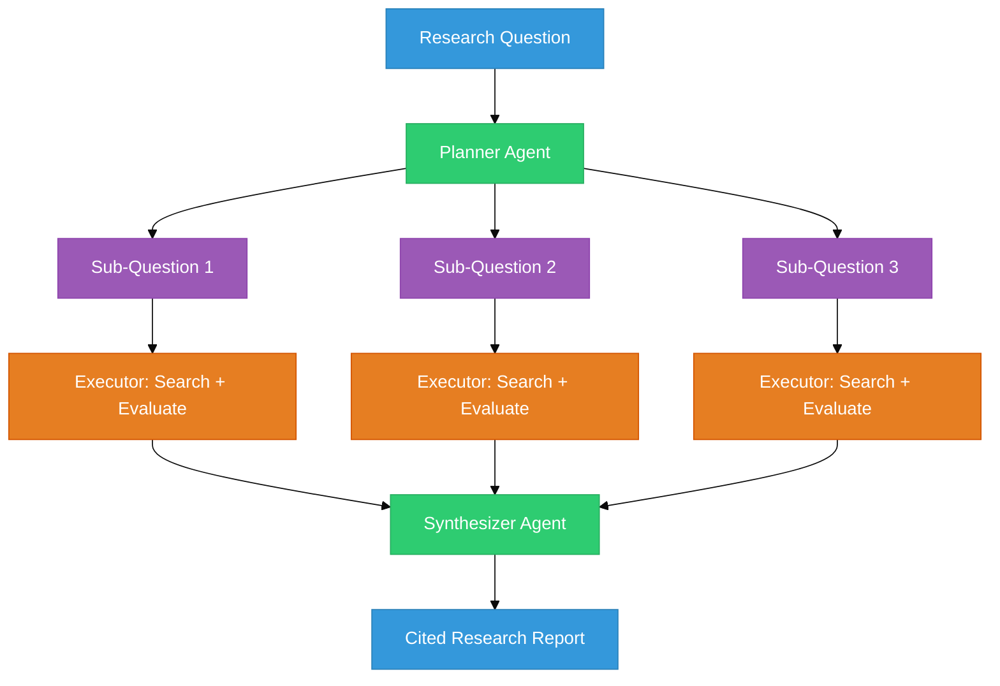
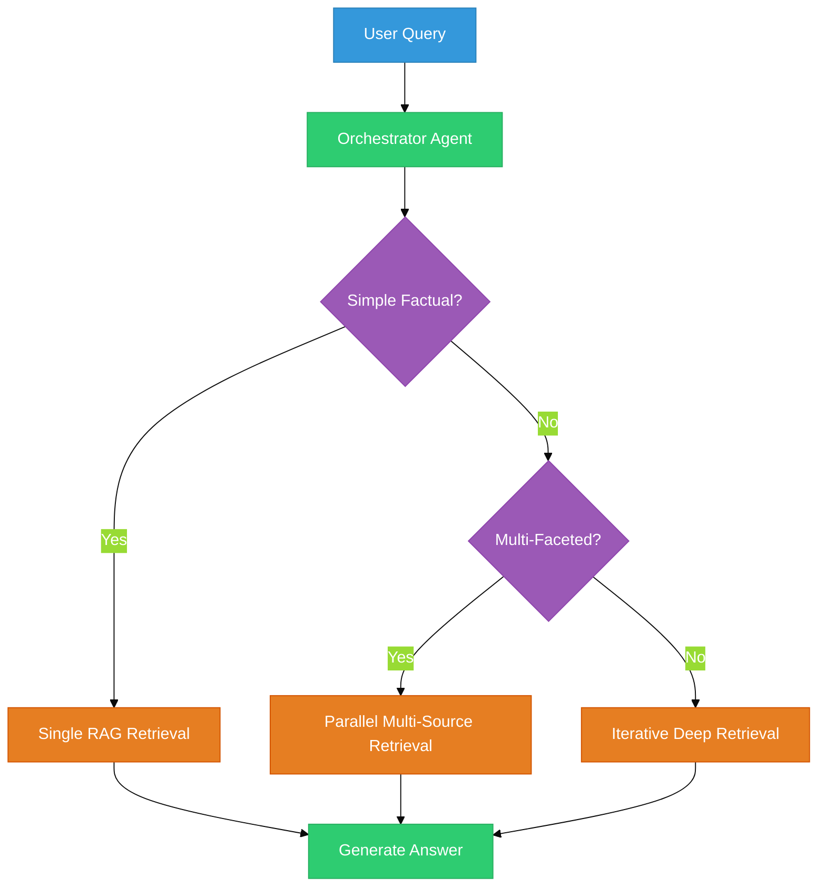

# Chapter 30B: Deep Research Agents — The AI Researcher

<!--
METADATA
Phase: Phase 5: Agents
Time: 1.75 hours (45 minutes reading + 60 minutes hands-on)
Difficulty: ⭐⭐⭐
Type: Implementation / Agent Architecture
Prerequisites: Chapter 29 (Tool Calling), Chapter 30 (Agent Memory)
Builds Toward: Chapter 31 (LangGraph), Chapter 54 (Complete System)
Correctness Properties: [P42: Citation Accuracy, P43: Source Diversity]
Project Thread: ResearchAgent - connects to Ch 31, 54

NAVIGATION
→ Quick Reference: #quick-reference-card
→ Verification: #verification
→ What's Next: #whats-next

TEMPLATE VERSION: v2.1 (2026-01-17)
ENHANCED VERSION: v9.0 (2026-02-20) - New Chapter + Agentic RAG Pattern
-->

---

## Coffee Shop Intro

You ask ChatGPT: *"What are the latest advances in battery technology?"*

It gives you a decent answer — from its training data, which is months old. No citations. No sources. No way to verify. It's like asking a friend who *read about batteries once* — helpful, but not research.

Now imagine an AI that:
1. **Plans** what to research (breaks your question into sub-questions)
2. **Searches** multiple sources (web, academic papers, your local docs)
3. **Evaluates** what it finds (is this source credible? Is this information current?)
4. **Synthesizes** a report with citations

That's a **Deep Research Agent**. It doesn't just recall — it *investigates*.

**Analogy: Library Visitor vs. Research Analyst** 📚
- **Standard LLM** = A library visitor who reads one book and gives you their impression.
- **Deep Research Agent** = A research analyst who checks 10 sources, cross-references facts, identifies gaps, and delivers a cited report with confidence levels.

Today you'll build this analyst. Let's research! 🔬

---

## Prerequisites Check

Before we dive in, ensure you have:

✅ **Tool Calling**: You've built function-calling agents (Chapter 29).
✅ **Agent Memory**: You understand conversation and working memory (Chapter 30).
✅ **Dependencies**:
```bash
pip install openai tavily-python
```

You'll need a [Tavily API key](https://tavily.com/) (free tier: 1,000 searches/month).

---

## Action: Run This First (5 min)

We're going to build a minimal research agent that searches the web and summarizes findings.

```python
from openai import OpenAI
from tavily import TavilyClient
import os
import json

client = OpenAI()
tavily = TavilyClient(api_key=os.getenv("TAVILY_API_KEY"))


def research(query: str) -> str:
    """Simple research agent: search → summarize."""
    # Step 1: Search the web
    results = tavily.search(query, max_results=3)
    sources = [
        {"title": r["title"], "url": r["url"], "content": r["content"][:500]}
        for r in results["results"]
    ]

    # Step 2: Summarize with citations
    response = client.chat.completions.create(
        model="gpt-4o-mini",
        messages=[
            {
                "role": "system",
                "content": (
                    "You are a research analyst. Summarize the findings from the "
                    "provided sources. Cite each fact with [Source N] references."
                ),
            },
            {
                "role": "user",
                "content": f"Query: {query}\n\nSources:\n{json.dumps(sources, indent=2)}",
            },
        ],
    )

    report = response.choices[0].message.content
    citations = "\n".join(f"[{i+1}] {s['title']} - {s['url']}" for i, s in enumerate(sources))
    return f"{report}\n\n---\nSources:\n{citations}"


print(research("What are the latest RAG techniques in 2026?"))
```

**Expected Result**: A summary paragraph with `[Source 1]`, `[Source 2]` citations, followed by a bibliography. Your first research agent!

---

## Watch & Learn (Optional)

-   **Assaf Elovic**: [GPT Researcher Architecture](https://www.youtube.com/watch?v=37S1fB98Mks) (The definitive deep research pattern)
-   **LangChain**: [Research Agent with LangGraph](https://www.youtube.com/watch?v=hvAPnpSfSGo) (Stateful research workflow)

---

## Key Concepts Deep Dive

### Part 1: The Planner-Executor Pattern (~10 min)

The simplest research agent (above) has a problem: it searches once and summarizes. Real research requires **multiple rounds** — you search, find a lead, search again, refine your understanding.

The **Planner-Executor** pattern separates concerns:
- **Planner**: Breaks the research question into sub-questions
- **Executor**: Searches for each sub-question independently
- **Synthesizer**: Combines all findings into a coherent report


**Figure 30B.1**: Planner-Executor Research Architecture. The planner decomposes the question; executors search in parallel; the synthesizer creates the final report.

### Implementation: Multi-Source Research Agent

```python
from openai import OpenAI
from tavily import TavilyClient
import json
import os

client = OpenAI()
tavily = TavilyClient(api_key=os.getenv("TAVILY_API_KEY"))


def generate_sub_questions(query: str) -> list[str]:
    """Break a research question into 3-5 focused sub-questions."""
    response = client.chat.completions.create(
        model="gpt-4o-mini",
        messages=[
            {
                "role": "system",
                "content": (
                    "You are a research planner. Given a broad research question, "
                    "generate 3-5 specific sub-questions that would fully cover the topic. "
                    "Return a JSON array of strings."
                ),
            },
            {"role": "user", "content": query},
        ],
        response_format={"type": "json_object"},
    )
    result = json.loads(response.choices[0].message.content)
    return result.get("questions", result.get("sub_questions", []))


def search_and_evaluate(sub_question: str) -> dict:
    """Search for a sub-question and evaluate source quality."""
    results = tavily.search(sub_question, max_results=3)
    findings = []
    for r in results["results"]:
        findings.append({
            "title": r["title"],
            "url": r["url"],
            "content": r["content"][:500],
            "relevance": r.get("score", 0),
        })
    return {"question": sub_question, "findings": findings}


def synthesize_report(query: str, all_findings: list[dict]) -> str:
    """Combine all findings into a structured research report."""
    response = client.chat.completions.create(
        model="gpt-4o-mini",
        messages=[
            {
                "role": "system",
                "content": (
                    "You are a research synthesizer. Create a comprehensive report from "
                    "the provided research findings. Structure it with:\n"
                    "1. Executive Summary (2-3 sentences)\n"
                    "2. Key Findings (organized by sub-topic)\n"
                    "3. Gaps & Limitations\n"
                    "Cite sources as [Source N]."
                ),
            },
            {
                "role": "user",
                "content": (
                    f"Research Question: {query}\n\n"
                    f"Findings:\n{json.dumps(all_findings, indent=2)}"
                ),
            },
        ],
    )
    return response.choices[0].message.content


def deep_research(query: str) -> str:
    """Full deep research pipeline: plan → search → synthesize."""
    print(f"📋 Planning research for: {query}")
    sub_questions = generate_sub_questions(query)
    print(f"   Generated {len(sub_questions)} sub-questions")

    all_findings = []
    all_sources = []
    for i, sq in enumerate(sub_questions, 1):
        print(f"🔍 [{i}/{len(sub_questions)}] Researching: {sq}")
        result = search_and_evaluate(sq)
        all_findings.append(result)
        all_sources.extend(result["findings"])

    print("📝 Synthesizing report...")
    report = synthesize_report(query, all_findings)

    # Add bibliography
    seen_urls = set()
    bibliography = []
    for i, s in enumerate(all_sources, 1):
        if s["url"] not in seen_urls:
            bibliography.append(f"[{len(bibliography)+1}] {s['title']} — {s['url']}")
            seen_urls.add(s["url"])

    return f"{report}\n\n---\n## Sources\n" + "\n".join(bibliography)


# Run it!
report = deep_research("What are the latest advances in RAG systems for 2026?")
print("\n" + "=" * 60)
print(report)
```

---

### Part 2: Agentic RAG — The Decision-Making Retriever (~12 min) — v9.0

Standard RAG always retrieves. Every query hits the vector store, whether it needs to or not. **Agentic RAG** gives the agent the intelligence to *decide* when, how, and what to retrieve.

**Analogy: Autopilot vs. Skilled Driver** 🚗
- **Standard RAG** = Autopilot that always takes the highway. Even if you're going next door.
- **Agentic RAG** = A skilled driver who checks the destination, considers traffic, and picks the best route — sometimes the highway, sometimes a shortcut, sometimes walking.

### The Three Agentic RAG Patterns

#### Pattern 1: Tool-RAG — RAG as One Tool of Many

The agent has multiple tools (web search, calculator, code executor, RAG). It decides which to use based on the query.

```python
tools = [
    {"name": "rag_search", "description": "Search internal knowledge base"},
    {"name": "web_search", "description": "Search the internet for current info"},
    {"name": "calculator", "description": "Perform mathematical calculations"},
    {"name": "code_runner", "description": "Execute Python code"},
]

# The agent sees the query and decides:
# "What is our refund policy?" → rag_search (internal docs)
# "What is Bitcoin's price today?" → web_search (current data)
# "What is 15% of $340?" → calculator (no retrieval needed)
```

#### Pattern 2: Iterative RAG — Retrieve, Evaluate, Retrieve Again

The agent retrieves, evaluates whether it has enough information, and retrieves again if needed — with refined queries.

```python
def iterative_rag(query: str, max_rounds: int = 3) -> str:
    """Retrieve until the agent has sufficient information."""
    context_so_far = []

    for round_num in range(1, max_rounds + 1):
        # Retrieve
        docs = vector_search(query if round_num == 1 else refined_query)
        context_so_far.extend(docs)

        # Evaluate: Do we have enough?
        evaluation = client.chat.completions.create(
            model="gpt-4o-mini",
            messages=[
                {
                    "role": "system",
                    "content": (
                        "Given the query and retrieved context, determine:\n"
                        "1. Can you answer the query fully? (yes/no)\n"
                        "2. If no, what specific information is missing?\n"
                        "Respond with JSON: {\"sufficient\": true/false, \"missing\": \"...\"}"
                    ),
                },
                {
                    "role": "user",
                    "content": f"Query: {query}\n\nContext: {context_so_far}",
                },
            ],
            response_format={"type": "json_object"},
        )
        result = json.loads(evaluation.choices[0].message.content)

        if result.get("sufficient"):
            break

        # Refine query for next round
        refined_query = result.get("missing", query)
        print(f"  Round {round_num}: Insufficient. Searching for: {refined_query}")

    # Generate final answer from all collected context
    return generate_answer(query, context_so_far)
```

#### Pattern 3: Orchestrator-RAG — Planning Agent Directs Retrieval

A planning agent decides the retrieval strategy based on query complexity:


**Figure 30B.2**: Orchestrator-RAG Pattern. The orchestrator classifies query complexity and selects the appropriate retrieval strategy.

### Agentic RAG vs. Standard RAG — The Key Difference

| Aspect | Standard RAG | Agentic RAG |
|--------|-------------|-------------|
| **When to retrieve** | Always | Agent decides |
| **What to retrieve from** | One vector store | Multiple sources (vector DB, web, APIs, KGs) |
| **How many times** | Once | Iteratively until sufficient |
| **Query refinement** | None | Agent refines based on gaps |
| **Tool selection** | Always embedding search | Agent picks best tool per query |

---

## Checkpoint (~1 min)

You now know the Planner-Executor research pattern and three Agentic RAG patterns. The key insight: **intelligent retrieval decisions** matter more than retrieval algorithm improvements.

**If this is clear**: Build the mini-projects below.
**If this feels fuzzy**: Re-read the three Agentic RAG patterns. The difference between them is *who decides the retrieval strategy*: the code (standard RAG), the agent (Tool-RAG/Iterative), or a planning agent (Orchestrator-RAG).

---

## Try This! (Mini-Projects)

### Project 1: Simple Research Agent (30 min)

**Objective**: Build a research agent that searches the web and generates a cited report.
**Difficulty**: Intermediate

**Requirements**:
1. Accept a research question from the user.
2. Search the web using Tavily (3-5 results).
3. Generate a summary with `[Source N]` citations.
4. Output a bibliography with URLs.
5. Test with: "What are the latest RAG techniques in 2026?"

<details>
<summary>Hints</summary>

- Use the `research()` function from the Action section as your starting point.
- Format the bibliography at the bottom of the report.

</details>

---

### Project 2: Multi-Source Aggregator (45 min)

**Objective**: Build a Planner-Executor research system that breaks questions into sub-topics.
**Difficulty**: Intermediate-Advanced

**Requirements**:
1. Planner generates 3-5 sub-questions from the main query.
2. Executor searches each sub-question independently.
3. Synthesizer combines all findings into a structured report.
4. Include an "Executive Summary" and "Gaps & Limitations" section.
5. Test with a broad question like: "Compare the state of AI agents in 2026."

<details>
<summary>Hints</summary>

- Use the `deep_research()` function from Part 1 as your starting point.
- For better quality, have the synthesizer explicitly note when different sources contradict each other.

</details>

---

### Project 3: Agentic RAG System (60 min) — v9.0

**Objective**: Build an agent that decides whether to use RAG, web search, or direct LLM response.
**Difficulty**: Advanced

**Requirements**:
1. Implement the Tool-RAG pattern: the agent has access to `rag_search`, `web_search`, and `direct_answer` tools.
2. Create a small ChromaDB knowledge base (10 documents about a specific topic).
3. Test with 6 queries:
   - 2 that should use RAG (domain-specific questions)
   - 2 that should use web search (current events)
   - 2 that should use direct LLM answer (common knowledge)
4. Log which tool the agent selected for each query and whether the answer was correct.
5. Implement Iterative RAG: if the first retrieval is insufficient, refine and retrieve again.

<details>
<summary>Hints</summary>

- Use the `should_retrieve()` classifier from Chapter 22 (Adaptive Retrieval) to decide the route.
- For Iterative RAG, implement the evaluation loop from Pattern 2 above.
- Track accuracy: did the agent pick the right source for each query?

</details>

---

## Interview Corner

**Q1: What is the Planner-Executor pattern in research agents?**

<details>
<summary>Answer</summary>

The Planner-Executor pattern separates research into three roles: (1) The **Planner** decomposes a broad question into specific sub-questions. (2) **Executors** independently search for each sub-question, potentially using different sources. (3) The **Synthesizer** combines all findings into a coherent report with citations. This produces more comprehensive research than a single search because it covers multiple facets of the topic and can search in parallel.

</details>

**Q2: What is Agentic RAG and how does it differ from standard RAG?**

<details>
<summary>Answer</summary>

Standard RAG always retrieves — every query goes through embedding search regardless of whether retrieval is needed. **Agentic RAG** adds intelligence to the retrieval decision: the agent decides *when* to retrieve (some queries don't need it), *what* to retrieve from (vector DB, web, APIs), and *how many times* (iterative retrieval until sufficient). The three patterns are Tool-RAG (RAG as one tool of many), Iterative RAG (retrieve-evaluate-refine loop), and Orchestrator-RAG (planning agent selects retrieval strategy). This reduces unnecessary API calls and improves answer quality for complex queries.

</details>

**Q3: How do you ensure citation accuracy in research agents?**

<details>
<summary>Answer</summary>

Three strategies: (1) **Source tracking**: Attach source metadata to every retrieved chunk and pass it to the LLM alongside the content. (2) **Inline citation prompting**: Instruct the LLM to cite `[Source N]` for every factual claim and only use provided sources. (3) **Post-generation verification**: After generating the report, verify each citation by checking whether the cited source actually contains the claimed fact. This catches hallucinated citations — a common failure mode where the LLM invents plausible-sounding references.

</details>

**Q4: When would you use Iterative RAG vs. single-pass RAG?**

<details>
<summary>Answer</summary>

Use **single-pass RAG** for simple factual queries where the answer is likely in one chunk ("What is our refund policy?"). Use **Iterative RAG** for complex queries that require synthesizing information across multiple documents or when the initial retrieval may not surface all relevant context ("Compare the performance characteristics of our three database options and recommend one for our use case"). The trade-off is latency and cost — iterative RAG takes 2-3x longer and costs 2-3x more per query.

</details>

---

## Summary

1.  **Research Agents Investigate**: They plan, search multiple sources, evaluate quality, and synthesize — not just recall.
2.  **Planner-Executor Pattern**: Decompose → Search → Synthesize for comprehensive coverage.
3.  **Agentic RAG = Smart Retrieval**: The agent decides *when*, *where*, and *how often* to retrieve.
4.  **Three Agentic RAG Patterns**: Tool-RAG (one of many tools), Iterative RAG (retrieve until sufficient), Orchestrator-RAG (planning agent selects strategy).
5.  **Citations Are Non-Negotiable**: Every claim must trace back to a source. Verify citations post-generation.
6.  **Standard RAG Handles 80%**: Graduate to Agentic RAG only when standard retrieval isn't meeting quality requirements.

**Key Takeaway**: The difference between a chatbot and a research assistant is *how it retrieves*. Standard RAG is a reflex; Agentic RAG is a strategy.

**What's Next?**
You've mastered single-agent research. In **Phase 6: LangGraph**, you'll learn to build **stateful multi-step workflows** — agents that remember state across turns, branch conditionally, and coordinate complex processes! 🧠🔧
