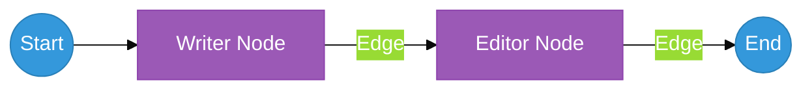

# Chapter 31: LangGraph State Machines — Beyond the Loop

<!--
METADATA
Phase: Phase 6: LangGraph
Time: 1.5 hours (45 minutes reading + 45 minutes hands-on)
Difficulty: ⭐⭐⭐
Type: Implementation / Workflow Orchestration
Prerequisites: Chapter 28 (OTAR Loop)
Builds Toward: Chapter 32 (Conditional Routing), Chapter 54 (Complete System)
Correctness Properties: [P38: State Transition validity, P42: Graph execution correctness]
Project Thread: WorkflowEngine - connects to Ch 32, 54

NAVIGATION
→ Quick Reference: #quick-reference-card
→ Verification: #verification
→ What's Next: #whats-next

TEMPLATE VERSION: v2.1 (2026-01-17)
ENHANCED VERSION: v8.0 (2026-02-15) - Action-First, Visuals, Mini-Projects
-->

---

## ☕ Coffee Shop Intro

Imagine you run a busy newspaper newsroom. 🗞️

You have a strict process: **Writer** -> **Editor** -> **Publisher**. If the Editor hates the draft, they send it *back* to the Writer. If they like it, they send it *forward* to the Publisher. Everyone knows their job, and the document moves along a defined path.

Standard Agents (Chapter 26) are like "Solo Freelancers." You give them a goal, and they figure it out themselves. But freelancers can be unpredictable—they might forget to check with the editor or skip a crucial step.

**LangGraph allows you to build the Newsroom.** It gives you a "Blueprint" (the Graph) where you define exactly who does what (Nodes) and where the work flows next (Edges). Today, you'll learn how to turn the chaos of AI into a deterministic, reliable workflow engine. Let's start building the assembly line! ⚙️🏗️

---

## Prerequisites Check

Before we dive in, ensure you have:

✅ **LangGraph Installed**: This is the core library for state machines.
```bash
pip install langgraph
```

✅ **State Knowledge**: You understand that a "State" is just a shared dictionary that everyone reads from and writes to.

---

## ⚡ Action: Run This First (5 min)

We're going to build a simple "Two-Step" graph where one node creates data and the next node processes it.

1.  **Create a file** named `first_graph.py`.
2.  **Paste and Run** this code:

```python
from typing import TypedDict
from langgraph.graph import StateGraph, END

# 1. Define the "Shared Clipboard" (State)
class AgentState(TypedDict):
    content: str
    revision: int

# 2. Define the Workers (Nodes)
def writer_node(state: AgentState):
    print("✍️  Node 1: Writing...")
    return {"content": "Hello from the Graph!", "revision": 1}

def editor_node(state: AgentState):
    print("🧐 Node 2: Editing...")
    return {"content": state["content"].upper(), "revision": state["revision"] + 1}

# 3. Assemble the Blueprint (Graph)
workflow = StateGraph(AgentState)
workflow.add_node("writer", writer_node)
workflow.add_node("editor", editor_node)

# 4. Define the Flow (Edges)
workflow.set_entry_point("writer")
workflow.add_edge("writer", "editor")
workflow.add_edge("editor", END)

# 5. Compile and Run
app = workflow.compile()
print("🔗 Running Graph...")
final_state = app.invoke({"content": "", "revision": 0})

print(f"\nFinal Content: {final_state['content']}")
print(f"Total Revisions: {final_state['revision']}")
```

**Expected Result**: You'll see the work passing from the "writer" to the "editor," and the final output will be in **ALL CAPS**. You just built your first deterministic AI workflow! 🚀

---

## 📺 Watch & Learn (Optional)

-   **LangChain**: [Introduction to LangGraph](https://www.youtube.com/watch?v=PqS1uCHquXs) (Official conceptual overview)
-   **DeepLearning.AI**: [AI Agents in LangGraph](https://www.youtube.com/learn/ai-agents-in-langgraph/) (Complete short course)

---

## Key Concepts Deep Dive

### Part 1: Nodes and Edges (The Map)

In LangGraph, we model our logic as a **Directed Acyclic Graph (DAG)** or a **State Machine**.
-   **Nodes**: These are your Python functions (the workers). They take the current state, do some work, and return an *update* to that state.
-   **Edges**: These are the arrows on the map. They define the path from one node to the next.
-   **Entry Point**: This is the "Start" button.


**Figure 31.1**: A Linear Workflow. This simple graph ensures that work always passes through the writer before reaching the editor.

### Part 2: The State (The Source of Truth)

The **State** is the most important concept in LangGraph. It is a single, shared object that all nodes can access. When a node returns a dictionary, LangGraph doesn't overwrite the whole state; it **merges** the update into the existing state. This allows multiple agents to collaborate on a single document without stepping on each other's toes.

---

### ⚠️ War Story: The Out-of-Order Agent

**The Setup**: A developer built a research agent that was supposed to: 1. Search Web, 2. Summarize, 3. Email Result. They used a simple loop (ReAct).
**The Error**: For some complex queries, the AI decided it was "smart enough" to skip the search and just summarized its own training data. 
**The Disaster**: The user got an email with outdated, hallucinated information because the AI ignored the process.
**The Fix**: **LangGraph**. By defining a strict graph where the `Summarizer` node is only reachable via the `Search` node, the developer **forced** the AI to follow the correct sequence. The AI could no longer choose to skip steps.

---

## 🔬 Try This! (Mini-Projects)

### Project 1: The "Greeting & Polishing" Team (20 min)

**Objective**: Build a 3-node graph.
**Difficulty**: Beginner

**Requirements**:
1.  Node 1 (`Greeter`): Returns `{"msg": "hello world"}`.
2.  Node 2 (`Capitalizer`): Turns the message into `HELLO WORLD`.
3.  Node 3 (`Exclaimer`): Adds `!!!` to the end.
4.  Verify the final state is `HELLO WORLD!!!`.

**Starter Code**:
```python
# TODO: add_node("greeter", ...)
# TODO: add_node("capitalizer", ...)
# TODO: add_node("exclaimer", ...)
# TODO: set_entry_point("greeter")
```

---

### Project 2: The Revision Loop (45 min)

**Objective**: Use a loop to improve quality.
**Difficulty**: Intermediate

**Requirements**:
1.  Node 1 (`Generator`): Adds 1 to a `count` variable in the state.
2.  Node 2 (`Reviewer`): Checks if `count` is less than 3.
3.  **Edge**: If count < 3, send the work BACK to the `Generator`. If count >= 3, go to `END`.
4.  Print the state after each step to see the loop in action.

**Starter Code**:
```python
# TODO: workflow.add_edge("reviewer", "generator") # This creates the loop!
```

---

## 🧠 Interview Corner

**Q1: Why use LangGraph instead of just calling Python functions in a standard `for` loop?**
*Answer*: 
1.  **Observability**: LangGraph creates a formal record of every transition, making it easy to visualize and debug.
2.  **Persistence**: LangGraph can automatically save the "state" to a database at every step, allowing you to pause a long-running workflow and resume it days later.
3.  **Cyclic Logic**: It handles loops (cycles) natively, which are difficult to manage in standard DAG-based frameworks like Airflow or basic LangChain chains.

**Q2: What is a "State Schema" in LangGraph?**
*Answer*: It is the definition of the data structure (usually a `TypedDict` or `Pydantic` model) that will be passed between nodes. It acts as the "Contract" for the graph—every node knows exactly what data it will receive and what data it is expected to return.

**Q3: What does the `compile()` method do in LangGraph?**
*Answer*: The `compile()` method validates your graph (checking for dead ends or missing entry points) and transforms your Python definitions into a highly optimized runtime object. Once compiled, the graph can be treated as a standard LangChain "Runnable" and used with `invoke()`, `stream()`, or `batch()`.

---

## Summary

1.  **Graphs are Blueprints**: They define the "Rules of Engagement" for your AI.
2.  **Nodes are Workers**: Standard Python functions that update the shared state.
3.  **Edges are Paths**: They define how data moves through the system.
4.  **State is the Clipboard**: A shared memory space that stores all progress.
5.  **Deterministic AI**: Graphs force models to follow a specific process, reducing unpredictability.
6.  **Cycles for Improvement**: Use loops to let agents review and refine their work.
7.  **Compile for Validation**: LangGraph catches errors in your process before you run them.

**Key Takeaway**: Don't hope the agent follows the process. **Code the process** into a graph.

**What's Next?**
Our nodes currently follow a fixed path. But what if we want the AI to *decide* which path to take? 🚦 In **Chapter 32: Conditional Routing**, we'll learn how to build "Traffic Controller" nodes that route work based on logic! 🚀🏆
