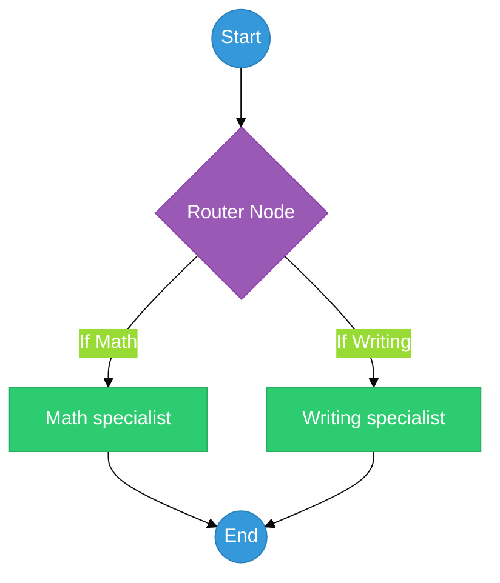

# Chapter 32: Conditional Routing — The Fork in the Road

<!--
METADATA
Phase: Phase 6: LangGraph
Time: 1.5 hours (45 minutes reading + 45 minutes hands-on)
Difficulty: ⭐⭐⭐
Type: Implementation / System Design
Prerequisites: Chapter 31 (LangGraph State Machines)
Builds Toward: Chapter 33 (Human-in-the-Loop), Chapter 54 (Complete System)
Correctness Properties: [P43: Routing condition evaluation, P44: Branch coverage]
Project Thread: TrafficController - connects to Ch 33, 54

NAVIGATION
→ Quick Reference: #quick-reference-card
→ Verification: #verification
→ What's Next: #whats-next

TEMPLATE VERSION: v2.1 (2026-01-17)
ENHANCED VERSION: v8.0 (2026-02-15) - Action-First, Visuals, Mini-Projects
-->

---

## ☕ Coffee Shop Intro

Imagine you walk into a hospital. You don't just walk into a random room and hope for the best. You go to the **Triage Desk**. 🏥🚦

The nurse asks, *"What's wrong?"* If your arm is broken, they send you to **X-Ray**. If you have a high fever, they send you to **General Medicine**. The hospital is a team of specialists, and the triage nurse is the "Router" who ensures you get to the right expert.

**Conditional Routing is the Triage Desk for your AI.** Instead of one giant, expensive agent trying to do everything (writing poems, calculating taxes, searching legal files), we build **Specialists**. The Router analyzes the user's request and sends them down the perfect path. Today, you'll learn how to build an intelligent traffic controller that makes your AI systems 10x more reliable. Let's build the switchboard! 🚦🎛️

---

## Prerequisites Check

Before we dive in, ensure you have:

✅ **LangGraph Basics**: You know how to define nodes and edges (Chapter 31).
✅ **Structured Output**: You know how to force an LLM to return a specific key (Chapter 11).

---

## ⚡ Action: Run This First (5 min)

We're going to build a "Routing Node" that sends a user to either a "Math" department or a "Writing" department based on their intent.

1.  **Create a file** named `quick_router.py`.
2.  **Paste and Run** this code:

```python
from typing import TypedDict, Literal
from langgraph.graph import StateGraph, END
from langchain_openai import ChatOpenAI
from langchain_core.pydantic_v1 import BaseModel, Field
from dotenv import load_dotenv

load_dotenv()

# 1. Define the State and the Router's Output
class AgentState(TypedDict):
    query: str
    department: str

class RouteChoice(BaseModel):
    choice: Literal["math", "writing"] = Field(description="The department to route to")

# 2. Setup the "Triage Nurse" (Router)
model = ChatOpenAI(model="gpt-4o-mini", temperature=0)
structured_llm = model.with_structured_output(RouteChoice)

def router_node(state: AgentState):
    print(f"🚦 Triage: Analyzing '{state['query']}'")
    decision = structured_llm.invoke(state["query"])
    return {"department": decision.choice}

# 3. Define the Workers
def math_worker(state: AgentState):
    print("🔢 Math Dept: Calculating...")
    return {"department": "math"}

def writing_worker(state: AgentState):
    print("✍️  Writing Dept: Composing...")
    return {"department": "writing"}

# 4. Build the Graph
workflow = StateGraph(AgentState)
workflow.add_node("math", math_worker)
workflow.add_node("writing", writing_worker)

# Logic: Start at the router, then jump to the chosen node
def route_logic(state: AgentState):
    return state["department"]

workflow.set_conditional_entry_point(
    router_node,
    {
        "math": "math",
        "writing": "writing"
    }
)
workflow.add_edge("math", END)
workflow.add_edge("writing", END)

app = workflow.compile()

# 5. Test it
print("--- Run 1 ---")
app.invoke({"query": "What is 55 * 12?"})
print("\n--- Run 2 ---")
app.invoke({"query": "Write a short story about a brave toaster."})
```

**Expected Result**: The console will show the "Triage" identifying the intent and then handing off the work to the correct specialized department. 🚀

---

## 📺 Watch & Learn (Optional)

-   **LangChain**: [How to use Conditional Edges](https://www.youtube.com/watch?v=UVn2ID7_Atc) (Official documentation)
-   **Rabbit Hole**: [Multi-Agent Routing Patterns](https://www.youtube.com/watch?v=S_An99V9mFM) (Conceptual walkthrough)

---

## Key Concepts Deep Dive

### Part 1: The Classifier (The Switch)

A router is essentially a **Classifier**. Its only job is to look at the input and pick a category. In LangGraph, we implement this using `add_conditional_edges` or `set_conditional_entry_point`. This allows the graph to "fork" in different directions depending on the data in the state.


**Figure 32.1**: The Conditional Fork. The system analyzes the user intent and routes the state to the most appropriate processing node.

### Part 2: Specialization over Generalization

Why not just use one big agent? 
1.  **Context Window**: A specialist only needs tools relevant to its job, saving space.
2.  **Accuracy**: A math-only prompt is less likely to start writing poetry by accident.
3.  **Cost**: You can use a tiny, cheap model for the Router and a massive, smart model for the Expert.

---

### ⚠️ War Story: The Confused Polymath

**The Setup**: A developer built a "Legal & HR" bot for a large company. It had 100 tools, ranging from "Search Payroll" to "Generate Legal Disclaimer."
**The Error**: When a user asked about "Contract termination," the AI got confused between the "Legal" tool and the "HR" tool. 
**The Disaster**: The AI called the "Search Payroll" tool by mistake, exposing sensitive salary data to someone who shouldn't have seen it.
**The Fix**: **Conditional Routing**. The developer built a strict Router that separated the "Legal Brain" from the "HR Brain." The Legal agent literally didn't have access to the Payroll tool, making the security breach impossible.

---

## 🔬 Try This! (Mini-Projects)

### Project 1: The "Sentiment" Sorter (20 min)

**Objective**: Route a user based on their mood.
**Difficulty**: Beginner

**Requirements**:
1.  Node 1 (`Angry`): Returns *"I'm so sorry, let me fix that for you."*
2.  Node 2 (`Happy`): Returns *"Glad you're having a great day!"*
3.  **Router**: Analyzes the input sentiment and routes accordingly.
4.  Test with: *"I HATE this product!"* and *"I love this!"*

**Starter Code**:
```python
class Sentiment(BaseModel):
    mood: Literal["angry", "happy"]
# TODO: Implement nodes and conditional entry
```

---

### Project 2: The Multi-Lingual Receptionist (45 min)

**Objective**: Route users to different agents based on their language.
**Difficulty**: Intermediate

**Requirements**:
1.  Router detects if the language is English or Spanish.
2.  Node `EN_Agent`: Responds in English.
3.  Node `ES_Agent`: Responds in Spanish.
4.  Verify that if you type *"Hola"*, the `ES_Agent` node is the one that executes.

**Starter Code**:
```python
# TODO: Use structured output to detect 'language'
```

---

## 🧠 Interview Corner

**Q1: What is the difference between a "Standard Edge" and a "Conditional Edge" in LangGraph?**
*Answer*: A **Standard Edge** always goes from Node A to Node B (a fixed path). A **Conditional Edge** uses a Python function to look at the current state and *choose* the destination (a dynamic path). This is the key to building adaptive AI systems.

**Q2: How do you handle "Unknown" categories in a router?**
*Answer*: You should always have a **Fallback** or "General" destination. In your Pydantic model and your edge map, include an "other" or "general" key. If the LLM is unsure, it defaults to that path, preventing the graph from crashing or going down a wrong, specialized path.

**Q3: Is it better to route based on Keywords or an LLM call?**
*Answer*: Keywords are faster and cheaper (e.g., `if "tax" in query`), but they are brittle and fail on context. LLM-based routing is slower but far more robust—it can understand that "the green stuff in my wallet" means "money" and route to the Financial node correctly.

---

## Summary

1.  **Triage First**: Use routers to split complex goals into specialized tasks.
2.  **Specialists are Safer**: Specialized agents have fewer tools and fewer ways to fail.
3.  **Conditional Edges**: The mechanism for building "If/Then" logic into your AI graphs.
4.  **Structured Output**: Always use Pydantic to ensure the router returns a valid path.
5.  **Start at the Switch**: `set_conditional_entry_point` allows the graph to begin with a decision.
6.  **Model Tiering**: Use small models for routing and large models for expert tasks.
7.  **Fallback is Mandatory**: Always have a "General" path for queries that don't fit a category.

**Key Takeaway**: Don't build a Swiss Army Knife. Build a **Toolbox** and a **Hand** that picks the right tool.

**What's Next?**
Your graph can now make decisions. But what if the decision is too risky for an AI? 🛑 In **Chapter 33: Human-in-the-Loop**, we'll learn how to make the graph pause and wait for a human to hit "Approve"! 🚀🏆
