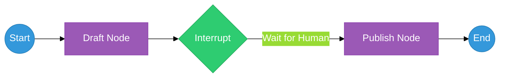

# Chapter 33: Human-in-the-Loop Workflows — The Supervisor

<!--
METADATA
Phase: Phase 6: LangGraph
Time: 1.5 hours (45 minutes reading + 45 minutes hands-on)
Difficulty: ⭐⭐⭐
Type: Implementation / Safety
Prerequisites: Chapter 31 (LangGraph State Machines)
Builds Toward: Chapter 34 (Persistent State), Chapter 54 (Complete System)
Correctness Properties: [P45: State Persistence, P46: Resume Correctness]
Project Thread: HumanSupervisor - connects to Ch 34, 54

NAVIGATION
→ Quick Reference: #quick-reference-card
→ Verification: #verification
→ What's Next: #whats-next

TEMPLATE VERSION: v2.1 (2026-01-17)
ENHANCED VERSION: v8.0 (2026-02-15) - Action-First, Visuals, Mini-Projects
-->

---

## ☕ Coffee Shop Intro

Imagine you're teaching a teenager how to drive. 🚗 🛑

Do you hand them the keys, wish them luck, and tell them to come home in 5 hours? Of course not. You sit in the passenger seat. You have your own brake pedal. If they try to merge into a semi-truck, you **Intervene**. You grab the wheel, hit the brakes, and explain why that was a bad idea.

AI is like that teenager. It's smart, fast, and capable, but sometimes it hallucinates or tries to "merge" your production database into a trash can. **Human-in-the-Loop (HITL)** puts you in the passenger seat. Today, you'll learn how to build a safety system that pauses the AI right before it performs a high-stakes action, waits for your "OK," and even lets you rewrite its "thoughts" before they become reality. Let's put a human in charge! 👨‍💼🦾

---

## Prerequisites Check

Before we dive in, ensure you have:

✅ **LangGraph Mastery**: You know how to build a basic graph with nodes and edges (Chapter 31).
✅ **State Knowledge**: You understand that the graph's memory is stored in a shared dictionary.

---

## ⚡ Action: Run This First (5 min)

We're going to build a "Draft & Publish" graph that physically **stops** and waits for your permission before printing the final result.

1.  **Create a file** named `human_gate.py`.
2.  **Paste and Run** this code:

```python
from typing import TypedDict
from langgraph.graph import StateGraph, END
from langgraph.checkpoint.memory import MemorySaver

# 1. Define the State
class AgentState(TypedDict):
    content: str

# 2. Define the Workers
def draft_node(state: AgentState):
    print("✍️  AI: Drafting content...")
    return {"content": "AI says: Python is a type of snake."}

def publish_node(state: AgentState):
    print(f"🚀 PUBLISHED: {state['content']}")
    return {}

# 3. Build Graph with an INTERRUPT
builder = StateGraph(AgentState)
builder.add_node("draft", draft_node)
builder.add_node("publish", publish_node)
builder.set_entry_point("draft")
builder.add_edge("draft", "publish")
builder.add_edge("publish", END)

# Memory is required for HITL!
memory = MemorySaver()
# interrupt_before=["publish"] is the brake pedal
app = builder.compile(checkpointer=memory, interrupt_before=["publish"])

# 4. Run the first half
config = {"configurable": {"thread_id": "session_1"}}
print("🔗 Starting workflow...")
app.invoke({"content": ""}, config=config)

print("\n🛑 The graph is now PAUSED.")
print("Next expected step:", app.get_state(config).next)

# 5. Manual Resume (Simulation of Human Clicking 'Approve')
input("\n[PRESS ENTER TO APPROVE AND FINISH]")
app.invoke(None, config=config)
```

**Expected Result**: The script will print *"AI: Drafting content..."* and then just sit there. It will only print *"PUBLISHED"* **after** you press Enter. You just successfully "paused" an AI in mid-thought! 🚀

---

## 📺 Watch & Learn (Optional)

-   **LangChain**: [Human-in-the-loop with LangGraph](https://www.youtube.com/watch?v=LknS_ESwS_8) (Technical walkthrough)
-   **Andrew Ng**: [The Power of Human-in-the-loop](https://www.youtube.com/watch?v=sal78ACtGTc) (Strategic value of HITL)

---

## Key Concepts Deep Dive

### Part 1: Checkpoints (Saving the Game)

To pause a program and resume it later (perhaps hours later when the human wakes up), we need to save the graph's entire brain to disk. This is called a **Checkpoint**. 
-   **Thread ID**: A unique identifier (like a "Save Slot") that tells the system which specific conversation to reload.
-   **MemorySaver**: A simple in-memory database. In production, we swap this for a real database like **SQLite** or **PostgreSQL**.

### Part 2: The Interrupt (The Brake Pedal)

In LangGraph, we can set two types of "Brakes":
1.  **interrupt_before**: Stop *before* a specific node runs. (Best for "Approving" an action).
2.  **interrupt_after**: Stop *after* a node finishes. (Best for "Reviewing" a result).


**Figure 33.1**: The HITL Flow. The "Gate" represents a hard stop in the code execution that can only be cleared by a specific manual command or update.

---

### ⚠️ War Story: The Viral Disaster

**The Setup**: A startup built an AI agent that automatically replied to angry customers on Twitter to "de-escalate" situations. 
**The Error**: An angry customer used sarcasm. The AI didn't catch it and replied with an even more sarcastic, insulting joke. 
**The Disaster**: The bot's reply went viral for all the wrong reasons. The company's stock dropped 5% in a day, and they had to issue a public apology. 
**The Fix**: **Human-in-the-Loop**. They added an `interrupt_before=["post_reply"]`. Now, a human agent sees the draft, laughs at it, deletes it, and writes a professional response instead.

---

## 🔬 Try This! (Mini-Projects)

### Project 1: The "Hacker" Override (30 min)

**Objective**: Reach into the AI's brain and change its answer while it's paused.
**Difficulty**: Beginner

**Requirements**:
1.  Run the `human_gate.py` script.
2.  When the script pauses, use `app.update_state()` to change the `"content"` key to *"Human says: I am the captain now."*
3.  Resume the graph.
4.  Verify the final "PUBLISHED" output is your human text, not the AI's original draft.

**Starter Code**:
```python
# While paused:
app.update_state(config, {"content": "MY NEW TEXT"})
# Then:
app.invoke(None, config=config)
```

---

### Project 2: The Multi-Step Review (45 min)

**Objective**: Build a graph that stops at TWO different points.
**Difficulty**: Intermediate

**Requirements**:
1.  Node 1: Research. Node 2: Write. Node 3: Post.
2.  Interrupt **after** Research (to verify the facts).
3.  Interrupt **before** Post (to approve the final text).
4.  Verify you can resume twice to finish the workflow.

**Starter Code**:
```python
app = builder.compile(
    checkpointer=memory, 
    interrupt_after=["research"], 
    interrupt_before=["post"]
)
```

---

## 🧠 Interview Corner

**Q1: What is the primary purpose of a `thread_id` in a human-in-the-loop system?**
*Answer*: The `thread_id` is the "Session Key." Since a human might take 10 minutes or 10 hours to reply, the server needs a way to store the AI's state in a database and find it again when the human finally hits "Approve." Without a `thread_id`, the system would lose its place and have to start from the beginning.

**Q2: What is the difference between `invoke(input)` and `invoke(None)`?**
*Answer*: `invoke(input)` starts a new execution or sends new data into the graph. `invoke(None)` tells LangGraph to *"Look at the saved checkpoint for this thread and continue from exactly where you stopped."* This is the standard way to "unpause" a HITL workflow.

**Q3: When should you use `update_state`?**
*Answer*: Use `update_state` when the human wants to **edit** the AI's work before it proceeds. For example, if an AI generates a legal contract with a wrong date, the human can call `update_state` to fix the date in the graph's memory so that the final "Save to PDF" node uses the correct information.

---

## Summary

1.  **Safety First**: High-stakes actions (spending money, posting public text) should always have a human gate.
2.  **Checkpoints are Save-Points**: Use a `MemorySaver` or database to store the state during a pause.
3.  **Thread IDs**: Every conversation needs a unique ID to manage its memory slot.
4.  **Interrupts**: Use `interrupt_before` to stop execution and wait for permission.
5.  **None is Continue**: Use `app.invoke(None)` to resume a paused graph.
6.  **Update State**: You can manually change the values in the AI's brain while it is sleeping.
7.  **Time Travel**: Checkpoints allow you to see the history of the state at every step.

**Key Takeaway**: A human-in-the-loop system turns an "Autonomous Agent" into a **Powerful Assistant**.

**What's Next?**
We can pause and edit. But if our computer crashes, our "MemorySaver" is wiped out. 💻🔥 In **Chapter 34: Persistent State with Checkpoints**, we'll learn how to save our AI's brain to a real database so it can survive a reboot! 🚀🏆
