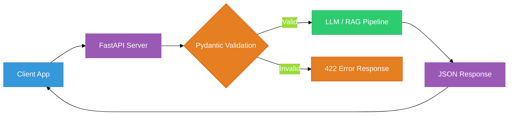
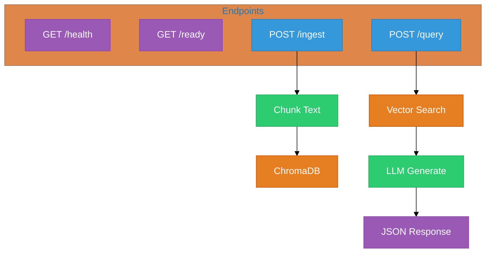

# Chapter 41B: FastAPI for AI Services — The API Layer

<!--
METADATA
Phase: Phase 8: Production
Time: 1.5 hours (40 minutes reading + 50 minutes hands-on)
Difficulty: ⭐⭐⭐
Type: Implementation / Deployment
Prerequisites: Chapter 12A (Async/Await), Chapter 11 (Structured Output)
Builds Toward: Chapter 41C (Docker), Chapter 54 (Complete System)
Correctness Properties: [P57: API Correctness, P58: Streaming Integrity]
Project Thread: Production - connects to Ch 41C, 42, 54

NAVIGATION
→ Quick Reference: #quick-reference-card
→ Verification: #verification
→ What's Next: #whats-next

TEMPLATE VERSION: v2.1 (2026-01-17)
ENHANCED VERSION: v9.0 (2026-02-20) - New Chapter
-->

---

## Coffee Shop Intro

You've built a RAG system. It works beautifully... on your laptop. In a Jupyter notebook. When *you* run it.

Now your teammate wants to use it. Your mobile app needs to call it. Your frontend developer wants to stream responses to the browser. Your DevOps engineer needs a health check endpoint for Kubernetes.

**Your AI model needs a front door.** That front door is a REST API.

**Analogy: Restaurant Kitchen vs. Restaurant** 🍽️
- Your RAG pipeline is the **kitchen** — it does the cooking.
- FastAPI is the **restaurant** — it takes orders (HTTP requests), sends them to the kitchen, and serves the food (responses) to customers. Without the restaurant, your amazing kitchen only feeds the chef.

Today, you'll wrap your AI systems in production-grade APIs — with streaming, validation, rate limiting, and health checks. Let's open the restaurant! 🚀

---

## Prerequisites Check

Before we dive in, ensure you have:

✅ **Async/Await**: You understand `async def` and `await` (Chapter 12A).
✅ **Pydantic**: You've used Pydantic models for validation (Chapter 3).
✅ **FastAPI installed**:
```bash
pip install "fastapi[standard]" uvicorn python-dotenv
```

---

## Action: Run This First (5 min)

We're going to create a working AI API in under 30 lines.

1.  **Create a file** named `ai_api.py`.
2.  **Paste and Run** this code:

```python
from fastapi import FastAPI
from pydantic import BaseModel
from openai import OpenAI
from dotenv import load_dotenv

load_dotenv()

app = FastAPI(title="My AI API")
client = OpenAI()


class QueryRequest(BaseModel):
    question: str
    max_tokens: int = 200


class QueryResponse(BaseModel):
    answer: str
    tokens_used: int


@app.post("/ask", response_model=QueryResponse)
async def ask(request: QueryRequest):
    response = client.chat.completions.create(
        model="gpt-4o-mini",
        messages=[{"role": "user", "content": request.question}],
        max_tokens=request.max_tokens,
    )
    return QueryResponse(
        answer=response.choices[0].message.content,
        tokens_used=response.usage.total_tokens,
    )
```

3.  **Start the server**:
```bash
uvicorn ai_api:app --reload
```

4.  **Test it** — open `http://127.0.0.1:8000/docs` in your browser. You'll see an interactive Swagger UI. Click "Try it out" on the `/ask` endpoint and send a question.

**Expected Result**: You get a JSON response with the AI's answer and token count. Your AI now has a REST API! Anyone on your network can call it.

---

## Watch & Learn (Optional)

-   **Sebastián Ramírez (FastAPI creator)**: [FastAPI Tutorial](https://www.youtube.com/watch?v=0RS9W8MtZe4) (Fundamentals)
-   **Patrick Loeber**: [Deploy ML Models with FastAPI](https://www.youtube.com/watch?v=h5wLuVDr0oc) (AI-specific patterns)

---

## Key Concepts Deep Dive

### Part 1: FastAPI Fundamentals for AI (~8 min)

FastAPI is the go-to framework for AI services because of three properties:

| Property | Why It Matters for AI |
|----------|----------------------|
| **Async-native** | LLM API calls take 1-30 seconds. Async lets your server handle other requests while waiting. |
| **Pydantic-native** | You already use Pydantic for structured output. FastAPI uses the same models for request validation. |
| **Auto-documentation** | Swagger UI is auto-generated. Your frontend team gets interactive docs for free. |


**Figure 41B.1**: FastAPI as the bridge between clients and your AI pipeline. Pydantic validates every request before it reaches your expensive LLM calls.

### The Async Advantage

Synchronous servers block on every LLM call. If your LLM takes 5 seconds and you have 10 concurrent users, user #10 waits 50 seconds. Async servers handle all 10 concurrently:

```python
# ❌ Synchronous - blocks the entire server during LLM call
@app.post("/ask-sync")
def ask_sync(request: QueryRequest):
    response = client.chat.completions.create(...)  # Blocks 5 seconds
    return {"answer": response.choices[0].message.content}


# ✅ Async - server handles other requests while waiting
@app.post("/ask-async")
async def ask_async(request: QueryRequest):
    # Use the async client for true async behavior
    response = await async_client.chat.completions.create(...)  # Non-blocking
    return {"answer": response.choices[0].message.content}
```

> **Important**: To get true async behavior with OpenAI, use `AsyncOpenAI`:
> ```python
> from openai import AsyncOpenAI
> async_client = AsyncOpenAI()
> ```

---

### Part 2: RAG API Endpoints (~10 min)

A production RAG service typically has these endpoints:

```python
from fastapi import FastAPI, HTTPException, BackgroundTasks
from pydantic import BaseModel, Field
from openai import AsyncOpenAI
from dotenv import load_dotenv
import chromadb
import hashlib
import time

load_dotenv()

app = FastAPI(
    title="RAG Service API",
    description="Production RAG system with query and ingestion endpoints",
    version="1.0.0",
)

async_client = AsyncOpenAI()
chroma = chromadb.Client()
collection = chroma.get_or_create_collection("documents")


# --- Request/Response Models ---

class IngestRequest(BaseModel):
    text: str = Field(..., min_length=10, description="Document text to ingest")
    source: str = Field(..., description="Source identifier (e.g., filename)")
    metadata: dict = Field(default_factory=dict)


class IngestResponse(BaseModel):
    document_id: str
    chunks_created: int
    status: str


class RAGQueryRequest(BaseModel):
    question: str = Field(..., min_length=3)
    top_k: int = Field(default=3, ge=1, le=10)


class RAGQueryResponse(BaseModel):
    answer: str
    sources: list[str]
    latency_ms: float


# --- Health Check ---

@app.get("/health")
async def health():
    """Liveness probe for Kubernetes/Docker."""
    return {"status": "healthy", "model": "gpt-4o-mini"}


@app.get("/ready")
async def readiness():
    """Readiness probe — checks that dependencies are reachable."""
    try:
        collection.count()
        return {"status": "ready", "documents": collection.count()}
    except Exception as e:
        raise HTTPException(status_code=503, detail=f"Not ready: {e}")


# --- Ingestion ---

@app.post("/ingest", response_model=IngestResponse)
async def ingest_document(request: IngestRequest):
    """Ingest a document into the RAG vector store."""
    doc_id = hashlib.sha256(request.text.encode()).hexdigest()[:12]

    # Simple chunking (in production, use RecursiveCharacterTextSplitter)
    chunk_size = 500
    chunks = [
        request.text[i : i + chunk_size]
        for i in range(0, len(request.text), chunk_size)
    ]

    collection.add(
        documents=chunks,
        ids=[f"{doc_id}_{i}" for i in range(len(chunks))],
        metadatas=[{"source": request.source, **request.metadata}] * len(chunks),
    )

    return IngestResponse(
        document_id=doc_id,
        chunks_created=len(chunks),
        status="indexed",
    )


# --- Query ---

@app.post("/query", response_model=RAGQueryResponse)
async def query_rag(request: RAGQueryRequest):
    """Query the RAG system."""
    start = time.perf_counter()

    # Retrieve
    results = collection.query(
        query_texts=[request.question], n_results=request.top_k
    )

    if not results["documents"][0]:
        raise HTTPException(status_code=404, detail="No documents found")

    context = "\n\n".join(results["documents"][0])
    sources = [m["source"] for m in results["metadatas"][0]]

    # Generate
    response = await async_client.chat.completions.create(
        model="gpt-4o-mini",
        messages=[
            {
                "role": "system",
                "content": "Answer using ONLY the provided context. Cite sources.",
            },
            {
                "role": "user",
                "content": f"Context:\n{context}\n\nQuestion: {request.question}",
            },
        ],
    )

    latency = (time.perf_counter() - start) * 1000

    return RAGQueryResponse(
        answer=response.choices[0].message.content,
        sources=list(set(sources)),
        latency_ms=round(latency, 1),
    )
```


**Figure 41B.2**: RAG API Architecture. Four endpoints cover the full lifecycle: health monitoring, document ingestion, and query serving.

---

### Part 3: Streaming with Server-Sent Events (SSE) (~10 min)

Users expect to see tokens appear one-by-one, like ChatGPT. This is **Server-Sent Events (SSE)** — a simple protocol where the server pushes data to the client as it arrives.

```python
from fastapi import FastAPI
from fastapi.responses import StreamingResponse
from openai import AsyncOpenAI
from pydantic import BaseModel
import json

app = FastAPI()
async_client = AsyncOpenAI()


class StreamRequest(BaseModel):
    question: str
    model: str = "gpt-4o-mini"


async def stream_tokens(question: str, model: str):
    """Generator that yields SSE-formatted token events."""
    response = await async_client.chat.completions.create(
        model=model,
        messages=[{"role": "user", "content": question}],
        stream=True,
    )

    async for chunk in response:
        if chunk.choices[0].delta.content:
            token = chunk.choices[0].delta.content
            # SSE format: "data: {json}\n\n"
            yield f"data: {json.dumps({'token': token})}\n\n"

    # Signal end of stream
    yield f"data: {json.dumps({'done': True})}\n\n"


@app.post("/stream")
async def stream_response(request: StreamRequest):
    """Stream LLM response token-by-token via SSE."""
    return StreamingResponse(
        stream_tokens(request.question, request.model),
        media_type="text/event-stream",
    )
```

**Testing SSE from the command line**:
```bash
curl -N -X POST http://127.0.0.1:8000/stream \
  -H "Content-Type: application/json" \
  -d '{"question": "Explain RAG in 3 sentences"}'
```

You'll see tokens appear one by one:
```
data: {"token": "RAG"}
data: {"token": " stands"}
data: {"token": " for"}
...
data: {"done": true}
```

---

### Part 4: Production Middleware (~8 min)

A production API needs more than endpoints. It needs **middleware** — code that runs on every request/response:

```python
from fastapi import FastAPI, Request
from fastapi.middleware.cors import CORSMiddleware
import time
import logging

app = FastAPI()

# --- CORS (Cross-Origin Resource Sharing) ---
# Allows your frontend (on port 3000) to call your API (on port 8000)
app.add_middleware(
    CORSMiddleware,
    allow_origins=["http://localhost:3000"],  # Your frontend URL
    allow_methods=["*"],
    allow_headers=["*"],
)


# --- Request Logging ---
@app.middleware("http")
async def log_requests(request: Request, call_next):
    start = time.perf_counter()
    response = await call_next(request)
    duration = (time.perf_counter() - start) * 1000

    logging.info(
        f"{request.method} {request.url.path} → {response.status_code} ({duration:.0f}ms)"
    )
    return response


# --- Simple Rate Limiting ---
from collections import defaultdict
from datetime import datetime, timedelta

rate_limit_store: dict[str, list[datetime]] = defaultdict(list)
RATE_LIMIT = 10  # requests per minute


@app.middleware("http")
async def rate_limit(request: Request, call_next):
    client_ip = request.client.host
    now = datetime.now()
    window_start = now - timedelta(minutes=1)

    # Clean old entries
    rate_limit_store[client_ip] = [
        t for t in rate_limit_store[client_ip] if t > window_start
    ]

    if len(rate_limit_store[client_ip]) >= RATE_LIMIT:
        from fastapi.responses import JSONResponse
        return JSONResponse(
            status_code=429,
            content={"detail": "Rate limit exceeded. Try again in 1 minute."},
        )

    rate_limit_store[client_ip].append(now)
    return await call_next(request)
```

> **In production**, use a proper rate limiter like `slowapi` or a reverse proxy (Nginx, Traefik) for rate limiting. The in-memory approach above works for development but doesn't survive restarts or scale across multiple server instances.

### API Key Authentication

```python
from fastapi import Security, HTTPException
from fastapi.security import APIKeyHeader
import os

api_key_header = APIKeyHeader(name="X-API-Key")


async def verify_api_key(api_key: str = Security(api_key_header)):
    """Validate the API key from the request header."""
    if api_key != os.getenv("API_KEY"):
        raise HTTPException(status_code=403, detail="Invalid API key")
    return api_key


# Apply to specific endpoints:
@app.post("/query", dependencies=[Security(verify_api_key)])
async def query_rag(request: RAGQueryRequest):
    ...
```

---

## Checkpoint (~1 min)

You now have the four pillars of a production AI API: **endpoints** (Part 1-2), **streaming** (Part 3), and **middleware** (Part 4). These patterns apply to any AI service — RAG, agents, fine-tuned models, image generation.

**If this is clear**: Move to the mini-projects to build a complete, deployable API.
**If this feels fuzzy**: Re-read Part 2's RAG endpoint code. Focus on how `IngestRequest` and `RAGQueryResponse` mirror the function inputs/outputs you've been using in Jupyter notebooks — the only difference is HTTP wrapping.

---

## Try This! (Mini-Projects)

### Project 1: RAG API (30 min)

**Objective**: Wrap your Chapter 22 RAG system in a FastAPI service.
**Difficulty**: Intermediate

**Requirements**:
1. Create `/query` and `/ingest` endpoints from Part 2.
2. Use `AsyncOpenAI` for all LLM calls.
3. Add the `/health` and `/ready` endpoints.
4. Test all endpoints using the Swagger UI at `/docs`.
5. Ingest a real document (e.g., a Wikipedia article) and query it.

<details>
<summary>Hints</summary>

- Copy the Part 2 code as your starting point.
- For a real document, use `requests.get("https://en.wikipedia.org/w/api.php?action=query&prop=extracts&explaintext&titles=Python_(programming_language)&format=json")` to fetch Wikipedia text.
- Test the `/ready` endpoint returns the document count after ingestion.

</details>

---

### Project 2: Streaming Endpoint (45 min)

**Objective**: Build a token-by-token streaming endpoint for your RAG system.
**Difficulty**: Intermediate-Advanced

**Requirements**:
1. Create a `/stream-query` endpoint that accepts a RAG question.
2. Retrieve relevant documents from ChromaDB.
3. Stream the LLM's answer token-by-token via SSE.
4. Include the retrieved sources in the final SSE event (after the `done` signal).
5. Test with `curl -N` and verify tokens appear progressively.

<details>
<summary>Hints</summary>

- Combine the `/query` retrieval logic from Part 2 with the SSE streaming from Part 3.
- Send sources as a separate final event: `data: {"sources": ["doc1.pdf", "doc2.pdf"]}\n\n`
- Use `curl -N -X POST ...` (the `-N` flag disables buffering so you see tokens live).

</details>

---

### Project 3: Production API with Auth (60 min)

**Objective**: Add API key auth, rate limiting, structured logging, and error handling.
**Difficulty**: Advanced

**Requirements**:
1. Add API key authentication using the `X-API-Key` header.
2. Add rate limiting (10 requests/minute per IP).
3. Add structured JSON logging for every request (method, path, status, latency).
4. Add proper error handling: return helpful error messages for invalid queries, missing documents, and LLM failures.
5. Test: verify that requests without an API key get 403, excessive requests get 429, and invalid inputs get 422.

<details>
<summary>Hints</summary>

- Use the middleware code from Part 4 as your starting point.
- For structured logging, use Python's `logging` with `json.dumps()` or the `structlog` library.
- For error handling, use FastAPI's `@app.exception_handler(Exception)` decorator.
- Store the API key in a `.env` file: `API_KEY=your-secret-key`.

</details>

---

## Interview Corner

**Q1: Why is FastAPI preferred over Flask for AI services?**

<details>
<summary>Answer</summary>

FastAPI is **async-native**, which is critical for AI services where LLM API calls take 1-30 seconds. Flask's synchronous model blocks the server during each call, meaning 10 concurrent users would wait sequentially. FastAPI handles them concurrently. Additionally, FastAPI's built-in Pydantic integration provides automatic request validation and Swagger documentation — both essential for production APIs.

</details>

**Q2: What is SSE and why is it used for LLM streaming?**

<details>
<summary>Answer</summary>

Server-Sent Events (SSE) is a protocol where the server pushes data to the client over a single HTTP connection. For LLMs, tokens are generated one-by-one — SSE lets you send each token as it's produced rather than waiting for the full response. This dramatically improves perceived latency (the user sees the first word in 200ms instead of waiting 5 seconds for the complete answer). SSE is simpler than WebSockets and sufficient for the one-directional server-to-client streaming that LLMs need.

</details>

**Q3: How do you handle long-running AI tasks (e.g., document ingestion) in a REST API?**

<details>
<summary>Answer</summary>

Use **background tasks** or a **task queue**. FastAPI's `BackgroundTasks` works for simple cases — the endpoint returns immediately with a task ID while processing continues in the background. For production scale, use Celery with Redis or RabbitMQ as the broker. The client polls a `/status/{task_id}` endpoint to check progress. Never block an HTTP request for more than 30 seconds — load balancers and proxies will timeout.

</details>

**Q4: What is the difference between liveness and readiness probes?**

<details>
<summary>Answer</summary>

**Liveness** (`/health`) answers "Is the server process alive?" — if it fails, the orchestrator (Kubernetes/Docker) restarts the container. It should always return 200 unless the process is truly dead. **Readiness** (`/ready`) answers "Can this server handle requests right now?" — if it fails, the orchestrator stops sending traffic to this instance but doesn't restart it. Use readiness to check that dependencies (database, vector store, LLM API) are reachable. A server can be alive but not ready (e.g., still loading models).

</details>

---

## Summary

1.  **FastAPI = The Front Door**: Wrap your AI pipelines in HTTP endpoints so any application can use them.
2.  **Async is Non-Negotiable**: Always use `AsyncOpenAI` and `async def` for LLM endpoints — synchronous servers bottleneck on every call.
3.  **Pydantic for Everything**: Request validation, response schemas, and API documentation all come from the same Pydantic models you already know.
4.  **SSE for Streaming**: Send tokens one-by-one to create the ChatGPT-like experience users expect.
5.  **Middleware Stack**: CORS + logging + rate limiting + auth — add these before deploying to any shared environment.
6.  **Health Probes**: Every production service needs `/health` (liveness) and `/ready` (readiness) endpoints.

**Key Takeaway**: Your AI system is only as useful as its API. A well-designed FastAPI layer turns a notebook experiment into a service that any application, team, or device can consume.

**What's Next?**
Your API runs locally. But how do you package it so it runs *anywhere* — on any machine, any cloud, any OS? In **Chapter 41C: Docker for AI Applications**, you'll containerize this entire stack into a portable, reproducible image! 📦🐳
