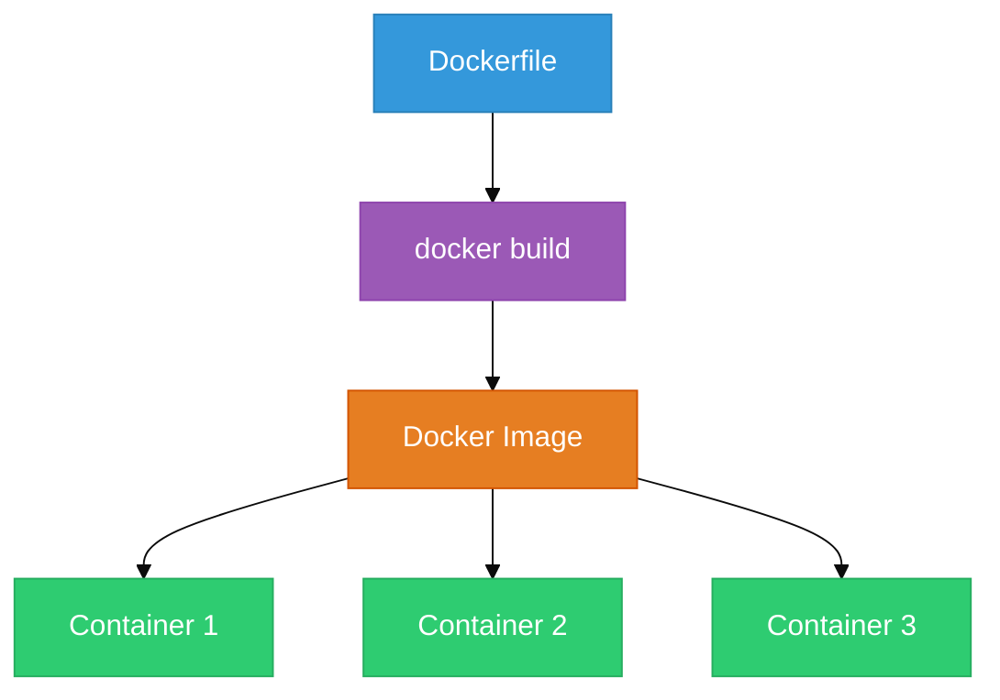
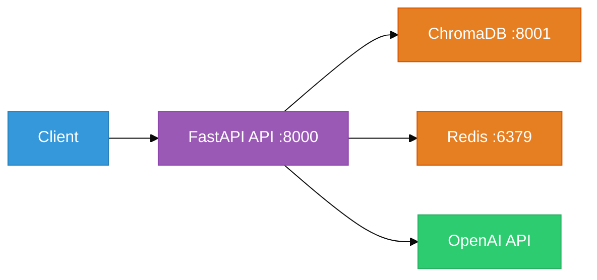

# Chapter 41C: Docker for AI Applications — The Shipping Container

<!--
METADATA
Phase: Phase 8: Production
Time: 1.0 hours (25 minutes reading + 35 minutes hands-on)
Difficulty: ⭐⭐⭐
Type: Implementation / DevOps
Prerequisites: Chapter 41B (FastAPI for AI Services)
Builds Toward: Chapter 54 (Complete System), Chapter 59 (Fine-Tuned Model Deployment)
Correctness Properties: [P59: Container Integrity, P60: Compose Orchestration]
Project Thread: Production - connects to Ch 54, 59

NAVIGATION
→ Quick Reference: #quick-reference-card
→ Verification: #verification
→ What's Next: #whats-next

TEMPLATE VERSION: v2.1 (2026-01-17)
ENHANCED VERSION: v9.0 (2026-02-20) - New Chapter
-->

---

## Coffee Shop Intro

Your FastAPI RAG service works perfectly on your laptop. You ship it to your colleague. They run it. It crashes.

*"I don't have Python 3.12." "My ChromaDB is a different version." "Where's the .env file?" "What's a virtual environment?"*

Sound familiar? This is the **"It works on my machine"** problem. It has plagued software engineering for decades, and it's *worse* for AI applications because they have heavy dependencies — Python versions, ML libraries, vector databases, model files.

**Analogy: Moving Houses vs. Shipping Containers** 📦
- **Without Docker** = Moving house by loading everything into random boxes. Half the stuff breaks, things get lost, and unpacking takes forever.
- **With Docker** = Packing your entire house into a standardized shipping container. Drop it anywhere in the world — the contents arrive intact, in the exact same arrangement.

Today, you'll package your entire AI stack into a container that runs identically on your laptop, your teammate's machine, AWS, or a Raspberry Pi. Let's build the box! 🐳

---

## Prerequisites Check

Before we dive in, ensure you have:

✅ **FastAPI Knowledge**: You've built the RAG API from Chapter 41B.
✅ **Docker Desktop installed**:
```bash
# Verify installation
docker --version
docker compose version
```
If you don't have Docker, install [Docker Desktop](https://www.docker.com/products/docker-desktop/) (free for personal use).

---

## Action: Run This First (5 min)

We're going to containerize a simple Python app in 3 steps.

1.  **Create a file** named `hello.py`:
```python
import sys
print(f"Hello from Docker! Python {sys.version}")
```

2.  **Create a file** named `Dockerfile` (no extension):
```dockerfile
FROM python:3.12-slim
COPY hello.py .
CMD ["python", "hello.py"]
```

3.  **Build and run**:
```bash
docker build -t hello-ai .
docker run hello-ai
```

**Expected Result**: `Hello from Docker! Python 3.12.x` — the same output regardless of what Python version you have installed locally. That's the magic.

---

## Watch & Learn (Optional)

-   **TechWorld with Nana**: [Docker in 1 Hour](https://www.youtube.com/watch?v=pg19Z8LL06w) (Comprehensive beginner guide)
-   **Patrick Loeber**: [Docker for Machine Learning](https://www.youtube.com/watch?v=0qG_0CPQhpg) (AI-specific patterns)

---

## Key Concepts Deep Dive

### Part 1: Docker Mental Model (~8 min)

Three concepts to understand:

| Concept | Analogy | What It Is |
|---------|---------|------------|
| **Image** | A recipe card | A read-only template with your code, dependencies, and OS. Built once. |
| **Container** | The cooked meal | A running instance of an image. You can run many containers from one image. |
| **Layer** | Recipe steps | Each `RUN`, `COPY`, or `ADD` instruction in a Dockerfile creates a cached layer. Change one step, and only that step (and subsequent ones) are rebuilt. |


**Figure 41C.1**: Image → Container relationship. One image produces many identical containers, each running in isolation.

---

### Part 2: Efficient Dockerfiles for AI (~10 min)

AI Dockerfiles have unique challenges: large dependency trees, model files, and slow builds. Here's a production-grade Dockerfile for your FastAPI RAG service:

```dockerfile
# ============================================
# Stage 1: Dependencies (cached aggressively)
# ============================================
FROM python:3.12-slim AS deps

WORKDIR /app

# Install system dependencies needed by some Python packages
RUN apt-get update && apt-get install -y --no-install-recommends \
    build-essential \
    && rm -rf /var/lib/apt/lists/*

# Copy ONLY requirements first (Docker caches this layer)
COPY requirements.txt .
RUN pip install --no-cache-dir -r requirements.txt

# ============================================
# Stage 2: Application (changes frequently)
# ============================================
FROM python:3.12-slim AS runtime

WORKDIR /app

# Copy installed packages from deps stage
COPY --from=deps /usr/local/lib/python3.12/site-packages /usr/local/lib/python3.12/site-packages
COPY --from=deps /usr/local/bin /usr/local/bin

# Copy application code
COPY . .

# Environment variables
ENV PYTHONUNBUFFERED=1
ENV PORT=8000

# Health check
HEALTHCHECK --interval=30s --timeout=10s --retries=3 \
    CMD python -c "import urllib.request; urllib.request.urlopen('http://localhost:8000/health')" || exit 1

# Run with uvicorn
EXPOSE 8000
CMD ["uvicorn", "main:app", "--host", "0.0.0.0", "--port", "8000"]
```

**Why multi-stage?** Your `requirements.txt` changes rarely. Your application code changes constantly. By splitting them into two stages, Docker caches the expensive `pip install` step. Code changes rebuild in seconds instead of minutes.

**The `.dockerignore` file** — just as important as `.gitignore`:
```
# .dockerignore
__pycache__/
*.pyc
.env
.git/
.venv/
*.md
tests/
```

> **Image size tip**: `python:3.12-slim` is ~120MB. The full `python:3.12` image is ~900MB. Always use `-slim` for production. Avoid `-alpine` for AI apps — many ML libraries don't compile on Alpine's musl libc.

---

### Part 3: Docker Compose for the Full Stack (~7 min)

Your RAG system isn't just one service. It's an API + a vector database + (optionally) a cache. Docker Compose orchestrates all of them with a single command.

```yaml
# docker-compose.yml
services:
  # Your FastAPI RAG API
  api:
    build: .
    ports:
      - "8000:8000"
    environment:
      - OPENAI_API_KEY=${OPENAI_API_KEY}
      - CHROMA_HOST=chromadb
      - CHROMA_PORT=8001
    depends_on:
      chromadb:
        condition: service_healthy
    restart: unless-stopped

  # ChromaDB vector store
  chromadb:
    image: chromadb/chroma:latest
    ports:
      - "8001:8000"
    volumes:
      - chroma_data:/chroma/chroma
    healthcheck:
      test: ["CMD", "curl", "-f", "http://localhost:8000/api/v1/heartbeat"]
      interval: 10s
      timeout: 5s
      retries: 5

  # Redis for caching (optional, used in Ch 42)
  redis:
    image: redis:7-alpine
    ports:
      - "6379:6379"
    volumes:
      - redis_data:/data

volumes:
  chroma_data:
  redis_data:
```

**Start the entire stack**:
```bash
docker compose up -d
```

**Check status**:
```bash
docker compose ps
docker compose logs api
```


**Figure 41C.2**: Docker Compose Stack. One `docker compose up` launches your entire RAG infrastructure.

### Environment Variables and Secrets

**Never** bake API keys into Docker images. Use environment variables:

```bash
# .env file (NOT committed to git)
OPENAI_API_KEY=sk-...
API_KEY=your-secret-key
```

Docker Compose automatically reads `.env` files. For production, use Docker secrets or your cloud provider's secret manager (AWS Secrets Manager, GCP Secret Manager).

---

## Checkpoint (~1 min)

You now know the three Docker skills that cover 95% of AI deployment needs: **Dockerfiles** (packaging), **multi-stage builds** (efficiency), and **Compose** (orchestration).

**If this is clear**: Build the mini-projects below.
**If this feels fuzzy**: Re-read Part 2's Dockerfile line by line — each instruction maps to a clear purpose.

---

## Try This! (Mini-Projects)

### Project 1: Dockerize FastAPI RAG (30 min)

**Objective**: Package your Chapter 41B FastAPI RAG API as a Docker container.
**Difficulty**: Intermediate

**Requirements**:
1. Create a `requirements.txt` with all your dependencies.
2. Write a multi-stage `Dockerfile` (deps stage + runtime stage).
3. Create a `.dockerignore` file.
4. Build the image: `docker build -t rag-api .`
5. Run it: `docker run -p 8000:8000 -e OPENAI_API_KEY=$OPENAI_API_KEY rag-api`
6. Test the `/health` and `/query` endpoints from your host machine.

<details>
<summary>Hints</summary>

- Your `requirements.txt` should include: `fastapi[standard]`, `uvicorn`, `openai`, `chromadb`, `python-dotenv`.
- Pass your API key via `-e` flag, not by copying `.env` into the image.
- If the container can't connect to ChromaDB, that's expected — you'll fix that in Project 2 with Compose.

</details>

---

### Project 2: Compose Stack (30 min)

**Objective**: Orchestrate your full RAG stack (API + ChromaDB + Redis) with Docker Compose.
**Difficulty**: Intermediate-Advanced

**Requirements**:
1. Create a `docker-compose.yml` with three services: `api`, `chromadb`, `redis`.
2. Use `depends_on` with health checks so the API starts only after ChromaDB is ready.
3. Use volumes to persist ChromaDB data across container restarts.
4. Start the stack: `docker compose up -d`
5. Ingest a document via `/ingest` and query it via `/query`.
6. Stop the stack, restart it, and verify your data is still there (persistence works).

<details>
<summary>Hints</summary>

- Update your FastAPI app to connect to ChromaDB via the `CHROMA_HOST` environment variable instead of localhost.
- Use `chromadb.HttpClient(host=os.getenv("CHROMA_HOST", "localhost"))` in your app.
- Check `docker compose logs chromadb` if health checks are failing.

</details>

---

## Interview Corner

**Q1: What is the difference between a Docker image and a container?**

<details>
<summary>Answer</summary>

An **image** is a read-only template — like a class definition in OOP. A **container** is a running instance of that image — like an object instantiated from the class. You can create many containers from one image, and each container runs in isolation with its own filesystem, network, and process space.

</details>

**Q2: Why use multi-stage builds for AI applications?**

<details>
<summary>Answer</summary>

AI applications have expensive dependency installation (pip install can take minutes). Multi-stage builds separate the **dependency installation** (slow, cached) from the **code copy** (fast, changes often). When you change your application code, Docker reuses the cached dependency layer and only rebuilds the code layer — turning a 5-minute rebuild into a 5-second one. This also produces smaller final images since build tools (gcc, make) stay in the deps stage and don't ship in production.

</details>

**Q3: How do you manage secrets (API keys) in Docker deployments?**

<details>
<summary>Answer</summary>

**Never bake secrets into images** — anyone who pulls the image can extract them. In development, pass secrets via environment variables (`docker run -e API_KEY=...`) or `.env` files. In production, use Docker Secrets (Swarm mode), Kubernetes Secrets, or cloud-native secret managers (AWS Secrets Manager, HashiCorp Vault). The application reads secrets from environment variables at runtime, never from files baked into the image.

</details>

**Q4: When would you NOT use Docker for an AI application?**

<details>
<summary>Answer</summary>

Docker adds overhead that may not be justified for: (1) GPU-intensive training jobs where the Docker GPU passthrough adds complexity and slight performance overhead, (2) rapid prototyping in Jupyter notebooks where the edit-reload cycle matters, (3) serverless deployments (AWS Lambda, Google Cloud Functions) that have their own packaging format. For inference services, REST APIs, and multi-service architectures, Docker is almost always the right choice.

</details>

---

## Summary

1.  **"Works on My Machine" is Solved**: Docker packages your code, dependencies, and runtime into a portable container.
2.  **Multi-Stage Builds**: Separate dependency installation from code to get fast rebuilds and small images.
3.  **Docker Compose = Orchestration**: One `docker compose up` launches your entire AI stack (API + vector DB + cache).
4.  **Volumes for Persistence**: Mount volumes to keep your vector store data across container restarts.
5.  **Secrets via Environment**: Never bake API keys into images. Pass them at runtime.
6.  **Use `-slim` Images**: `python:3.12-slim` is 7x smaller than the full image. Every MB matters in deployment.

**Key Takeaway**: Docker turns your AI project from "a collection of scripts that work on your laptop" into "a deployable service that runs anywhere." It's the bridge between development and production.

**What's Next?**
Your AI service is containerized and running. But LLM API calls are expensive. In **Chapter 42: Token Management & Cost Optimization**, you'll learn to slash costs with caching, batching, and smart token management! 💰📊
