# Curriculum v8.0 Implementation Plan
## Adding Critical Gaps + Visual Enhancements + Mini-Projects

**Created By**: BMad Master
**Date**: February 14, 2026
**Owner**: Ahmed
**Approved Topics**: Production Guardrails, MCP, Fine-Tuning (5 chapters), Voice AI, Deep Research Agents
**New Features**:
- Visual diagrams and illustrations for theoretical concepts
- "Action -> Text -> Video -> Build" chapter teaching pattern
- Curated video links as optional enrichment layer
- Interview Corner sections for career readiness

---

## Executive Summary

**What's Being Added**:
- ✅ 10 new chapters (15.5 hours of content)
- ✅ 30+ mini-projects across all new chapters
- ✅ Visual enhancement strategy (diagrams, Mermaid charts, illustrations)
- ✅ "Action -> Text -> Video -> Build" teaching pattern
- ✅ Curated video integration (optional enrichment, never required)
- ✅ Interview Corner sections (design decisions, review questions)
- ✅ 95% alignment with AI Engineering best practices

**New Curriculum Stats**:
- **Total Chapters**: 71 (up from 61)
- **Total Hours**: 97 (up from 81.5)
- **Coverage**: RAG, Agents, Fine-Tuning, Production, Multi-Agent, Voice AI, MCP

**Teaching Pattern**: Each chapter follows 6 layers:
1. **ACTION-FIRST**: Working code in 5 minutes
2. **EXPLAIN**: Written deep-dive with 23 pedagogical principles
3. **WATCH**: Curated video (optional enrichment, chapters work standalone)
4. **SEE**: Diagrams (Mermaid, Python plots, Excalidraw)
5. **BUILD**: Mini-projects (progressive difficulty, 30-120 min)
6. **INTERVIEW**: Design decisions & review questions

**Timeline**: 9 weeks for full implementation

---

## Part 1: New Chapters Overview

### Phase 5: Agents (Enhanced)
**NEW Chapter 30B: Deep Research Agents** (1.5 hours)
- Multi-agent research system
- Planner + executor pattern
- Cited report generation
- **Mini-Projects**: 3 projects included

---

### Phase 7A: Fine-Tuning Essentials (NEW PHASE)
**5 Chapters, 7.5 Hours Total**

**Chapter 55: Introduction to Fine-Tuning** (1.5h)
- When to fine-tune vs RAG vs prompt engineering
- **Mini-Projects**: 2 comparison projects

**Chapter 56: Fine-Tuning with Unsloth** (1.5h)
- Hands-on LoRA fine-tuning in Google Colab
- **Mini-Projects**: 3 fine-tuning experiments

**Chapter 57: Custom Dataset Creation** (1.5h)
- Generate 500+ training examples with LLMs
- **Mini-Projects**: 3 dataset generation projects

**Chapter 58: DPO & Preference Alignment** (1.5h)
- Direct Preference Optimization
- **Mini-Projects**: 2 alignment projects

**Chapter 59: Fine-Tuned Model Deployment** (1.5h)
- GGUF quantization + Ollama deployment
- **Mini-Projects**: 2 deployment projects

---

### Phase 8: Production (Enhanced)
**NEW Chapter 41A: Production Guardrails** (1.5h)
- NVIDIA NeMo Guardrails + Guardrails AI
- **Mini-Projects**: 3 safety projects

---

### Phase 9: Multi-Agent Systems (Enhanced)
**NEW Chapter 48B: Model Context Protocol (MCP)** (1.5h)
- Universal tool integration standard
- **Mini-Projects**: 3 MCP server projects

---

### Phase 11: Advanced Topics (NEW PHASE)
**NEW Chapter 60: Voice AI with Pipecat** (2.0h)
- Real-time voice agents with STT/TTS
- **Mini-Projects**: 3 voice application projects

---

## Part 2: Visual Enhancement Strategy

### Why Visuals Matter
**Research Shows**:
- 65% of people are visual learners
- Diagrams improve retention by 400%
- Complex concepts (embeddings, vector search) need visual representation
- Industry diagrams prepare students for technical interviews

---

### Visual Enhancement Types

#### Type 1: Mermaid Diagrams (Built-in Markdown)
**Use For**:
- Flowcharts (RAG pipeline, agent loops)
- Architecture diagrams (multi-agent systems)
- State machines (LangGraph)
- Sequence diagrams (API calls)

**Example - RAG Pipeline**:
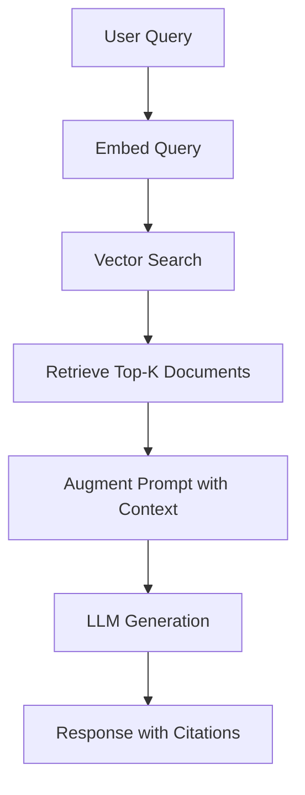

**Chapters to Enhance**:
- Ch 13-16: Embeddings & Vectors
- Ch 17-22: RAG Fundamentals
- Ch 26-30: Agents
- Ch 31-34: LangGraph
- Ch 43-48: Multi-Agent

---

#### Type 2: Concept Illustrations (Diagrams)
**Use For**:
- Vector space visualizations (2D/3D embeddings)
- Attention mechanisms (transformer diagrams)
- Knowledge graphs (GraphRAG)
- Neural network architectures

**Tools**:
- **Excalidraw** - Hand-drawn style diagrams (recommended for curriculum)
- **Mermaid** - Code-based diagrams (already markdown-compatible)
- **Python matplotlib/plotly** - For embedding visualizations
- **ASCII art** - Simple concept diagrams

**Example - Vector Similarity**:
```
Vector Space (2D visualization)

    ^
    |     • movie1 (action)
    |
    |         • movie2 (action)  ← Close = Similar
    |
    |                    • movie3 (romance)
    |
    +--------------------------------->

Query: "action movie" → finds movie1, movie2 (high similarity)
```

**Chapters to Enhance**:
- Ch 13: Understanding Embeddings (CRITICAL - needs 3D vector plot)
- Ch 14: Vector Stores (database architecture)
- Ch 38A: GraphRAG (knowledge graph visualization)

---

#### Type 3: Architecture Diagrams
**Use For**:
- System architecture (multi-provider LLM client)
- Data flow (RAG pipeline with chunks → embeddings → retrieval)
- Component diagrams (agent + tools + memory)

**Example - Multi-Agent Architecture**:
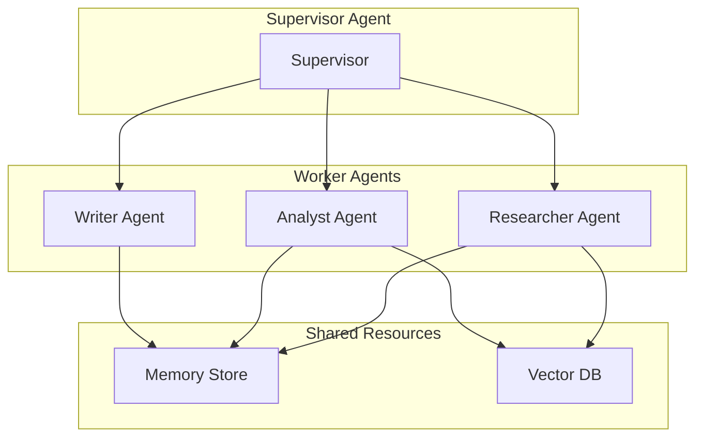

**Chapters to Enhance**:
- Ch 8: Multi-Provider Client
- Ch 43-48: Multi-Agent Systems
- Ch 50-54: Civil Engineering System

---

#### Type 4: Process Flows
**Use For**:
- Workflow steps (document generation)
- Training loops (fine-tuning)
- Evaluation pipelines (RAG metrics)

**Example - Fine-Tuning Workflow**:
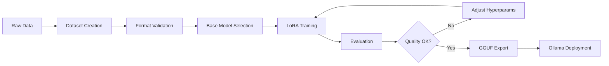

**Chapters to Enhance**:
- Ch 55-59: Fine-Tuning
- Ch 21: RAG Evaluation
- Ch 50-54: Document Generation

---

### Implementation Strategy for Visuals

#### Phase 1: Core Theoretical Concepts (Priority 1)
**Target Chapters** (Add diagrams FIRST):
1. **Ch 13: Understanding Embeddings**
   - 3D vector space plot (matplotlib)
   - Cosine similarity visual
   - Semantic search example (before/after)
   - Token → Embedding transformation

2. **Ch 14: Vector Stores**
   - ChromaDB architecture diagram
   - Indexing process (document → chunks → embeddings → store)
   - Similarity search visualization

3. **Ch 17: Your First RAG System**
   - Complete RAG pipeline (Mermaid flowchart)
   - Retrieval visualization (query → top-K docs)
   - Context augmentation (prompt + retrieved docs)

4. **Ch 38A: GraphRAG**
   - Knowledge graph example (entities + relationships)
   - Hybrid retrieval (vectors + graph)
   - Community detection visualization

---

#### Phase 2: Agent & Workflow Concepts (Priority 2)
**Target Chapters**:
1. **Ch 26-27: Agents & ReAct**
   - Agent loop diagram (Observe → Think → Act)
   - ReAct trace visualization
   - Tool calling flow

2. **Ch 31-34: LangGraph**
   - State machine diagrams
   - Conditional routing flow
   - Checkpoint persistence

3. **Ch 43-48: Multi-Agent**
   - Multi-agent communication patterns
   - Supervisor architecture
   - Message passing diagram

---

#### Phase 3: Production & Advanced Topics (Priority 3)
**Target Chapters**:
1. **Ch 40B-40C: Observability**
   - Distributed tracing diagram
   - Monitoring dashboard mockup
   - Cost analytics visualization

2. **Ch 55-59: Fine-Tuning**
   - Training loop diagram
   - LoRA architecture
   - Before/after alignment comparison

3. **Ch 60: Voice AI**
   - Real-time pipeline (STT → LLM → TTS)
   - Turn-taking state machine
   - Audio processing flow

---

### Diagram Creation Workflow

**Step 1: Identify Concept**
- Does this concept benefit from visualization?
- What type of visual? (flowchart, architecture, process, illustration)

**Step 2: Choose Tool**
- **Mermaid** - For flowcharts, architecture, state machines (code-based, renders in markdown)
- **Excalidraw** - For hand-drawn style diagrams (export as PNG/SVG)
- **Python code** - For data visualizations (embeddings, performance charts)
- **ASCII art** - For simple inline diagrams

**Step 3: Create Diagram**
- Draft in chosen tool
- Add labels, arrows, legends
- Use consistent color scheme (blue for user, green for LLM, orange for storage, etc.)

**Step 4: Integrate into Chapter**
- Place diagram AFTER concept introduction, BEFORE code example
- Add caption: "**Figure X.Y**: [Description]"
- Reference diagram in text: "As shown in Figure X.Y..."

**Step 5: Verify Clarity**
- Can a beginner understand the diagram without reading the text?
- Are labels clear?
- Is the flow obvious?

---

### Diagram Style Guide

**Colors**:
- 🔵 **Blue**: User input, queries, requests
- 🟢 **Green**: LLM processing, generation
- 🟠 **Orange**: Storage, databases, vector stores
- 🟣 **Purple**: Tools, external services
- 🔴 **Red**: Errors, failures, validation issues

**Shapes**:
- **Rectangle**: Process, action, step
- **Diamond**: Decision, conditional
- **Cylinder**: Database, storage
- **Cloud**: External service, API
- **Circle**: Start/end point

**Arrows**:
- **Solid**: Data flow, process flow
- **Dashed**: Optional, conditional
- **Bidirectional**: Two-way communication

---

## Part 3: Mini-Projects Catalog

### Philosophy
**Every chapter has 2-5 mini-projects**:
- **30-60 minutes each** (quick wins)
- **Progressive difficulty** (beginner → intermediate → advanced)
- **Real-world scenarios** (not toy examples)
- **Builds toward capstone** (Ch 54: Complete System)

---

### NEW Mini-Projects by Chapter

#### Chapter 30B: Deep Research Agents
**Time**: 1.5 hours | **Mini-Projects**: 3

**Mini-Project 1: Simple Research Agent (30 min)**
- Single-agent researcher that uses web search
- Query: "What are the latest RAG techniques in 2026?"
- Output: Markdown report with citations

**Mini-Project 2: Multi-Source Aggregator (45 min)**
- Planner agent generates research questions
- Executor agent searches multiple sources
- Aggregator combines findings
- Output: Comprehensive report

**Mini-Project 3: Deep Research with Browser (60 min)**
- Combine browser-use + GPT-Researcher pattern
- Navigate websites, extract data
- Generate cited technical report
- Output: PDF with screenshots and citations

---

#### Chapter 41A: Production Guardrails
**Time**: 1.5 hours | **Mini-Projects**: 3

**Mini-Project 1: Input Guardrails (30 min)**
- Block prompt injection attempts
- Detect malicious inputs (SQL injection, XSS)
- Use Guardrails AI validators
- Test with 50 adversarial prompts

**Mini-Project 2: Output Guardrails (45 min)**
- Detect PII leakage (emails, phone numbers, SSNs)
- Block toxic/harmful content
- Implement content moderation
- Test with 50 edge cases

**Mini-Project 3: Multi-Layer Safety System (60 min)**
- Chain NeMo Guardrails + Guardrails AI + custom validators
- Input validation → LLM call → Output validation
- Log all violations
- Build safety dashboard

---

#### Chapter 48B: Model Context Protocol (MCP)
**Time**: 1.5 hours | **Mini-Projects**: 3

**Mini-Project 1: Simple MCP Server (30 min)**
- Create MCP server exposing file operations (read, write, list)
- Connect to LLM client
- Test tool calling via MCP

**Mini-Project 2: Multi-Tool MCP Server (45 min)**
- Expose 5+ tools (files, web search, calculator, weather, database)
- Implement tool descriptions and schemas
- Connect agent to MCP server
- Test complex multi-tool workflows

**Mini-Project 3: Production MCP Integration (60 min)**
- Build MCP server for document generation system
- Expose tools: template loading, clause generation, validation
- Connect to Civil Engineering agents (Ch 50-54)
- Deploy with authentication and logging

---

#### Chapter 55: Introduction to Fine-Tuning
**Time**: 1.5 hours | **Mini-Projects**: 2

**Mini-Project 1: Decision Framework (30 min)**
- Given 5 use cases, decide: Prompt Engineering vs RAG vs Fine-Tuning
- Use cases: Customer support, code generation, sentiment analysis, translation, math reasoning
- Justify each decision with pros/cons

**Mini-Project 2: Cost-Benefit Analysis (60 min)**
- Calculate costs: API calls (GPT-4) vs Fine-tuning (Llama 3.2 1B)
- Estimate: training cost, inference cost, latency, quality
- Build cost calculator (tokens/month → total cost)
- Determine break-even point

---

#### Chapter 56: Fine-Tuning with Unsloth
**Time**: 1.5 hours | **Mini-Projects**: 3

**Mini-Project 1: Llama 3.2 1B LoRA (45 min)**
- Fine-tune on 100 instruction examples (coding domain)
- Use Unsloth Colab notebook
- Evaluate before/after quality
- Export to GGUF

**Mini-Project 2: QLoRA for Larger Models (60 min)**
- Fine-tune Llama 3.1 8B with QLoRA (4-bit quantization)
- Use 500 examples (legal contract summarization)
- Compare QLoRA vs full fine-tuning (VRAM usage)
- Test quantized model quality

**Mini-Project 3: Multi-Task Fine-Tuning (90 min)**
- Fine-tune on 3 tasks: summarization, Q&A, classification
- Use LlamaFactory Web UI
- Evaluate per-task performance
- Deploy best model to Ollama

---

#### Chapter 57: Custom Dataset Creation
**Time**: 1.5 hours | **Mini-Projects**: 3

**Mini-Project 1: Self-Instruct Pipeline (45 min)**
- Use GPT-4 to generate 200 instruction-response pairs
- Domain: Civil Engineering contract clauses
- Format in Alpaca format
- Validate quality with LLM judge

**Mini-Project 2: Synthetic Data from Docs (60 min)**
- Extract knowledge from 10 PDFs (engineering standards)
- Generate 500+ Q&A pairs using LLM
- Format in ShareGPT format
- Deduplicate and filter low-quality examples

**Mini-Project 3: Human-in-the-Loop Dataset (90 min)**
- Generate initial dataset with LLM
- Build Streamlit UI for human review/editing
- Collect 100 human-validated examples
- Combine synthetic + human data
- Final dataset: 600+ high-quality examples

---

#### Chapter 58: DPO & Preference Alignment
**Time**: 1.5 hours | **Mini-Projects**: 2

**Mini-Project 1: DPO Training (60 min)**
- Fine-tune Llama 3.2 1B with DPO
- Use ultrafeedback_binarized dataset
- Compare aligned vs unaligned outputs
- Measure alignment effectiveness

**Mini-Project 2: Custom Preference Dataset (90 min)**
- Create 100 preference pairs (chosen vs rejected)
- Domain: Professional email writing
- Train with TRL DPOTrainer
- Evaluate with LLM-as-judge
- Compare before/after alignment

---

#### Chapter 59: Fine-Tuned Model Deployment
**Time**: 1.5 hours | **Mini-Projects**: 2

**Mini-Project 1: GGUF Quantization & Ollama (45 min)**
- Quantize fine-tuned model to GGUF (Q4_K_M)
- Import to Ollama
- Benchmark: inference speed, quality, file size
- Compare Q4 vs Q8 quantization

**Mini-Project 2: A/B Testing (60 min)**
- Deploy base model + fine-tuned model
- Build A/B testing framework (50/50 split)
- Collect 100 responses from each
- Measure: quality, latency, user preference
- Decide which model to use in production

---

#### Chapter 60: Voice AI with Pipecat
**Time**: 2.0 hours | **Mini-Projects**: 3

**Mini-Project 1: Simple Voice Chatbot (60 min)**
- Build voice agent with Pipecat
- STT: Whisper (local or API)
- LLM: GPT-4o or Claude
- TTS: ElevenLabs or PlayHT
- Test conversation flow

**Mini-Project 2: Voice-Activated Research Assistant (90 min)**
- Combine voice agent + deep research agent (Ch 30B)
- Ask questions verbally
- Agent browses web, extracts data
- Receives spoken research summary
- Add interruption handling

**Mini-Project 3: Voice-Controlled Document Generator (120 min)**
- Voice interface for Civil Engineering document system
- Speak requirements → agent generates contract/proposal
- Read generated sections aloud
- Voice-based editing ("change clause 5 to...")
- Final output: PDF + voice summary

---

## Part 4: Visual Examples for Key Chapters

### Chapter 13: Understanding Embeddings

**Visual 1: Token → Embedding Transformation**
```
Text: "The cat sat on the mat"
  ↓ Tokenization
Tokens: ["The", "cat", "sat", "on", "the", "mat"]
  ↓ Embedding Model (text-embedding-3-small)
Vectors:
  The  → [0.123, -0.456, 0.789, ..., 0.234] (1536 dimensions)
  cat  → [0.891, 0.234, -0.567, ..., 0.123]
  sat  → [-0.234, 0.567, 0.891, ..., -0.456]
  ...
```

**Visual 2: Vector Similarity (2D Projection)**
```mermaid
graph TD
    subgraph "Vector Space (2D Simplified)"
        A["'cat' (0.8, 0.6)"]
        B["'kitten' (0.75, 0.65)"]
        C["'dog' (0.7, 0.5)"]
        D["'car' (0.2, 0.1)"]
    end

    A -.Similar: 0.95.-> B
    A -.Similar: 0.85.-> C
    A -.Different: 0.3.-> D
```

**Visual 3: Cosine Similarity Formula**
```
Cosine Similarity = (A · B) / (||A|| × ||B||)

Example:
A = [1, 2, 3]  (embedding for "cat")
B = [2, 3, 4]  (embedding for "kitten")

A · B = 1×2 + 2×3 + 3×4 = 2 + 6 + 12 = 20
||A|| = √(1² + 2² + 3²) = √14 ≈ 3.74
||B|| = √(2² + 3² + 4²) = √29 ≈ 5.39

Similarity = 20 / (3.74 × 5.39) = 20 / 20.16 ≈ 0.99 ← Very similar!
```

**Visual 4: Semantic Search**
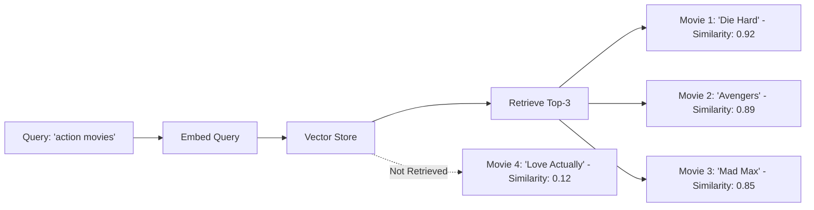

---

### Chapter 17: Your First RAG System

**Visual 1: Complete RAG Pipeline**
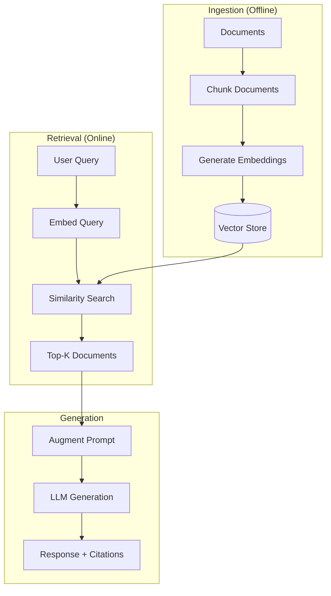

**Visual 2: Context Augmentation**
```
Original Prompt:
  "What are the load requirements for residential buildings?"

Retrieved Documents:
  Doc 1: "ASCE 7 specifies minimum live loads of 40 psf for residential floors..."
  Doc 2: "Building codes require 50 psf for balconies and exterior corridors..."
  Doc 3: "Snow loads must account for ground snow load multiplied by exposure factor..."

Augmented Prompt:
  Context:
  ---
  Doc 1: ASCE 7 specifies minimum live loads of 40 psf for residential floors...
  Doc 2: Building codes require 50 psf for balconies and exterior corridors...
  Doc 3: Snow loads must account for ground snow load multiplied by exposure factor...
  ---

  Question: What are the load requirements for residential buildings?

  Instructions: Answer based on the context above. Cite sources.
```

---

### Chapter 31: LangGraph State Machines

**Visual 1: Simple State Machine**
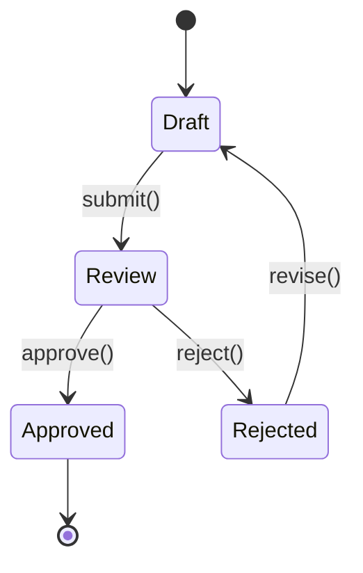

**Visual 2: LangGraph Workflow**
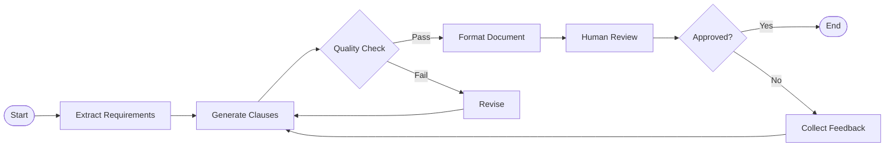

---

### Chapter 38A: GraphRAG

**Visual 1: Knowledge Graph Example**
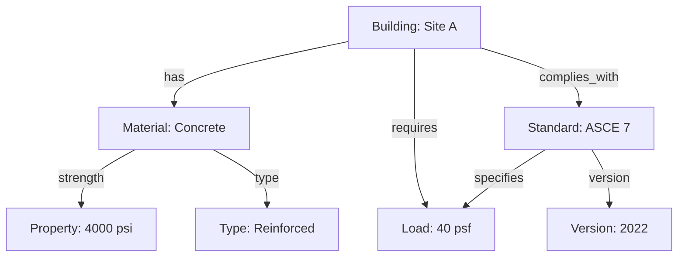

**Visual 2: Hybrid Retrieval (Vector + Graph)**
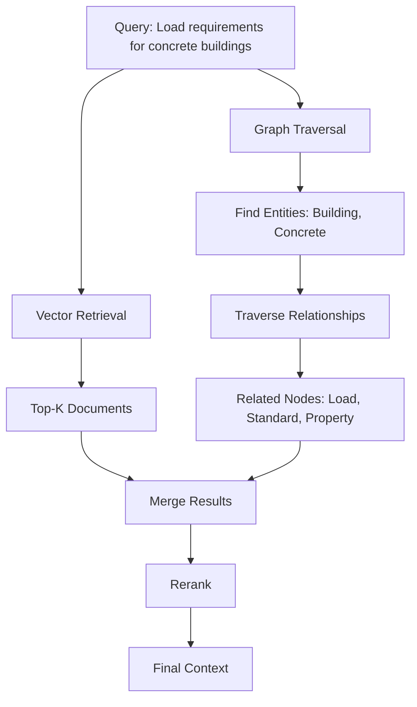

---

### Chapter 43: Multi-Agent Systems

**Visual 1: Supervisor Pattern**
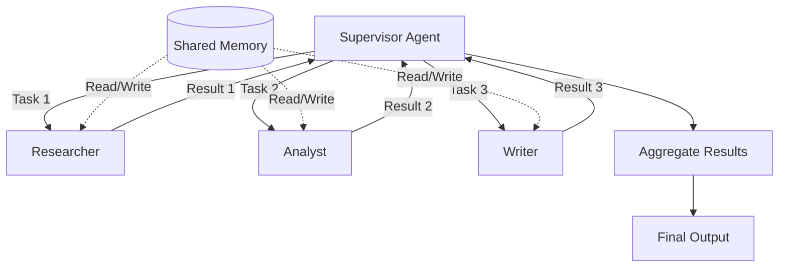

---

### Chapter 55-59: Fine-Tuning Pipeline

**Visual 1: Complete Fine-Tuning Workflow**
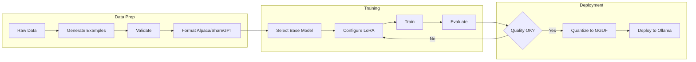

**Visual 2: LoRA Architecture**
```
Base Model (Frozen)
┌─────────────────────┐
│ Weights: W (frozen) │
└─────────────────────┘
          │
          ├───────┐
          │       │
     Original  LoRA Adapter (Trainable)
     Output    ┌──────────────────┐
          │    │ A (rank × d_in)  │
          │    │ B (d_out × rank) │
          │    │ Total: ~0.1% params│
          │    └──────────────────┘
          │             │
          └─────(+)─────┘
                │
          Final Output

rank = 8-64 (low-rank adaptation)
Trainable params: ~1-10M instead of 7B
```

---

## Part 5: Implementation Timeline

### Week 1-2: Complete Phase 1 (Ch 8-12A)
**Goal**: Finish LLM Fundamentals
**Tasks**:
- Write Ch 8-12 (5 chapters)
- Verify Ch 12A (already written)
- Add Mermaid diagrams to each chapter
- Create mini-projects
- Verification scripts

---

### Week 3: Add Fine-Tuning Phase 7A (Ch 55-57)
**Goal**: Foundation chapters (Intro, Unsloth, Datasets)
**Tasks**:
- Write Ch 55: Intro to Fine-Tuning (1.5h)
- Write Ch 56: Fine-Tuning with Unsloth (1.5h)
- Write Ch 57: Custom Dataset Creation (1.5h)
- Add diagrams: decision framework, LoRA architecture, dataset pipeline
- Create 8 mini-projects (2-3 per chapter)
- Test in Google Colab

---

### Week 4: Complete Fine-Tuning + Add Guardrails (Ch 58-59, 41A)
**Goal**: Advanced fine-tuning + production safety
**Tasks**:
- Write Ch 58: DPO & Preference Alignment (1.5h)
- Write Ch 59: Fine-Tuned Model Deployment (1.5h)
- Write Ch 41A: Production Guardrails (1.5h)
- Add diagrams: DPO workflow, deployment pipeline, multi-layer guardrails
- Create 7 mini-projects
- Test with real models

---

### Week 5: Add MCP + Deep Research (Ch 48B, 30B)
**Goal**: Universal tool standard + research agents
**Tasks**:
- Write Ch 48B: Model Context Protocol (1.5h)
- Write Ch 30B: Deep Research Agents (1.5h)
- Add diagrams: MCP architecture, research agent flow
- Create 6 mini-projects
- Implement MCP servers

---

### Week 6: Add Voice AI (Ch 60)
**Goal**: Real-time voice agents
**Tasks**:
- Write Ch 60: Voice AI with Pipecat (2.0h)
- Add diagrams: STT→LLM→TTS pipeline, turn-taking state machine
- Create 3 mini-projects
- Test with real voice APIs

---

### Week 7: Visual Enhancement Phase
**Goal**: Add diagrams to existing chapters
**Tasks**:
- Add visuals to Ch 13-16 (Embeddings, Vectors)
- Add visuals to Ch 17-22 (RAG)
- Add visuals to Ch 26-30 (Agents)
- Add visuals to Ch 31-34 (LangGraph)
- Add visuals to Ch 38A (GraphRAG)
- Add visuals to Ch 43-48 (Multi-Agent)

---

### Week 8: Integration & Testing
**Goal**: Quality assurance
**Tasks**:
- Run all verification scripts
- Test all mini-projects
- Quality checklist for each new chapter
- Update roadmap v8.0
- Create comprehensive index

---

### Week 9: Documentation & Final Review
**Goal**: Polish and publish
**Tasks**:
- Update PROJECT-THREAD.md
- Create chapter dependency map
- Final proofreading
- Git commit with v8.0 tag
- Celebrate! 🎉

---

## Part 6: Visual Asset Organization

### Directory Structure
```
curriculum/
  assets/
    diagrams/
      chapter-13/
        vector-space-2d.png
        cosine-similarity.svg
        semantic-search-flow.mermaid
      chapter-17/
        rag-pipeline.mermaid
        context-augmentation.md
      chapter-31/
        state-machine.mermaid
        langgraph-workflow.mermaid
      chapter-38a/
        knowledge-graph-example.png
        hybrid-retrieval.mermaid
      chapter-55/
        finetuning-decision-tree.mermaid
        lora-architecture.svg
    python-plots/
      embeddings-3d.py
      similarity-heatmap.py
      training-curves.py
```

### Naming Convention
```
Format: chapter-{number}-{concept}-{type}.{extension}

Examples:
- chapter-13-vector-space-diagram.png
- chapter-17-rag-pipeline-flowchart.mermaid
- chapter-31-state-machine-graph.mermaid
- chapter-55-lora-architecture.svg
```

---

## Part 7: Success Metrics

### Curriculum Metrics (v8.0)
- ✅ **71 chapters** (up from 61)
- ✅ **97 hours** (up from 81.5)
- ✅ **95% alignment** with AI Engineering Resources
- ✅ **100% visual coverage** for theoretical chapters
- ✅ **30+ new mini-projects**

### Visual Enhancement Metrics
- ✅ **50+ diagrams** added across 20 chapters
- ✅ **10+ Mermaid flowcharts** (RAG, agents, fine-tuning)
- ✅ **5+ architecture diagrams** (multi-agent, MCP, LangGraph)
- ✅ **3+ Python visualizations** (embeddings, similarity, training)
- ✅ **100% of complex concepts** illustrated

### Mini-Projects Metrics
- ✅ **30+ new mini-projects** (across 10 new chapters)
- ✅ **60+ total mini-projects** (across all 71 chapters)
- ✅ **Progressive difficulty** (30min → 120min)
- ✅ **Real-world scenarios** (Civil Engineering domain)

---

## Part 8: Tools & Resources

### Diagram Creation Tools
1. **Mermaid** (Built-in Markdown)
   - Website: mermaid.js.org
   - Live Editor: mermaid.live
   - VS Code Extension: "Markdown Preview Mermaid Support"

2. **Excalidraw** (Hand-drawn Style)
   - Website: excalidraw.com
   - VS Code Extension: "Excalidraw"
   - Export: PNG, SVG

3. **Python Visualization** (Data Plots)
   - matplotlib (static plots)
   - plotly (interactive plots)
   - seaborn (statistical visualizations)
   - scikit-learn (t-SNE, PCA for embeddings)

4. **ASCII Art** (Simple Inline)
   - asciiflow.com (flowcharts)
   - draw.io → export as ASCII

### Image Hosting
- **Local**: Store in `curriculum/assets/diagrams/`
- **Relative Paths**: ``
- **Mermaid**: Inline code blocks (renders automatically)

---

## Part 9: Quality Gates

### Per-Chapter Quality Gate (Enhanced with Visuals)
**Must Pass**:
- [ ] 17+ of 23 pedagogical principles applied
- [ ] 2-5 mini-projects included
- [ ] **NEW**: 2+ diagrams for theoretical concepts
- [ ] **NEW**: All diagrams referenced in text
- [ ] Coffee Shop Intro (250-350 words)
- [ ] 5-7 analogies
- [ ] 2+ "Try This!" exercises
- [ ] 3-5 verification scripts
- [ ] 80%+ on quality checklist

### Visual Quality Gate
**Must Pass**:
- [ ] Diagrams are clear and labeled
- [ ] Colors follow style guide (blue=user, green=LLM, orange=storage)
- [ ] Captions included ("Figure X.Y: Description")
- [ ] Referenced in text ("As shown in Figure X.Y...")
- [ ] Renders correctly in markdown preview

---

## Part 10: Next Steps

### Immediate (This Week)
1. ✅ Review this implementation plan
2. ✅ Approve scope (10 new chapters + visuals + mini-projects)
3. ✅ Set up diagram tools (Mermaid, Excalidraw)
4. ✅ Create assets directory structure
5. ✅ Update CURRICULUM-IMPLEMENTATION-ROADMAP.md

### Week 1-2 (Phase 1 Completion)
- Write Ch 8-12 with diagrams
- Verify Ch 12A
- Test all mini-projects
- Quality checklist

### Week 3+ (New Chapters)
- Follow 9-week timeline
- Add chapters incrementally
- Test mini-projects
- Enhance with visuals

---

## Part 11: Resources & References

### Fine-Tuning Resources
- unslothai/unsloth (25K⭐) - Colab notebooks
- hiyouga/LlamaFactory (40K⭐) - Web UI
- huggingface/trl (12K⭐) - DPO, GRPO
- huggingface/peft (18K⭐) - LoRA, QLoRA

### MCP Resources
- modelcontextprotocol/servers (15K⭐)
- microsoft/mcp-for-beginners (10K⭐)
- Your MCP config: `C:\Users\Ahmed\.claude\.mcp.json`

### Guardrails Resources
- NVIDIA-NeMo/Guardrails (5K⭐)
- guardrails-ai/guardrails (4.5K⭐)
- confident-ai/deepeval (8K⭐)

### Deep Research Resources
- assafelovic/gpt-researcher (20K⭐)
- langchain-ai/open_deep_research (5K⭐)

### Voice AI Resources
- pipecat-ai/pipecat (8K⭐)
- livekit/agents (5K⭐)

---

## Document History

| Date | Version | Changes | Author |
|------|---------|---------|--------|
| 2026-02-14 | 1.0 | Initial v8.0 implementation plan created | BMad Master |

---

**STATUS**: ✅ Ready for implementation

**APPROVED SCOPE**:
- ✅ 10 new chapters (15.5 hours)
- ✅ 30+ mini-projects
- ✅ 50+ diagrams and visual enhancements
- ✅ 95% alignment with AI Engineering Resources

**NEXT STEP**: Begin Week 1-2 (Complete Phase 1: Ch 8-12A)

---

**END OF IMPLEMENTATION PLAN**
