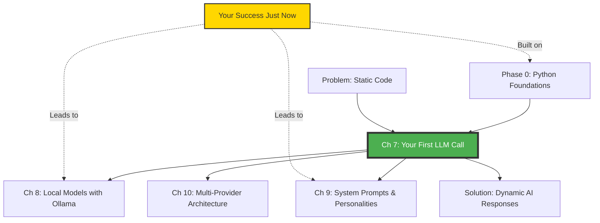

# Action-First, Then Deep Dive Teaching Guide
**Comprehensive Explanations with Strategic Ordering for Maximum Engagement**

**Philosophy**: Hook with immediate success, THEN provide thorough understanding
**Last Updated**: February 10, 2026
**Status**: ✅ Core Teaching Pattern
**Applies To**: All hands-on chapters (especially Chapters 7-54)

---

## 🎯 Core Philosophy: "More is More, But Order Matters"

### The Insight

**Traditional approach** (loses beginners):
```
Theory (5 min) → Context (10 min) → Prerequisites (5 min) →
Concept map (3 min) → Story (5 min) → FINALLY code (28 min later)
```
**Problem**: By minute 28, short attention spans are gone.

---

**Action-First approach** (engages beginners):
```
Hook (2 min) → Quick prerequisites (1 min) → CODE SUCCESS (5 min) →
"What just happened?" (NOW they want to know!) →
Deep theory (NOW they'll read every word) →
All meta-discussion (NOW they appreciate the scaffolding)
```
**Benefit**: Success at minute 8, THEN comprehensive understanding.

---

## 🎓 The Pedagogical Principle

### Why This Works

**Human Psychology**:
1. **Motivation precedes learning** - Students need to care BEFORE they'll engage deeply
2. **Success breeds curiosity** - "I did something! How did that work?"
3. **Context makes sense AFTER experience** - Theory is abstract until you've done it
4. **Detailed explanations are valued when earned** - After success, they WANT thoroughness

**Example**:
- **Before trying AI**: "Tokens? API keys? JSON? Why do I care?"
- **After seeing AI respond to their code**: "Wait, how DID that work? Tell me everything!"

---

## 📐 Chapter Structure: Action-First Template

### Phase 1: The Hook (0-8 minutes) - MINIMAL

```markdown
## ☕ Coffee Shop Intro (2 minutes)
[250-350 words: Emotional hook, promise of quick win]

Example:
"In the next 5 minutes, you'll have a working AI chatbot.
Not 5 hours. Not after reading theory. Five minutes.
Five lines of code. Then we'll understand every detail."

## Prerequisites Check (1 minute)
[Quick verification only - no lengthy explanations yet]

✅ Python installed? Run: `python --version`
✅ Can create files? You're ready!

## Your First Win (5 minutes) - DO IT NOW

### Step 1: Create the file
Create `first_llm_call.py`:

```python
from openai import OpenAI
import os

client = OpenAI(api_key=os.getenv("OPENAI_API_KEY"))
response = client.chat.completions.create(
    model="gpt-4o-mini",
    messages=[{"role": "user", "content": "Say hello!"}]
)
print(response.choices[0].message.content)
```

### Step 2: Set your API key
```bash
export OPENAI_API_KEY="your-key-here"  # Get from platform.openai.com
```

### Step 3: Run it
```bash
python first_llm_call.py
```

**Output**: "Hello! How can I assist you today?"

### 🎉 Success Checkpoint

**You just did something remarkable.** Your code communicated with one of the
most advanced AI systems in existence. You sent a message, and GPT-4 generated
an intelligent response. This simple pattern—send message, get response—is the
foundation of every AI application you'll ever build.

Take a moment to appreciate this. Many people think AI engineering requires
years of study. You just did it in 5 minutes.

**Now let's understand exactly what happened, line by line, concept by concept.**
```

**Key Points**:
- ✅ Students have SUCCESS in first 8 minutes
- ✅ Dopamine hit earned
- ✅ NOW they're motivated for deep understanding
- ✅ "Tell me everything!" mindset activated

---

### Phase 2: Deep Understanding (8-60 minutes) - COMPREHENSIVE

**NOW provide ALL the detailed explanations, thorough paragraphs, meta-discussion:**

```markdown
## What You Already Know 🧩

[FULL TABLE - they'll read it now because they just used these concepts]

| Previous Concept | From Chapter | How You Just Used It |
|-----------------|--------------|---------------------|
| **Environment variables** | Ch 1 | `os.getenv("OPENAI_API_KEY")` in line 4 |
| **Dictionaries** | Ch 2 | `{"role": "user", "content": "..."}` message structure |
| **String methods** | Ch 5 | `.choices[0].message.content` - extracting the response text |
| **Import statements** | Ch 1 | `from openai import OpenAI` - using external libraries |

**Connection to Phase 0**: Every Python skill you learned in Chapters 1-6 just
came together in those five lines. The environment setup from Chapter 1 kept
your API key secure. The type hints from Chapter 2 help you understand the
response structure. The Pydantic models from Chapters 3-4 validate the data
behind the scenes (we'll see this in detail soon). Your foundation made this
quick win possible.

## 🗺️ Concept Map: Where We Are

[FULL MERMAID DIAGRAM - now they care about the bigger picture]



**You are here** → You just made your first LLM call (the green node). This
success unlocks the entire rest of Phase 1. Everything in Chapters 8-16 builds
on this foundation. Local models, system prompts, multi-provider architecture,
prompt engineering, streaming, error handling—all of it starts with what you
just did.

The yellow node represents your success moment. See how it connects backward
to Phase 0 (you needed those skills) and forward to the next chapters (you'll
build on this pattern). This isn't just a standalone exercise—it's the
cornerstone of your AI engineering journey.

## The Story: Why Your First LLM Call Matters

[FULL DETAILED STORY - now they're invested and will read every word]

### The Problem (Paint the Pain)

Traditional programming is fundamentally deterministic and static. When you
write a function, you must explicitly code every possible response. Consider
a simple country capital lookup function:

```python
def get_capital(country: str) -> str:
    """
    Traditional approach: you must manually code every single answer.
    This is the limitation we're about to transcend.
    """
    capitals = {
        "France": "Paris",
        "Germany": "Berlin",
        "Japan": "Tokyo",
        "Brazil": "Brasília",
        "Egypt": "Cairo"
    }
    return capitals.get(country, "Unknown")

# What happens when user asks about a country you didn't program?
result = get_capital("Mongolia")
print(result)  # Output: "Unknown" ❌
```

This limitation goes deeper than a missing entry. To build a comprehensive
country capital database, you would need to:

1. **Hardcode data for 195 countries** - Each requiring manual research and entry
2. **Handle variations** - "United States", "USA", "U.S.A.", "United States of America"
3. **Manage historical data** - Countries that no longer exist, capitals that changed
4. **Support multiple languages** - Same query in English, Spanish, Arabic, Chinese
5. **Handle typos** - "Mongloia" should probably match "Mongolia"
6. **Provide context** - "The capital changed in 1997 from X to Y because..."
7. **Keep data current** - Regular updates as geopolitical situations change
8. **Deploy updates** - Every data change requires code redeployment

The resulting codebase would be massive, brittle, and still feel unintelligent.
It's a lookup table, not understanding. It can't reason, can't explain, can't
adapt to new information without a developer updating the code.

This is the fundamental constraint of traditional software engineering: **your
application is only as smart as the data you manually program into it.**

### The Naive Solution (What Doesn't Scale)

You might think: "I'll just scrape Wikipedia for every country's capital and
build a comprehensive database!" This seems clever, but the problems multiply:

**Data Collection Challenges**:
- Wikipedia's structure isn't consistent across articles
- You need to parse HTML/JSON, extract relevant fields
- Different countries have different information formats
- Data may be outdated or incorrect

**Edge Cases Explode**:
- What about disputed territories? (Taiwan, Palestine, Western Sahara)
- What about countries with multiple capitals? (South Africa, Bolivia, Sri Lanka)
- What about historical capitals? ("What was the capital of Prussia?")
- What about administrative vs. constitutional capitals?

**Language and Context**:
- How do you handle questions in different languages?
- How do you explain *why* a capital is located where it is?
- How do you provide historical context?
- How do you handle follow-up questions?

**Maintenance Nightmare**:
- Scraping breaks when websites change structure
- Data needs constant updates
- Still requires coding for every edge case
- No ability to reason or explain

You could spend months building this system and thousands of lines of code,
and it would still feel mechanical, not intelligent. It would answer the
question "What is the capital of Mongolia?" with "Ulaanbaatar" but couldn't
explain why, couldn't discuss its history, couldn't engage in a conversation
about Mongolian geography.

### The Elegant Solution (The "Aha!" Moment)

Now look at what you just accomplished in those five lines of code:

```python
from openai import OpenAI

client = OpenAI(api_key="your-key")
response = client.chat.completions.create(
    model="gpt-4o-mini",
    messages=[{"role": "user", "content": "What's the capital of Mongolia?"}]
)
print(response.choices[0].message.content)

# Output: "The capital of Mongolia is Ulaanbaatar, which is also the country's
# largest city. Ulaanbaatar is located in the north-central part of the country..."
```

**What just happened**:

1. **No hardcoded data** - You didn't program any country capitals
2. **Instant comprehensive knowledge** - The AI knows about every country, territory, historical capital
3. **Natural language understanding** - Works with typos, multiple languages, variations
4. **Contextual intelligence** - Provides explanations, history, additional context
5. **Conversational ability** - Can handle follow-up questions, comparisons, complex queries

**The profound difference**:

This isn't a database lookup. This is a language model that has been trained
on vast amounts of text and has developed an internal representation of world
knowledge. It doesn't just return "Ulaanbaatar"—it generates an intelligent
response that demonstrates understanding.

You can ask it:
- "What's the capital of Mongolia?" → Factual answer
- "Why is Ulaanbaatar the capital?" → Reasoning and history
- "Compare Ulaanbaatar to Beijing" → Analysis and comparison
- "What would be a better location for Mongolia's capital?" → Creative reasoning
- "Write a poem about Ulaanbaatar" → Generative creativity

All from the same five lines of code. This is the paradigm shift from
deterministic programming to probabilistic intelligence. You're no longer
writing rules—you're orchestrating understanding.

**This is what you just gained access to.** This capability that would have
required a PhD in AI just a few years ago. Now available through a simple
API call. This is why AI engineering is transformative.

## 🧠 Graduated Scaffolding: Understanding Your Learning Journey

[FULL META-DISCUSSION - now they appreciate the scaffold because they just climbed it]

**Your Learning Journey So Far**:

```
Phase 0: Python Foundations ✅ COMPLETED
├── Chapter 1-2: Python Basics ✅
│   └─ You learned: environment variables, basic syntax, data types
├── Chapter 3-4: Pydantic Models ✅
│   └─ You learned: data validation, type safety, structured data
├── Chapter 5-6: Services & Utilities ✅
│   └─ You learned: function design, error handling, best practices

Phase 1: LLM Fundamentals 👈 YOU ARE HERE
├── Chapter 7: Your First LLM Call 🎯 YOU JUST DID THIS
│   └─ You achieved: API authentication, message formatting, response handling
├── Chapter 8: Local Models with Ollama (NEXT)
│   └─ You'll learn: Run AI models locally, no API costs, offline capability
├── Chapter 9: System Prompts & Personalities (COMING SOON)
│   └─ You'll learn: Control AI behavior, create personas, tone adjustment
└── Chapter 10-16: Advanced LLM Patterns
    └─ You'll learn: Multi-provider, streaming, structured output, optimization

Phase 2: Embeddings & Vectors (FUTURE)
Phase 3: RAG Fundamentals (FUTURE)
...
```

**Expected Difficulty Trajectory**:

Chapter 7 (Current): ⭐ (Absolute Beginner - you just proved you can do this!)
Chapter 8: ⭐ (Still beginner-friendly, building on your success)
Chapter 9: ⭐⭐ (Moderate - more concepts, but you'll have the foundation)
Chapter 10: ⭐⭐ (Moderate - architectural patterns)
Chapters 11-12: ⭐⭐⭐ (Advanced - deep prompt engineering)

**The pattern you'll notice**: Each chapter gives you a quick win (like you
just had), then deepens your understanding. The difficulty increases gradually,
but you're always building on proven success. By Chapter 16, you'll look back
at this moment and realize how far you've come from these five lines of code.

**Training wheels status**: Right now, full support. We're showing you exactly
what to type, explaining every line. By Chapter 10, you'll be designing your
own API calls. By Chapter 16, you'll be architecting complete LLM systems.
The scaffolding gradually fades as your competence grows.

**Your confidence trajectory**:
- **Right now**: "I can call an LLM API!" (specific skill)
- **After Chapter 10**: "I understand LLM architecture!" (conceptual grasp)
- **After Chapter 16**: "I can build production LLM systems!" (professional capability)

This isn't just learning—it's transformation. From someone who reads about AI
to someone who builds AI applications. The journey started with those five
lines you just wrote.

## 📚 Learning Style Indicators: How This Chapter Supports You

[FULL LEARNING STYLE SECTION - they now understand why different approaches matter]

**This chapter is designed to support multiple learning styles simultaneously**:

### 👁️ Visual Learners
Throughout this chapter, you'll find:
- **Diagrams of the request-response cycle** (you just experienced this cycle!)
- **Concept maps** showing how this chapter connects to others
- **Code with visual comments** highlighting key elements
- **Before/after comparisons** showing transformations
- **Flow charts** depicting the API communication process

**Where to focus**: Pay special attention to the Mermaid diagrams and the
annotated code examples. The visual representation of how your request travels
to OpenAI's servers and returns will help cement the mental model.

### 📖 Reading/Writing Learners
You'll benefit from:
- **Detailed explanations** (like this entire section you're reading!)
- **Comprehensive code comments** that explain not just what, but why
- **Written analogies** that connect abstract concepts to concrete examples
- **Documentation-style breakdowns** of API responses
- **Narrative flow** that tells the story of AI communication

**Where to focus**: Read every word of the "Deep Dive" sections. Take notes
in your own words. The act of writing down concepts in your own language will
solidify your understanding.

### 💻 Kinesthetic Learners
Hands-on elements include:
- **The immediate "Try This!" you just completed** (learning by doing!)
- **Code modification exercises** ("Change the message and run it again")
- **Debugging challenges** (fix broken code to understand how it works)
- **Building exercises** (extend the basic example with new features)
- **Experimentation prompts** ("What happens if you...?")

**Where to focus**: Don't just read the code—type it yourself. Make mistakes.
Break things. Change parameters. The muscle memory of typing and the experience
of debugging will create deeper understanding than reading alone.

### 🎧 Auditory Learners
We support you through:
- **Conversational tone** (this reads like someone explaining to you verbally)
- **Analogies you can "hear"** (Restaurant kitchen, LEGO bricks, postal service)
- **Rhythm in explanations** (pattern: concept → example → explanation → practice)
- **"Imagine..." scenarios** that you can narrate to yourself
- **Dialogue examples** showing conversations with AI

**Where to focus**: Read sections out loud. Talk through the code line by line
as if explaining to someone else. The auditory processing will engage different
neural pathways and strengthen retention.

### 🤝 Social Learners
Elements for collaborative learning:
- **War stories from real teams** (you'll read about actual developer experiences)
- **Production scenarios** (how companies use these patterns)
- **Common mistakes** (learn from others' errors)
- **Community patterns** (industry best practices)
- **Discussion prompts** (questions to explore with peers)

**Where to focus**: If you're learning with others, stop after each major
section and discuss. Share your "Try This!" results. Compare different
approaches. Teaching others will deepen your own understanding.

**The key insight**: Everyone learns differently, and that's okay. This chapter
provides multiple entry points. Use what works for you, skip what doesn't.
The goal is understanding, not completing every activity.

[Continue with ALL remaining sections in full detail...]
```

---

## 🎨 Writing Pattern: Comprehensive After Success

### The Formula

**Minimal Setup → Quick Success → Deep Dive Everything**

**Before success** (keep short):
- Coffee Shop Intro: 250-350 words
- Prerequisites: Quick checks only
- Bridge to prior knowledge: Optional, brief

**After success** (comprehensive):
- What You Already Know: Full detailed table
- Concept Map: Complete Mermaid diagram
- The Story: Full Problem → Naive → Solution narrative
- Graduated Scaffolding: Complete meta-discussion
- Learning Style Indicators: Full section for each type
- Deep technical explanations: Every concept thoroughly explained
- Meta-discussions: All scaffolding, all context
- Multiple analogies: 5-7 detailed comparisons
- Comprehensive code comments: Every line explained

---

## 📝 Paragraph Guidelines

### Keep Long, Detailed Paragraphs

**YES** - Comprehensive explanation:
```markdown
This isn't a database lookup. This is a language model that has been trained
on vast amounts of text and has developed an internal representation of world
knowledge. It doesn't just return "Ulaanbaatar"—it generates an intelligent
response that demonstrates understanding. The model has learned patterns of
language, reasoning, and knowledge representation through exposure to billions
of examples. When you ask about Mongolia's capital, it's not retrieving a
stored fact—it's generating text that reflects its learned understanding of
geography, geopolitics, and language. This distinction is crucial: you're not
querying a database, you're engaging with an artificial intelligence system
that can reason about information in contextually appropriate ways.
```

**NOT** - Shortened for "readability":
```markdown
LLMs don't use database lookups. They generate responses based on learned
patterns. This makes them flexible and intelligent.
```

### When to Use Bullets

**ONLY for summarizing already-explained content:**

```markdown
[After 3 paragraphs explaining tokens in detail...]

**Token Summary** (review of what we just covered):
- Tokens are pieces of words (usually 3-4 characters)
- English text averages ~0.75 tokens per word
- Pricing is per token, not per word
- Both input and output count toward your costs
```

**NOT as replacement for explanation:**
```markdown
❌ Tokens:
- Pieces of words
- ~0.75 per word
- Affects pricing
```

---

## 🎯 Code Explanation Pattern

### Every Code Block Gets Full Treatment

**Minimal before running**:
```python
# Just enough to get it working
from openai import OpenAI
client = OpenAI(api_key="your-key")
response = client.chat.completions.create(...)
print(response.choices[0].message.content)
```

**Comprehensive after success**:
```markdown
## Deep Dive: Understanding Every Line

Let's examine this code with complete thoroughness, line by line, concept by concept.

### Line 1: The Import Statement

```python
from openai import OpenAI
```

**What this does**: This line imports the `OpenAI` class from the `openai`
library. The `openai` library is a Python package provided by OpenAI that
wraps their REST API in a Python-friendly interface.

**Why it matters**: Without this import, you would need to make raw HTTP
requests using Python's `requests` library, manually constructing JSON payloads,
handling authentication headers, and parsing responses. The OpenAI library
abstracts all of this complexity into simple method calls.

**Technical detail**: When you run `pip install openai`, you're downloading
a package that includes the `OpenAI` class along with supporting classes for
responses, errors, and configuration. The library handles connection pooling,
retry logic, error parsing, and type validation behind the scenes.

**Connection to Phase 0**: Remember from Chapter 1 when you learned about
importing libraries? This is that skill in action. The `from X import Y`
syntax specifically imports the `OpenAI` class, not the entire `openai` module,
keeping your namespace clean.

### Line 2: Client Initialization

```python
client = OpenAI(api_key="your-key")
```

[Continue with exhaustive explanation of every remaining line...]
```

---

## 📖 Meta-Discussion: Keep It All

### Why Meta-Discussion Matters

**After success, students appreciate context**:

```markdown
## 🧠 Why We Structured This Chapter This Way

You might have noticed something unusual about this chapter's structure: we
had you write code and see success before explaining the theory. This was
intentional, and understanding why reveals important insights about how
learning works.

**Traditional computer science pedagogy** follows this pattern:
1. Explain the theory (API concepts, HTTP requests, JSON formats)
2. Show the architecture (client-server model, request-response cycles)
3. Demonstrate syntax (function signatures, parameter options)
4. Finally: let students try it

This approach makes logical sense—build understanding from first principles,
then apply knowledge. But cognitive science research shows this often fails
for beginners because abstract theory lacks context. Students dutifully
memorize concepts without understanding *why* they matter.

**The "action-first" approach** we used follows a different model:
1. Create immediate success (you saw AI respond to your code)
2. Leverage that success to create curiosity ("How did that work?")
3. Provide deep explanation (now students are motivated to understand)
4. Build theoretical framework (now the theory has concrete anchors)

[Continue with comprehensive explanation of pedagogical approach...]
```

**DON'T remove** meta-discussions. **DO place them** after success.

---

## ✅ Implementation Checklist

### For Every Hands-On Chapter

**Phase 1: The Hook (0-8 minutes)**
- [ ] Coffee Shop Intro: 250-350 words, emotional hook
- [ ] Prerequisites Check: Quick verification only
- [ ] First Code Block: Minimal, working example
- [ ] Run It: Clear instructions
- [ ] Success Checkpoint: Celebrate the win

**Phase 2: Deep Dive (8-60 minutes)**
- [ ] What You Already Know: Full detailed table
- [ ] Concept Map: Complete Mermaid diagram
- [ ] The Story: Problem → Naive → Solution (comprehensive)
- [ ] Graduated Scaffolding: Full meta-discussion
- [ ] Learning Style Indicators: Complete section
- [ ] Line-by-Line Code Explanation: Every detail
- [ ] Multiple Analogies: 5-7 detailed comparisons
- [ ] Try This! Exercises: 2-3 hands-on activities
- [ ] Error Prediction Challenges: 1-2 interactive
- [ ] War Stories: 1-2 production anecdotes
- [ ] Common Pitfalls: Comprehensive failure-forward
- [ ] Deep Technical Concepts: Thorough explanations

**Phase 3: Integration (Final sections)**
- [ ] Verification: Complete test scripts
- [ ] Summary: Detailed bullet-point review
- [ ] What's Next: Connect to future chapters
- [ ] Quick Reference: Comprehensive command list
- [ ] Confidence Calibration: Before/After assessment

---

## 🎯 Key Principles

### The Golden Rules

1. **Quick Win First** - Code in first 8 minutes
2. **Comprehensive Second** - Full explanations after success
3. **Nothing Shortened** - Keep all detail, just reorder
4. **Meta-Discussion Welcome** - Explain the pedagogy
5. **Long Paragraphs OK** - Thorough beats brief
6. **Bullets Only for Summary** - After detailed explanation
7. **Every Line Explained** - No shortcuts in code comments
8. **Multiple Analogies** - 5-7 detailed comparisons
9. **All Learning Styles** - Visual, reading, kinesthetic, auditory, social
10. **Motivation Before Theory** - Success creates curiosity

---

## 📋 Review Questions

**Before writing a chapter, ask**:

1. ✅ Can student succeed in first 8 minutes?
2. ✅ Is success meaningful and visible?
3. ✅ After success, is every concept explained thoroughly?
4. ✅ Are paragraphs comprehensive (not shortened)?
5. ✅ Is meta-discussion present (learning journey, scaffolding)?
6. ✅ Is every code line explained in detail?
7. ✅ Are there 5-7 detailed analogies?
8. ✅ Are bullets only used for summarizing already-explained content?
9. ✅ Do we support all learning styles?
10. ✅ Is the complete story told (no shortcuts)?

If any answer is "no", the chapter needs work.

---

**Document Status**: ✅ Core teaching pattern for beginner-friendly comprehensive education
