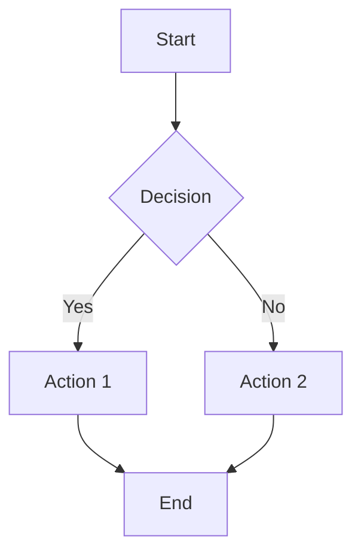
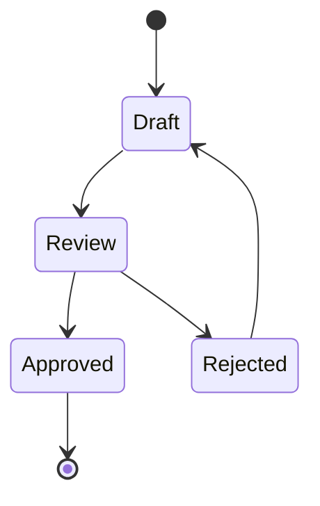
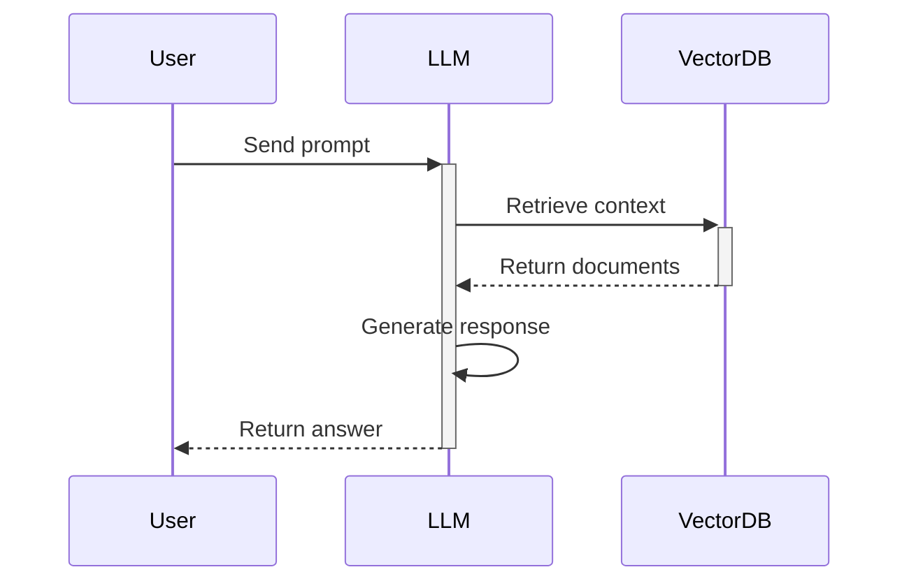
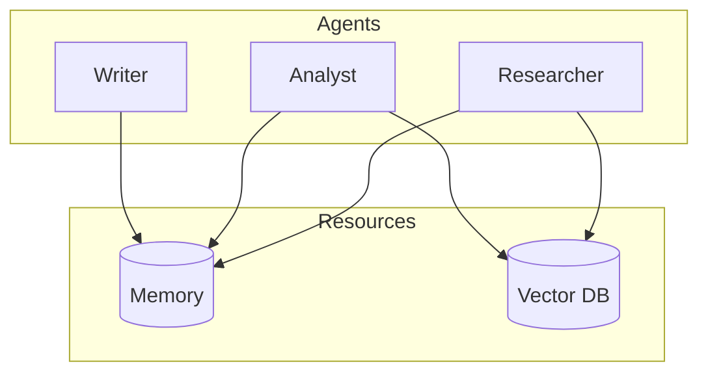
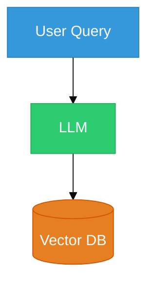
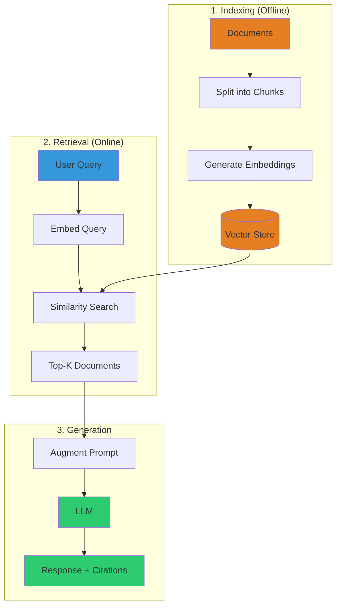
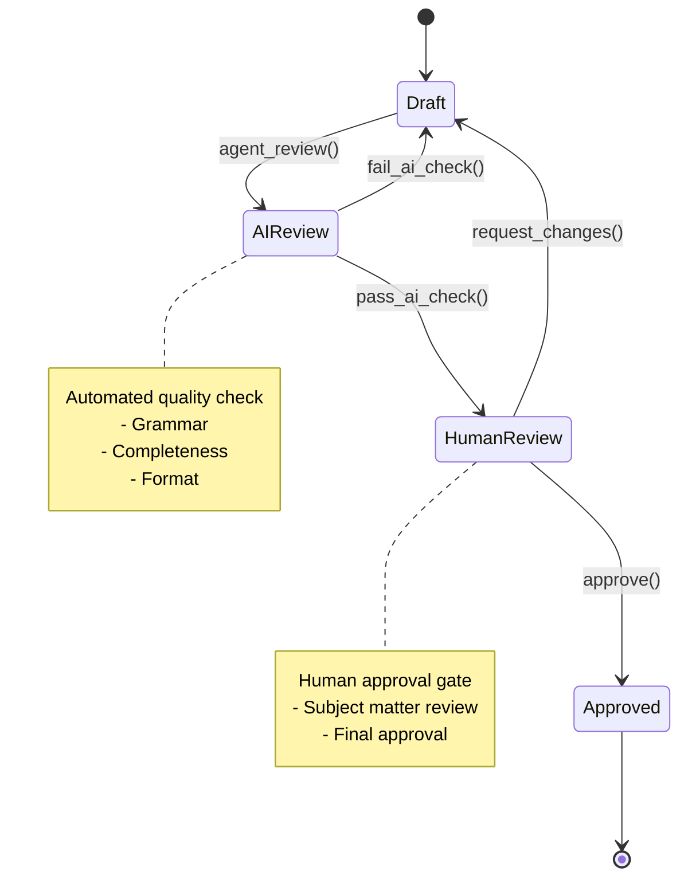
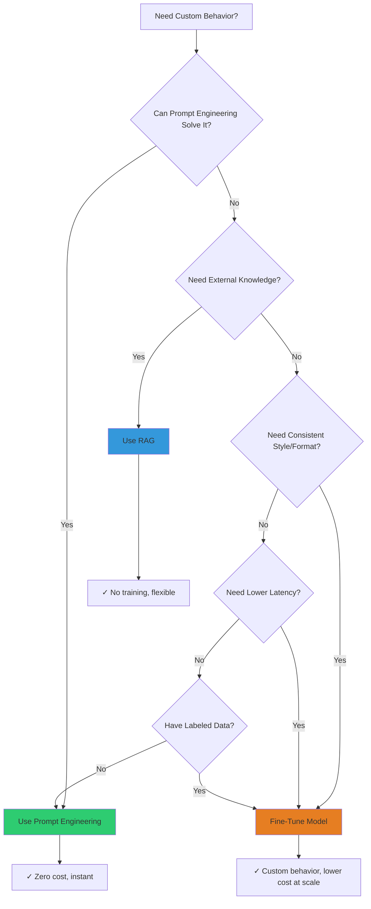
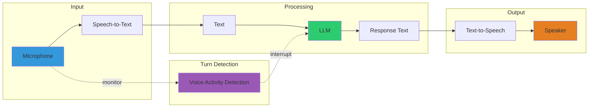

# Visual Enhancement Guide for AI Engineering Curriculum
## Creating Diagrams, Illustrations, and Visual Aids

**Version**: 1.0
**Date**: February 14, 2026
**Purpose**: Standardize visual elements across curriculum chapters
**Owner**: Ahmed

---

## Table of Contents

1. [Why Visuals Matter](#why-visuals-matter)
2. [Visual Types & When to Use](#visual-types--when-to-use)
3. [Mermaid Diagrams](#mermaid-diagrams)
4. [Python Visualizations](#python-visualizations)
5. [Excalidraw Diagrams](#excalidraw-diagrams)
6. [ASCII Art](#ascii-art)
7. [Style Guide](#style-guide)
8. [Video Integration](#video-integration)
9. [Integration Workflow](#integration-workflow)
10. [Examples Library](#examples-library)

---

## Why Visuals Matter

### Learning Science
- **65% of people** are visual learners
- **Diagrams improve retention** by 400%
- **Complex concepts** (embeddings, RAG, agents) benefit most from visualization
- **Technical interviews** often require whiteboard diagrams

### Curriculum Goals
- Make theoretical concepts concrete
- Show relationships and flows
- Provide mental models
- Reduce cognitive load
- Support multiple learning styles

---

## Visual Types & When to Use

### 1. Flowcharts (Mermaid)
**Use For**: Process flows, pipelines, algorithms
**Best Tool**: Mermaid (code-based, renders in markdown)
**Examples**: RAG pipeline, agent loop, fine-tuning workflow

### 2. Architecture Diagrams (Mermaid)
**Use For**: System components, multi-agent systems, data flow
**Best Tool**: Mermaid or Excalidraw
**Examples**: Multi-provider client, supervisor pattern, MCP architecture

### 3. State Machines (Mermaid)
**Use For**: Workflows, conditional routing, agent states
**Best Tool**: Mermaid stateDiagram
**Examples**: LangGraph workflows, document approval, OTAR loop

### 4. Data Visualizations (Python)
**Use For**: Embeddings, similarity, performance metrics
**Best Tool**: matplotlib, plotly, seaborn
**Examples**: 3D vector space, cosine similarity heatmap, training curves

### 5. Concept Illustrations (Excalidraw)
**Use For**: Hand-drawn style diagrams, whiteboards
**Best Tool**: Excalidraw
**Examples**: Knowledge graphs, neural network layers, attention mechanisms

### 6. Simple Diagrams (ASCII)
**Use For**: Quick inline examples, terminal-friendly
**Best Tool**: ASCII art
**Examples**: Directory trees, simple flows, before/after comparisons

---

## Mermaid Diagrams

### Setup
**Markdown Support**: Most markdown renderers support Mermaid
**VS Code Extension**: "Markdown Preview Mermaid Support"
**Live Editor**: https://mermaid.live

### Syntax Basics

#### Flowchart


**Code**:
````markdown

````

---

#### State Diagram


**Code**:
````markdown

````

---

#### Sequence Diagram


**Code**:
````markdown

````

---

#### Graph (Network)


**Code**:
````markdown

````

---

### Mermaid Shape Reference

| Shape | Syntax | Use For |
|-------|--------|---------|
| Rectangle | `A[Text]` | Process, step, action |
| Round Rectangle | `A(Text)` | Start/end point |
| Diamond | `A{Text}` | Decision, conditional |
| Circle | `A((Text))` | Event, trigger |
| Cylinder | `A[(Text)]` | Database, storage |
| Cloud | `A([Text])` | External service, API |
| Hexagon | `A{{Text}}` | Preparation, setup |
| Parallelogram | `A[/Text/]` | Input/output |

### Mermaid Arrow Reference

| Arrow | Syntax | Use For |
|-------|--------|---------|
| Solid | `A --> B` | Data flow, sequence |
| Dashed | `A -.-> B` | Optional, conditional |
| Thick | `A ==> B` | Primary path |
| Dotted with label | `A -.label.-> B` | Relationship with context |
| Arrow with label | `A -->|label| B` | Action with description |

---

## Python Visualizations

### Setup
```python
import matplotlib.pyplot as plt
import numpy as np
from sklearn.manifold import TSNE
import seaborn as sns

# Set style
plt.style.use('seaborn-v0_8-darkgrid')
sns.set_palette("husl")
```

### Example 1: 3D Vector Space (Embeddings)
```python
import matplotlib.pyplot as plt
from mpl_toolkits.mplot3d import Axes3D
import numpy as np

# Generate sample embeddings (3D for visualization)
embeddings = {
    'cat': np.array([0.8, 0.6, 0.2]),
    'kitten': np.array([0.75, 0.65, 0.25]),
    'dog': np.array([0.7, 0.5, 0.3]),
    'puppy': np.array([0.65, 0.55, 0.35]),
    'car': np.array([0.2, 0.1, 0.8]),
    'truck': np.array([0.25, 0.15, 0.75])
}

# Create 3D plot
fig = plt.figure(figsize=(10, 8))
ax = fig.add_subplot(111, projection='3d')

# Plot each word
for word, embedding in embeddings.items():
    ax.scatter(embedding[0], embedding[1], embedding[2], s=100)
    ax.text(embedding[0], embedding[1], embedding[2], word, fontsize=12)

ax.set_xlabel('Dimension 1')
ax.set_ylabel('Dimension 2')
ax.set_zlabel('Dimension 3')
ax.set_title('Word Embeddings in 3D Vector Space')

plt.savefig('embeddings-3d.png', dpi=300, bbox_inches='tight')
plt.show()
```

**Output**: 3D scatter plot showing semantic clustering (animals vs vehicles)

---

### Example 2: Cosine Similarity Heatmap
```python
import numpy as np
import seaborn as sns
import matplotlib.pyplot as plt
from sklearn.metrics.pairwise import cosine_similarity

# Sample embeddings (5D)
words = ['cat', 'kitten', 'dog', 'puppy', 'car']
embeddings = np.random.rand(5, 5)  # Replace with real embeddings

# Calculate cosine similarity matrix
similarity_matrix = cosine_similarity(embeddings)

# Create heatmap
plt.figure(figsize=(8, 6))
sns.heatmap(
    similarity_matrix,
    annot=True,
    fmt='.2f',
    cmap='YlOrRd',
    xticklabels=words,
    yticklabels=words,
    square=True,
    cbar_kws={'label': 'Cosine Similarity'}
)
plt.title('Cosine Similarity Between Word Embeddings')
plt.tight_layout()
plt.savefig('similarity-heatmap.png', dpi=300, bbox_inches='tight')
plt.show()
```

**Output**: Heatmap showing similarity scores between all word pairs

---

### Example 3: t-SNE Visualization (High-Dimensional Embeddings)
```python
from sklearn.manifold import TSNE
import matplotlib.pyplot as plt
import numpy as np

# Sample: 100 embeddings with 1536 dimensions (OpenAI text-embedding-3-small)
embeddings = np.random.rand(100, 1536)  # Replace with real embeddings
labels = ['animal'] * 50 + ['vehicle'] * 50  # Category labels

# Reduce to 2D with t-SNE
tsne = TSNE(n_components=2, random_state=42, perplexity=30)
embeddings_2d = tsne.fit_transform(embeddings)

# Plot
plt.figure(figsize=(10, 8))
colors = {'animal': 'blue', 'vehicle': 'red'}
for label in set(labels):
    mask = np.array(labels) == label
    plt.scatter(
        embeddings_2d[mask, 0],
        embeddings_2d[mask, 1],
        c=colors[label],
        label=label,
        alpha=0.6,
        s=50
    )

plt.title('t-SNE Visualization of 1536D Embeddings')
plt.xlabel('t-SNE Dimension 1')
plt.ylabel('t-SNE Dimension 2')
plt.legend()
plt.grid(True, alpha=0.3)
plt.savefig('tsne-embeddings.png', dpi=300, bbox_inches='tight')
plt.show()
```

**Output**: 2D scatter plot showing clustering of high-dimensional embeddings

---

### Example 4: Training Curves (Fine-Tuning)
```python
import matplotlib.pyplot as plt
import numpy as np

# Sample training data
epochs = np.arange(1, 11)
train_loss = np.exp(-0.3 * epochs) + np.random.rand(10) * 0.1
val_loss = np.exp(-0.25 * epochs) + np.random.rand(10) * 0.15

# Plot
fig, (ax1, ax2) = plt.subplots(1, 2, figsize=(14, 5))

# Loss curve
ax1.plot(epochs, train_loss, 'b-o', label='Training Loss', linewidth=2)
ax1.plot(epochs, val_loss, 'r-s', label='Validation Loss', linewidth=2)
ax1.set_xlabel('Epoch')
ax1.set_ylabel('Loss')
ax1.set_title('Training Progress')
ax1.legend()
ax1.grid(True, alpha=0.3)

# Accuracy curve
train_acc = 1 - train_loss * 0.5
val_acc = 1 - val_loss * 0.5
ax2.plot(epochs, train_acc, 'b-o', label='Training Accuracy', linewidth=2)
ax2.plot(epochs, val_acc, 'r-s', label='Validation Accuracy', linewidth=2)
ax2.set_xlabel('Epoch')
ax2.set_ylabel('Accuracy')
ax2.set_title('Accuracy Progress')
ax2.legend()
ax2.grid(True, alpha=0.3)

plt.tight_layout()
plt.savefig('training-curves.png', dpi=300, bbox_inches='tight')
plt.show()
```

**Output**: Dual plot showing loss and accuracy over training epochs

---

## Excalidraw Diagrams

### Setup
- **Web**: https://excalidraw.com
- **VS Code Extension**: "Excalidraw"
- **Export**: PNG, SVG (for high resolution)

### When to Use Excalidraw
- Hand-drawn aesthetic (more approachable)
- Complex system diagrams
- Whiteboard-style explanations
- Knowledge graphs (entities + relationships)
- Neural network architectures

### Style Tips
1. **Use hand-drawn style** (default) for friendly feel
2. **Color code components**: Blue=input, Green=processing, Orange=output
3. **Add icons** for visual interest (database cylinder, cloud, etc.)
4. **Group related elements** with boxes or colors
5. **Export as PNG** (300 DPI for print quality)

### Example: Knowledge Graph
```
[Excalidraw diagram showing:]

┌─────────────┐      has_material      ┌──────────────┐
│  Building A │ ───────────────────────>│   Concrete   │
└─────────────┘                         └──────────────┘
       │                                        │
       │ requires_load                   strength_of
       │                                        │
       ↓                                        ↓
┌─────────────┐                         ┌──────────────┐
│  40 psf     │                         │  4000 psi    │
└─────────────┘                         └──────────────┘
       │
       │ specified_by
       ↓
┌─────────────┐
│   ASCE 7    │
└─────────────┘
```

---

## ASCII Art

### When to Use ASCII
- Quick inline diagrams
- Terminal-friendly documentation
- Simple directory trees
- Before/after comparisons

### Tools
- **asciiflow.com** - Draw flowcharts
- **draw.io** - Export as ASCII
- **Manual** - For simple diagrams

### Example 1: Directory Tree
```
curriculum/
├── chapters/
│   ├── phase-1-llm-fundamentals/
│   │   ├── chapter-07-first-llm-call.md
│   │   ├── chapter-08-multi-provider.md
│   │   └── chapter-12A-asyncio.md
│   └── phase-7A-fine-tuning/
│       ├── chapter-55-intro-finetuning.md
│       ├── chapter-56-unsloth.md
│       └── chapter-57-datasets.md
├── assets/
│   └── diagrams/
│       ├── chapter-13/
│       └── chapter-17/
└── verification/
    ├── verify_chapter_07.py
    └── verify_chapter_12A.py
```

### Example 2: Before/After Comparison
```
BEFORE Fine-Tuning:
┌──────────────────────────┐
│  Base Model (Llama 3.2)  │
│  Generic responses       │
│  No domain knowledge     │
└──────────────────────────┘
         ↓
User: "Draft a construction contract clause for delay penalties"
Model: "I can help with that. Here's a generic example..."
         ↓
❌ Not specific to engineering domain


AFTER Fine-Tuning:
┌──────────────────────────┐
│  Fine-Tuned Model        │
│  + 500 CE examples       │
│  Engineering terminology │
└──────────────────────────┘
         ↓
User: "Draft a construction contract clause for delay penalties"
Model: "LIQUIDATED DAMAGES: Contractor shall pay Owner the sum of..."
         ↓
✅ Domain-specific, professional language
```

### Example 3: Simple Flow
```
RAG Pipeline:
─────────────

Documents → Chunk → Embed → Store
                              ↓
                         Vector DB
                              ↓
Query → Embed → Search → Retrieve → Augment → LLM → Response
```

---

## Style Guide

### Color Palette
Use consistent colors across all diagrams:

| Color | Hex Code | Use For | Mermaid Class |
|-------|----------|---------|---------------|
| 🔵 Blue | `#3498db` | User input, queries | `.user` |
| 🟢 Green | `#2ecc71` | LLM processing | `.llm` |
| 🟠 Orange | `#e67e22` | Storage, databases | `.storage` |
| 🟣 Purple | `#9b59b6` | Tools, services | `.tool` |
| 🔴 Red | `#e74c3c` | Errors, failures | `.error` |
| ⚪ Gray | `#95a5a6` | Optional, metadata | `.meta` |

### Mermaid Styling


### Typography
- **Labels**: Bold, 12-14pt
- **Descriptions**: Regular, 10-12pt
- **Code**: Monospace font
- **Arrows**: Include action verbs ("retrieves", "generates", "stores")

### Spacing
- **Nodes**: Consistent padding (10-15px)
- **Arrows**: Clear direction (left-to-right or top-to-bottom)
- **Grouping**: Use subgraphs or boxes for related components

---

## Video Integration

### Role of Video in the Curriculum

Videos are **Layer 3** in the "Action -> Text -> Video -> Build" teaching pattern. They serve as optional enrichment - a different perspective on concepts already taught through text and code.

### Key Principles

1. **Videos are never required** - Every chapter must work standalone without video
2. **Text is primary** - Always write equivalent content; video is a bonus layer
3. **Link rot protection** - If a video link breaks, the chapter still teaches everything
4. **No video-first learning** - Students should code first, read second, watch third

### Video Section Format

Place the video section after the deep-dive explanation, before diagrams:

```markdown
---

## Watch: Reinforcement Videos (Optional)

> These videos provide alternative explanations of the concepts above.
> The chapter is self-contained - videos are supplementary enrichment.

### Recommended
- [Video Title](URL) (Duration) - Brief description of what it covers
  *Source: Creator/Channel Name*

### Deep Dive (Optional)
- [Video Title](URL) (Duration) - For learners who want more depth
  *Source: Creator/Channel Name*
```

### Video Sources (Curated)

**Priority Sources** (high quality, regularly updated):
- **DeepLearning.AI** - Short courses on LLMs, RAG, agents, fine-tuning
- **3Blue1Brown** - Visual math/ML explanations
- **Andrej Karpathy** - LLM internals, training, fine-tuning
- **Yannic Kilcher** - Paper explanations and analysis

**Framework-Specific**:
- **LangChain YouTube** - Official tutorials and walkthroughs
- **LlamaIndex YouTube** - Indexing and query patterns
- **HuggingFace YouTube** - Transformers, fine-tuning, PEFT

**Community**:
- **James Briggs** - RAG, embeddings, vector databases
- **Sam Witteveen** - Practical AI engineering
- **Matt Williams** - Ollama and local models

### Video Quality Checklist

- [ ] Video is from a reputable source
- [ ] Content matches chapter topic (not tangential)
- [ ] Video is reasonably current (within 18 months)
- [ ] Duration noted (prefer under 20 minutes)
- [ ] Brief description explains what it adds beyond chapter text
- [ ] Link tested and working

---

## Integration Workflow

### Step 1: Identify Concept
**Ask**:
- Does this concept benefit from visualization?
- What is the key insight to convey?
- Which visual type is best? (flowchart, diagram, plot, illustration)

### Step 2: Create Diagram
**Choose Tool**:
- **Mermaid** → Flowcharts, state machines, architecture
- **Python** → Data visualizations, embeddings, metrics
- **Excalidraw** → Hand-drawn diagrams, knowledge graphs
- **ASCII** → Simple inline diagrams

### Step 3: Place in Chapter
**Location**:
- **After concept introduction** (explain, then visualize)
- **Before code example** (show pattern, then implement)
- **In "Deep Dive" section** (theoretical → visual → practical)

**Format**:
```markdown
### Understanding Vector Similarity

When we embed text, each word becomes a point in high-dimensional space.
Words with similar meanings are close together. Let's visualize this in 2D:

```mermaid
graph TD
    A["'cat' (0.8, 0.6)"]
    B["'kitten' (0.75, 0.65)"]
    C["'dog' (0.7, 0.5)"]
    D["'car' (0.2, 0.1)"]

    A -.Similar: 0.95.-> B
    A -.Similar: 0.85.-> C
    A -.Different: 0.3.-> D
```

**Figure 13.1**: Vector space showing semantic similarity. Animal words cluster
together (top-right), while vehicles are distant (bottom-left).

As you can see in Figure 13.1, words with similar meanings (cat, kitten, dog)
have high cosine similarity scores (0.85-0.95), while unrelated words (cat, car)
score low (0.3).

Now let's calculate similarity in code...
```

### Step 4: Add Caption & Reference
**Caption Format**:
```markdown
**Figure [Chapter].[Number]**: [Description]
```

**Examples**:
- **Figure 13.1**: Vector space showing semantic similarity
- **Figure 17.2**: Complete RAG pipeline from query to response
- **Figure 31.3**: LangGraph state machine for document approval

**Reference in Text**:
```markdown
As shown in Figure 13.1, embeddings cluster by semantic meaning...
The RAG pipeline (Figure 17.2) consists of three stages...
```

### Step 5: Verify Rendering
**Checklist**:
- [ ] Diagram renders correctly in markdown preview
- [ ] Labels are readable
- [ ] Colors follow style guide
- [ ] Caption is present
- [ ] Referenced in text
- [ ] Works in both light and dark mode (if applicable)

---

## Examples Library

### Chapter 13: Understanding Embeddings

#### Example 1: Token to Vector Transformation
```
INPUT: "The cat sat on the mat"
  ↓
TOKENIZATION: ["The", "cat", "sat", "on", "the", "mat"]
  ↓
EMBEDDING (text-embedding-3-small, 1536 dimensions):
  "The"  → [0.0123, -0.0456,  0.0789, ..., 0.0234]  (1536 values)
  "cat"  → [0.0891,  0.0234, -0.0567, ..., 0.0123]
  "sat"  → [-0.0234, 0.0567,  0.0891, ..., -0.0456]
  ...
  ↓
OUTPUT: 6 vectors × 1536 dimensions = Matrix[6, 1536]
```

#### Example 2: Semantic Clustering (Mermaid)
```mermaid
graph LR
    subgraph Animals
        A1[cat]
        A2[kitten]
        A3[dog]
        A4[puppy]
    end

    subgraph Vehicles
        V1[car]
        V2[truck]
        V3[bus]
    end

    A1 -.0.95.-> A2
    A1 -.0.85.-> A3
    A3 -.0.92.-> A4
    V1 -.0.88.-> V2
    V2 -.0.90.-> V3

    A1 -.0.12.-> V1
```

---

### Chapter 17: Your First RAG System

#### Example 1: RAG Pipeline (Mermaid Flowchart)


---

### Chapter 31: LangGraph State Machines

#### Example 1: Document Approval Workflow


---

### Chapter 55: Introduction to Fine-Tuning

#### Example 1: Decision Tree (Mermaid)


---

### Chapter 60: Voice AI

#### Example 1: Real-Time Pipeline


---

## Quick Reference Card

### When to Use Each Tool

| Task | Tool | Example |
|------|------|---------|
| Show process flow | Mermaid flowchart | RAG pipeline, fine-tuning workflow |
| Show system architecture | Mermaid graph | Multi-agent system, MCP architecture |
| Show state transitions | Mermaid stateDiagram | LangGraph workflow, approval process |
| Show API interactions | Mermaid sequenceDiagram | LLM API calls, agent communication |
| Visualize embeddings | Python matplotlib | 3D vector space, t-SNE plot |
| Show similarity scores | Python seaborn | Heatmap, correlation matrix |
| Plot training metrics | Python matplotlib | Loss curves, accuracy over time |
| Hand-drawn diagrams | Excalidraw | Knowledge graphs, whiteboard style |
| Simple inline diagrams | ASCII art | Directory trees, before/after |

---

## Common Mistakes to Avoid

❌ **DON'T**:
- Create diagrams without captions
- Use diagrams that aren't referenced in text
- Make diagrams too complex (>10 nodes)
- Use inconsistent colors
- Forget to test rendering in markdown
- Use proprietary diagram formats (use PNG/SVG export)

✅ **DO**:
- Keep diagrams simple and focused
- Use consistent color scheme
- Add descriptive captions
- Reference diagrams in text
- Test in markdown preview
- Export at high resolution (300 DPI)
- Version control diagram source files

---

## Resources

### Learning Mermaid
- Official Docs: https://mermaid.js.org/intro/
- Live Editor: https://mermaid.live
- VS Code Extension: "Markdown Preview Mermaid Support"
- Cheat Sheet: https://jojozhuang.github.io/tutorial/mermaid-cheat-sheet/

### Learning Python Visualization
- Matplotlib Docs: https://matplotlib.org
- Seaborn Gallery: https://seaborn.pydata.org/examples/
- Plotly Docs: https://plotly.com/python/
- t-SNE Tutorial: https://scikit-learn.org/stable/modules/generated/sklearn.manifold.TSNE.html

### Design Inspiration
- Excalidraw Community: https://libraries.excalidraw.com
- Diagram Patterns: https://c4model.com
- Color Palettes: https://coolors.co

---

## Next Steps

1. ✅ Install diagram tools (Mermaid, Excalidraw, Python libraries)
2. ✅ Create `curriculum/assets/diagrams/` directory
3. ✅ Start with Chapter 13 (Embeddings) - add 3-4 diagrams
4. ✅ Test rendering in markdown preview
5. ✅ Apply to remaining chapters

---

**END OF VISUAL ENHANCEMENT GUIDE**

**Status**: ✅ Ready to use
**Version**: 1.0
