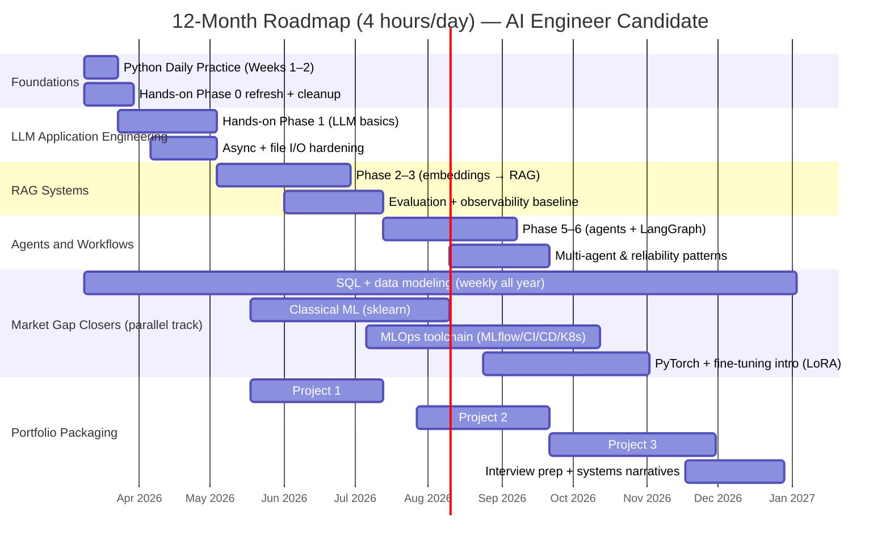

# Deep Research Report on Two GitHub Curricula and 2026 AI Job-Market Alignment

## Executive summary

Both repositories are valuable, but they serve different purposes. **Python-Daily-Practice** is a *short, test-driven Python fluency sprint* (currently two weeks + projects) that strengthens “daily driver” Python and software engineering habits via functions/classes/exceptions/context managers and incremental projects. citeturn11view0turn11view1turn21view2turn21view3turn24view0  
**hands-on-ai-engineering** is a *much broader applied LLM/AI engineering curriculum* built around implementing real components (LLM client, embeddings, vector stores, RAG, agents, LangGraph workflows, LlamaIndex, evaluation, observability, cost controls). It explicitly tracks chapter-by-chapter learning objectives and “correctness properties,” and reports meaningful progress already completed. citeturn9view0turn31view1turn8view0  

From a 2026 hiring-signal view, your current curricula map strongly to **AI Engineer / GenAI Engineer / AI-RAG Engineer** roles (RAG + agents + evaluation + production concerns). Job postings in that space repeatedly ask for **RAG pipelines (ingestion/chunking/embeddings/retrieval), agent patterns (ReAct / multi-agent), vector databases/search infrastructure, and production monitoring/evaluation.** citeturn25search5turn25search17turn25search7turn25search2  
However, the combined curricula leave **major gaps** for **ML Engineer** and **Data Scientist** tracks: notably **SQL + data modeling, classical ML fundamentals (scikit-learn), deep learning training (PyTorch), and end-to-end MLOps for training/inference (MLflow, orchestration, CI/CD, cloud/IaC).** Those gaps appear frequently in ML/MLOps job postings (MLflow/Kubeflow/SageMaker, Kubernetes/Docker, cloud, Spark/Ray, model monitoring). citeturn25search2turn25search14turn25search16turn25search20turn25search0  

With **4 hours/day for one year**, you have enough capacity to complete both repos *and* add the missing market-critical blocks. A full year at 4 hours/day is **~1,460 hours** (or **~1,040 hours** if you study 5 days/week). This is far more time than the “reading-time” estimates inside the hands-on curriculum, so the realistic question is not feasibility—it is **prioritization, sequencing, and portfolio-quality output.** citeturn9view0turn31view1turn7view0  

**Recommendation:** Start studying *now* (prep is part of study). Begin with a short Python calibration (Python-Daily-Practice + hands-on Phase 0) and immediately pivot into “LLM application engineering” while you simultaneously build the missing pillars (SQL + classical ML + MLOps/cloud). This produces market-ready evidence earlier and reduces the risk of spending months “preparing to start.” citeturn9view1turn31view1turn25search5turn25search2  

## Repository audit and extracted curricula

### Python-Daily-Practice curriculum extraction

The repository is structured as a daily plan (currently **Day 00 + Weeks 01–02**) with **pytest-driven exercises** and two weekly projects. Week 01 explicitly targets Python fundamentals; Week 02 targets intermediate Python with OOP and protocol-level features (magic methods, context managers, comprehensions/generators). citeturn11view0turn11view1turn11view2  

**Day 00 (assessment):** setup verification + diagnostic across “six areas,” meant to be retaken after Day 42 (future scope implied). citeturn11view2  

**Week 01: The Foundation (Days 01–07):**
- Day 01: variables, types, conversion, `isinstance`, multiple assignment; build five functions (type classification, safe conversion, swapping, profile dict, list statistics). citeturn12view0turn14view0turn14view1  
- Day 02: strings, f-strings, methods, slicing, formatting; reverse/count vowels/title-case/extract digits/format greeting. citeturn15view0turn15view1  
- Day 03: lists & tuples, indexing/slicing/unpacking; rotate lists, interleave, chunking, second largest, tuple stats (mean/median). citeturn15view2  
- Day 04: dictionaries & sets; merge dicts, invert dict, set intersection, group-by-length, dict diff. citeturn15view3  
- Day 05: control flow (`if/elif/else`, loops, nested loops); fizzbuzz, Collatz, palindrome, primes, 2D matrix sum. citeturn16view0  
- Day 06: functions/scope; default args, `*args/**kwargs`, closures, `lambda`, decorators (retry), memoization, composition. citeturn16view1  
- Day 07 weekly project: **Student Grade Analyzer** (multi-file pipeline: `utils.py`, `core.py`, `main.py`, integration tests). citeturn16view2turn18view0turn18view1turn18view2turn18view3  

**Week 02: Intermediate Python (Days 08–14):**
- Day 08: error handling + custom exceptions; exception chaining; retry logic; validation pipelines. citeturn20view0turn21view0  
- Day 09: context managers + resource management; build class-based context managers and patterns (timer, indentation nesting, temp attribute override, exception suppressor, transaction rollback). citeturn20view1turn21view1  
- Day 10: OOP (classes + inheritance); build `Shape` hierarchy and a `BankAccount` + `SavingsAccount` with business rules. citeturn21view2  
- Day 11: magic methods + properties; implement arithmetic/comparison/container protocols (`Money`, `Playlist`) and a conversion/validation property model (`Temperature`). citeturn21view3  
- Day 12: comprehensions + generators; comprehension transforms and generator pipelines/batching. citeturn22view0turn23view0  
- Day 13: unpacking + Pythonic idioms; `*`/`**`, `zip`, `enumerate`, walrus operator, EAFP-safe navigation, functional pipelines. citeturn23view1  
- Day 14 weekly project: **Inventory Management System** (OOP + exceptions + magic methods + context manager + comprehension-based reporting). citeturn23view2turn24view0turn24view1turn24view2turn24view3  

**Issues found that affect study-flow (important):**
- Week 01 Day 01 includes **file naming/import inconsistencies**: the folder contains `exercises.py` and `test_exercises.py`, but tests attempt to import from `solution_template`, and README mentions `pytest test_solution.py`. This will create avoidable friction unless fixed before you start. citeturn13view0turn14view1turn12view0  

### hands-on-ai-engineering curriculum extraction

This repository contains multiple layers/variants, but the **Layer2-Curriculum** appears to be the most structured “chapterized” curriculum, split into phase folders (Phase 0 foundations through Phase 10 domain system). citeturn8view0  

The project reports (as of **2026-01-18**) **19/54 chapters complete**, Phase 0 and Phase 1 complete, Phase 2 in progress (with Chunking + Document Loaders pending). citeturn9view0  

The roadmap file (Layer2-Curriculum/docs/roadmap-v6.md) includes an explicit phase-by-phase outline with learning objectives, key concepts, prerequisites, and correctness properties. citeturn31view1  

Key extracted modules (from the roadmap excerpt you provided in-repo) include:

**Phase 3: RAG Fundamentals (Ch 17–22)**  
- Ch 17 “Your First RAG System”: core RAG pattern, citations, “I don’t know” handling. citeturn31view1  
- Ch 18 LCEL (LangChain Expression Language): composable chains, parallel execution, fallbacks. citeturn31view1  
- Ch 19 retrieval strategies: multi-query, compression retrievers, hybrid search, reranking. citeturn31view1  
- Ch 20 conversational RAG: memory, question rewriting, pronoun resolution. citeturn31view1  
- Ch 21 RAG evaluation: retrieval metrics, faithfulness, hallucination detection, RAGAS. citeturn31view1  
- Ch 22 advanced RAG patterns: parent retrieval, auto-merge, HyDE, incremental indexing/change detection. citeturn31view1  

**Phase 4: LangChain Core (Ch 23–25)**  
Document loaders/splitters, memory/callbacks (token tracking + event handlers), output parsers (Pydantic parsers + parse error recovery). citeturn31view1  

**Phase 5: Agents (Ch 26–30)**  
Intro agents, ReAct pattern, OTAR loop, tool/function calling, agent memory & context pruning with vector stores. citeturn31view1turn30search1  

**Phase 6: LangGraph (Ch 31–34)**  
State-machine workflows, conditional routing, human-in-the-loop, checkpoint persistence & recovery (“time-travel debugging”). citeturn31view1  

**Phase 7: LlamaIndex (Ch 35–38 + 38A)**  
Index fundamentals, query engines & response synthesis, multi-index systems including knowledge graphs, hybrid search + reranking, GraphRAG & Neo4j concepts. citeturn31view1  

**Phase 8: Production (Ch 39–42 + 40A–C)**  
Hypothesis-based testing for AI systems; LangSmith evaluation; Arize Phoenix observability; distributed tracing & cost analytics; security/prompt-injection defense; token management & caching strategies. citeturn31view1turn25search7turn25search27  

**Phase 9: Multi-agent systems (Ch 43–48 + 48A)**  
Multi-agent fundamentals, communications/coordination, CrewAI team workflows, etc. citeturn31view1turn25search5  

Additional repo-level design decisions and pedagogy are documented in “Curriculum Evolution Decisions” and the “Curriculum Implementation Roadmap,” including:
- “LLM call in 15 minutes” as a deliberate motivation principle, and a shift to **Action-first then deep dive** writing. citeturn6view0  
- Planned/added foundations such as **file handling/path management** and **asyncio fundamentals** as critical prerequisites for real AI apps (streaming, concurrency, frameworks). citeturn6view0turn7view0  

**Structural issues to address before using it as a day-to-day curriculum:**
- There are **duplicate/parallel versions of chapters** (e.g., `chapter-07-your-first-llm-call.md` and `...-ENHANCED.md`) and even duplicate asyncio chapter files (`chapter-12A-async-await-fundamentals.md` vs `chapter-12A-asyncio-fundamentals.md`). This suggests the repo is both a curriculum and an evolving authoring workspace; you’ll want a “student path” branch/tag to reduce ambiguity. citeturn10view0turn6view0  
- The Phase-1 folder also contains files labeled “chapter-22A/B/C” (advanced python patterns/performance/testing), indicating some topical misplacement that can confuse sequencing. citeturn10view0  

## Current AI job-market skills landscape for target roles

This section synthesizes **primary job postings** plus **recent surveys** to rank core skills by (a) hiring demand signals, (b) market leverage/salary impact proxies, and (c) entry-level vs mid-level expectations.

### Cross-role baseline skills with the clearest 2026 demand signal

Across roles (AI Engineer/GenAI, ML Engineer, MLOps, Data Scientist), the strongest “always asked” stack is:

Python + SQL + Docker + Cloud + basic ML/metrics.

Evidence:
- Stack Overflow’s 2025 survey shows Python and SQL among the most used languages, and Docker as “near-universal,” with AWS/Azure/GCP and Kubernetes also strongly represented. citeturn29search0  
- ML/AI job postings explicitly mention cloud platforms (AWS/GCP/Azure) and containerization/orchestration (Docker/Kubernetes). citeturn25search16turn25search0turn25search24turn25search2  

### Role-specific “skill priority stacks” from job postings

**AI Engineer / GenAI Engineer (LLM apps, RAG, agents):**
High-signal skills are:
- RAG end-to-end (ingestion → chunking → embeddings → hybrid/keyword search → evaluation loops) citeturn25search5turn31view1turn30search0  
- Agent patterns/frameworks (ReAct, LangGraph/CrewAI, multi-agent) citeturn25search5turn31view1turn30search1  
- Production search/vector infrastructure (OpenSearch/Elasticsearch, vector DB ops, monitoring) citeturn25search5turn29search0  
- API/service delivery (FastAPI growth is notable in the Stack Overflow 2025 tech section) citeturn29search0  
- Evaluation/observability (LangSmith “evaluate a RAG application” tutorial, and broader LangSmith tooling) citeturn25search7turn25search27  

**ML Engineer:**
Common requirements include:
- Deep learning frameworks (PyTorch/TensorFlow/JAX) and model training/evaluation citeturn25search20turn25search24  
- Full lifecycle from data pipelines → training → deployment → monitoring, often including distributed processing (Spark/Ray) citeturn25search20turn25search0  
- Containerization + cloud deployment, and MLOps tools (MLflow/Kubeflow/SageMaker) citeturn25search2turn25search14turn25search24  

**Data Scientist:**
Market expectations still strongly include:
- SQL + Python + statistics/experimentation, and production adjacency (deployment-awareness) even if not fully “MLOps.” This aligns with the Stack Overflow 2025 dominance of SQL/Python and broad AI tool adoption. citeturn29search0turn29search1  

**MLOps:**
Very consistent requirements include:
- MLflow/Kubeflow/SageMaker, CI/CD, monitoring/observability, IaC, Kubernetes GPU scheduling at advanced levels. citeturn25search2turn25search14turn25search0  

**Prompt Engineer:**
The market is fragmented and often **skews senior** (“Prompt Engineer” postings frequently demand substantial experience plus RAG/LLM integration). citeturn25search11turn25search3  
A more robust modern framing is “prompt + context engineering + evaluation,” which also appears in LLM application postings and evaluation tooling docs. citeturn25search27turn31view1turn25search5  

### Salary impact proxies you can use safely

Direct salary numbers vary wildly by geography and seniority, but two defensible macro-signals for “salary leverage” are:
- **AI skill premiums / bidding wars** reported broadly in 2025 tech coverage, suggesting “AI + production engineering” can command higher compensation. citeturn26news48turn26news49  
- Persistent adoption and tooling trends: broad developer workflows increasingly include AI tools (84% using or planning to use them), and Docker/Kubernetes/cloud are mainstream. Skills that sit at that intersection (AI + production) are more likely to be valued. citeturn29search1turn29search0  

## Mapping repository topics to market skills, identifying gaps and redundancies

### Market-skill coverage map

The table below is the compact “what you learn vs what jobs ask for” mapping (✅ strong coverage, ◐ partial, ❌ missing). Citations in the last column point to the most direct repo evidence.

| Market skill cluster (2026) | AI/GenAI Engineer | ML Engineer | Data Scientist | MLOps | Prompt Engineer | Coverage in hands-on-ai-engineering | Coverage in Python-Daily-Practice | Repo evidence |
|---|---|---|---|---|---|---|---|---|
| Python fluency & SWE habits (functions/OOP/errors/tests) | High | High | High | High | Medium | ✅ (Phase 0 foundations + quality gates; Hypothesis testing appears later) | ✅ (daily exercises + 2 projects) | citeturn9view0turn31view1turn16view1turn24view0 |
| Type hints + schema validation (Pydantic) | High | Medium | Medium | Medium | Medium | ✅ (Pydantic structured outputs + parsers mentioned in roadmap) | ◐ (typing used, but not a full typing curriculum) | citeturn31view1turn21view3 |
| Async + streaming + concurrency | High | Medium | Low | Medium | Medium | ◐ to ✅ (async chapters planned/added; streaming + tracing in roadmap) | ❌ | citeturn7view0turn31view1 |
| APIs/services (FastAPI, production endpoints) | High | Medium | Low | Medium | Low | ◐ (production focus present; explicit FastAPI isn’t visible in excerpts) | ❌ | citeturn31view1turn29search0 |
| SQL + relational modeling | High | High | High | Medium | Low | ❌ (not emphasized in extracted phases) | ❌ | citeturn29search0turn25search16 |
| Classical ML (sklearn, feature engineering, model eval) | Medium | High | High | Medium | Low | ❌ (curriculum is LLM-heavy) | ❌ | citeturn25search20turn25search16 |
| Deep learning training (PyTorch/TensorFlow) | Medium | High | Medium | Medium | Low | ❌ (fine-tuning appears as future addition, not core completed) | ❌ | citeturn7view0turn25search20turn30search2 |
| Embeddings + vector DB + retrieval | Very High | Medium | Medium | Medium | Medium | ✅ (Phase 2–4 + hybrid search + GraphRAG) | ❌ | citeturn9view0turn31view1turn25search5 |
| RAG engineering + evaluation | Very High | Medium | Medium | Medium | High | ✅ (RAG + RAGAS + LangSmith evaluation) | ❌ | citeturn31view1turn25search7 |
| Agents + tool/function calling + workflows | Very High | Medium | Low | Medium | High | ✅ (ReAct, OTAR, tool calling, LangGraph, CrewAI) | ❌ | citeturn31view1turn30search1turn25search5 |
| Observability + testing for AI systems | High | Medium | Low | High | Medium | ✅ (Hypothesis, LangSmith, Phoenix, tracing, cost analytics) | ◐ (pytest discipline; not observability) | citeturn31view1turn24view3turn25search2 |
| MLOps toolchain (MLflow/Kubeflow/SageMaker, model registry) | Medium | High | Medium | Very High | Low | ❌ (not in core extracted path) | ❌ | citeturn25search2turn25search0turn25search14 |
| Cloud + Docker + Kubernetes + IaC | High | High | Medium | Very High | Low | ◐ (production concerns present; infra details not primary in roadmap excerpt) | ❌ | citeturn29search0turn25search14turn25search0 |

### Redundancies and misordered topics

Redundancy is not inherently bad, but with only 4 hours/day you should avoid *accidental duplication*.

The main overlaps:
- Python fundamentals: both repos cover **exceptions**, **OOP**, **context managers**, and “Pythonic idioms.” citeturn11view1turn21view0turn21view1turn10view0  

The main misordering / organization issues impacting a learner:
- **Python-Daily-Practice Week 01** has naming mismatches (README/test naming vs actual files, and import mismatch). Fixing this is a “first-hour” repair task. citeturn13view0turn14view1turn12view0  
- **hands-on-ai-engineering** has duplicate chapter variants and “chapter-22A/B/C” located in a Phase-1 folder (likely should be Phase 0/early foundations or a dedicated advanced block). This can confuse sequencing (“what is the canonical path?”). citeturn10view0turn6view0  

### The biggest gaps vs the 2026 market

If you want credible eligibility across **AI Engineer + ML Engineer + MLOps** postings, you need to add the following missing pillars:

- **SQL + data modeling + analytics workflows** (Postgres, joins, window functions, schema design). This is strongly justified by Stack Overflow’s 2025 tech usage (SQL is top-tier) and the reality that retrieval systems and ML systems both depend on data boundaries and operational stores. citeturn29search0turn25search0  
- **Classical ML** (sklearn, feature engineering, metrics, validation, leakage). Without it, you are “LLM-app-only,” which narrows roles. ML postings emphasize fundamentals and evaluation frameworks. citeturn25search20turn25search16  
- **Deep learning training and fine-tuning** (PyTorch + LoRA/QLoRA conceptually and practically). Your hands-on repo explicitly plans fine-tuning additions, and the original LoRA paper is a canonical reference. citeturn7view0turn30search2  
- **MLOps and training-to-serving lifecycle** (MLflow/Kubeflow/SageMaker, CI/CD, monitoring). Multiple MLOps postings cite these toolchains explicitly. citeturn25search2turn25search14turn25search0  

## Realistic completion timelines with 4 hours/day

### Your capacity over one year

At **4 hours/day**:
- If you study every day: **~1,460 hours/year** (4 × 365).  
- If you study 5 days/week: **~1,040 hours/year** (4 × 5 × 52).  

Given that real learning requires rework, projects, and revision, plan on **70–80% utilization** toward deep skill building (the rest goes to setup, debugging environment issues, and life). This is consistent with the hands-on repo emphasizing verification scripts and quality gates as non-negotiable. citeturn7view0turn9view1  

### Repo completion time estimates

**Python-Daily-Practice (current scope: Day 00 + 2 weeks + 2 weekly projects)**  
Nominal stated time is short (20–40 min per day + ~60 min projects), but realistic mastery time includes debugging tests, rewriting solutions cleanly, and spaced repetition:
- Realistic completion (first pass + passing all tests): **~40–60 hours** (~2–3 weeks at 20h/week, or ~10–15 days if truly 4h/day). citeturn11view0turn11view1turn24view3  

**hands-on-ai-engineering (LLM engineering curriculum)**  
The repo itself reports:
- Completed chapters: “~35 hours” and remaining “~36 hours” (as of 19/54 complete) in the progress summary. citeturn9view0  
Roadmap time totals for later phases are also in the multi-hour range per phase. citeturn31view1  

But for a job-ready outcome (you can *build and explain* systems, not just read), a realistic multiplier is **~2.5× to 4×** the “curriculum time,” because you must implement, test, refactor, and build portfolio artifacts (especially for RAG/agents/production). This is aligned with the repo’s own emphasis on verification scripts and quality gates. citeturn7view0turn31view1  

A practical estimate (depending on depth):
- **~200–330 hours** to finish the hands-on curriculum with strong retention and a portfolio-quality capstone (≈10–16 weeks at 20h/week, or 7–12 weeks at 28h/week). citeturn31view1turn9view0  

### Combined curriculum and year plan

If you do both repos plus essential market additions (SQL + ML fundamentals + MLOps), the total can still fit well within a year:

- Python-Daily-Practice: ~40–60h  
- hands-on-ai-engineering: ~200–330h  
- Add-on blocks to close market gaps (recommended):  
  - SQL + data modeling: ~60–100h  
  - Classical ML (sklearn + evaluation): ~120–180h  
  - MLOps (MLflow + CI/CD + Docker/K8s basics): ~120–220h  
  - Portfolio projects (3–5 strong projects): ~250–400h  

Total: **~790–1,290 hours**, which fits the **1,040–1,460 hour** budget depending on whether you study 5 or 7 days/week.

## Recommendation on when to start and how to sequence learning

You should **start now**, but start with a **sequenced and simplified “student path”** to avoid getting trapped in repo authoring complexity.

Why “start now” is rational:
- The broader ecosystem has normalized AI tooling: Stack Overflow’s 2025 survey reports **84%** of respondents are using or planning to use AI tools, and 51% of professional developers use them daily. citeturn29search1  
- Modern AI jobs increasingly demand **production-grade workflows** (evaluation + monitoring + deployment) rather than “toy demos,” which aligns with the hands-on repo’s focus on RAG evaluation and observability. citeturn31view1turn25search5turn25search2  

### A recommended sequencing principle

A strong market sequence is:

**(Python + SWE discipline) → (LLM app basics) → (RAG) → (Evaluation/observability) → (Agents/workflows) → (Deployment/MLOps) → (Classical ML + deep learning + fine-tuning)**

This matches:
- “LLM call quickly” motivation principle in the hands-on repo, but without skipping fundamentals like async/file I/O and testing. citeturn6view0turn7view0  
- Job postings that require not just building, but operating RAG/agent systems in production with monitoring and feedback loops. citeturn25search5turn25search2turn25search0  

## Curriculum enhancements, weekly plan, and milestone roadmap

### Prioritized action list

1. **Create a “student path” branch or folder** (even locally) that points to one canonical chapter file per topic (avoid ENHANCED duplicates unless you explicitly choose them). This removes ambiguity caused by multiple versions and mislocated chapters. citeturn10view0turn6view0  
2. **Fix Python-Daily-Practice file/test naming mismatches** in Week 01 so you can run tests smoothly without renaming imports every day. citeturn13view0turn14view1turn12view0  
3. **Add an explicit SQL track** (Postgres) starting in Month 1, continuing weekly all year. SQL demand is consistently high in Stack Overflow technology usage and is foundational for data-heavy AI systems. citeturn29search0turn25search0  
4. **Add classical ML fundamentals (sklearn) by Month 3** to keep ML Engineer and Data Scientist doors open; job postings repeatedly require ML fundamentals and model evaluation. citeturn25search20turn25search16  
5. **Add MLOps lifecycle tooling by Month 6** (MLflow + CI/CD + Docker/K8s + cloud basics). This aligns with MLOps postings that expect robust infrastructure management. citeturn25search2turn25search14turn25search0  
6. **Build portfolio artifacts continuously**: at least 1 repo-quality project per quarter in addition to exercises (RAG app, agentic workflow app, ML project, MLOps deployment). The coinmarketcap AI/RAG posting is a good “spec” for what real RAG engineer work looks like. citeturn25search5  

### Table comparing current vs recommended curricula and timelines

| Component | Current repo reality | Risk | Recommended enhancement | Target outcome |
|---|---|---|---|---|
| Python foundations | Strong coverage via Python-Daily-Practice Days 01–14 and Hands-on Phase 0 foundations. citeturn11view0turn11view1turn9view0 | Duplicated effort + test friction in Week 01. citeturn14view1turn13view0 | Use Python-Daily as “drills,” Hands-on as “systems”; fix naming; add spaced repetition review days. citeturn6view0 | Fast, confident Python + clean code habits |
| LLM fundamentals | Hands-on includes LLM client, structured output, streaming, tool calling foundations. citeturn9view0turn31view1 | Version ambiguity (multiple chapter variants) can slow you down. citeturn10view0 | Freeze a single canonical chapter version per topic to study; treat “ENHANCED” as optional reading. | Faster progress, higher trust in your path |
| RAG engineering | Strong end-to-end path: chunking → loaders → RAG → retrieval strategies → evaluation. citeturn9view0turn31view1 | Needs production data realism (SQL stores, queues) to match many companies. citeturn25search0 | Add “RAG system on real data” project: Postgres + OpenSearch/Elasticsearch + vector DB with monitoring. citeturn25search5turn29search0 | Job-aligned RAG portfolio |
| Agents/workflows | Rich coverage (ReAct/OTAR/LangGraph/CrewAI). citeturn31view1turn30search1 | Risk of “framework collecting” without clear evaluation harness. | Require evaluation + telemetry for each agent workflow (LangSmith/Phoenix style). citeturn31view1turn25search7 | Production-minded agent engineer profile |
| ML Engineer fundamentals | Not central in either repo. | Limits ML Engineer roles. citeturn25search20turn25search24 | Add a parallel ML block: sklearn + PyTorch training + metrics + model serving practices. citeturn25search20turn30search2 | Dual-eligibility (GenAI + ML Eng) |
| MLOps stack | Has evaluation/observability for LLM systems, but not full MLflow/Kubeflow lifecycle focus. citeturn31view1turn25search2 | May underprepare for MLOps Engineer roles. citeturn25search14 | Add MLflow + CI/CD + IaC + Kubernetes fundamentals explicitly. citeturn25search2turn29search0 | Credible MLOps readiness |

### Suggested weekly study plan template

Use 4 hours/day as:

- **90 min build**: implement exercises or chapter code (tests must pass)  
- **60 min deepen**: read the chapter/doc + annotate your notes (why it works, failure modes)  
- **60 min portfolio**: integrate what you learned into your “one evolving portfolio system”  
- **30 min spaced repetition**: flashcards + re-implement a previously learned function/mini-module from memory

This matches the hands-on repo’s “Action-first then deep dive” pedagogy. citeturn6view0  

### Milestone roadmap

#### Six-month milestone

By 6 months, you should be able to:
- Build and deploy at least one RAG system with evaluation and tracing (LangSmith/Phoenix-like), plus one agent workflow (ReAct or LangGraph). citeturn31view1turn25search7turn30search1  
- Demonstrate strong Python correctness habits (pytest discipline and OOP protocols). citeturn24view3turn21view3  
- Show working SQL capability (your biggest missing market block). citeturn29search0  

#### Nine-month milestone

By 9 months, you should add:
- A classical ML project (sklearn) and a deep learning mini-project (PyTorch) to expand beyond “LLM-app-only,” aligning to ML Engineer postings. citeturn25search20turn25search24  
- A reproducible MLOps pipeline “lite” (training → registry → deploy → monitor), matching MLOps job requirements. citeturn25search2turn25search14  

#### Twelve-month milestone

By 12 months, you should have:
- 3–5 portfolio-grade projects:
  - Production RAG + evaluation + telemetry (your flagship) citeturn31view1turn25search5  
  - Agentic workflow / multi-agent system with guardrails and replayable traces citeturn31view1turn25search5  
  - Classical ML prediction project with strong validation and interpretability citeturn25search20  
  - MLOps pipeline project (Kubernetes/Docker/cloud basics + CI/CD) citeturn25search14turn29search0  
- An interview-ready narrative anchored in primary research: you can explain why RAG exists (Lewis et al., 2020), why agent prompting patterns like ReAct work (Yao et al., 2022), and what LoRA is doing if you move into fine-tuning (Hu et al., 2021). citeturn30search0turn30search1turn30search2  

### Mermaid roadmap chart



## Links and repository file references

Use these commands locally (so you can truly “clone and inspect”):

```bash
git clone https://github.com/AhmedTElKodsh/hands-on-ai-engineering.git
git clone https://github.com/AhmedTElKodsh/Python-Daily-Practice.git
```

Key curriculum files used in this analysis (direct raw links):

```text
hands-on-ai-engineering
- https://raw.githubusercontent.com/AhmedTElKodsh/hands-on-ai-engineering/main/PROGRESS-SUMMARY.md
- https://raw.githubusercontent.com/AhmedTElKodsh/hands-on-ai-engineering/main/QUICKSTART.md
- https://raw.githubusercontent.com/AhmedTElKodsh/hands-on-ai-engineering/main/Layer2-Curriculum/docs/CURRICULUM-IMPLEMENTATION-ROADMAP.md
- https://raw.githubusercontent.com/AhmedTElKodsh/hands-on-ai-engineering/main/Layer2-Curriculum/docs/CURRICULUM-EVOLUTION-DECISIONS.md
- https://github.com/AhmedTElKodsh/hands-on-ai-engineering/blob/main/Layer2-Curriculum/docs/roadmap-v6.md

Python-Daily-Practice
- https://raw.githubusercontent.com/AhmedTElKodsh/Python-Daily-Practice/main/week-01-the-foundation/README.md
- https://raw.githubusercontent.com/AhmedTElKodsh/Python-Daily-Practice/main/week-02-intermediate-python/README.md
- https://raw.githubusercontent.com/AhmedTElKodsh/Python-Daily-Practice/main/week-02-intermediate-python/day-14-weekly-project/README.md
```

Primary market sources used (examples; see inline citations throughout):
- Job postings: Greenhouse/Lever postings and Indeed results pages citeturn25search0turn25search5turn25search2turn25search14turn25search20  
- Surveys: Stack Overflow 2025 Developer Survey (Technology + AI sections) citeturn29search0turn29search1turn29search2  
- Original papers: RAG (Lewis et al., 2020), ReAct (Yao et al., 2022), LoRA (Hu et al., 2021), Self-RAG (Asai et al., 2023) citeturn30search0turn30search1turn30search2turn30search3