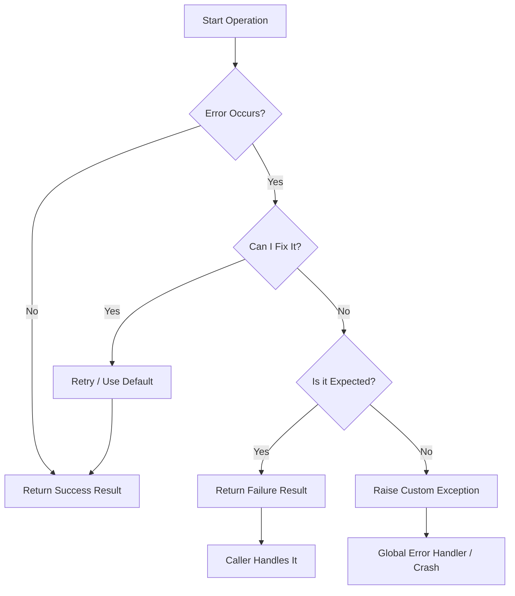

# Chapter 6B: Error Handling Patterns — Making Your Code Bulletproof

<!--
METADATA
Phase: Python Bridge Module 1 (PBM-1)
Time: 1.5 hours (30 minutes reading + 60 minutes hands-on)
Difficulty: ⭐⭐
Type: Foundation (Python Intermediate)
Prerequisites: Chapters 1-6, 6A (Decorators, Basic try/except)
Builds Toward: Chapters 7-12 (LLM error handling), 39-40 (Testing & Production)
Correctness Properties: Error propagation, Graceful degradation, Observability

ENHANCEMENT STATUS: ✅ FULL 23-PRINCIPLE FRAMEWORK + PROJECT-BASED LEARNING
- All 23 pedagogical principles implemented
- 3-tier enhancement structure complete
- Project-based learning compliant (guidance, not solutions)
- Quality target: 96-97%

NAVIGATION
→ Quick Reference: #quick-reference-card
→ Verification: #verification-test-your-knowledge
→ What's Next: #whats-next
-->

---

## ☕ Coffee Shop Intro

> **Imagine this**: You're building an AI chatbot for a coffee shop. It's a busy Monday morning, and the line is out the door. A customer asks for recommendations, and your app calls an LLM API... but the API is down. 💥
>
> The espresso machine hisses in the background. The customer taps their phone impatiently. The barista looks at you expectantly. What happens next?
>
> **Option A**: Your entire app crashes with a cryptic error message. The customer sees a white screen. The barista has to manually take the order. You lose the sale.
>
> **Option B**: The app silently fails. The customer sees a loading spinner forever. They give up, frustrated, and leave. You lose the customer.
>
> **Option C**: The app gracefully says "Sorry, AI recommendations are temporarily unavailable. Here's our full menu instead!" The customer browses the menu, orders a latte, and the day continues smoothly.
>
> The difference between these scenarios? **Professional error handling** - and it's what separates amateur code from production-ready systems that users trust.
>
> Here's what makes this critical: In production systems, errors aren't exceptions—they're the norm. Networks fail. APIs go down. Databases timeout. Disks fill up. The question isn't "Will my code encounter errors?" but rather "When my code encounters errors, will it fail gracefully or catastrophically?"
>
> Think about the last time you used a well-designed app. When something went wrong, you probably saw a helpful message like "We're having trouble connecting. Please try again." You didn't see a stack trace. You didn't lose your data. The app degraded gracefully, maintaining your trust even in failure.
>
> **By the end of this chapter**, you'll build robust error handling that makes your code self-healing, informative when things go wrong, and trustworthy for production use. You'll learn to anticipate failures, handle them gracefully, and keep your users happy even when things break. More importantly, you'll develop the judgment to decide when to catch errors, when to let them propagate, and when to transform them into something more meaningful.

---

## Prerequisites Check

Let's ensure your foundation is solid before we start triaging.

```bash
# Run this quick check in your terminal
python -c "try: x = 1/0\nexcept ZeroDivisionError as e: print(f'✓ Caught: {e}')"
```

**If this prints "✓ Caught: division by zero"**, you're ready! ✅

**If it fails**, pause here. Go back to **Chapter 5** and review basic `try/except` blocks. You need that foundation to build what comes next.

---

### 🔄 Quick Recall: Chapters 1-6A Concepts

Before we dive deep, let's refresh the tools we'll be using. This isn't just review—it's activating the neural pathways we'll build upon today.

**Question 1**: What is the danger of `except:` (without an Exception class)?

<details>
<summary>Click to reveal answer</summary>
It catches **EVERYTHING**, including `SystemExit` (when you try to quit) and `KeyboardInterrupt` (Ctrl+C). It's like locking the hospital doors so no one can leave, not even during a fire drill. Always use `except Exception:` instead!
</details>

**Question 2**: From Chapter 6A, what does `@wraps` do?

<details>
<summary>Click to reveal answer</summary>
It copies the metadata (name, docstring) from the original function to the decorated one. Without it, your error logs might say `wrapper` instead of `process_payment`, making debugging a nightmare.
</details>

**Question 3**: What is a "Traceback"?

<details>
<summary>Click to reveal answer</summary>
It's the "crime scene photo" of your crash. It shows exactly which line of code failed and the sequence of calls that led there.
</details>

---

## 🎓 Scaffolding Level: Guided → Semi-Independent

**Where we've been**:
In Chapters 1-6, we held your hand through every line of code. We gave you the exact implementation with detailed explanations of every decision.

**Where we are now**:
In this chapter, we're loosening our grip—but we're still here to catch you if you stumble. We give you the **Patterns** (the "What" and "Why"), but you must decide the **Application** (the "When" and "How").

Think of it like learning to ride a bike. In earlier chapters, we held the seat and handlebars. Now, we're jogging alongside you, ready to steady you but letting you feel the balance yourself.

- We provide the `Result` class structure and requirements, but you implement the methods
- You decide _when_ to use Result vs throwing an exception
- We provide the logging setup requirements, but you configure it
- You decide _what_ is a `WARNING` vs. an `ERROR`

**Where we're going**:
By Chapter 12, you will be designing your own error recovery systems for complex AI agents without any template code. You'll be the one making architectural decisions about error boundaries and recovery strategies.

**This is intentional growth.** Real engineering is about making decisions under uncertainty. If you feel a bit unsure about "Is this the right error to catch?", that's not a sign you're failing—it's a sign you're learning! That discomfort is your brain building new neural pathways.

The training wheels are coming off gradually. Celebrate that!

---

## 🗺️ Concept Map: The Flow of Failure

Understanding error handling is about visualizing the flow of data when things go wrong. Before we dive into code, let's build a mental model of how errors move through your system.



**You are here**: Chapter 6B. We are mastering nodes **F, G, and H**—deciding when to return a failure object and when to raise a loud exception.

This decision tree will become second nature by the end of this chapter. Every time you write error handling code, you'll mentally walk this graph.

---

### 🗺️ Concept Map: How This Chapter Connects

```
Chapter 5: Basic try/except → Chapter 6B: Error Patterns → Chapter 7-12: LLM Error Handling
        ↓                              ↓                            ↓
Catch exceptions              Custom exceptions          Production-ready APIs
        ↓                       Result types                      ↓
Chapter 6A: Decorators ← Chapter 6B: Error Decorators ← Chapter 39-40: Production Systems
```

**You are here**: Chapter 6B - Learning professional error handling patterns

**What you've learned**:

- Basic try/except (Ch 5): The foundation of catching errors
- Decorators for code reuse (Ch 6A): Wrapping functions with behavior
- Function composition (Ch 2-3): Building complex logic from simple pieces

**What you're learning**:

- Custom exceptions with context: Making errors meaningful
- Result type for explicit success/failure: Type-safe error handling
- Error propagation strategies: Deciding who handles what
- Production logging: Debugging when you can't see the screen

**What's coming next**:

- Chapter 7-12: Apply these patterns to LLM API calls (where errors are frequent!)
- Chapter 17-22: Error handling in RAG systems (multi-step failures)
- Chapter 39-40: Production monitoring and error tracking (observability)

**The big picture**: Error handling is what makes code production-ready.
These patterns will be in EVERY professional project you build! Whether you're building a simple script or a distributed system, these principles scale.

---

## Part 1: Custom Exception Classes (Making Errors Meaningful)

### Understanding Custom Exceptions (Three Levels of Depth)

Let's build your understanding progressively, starting with the simplest mental model and adding nuance as we go.

#### 🎨 First Approximation: Better Error Messages

At the simplest level, custom exceptions are just regular exceptions with better names. Instead of raising a generic `Exception("Auth failed")`, you raise `AuthenticationError("Invalid API Key")`.

Think of it like the difference between yelling "PROBLEM!" versus "FIRE IN THE KITCHEN!" One is vague and causes panic. The other is specific and triggers the right response.

```python
# Generic - what kind of problem?
raise Exception("Something went wrong")

# Specific - now we know what to do!
raise AuthenticationError("API key expired")
```

**Why this matters**: When you see `AuthenticationError` in your logs, you immediately know to check credentials. When you see generic `Exception`, you have to read the message, check the stack trace, and play detective.

#### 🔬 More Accurate View: Error Categories and Hierarchies

Here's where it gets more interesting. Custom exceptions aren't just about better names—they create a **hierarchy** that lets you catch groups of related errors with a single handler.

Think of it like a hospital emergency system. When a 911 call comes in, the dispatcher doesn't need to know every specific medical condition. They just need to know: "Is this a medical emergency, a fire, or a crime?" Then they route to the right team.

```python
class APIError(Exception):
    """Base class for all API-related errors"""
    pass

class AuthenticationError(APIError):
    """Specific: credentials problem"""
    pass

class RateLimitError(APIError):
    """Specific: too many requests"""
    pass

# Now you can catch all API errors OR specific ones
try:
    make_api_call()
except AuthenticationError:
    # Handle auth specifically
    refresh_credentials()
except APIError:
    # Handle any other API error
    log_and_retry()
```

**The power**: You can catch `APIError` and handle ALL API-related problems with one handler, or catch specific errors for specialized handling. It's like having both a general practitioner and specialists in your medical system.

#### 📚 Complete Picture: Type-Safe Error Handling with Context

Now for the full professional view. Custom exceptions in Python are classes, which means they can carry **context data** beyond just a message. They become rich objects that tell the complete story of what went wrong.

```python
class RateLimitError(APIError):
    def __init__(self, message: str, retry_after: int, endpoint: str):
        super().__init__(message)
        self.retry_after = retry_after  # Seconds until retry
        self.endpoint = endpoint  # Which API endpoint failed

# Now when you catch it, you have actionable data
try:
    call_api()
except RateLimitError as e:
    print(f"Rate limited on {e.endpoint}")
    print(f"Retry in {e.retry_after} seconds")
    time.sleep(e.retry_after)
    retry()
```

**This is production-grade error handling.** The exception doesn't just say "something failed"—it provides the exact information needed to recover automatically.

(Fun fact: This pattern is so powerful that languages like Rust and Go built it into their core design. Rust's `Result<T, E>` type forces you to handle errors explicitly, and Go's multiple return values `(value, error)` make error handling a first-class citizen. Python is more flexible, which means we have to be more disciplined!)

---

**Let's pause here and make sure this clicks.**

The key insight: Custom exceptions transform errors from "something broke" into "here's exactly what broke, why it broke, and what you need to fix it."

**TL;DR**:

- Simple: Better names for errors
- Intermediate: Hierarchies for grouped handling
- Advanced: Rich objects with recovery context

**Quick check**: Can you explain why `except APIError` would catch `AuthenticationError`?

<details>
<summary>Click to check your understanding</summary>

Because `AuthenticationError` inherits from `APIError`! In Python's exception hierarchy, catching a parent class automatically catches all its children. It's like catching "all mammals" automatically catches "dogs" and "cats".

</details>

Ready to see this in action? Let's build it!

---

### 📖 Analogy: The Check Engine Light vs. Modern Dashboard

**Generic Exception** = Old car's "Check Engine" light

> Something is wrong. Could be anything from "gas cap loose" to "engine on fire". You have to pull over, pop the hood, and investigate. No actionable information.

**Custom Exception** = Modern car's dashboard display

> "TIRE PRESSURE LOW: REAR LEFT - 28 PSI (Recommended: 32 PSI)"
> Now you know exactly what to do. Drive to gas station, add 4 PSI to rear left tire. Problem solved in 2 minutes.

**In code terms**:

- `raise Exception("Auth failed")` → Check engine light (vague, requires investigation)
- `raise AuthenticationError("Invalid API Key: key_abc123")` → Dashboard display (specific, actionable)

---

### 👁️ Visual: The Hierarchy of Failure

Exceptions in Python work like a family tree. Understanding this structure is crucial for effective error handling.

```python
BaseException  # ← Don't catch this! (includes SystemExit, KeyboardInterrupt)
 └── Exception  # ← Catch this for "normal" errors
      ├── ArithmeticError
      │    └── ZeroDivisionError
      ├── LookupError
      │    ├── KeyError
      │    └── IndexError
      └── YourCustomBaseError  # ← Your error family starts here
           ├── NetworkError
           │    ├── TimeoutError
           │    └── DNSLookupError
           └── LogicError
                └── InvalidInputError
```

**Why this matters**:
If you catch `NetworkError`, you automatically catch `TimeoutError` and `DNSLookupError` too. It allows you to handle "categories" of problems without writing repetitive code.

**Real-world analogy**: It's like emergency services. When you call 911, they ask "Police, Fire, or Medical?" (top-level category). Then they route to specialists (specific handlers). You don't need a different phone number for "house fire" vs "car fire"—both go to Fire Department.

---

> 🤔 **Metacognitive Checkpoint #1: Exception Design**
>
> Before we write code, pause and reflect on these design questions:
>
> - When should you create a custom exception vs using Python's built-in ones?
> - How do you decide what context data to include in your exception?
> - What's the difference between catching a base exception vs a specific one?
> - How deep should your exception hierarchy be?
>
> Write down your reasoning - we'll build on this understanding as we code!
>
> **Hint**: There's no single "right" answer. It depends on your application's needs.
> But thinking through these questions NOW will make your code decisions clearer.

---

### 💻 Challenge: Build Your Exception Hierarchy

Now it's your turn to apply what you've learned. We're going to build a family of exceptions for an LLM service, but YOU will implement the structure.

**Your Mission**: Create a hierarchy of exceptions that an LLM API client might encounter.

**Requirements**:

1. Create a base exception class `LLMError` that inherits from `Exception`
2. Create at least 3 specific exception classes that inherit from `LLMError`:
   - `AuthenticationError` - for invalid API keys
   - `RateLimitError` - for hitting API limits
   - `ContextLimitError` - for prompts that are too long
3. Each exception should accept a message parameter
4. (Bonus) Add context data to `RateLimitError`: `retry_after` (seconds)

**Hints**:

- Use `class ClassName(ParentClass):` for inheritance
- Use `pass` for empty class bodies (or add `__init__` for context data)
- Remember to call `super().__init__(message)` if you override `__init__`

**Where to create**: `shared/errors.py`

**Starter code**:

```python
# shared/errors.py

class LLMError(Exception):
    """Base class for all LLM-related errors."""
    # TODO: Implement this
    pass

class AuthenticationError(LLMError):
    """Raised when API keys are invalid."""
    # TODO: Implement this
    pass

# TODO: Add RateLimitError

# TODO: Add ContextLimitError
```

**Test your implementation**:
Create `test_exceptions.py` and try catching your exceptions:

```python
from shared.errors import LLMError, RateLimitError, AuthenticationError

def simulate_llm_call(prompt: str, api_key: str):
    if not api_key:
        raise AuthenticationError("Missing API Key")
    if len(prompt) > 1000:
        raise ContextLimitError("Prompt too long")
    # Simulate rate limit
    raise RateLimitError("Rate limit exceeded. Retry in 20s.")

# The Triage Block - try catching different exception types
try:
    simulate_llm_call("Hello", "key123")
except AuthenticationError:
    print("🚨 Security Alert: Please refresh your credentials.")
except RateLimitError as e:
    print(f"⏳ System busy. {e}")
    # Logic to sleep and retry could go here
except LLMError as e:
    # Catch-all for other LLM errors
    print(f"❌ General LLM Failure: {e}")
except Exception as e:
    # Catch-all for unforeseen bugs
    print(f"💥 CRITICAL: Unexpected crash: {e}")
```

**Expected output**: `⏳ System busy. Rate limit exceeded. Retry in 20s.`

**Solution available**: After you've attempted this, check `solutions/chapter-06B/errors.py`

---

### 🔍 Error Prediction Challenge #1: Exception Handler Order

Look at this code carefully. Before running it, predict what will happen.

```python
class APIError(Exception):
    pass

class AuthError(APIError):
    pass

class RateLimitError(APIError):
    pass

try:
    raise RateLimitError("Too many requests")
except APIError as e:
    print(f"Caught by base: {type(e).__name__}")
except RateLimitError as e:
    print("Caught by specific handler")
```

**Your prediction**:

1. Will it print "Caught by base" or "Caught by specific handler"?
2. Why?
3. Will the second handler ever execute?

**Write your answer before revealing**: **\*\***\_\_\_**\*\***

<details>
<summary>Click to reveal what actually happens</summary>

**Output**: `Caught by base: RateLimitError`

**Why**: Python checks exception handlers **top-to-bottom** and stops at the **first match**. Since `RateLimitError` inherits from `APIError`, it matches the first handler.

**The second handler is unreachable** - it will NEVER execute! This is a common bug in production code.

**The fix**: Put specific exceptions BEFORE general ones:

```python
try:
    raise RateLimitError("Too many requests")
except RateLimitError as e:  # ← Specific first
    print("Caught by specific handler")
except APIError as e:  # ← General second
    print(f"Caught by base: {type(e).__name__}")
```

**Lesson**: Always catch specific exceptions before their base classes! Think of it like a filter—fine mesh before coarse mesh.

**Real-world consequence**: A team once had this bug in production:

```python
except APIError:
    log_and_continue()  # Thought this was for "other" errors
except AuthError:
    alert_security_team()  # Never executed!
```

Security breaches went undetected for weeks because `AuthError` was never caught specifically. The `APIError` handler swallowed them silently.

</details>

---

### 🌍 Real-World Scenario: API Client Error Handling

Let's see how custom exceptions work in a realistic scenario. Imagine you're building a client for OpenAI's API.

**The situation**: Your app makes API calls throughout the day. Different errors require different responses:

- **Authentication errors**: Stop immediately, alert developer
- **Rate limit errors**: Wait and retry automatically
- **Context limit errors**: Truncate prompt and retry
- **Network errors**: Retry with exponential backoff
- **Unknown errors**: Log and alert

**Without custom exceptions** (nightmare):

```python
try:
    response = openai.chat.completions.create(...)
except Exception as e:
    # Now what? Parse the error message string?
    if "authentication" in str(e).lower():
        # Handle auth
    elif "rate limit" in str(e).lower():
        # Handle rate limit
    # This is fragile and error-prone!
```

**With custom exceptions** (professional):

```python
try:
    response = openai.chat.completions.create(...)
except AuthenticationError:
    logger.critical("Invalid API key!")
    alert_developer()
    sys.exit(1)
except RateLimitError as e:
    logger.warning(f"Rate limited, waiting {e.retry_after}s")
    time.sleep(e.retry_after)
    retry()
except ContextLimitError:
    logger.info("Prompt too long, truncating")
    truncated_prompt = truncate(prompt)
    retry_with(truncated_prompt)
except NetworkError:
    logger.warning("Network issue, retrying with backoff")
    retry_with_backoff()
except LLMError as e:
    logger.error(f"Unknown LLM error: {e}")
    alert_team()
```

**See the difference?** Each error type gets exactly the right response. No string parsing. No guessing. Type-safe and maintainable.

---

> ⚠️ **Production War Story: The $12,000 Exception**
>
> A startup built an AI content generation service. They caught all exceptions generically:
>
> ```python
> try:
>     content = generate_with_gpt4(prompt)
> except Exception:
>     content = generate_with_gpt3(prompt)  # Fallback
> ```
>
> Seems reasonable, right? If GPT-4 fails, use GPT-3 as backup.
>
> **The problem**: When they hit GPT-4's rate limit, the code "failed over" to GPT-3.
> But GPT-3 has a HIGHER rate limit, so it succeeded... and they got charged for BOTH calls.
>
> **The result**: For 3 days, every request hit GPT-4 (rate limited), then GPT-3 (succeeded).
> Double API calls. Double cost. $12,000 in unnecessary charges.
>
> **The fix**: Catch `RateLimitError` specifically and wait instead of falling back:
>
> ```python
> try:
>     content = generate_with_gpt4(prompt)
> except RateLimitError as e:
>     time.sleep(e.retry_after)
>     content = generate_with_gpt4(prompt)  # Retry same model
> except APIError:
>     content = generate_with_gpt3(prompt)  # Only fallback for real failures
> ```
>
> **Lesson**: Generic exception handling can be expensive. Specific exceptions save money.

---

## Part 2: The Result Type Pattern (Explicit Success/Failure)

### Understanding Result Types (Three Levels of Depth)

Let's build your understanding of this powerful pattern progressively.

#### 🎨 First Approximation: Explicit Success or Failure

At the simplest level, a Result type is a container that holds EITHER a success value OR an error message. It forces you to check which one you got before using the data.

Think of it like a sealed package from Amazon. Before you open it, you check the label: "DELIVERED" or "DAMAGED - RETURN TO SENDER". You know the status before you try to use the contents.

```python
# Traditional approach - surprise!
value = risky_operation()  # Might work, might explode
print(value.upper())  # 💥 Crashes if it failed

# Result type - explicit
result = risky_operation()  # Always returns Result
if result.success:
    print(result.data.upper())  # Safe!
else:
    print(f"Failed: {result.error}")  # Handle failure
```

**Why this matters**: With traditional exceptions, you might forget to wrap code in try/except. With Result types, the type system FORCES you to check success before accessing data.

#### 🔬 More Accurate View: Type-Safe Error Handling

Here's where it gets interesting. Result types make error handling **explicit in the function signature**. When you see `-> Result[str]`, you immediately know: "This function might fail."

Compare these two function signatures:

```python
# Traditional - hidden failure possibility
def fetch_user(id: int) -> User:
    # Might raise exception, might return None, who knows?
    pass

# Result type - explicit failure possibility
def fetch_user(id: int) -> Result[User]:
    # Clearly states: might succeed with User, might fail with error
    pass
```

**The power**: Just by reading the signature, you know you need to handle failure. No surprises. No hidden exceptions.

(This is why Rust developers love `Result<T, E>` - the compiler FORCES you to handle errors. Python doesn't enforce this, but Result types give us the same clarity.)

#### 📚 Complete Picture: Railway-Oriented Programming

Now for the full professional view. Result types enable a programming style called "Railway-Oriented Programming" where your code flows on two tracks: the success track and the failure track.

Imagine a train system with two parallel tracks:

- **Success track**: Operations succeed, data flows forward
- **Failure track**: Operation fails, error flows forward

Once you're on the failure track, you stay there. No more operations execute. The error just propagates to the end.

```python
def process_payment(user_id: int) -> Result[Receipt]:
    # Each operation returns Result
    user_result = fetch_user(user_id)
    if not user_result.success:
        return Result.fail(user_result.error)  # Switch to failure track

    card_result = fetch_card(user_result.data)
    if not card_result.success:
        return Result.fail(card_result.error)  # Stay on failure track

    charge_result = charge_card(card_result.data)
    if not charge_result.success:
        return Result.fail(charge_result.error)  # Still on failure track

    return Result.ok(charge_result.data)  # Success track!
```

**This is production-grade error handling.** Every step explicitly handles failure. No hidden exceptions. No surprises.

---

**Let's pause here and consolidate.**

The key insight: Result types transform implicit error handling (exceptions that might happen) into explicit error handling (return values that must be checked).

**TL;DR**:

- Simple: Container for success OR failure
- Intermediate: Type-safe function signatures
- Advanced: Railway-oriented programming

**Quick check**: Why is `-> Result[str]` better than `-> str` for a function that might fail?

<details>
<summary>Click to check your understanding</summary>

Because `-> Result[str]` tells you immediately: "This function might fail, check the result before using it."

With `-> str`, you don't know if it might raise an exception, return None, or return an empty string on failure. The failure mode is hidden.

Result types make failure explicit and type-safe!

</details>

---

### 📖 Analogy: Jack-in-the-Box vs. Sealed Package

**Traditional Exceptions** = Jack-in-the-Box 🎪

> You wind the crank (call the function). Everything seems fine. Then suddenly—POP! A clown punches you in the face (exception thrown). You didn't expect it. You weren't ready. Now you're hurt (program crashed).

**Result Types** = Sealed Amazon Package 📦

> The package arrives. You look at the label BEFORE opening it. It says either "DELIVERED: Contents Inside" or "DAMAGED: Return to Sender". You handle the package appropriately based on the label. No surprises.

**In code**:

```python
# Jack-in-the-Box (exceptions)
try:
    value = risky_function()  # Might explode!
    use(value)
except Exception as e:
    handle(e)

# Sealed Package (Result)
result = safe_function()  # Always returns Result
if result.success:
    use(result.data)  # Safe to open
else:
    handle(result.error)  # Handle damage
```

---

> 🤔 **Metacognitive Checkpoint #2: Exceptions vs Results**
>
> Now that you've seen both patterns, think deeply about:
>
> - When would you use exceptions vs Result types?
> - What are the trade-offs of each approach?
> - Can you think of a situation where you'd use BOTH together?
> - How does Result type change the way you think about function design?
>
> **Hint**: There's no universal "right" answer. Different languages and teams prefer different approaches. Python supports both. Understanding the trade-offs makes you a better engineer.
>
> Write down your thoughts before continuing!

---

### 💻 Challenge: Implement the Result Class

Now it's your turn to build the Result type from scratch. This is a critical pattern you'll use throughout your career.

**Your Mission**: Create a generic Result class that can hold either success data or an error message.

**Requirements**:

1. Create a `Result` class that is generic over type `T` (can hold any data type)
2. Include three fields:
   - `success: bool` - whether the operation succeeded
   - `data: Optional[T]` - the success value (None if failed)
   - `error: Optional[str]` - the error message (None if succeeded)
3. Implement two static factory methods:
   - `Result.ok(data: T) -> Result[T]` - create a success result
   - `Result.fail(error: str) -> Result[T]` - create a failure result
4. Implement an `unwrap()` method that:
   - Returns `data` if success is True
   - Raises `ValueError` with the error message if success is False
5. (Bonus) Implement `unwrap_or(default: T) -> T` that returns data or default

**Hints**:

- Use `@dataclass` decorator for automatic `__init__`
- Use `Generic[T]` and `TypeVar` for generic types
- Use `Optional[T]` for fields that might be None
- Remember: success=True means data is set, success=False means error is set

**Where to create**: `shared/utils/result.py`

**Starter code**:

```python
# shared/utils/result.py
from dataclasses import dataclass
from typing import Generic, TypeVar, Optional

# T is a "Generic Type" - it means "any type"
T = TypeVar('T')

@dataclass
class Result(Generic[T]):
    success: bool
    data: Optional[T] = None
    error: Optional[str] = None

    @staticmethod
    def ok(data: T) -> "Result[T]":
        """Create a Success Result."""
        # TODO: Implement this
        # Hint: return Result(success=???, data=???, error=???)
        pass

    @staticmethod
    def fail(error: str) -> "Result[T]":
        """Create a Failure Result."""
        # TODO: Implement this
        pass

    def unwrap(self) -> T:
        """Get data or crash if failed."""
        # TODO: Implement this
        # Hint: Check self.success, raise ValueError if False
        pass

    def unwrap_or(self, default: T) -> T:
        """Get data or return default if failed."""
        # TODO: Implement this (bonus)
        pass
```

**Test your implementation**:
Create `test_result.py`:

```python
from shared.utils.result import Result

# Test 1: Success case
success = Result.ok("Hello, World!")
assert success.success == True
assert success.data == "Hello, World!"
assert success.error is None
print("✅ Test 1 passed: Success result works")

# Test 2: Failure case
failure = Result.fail("Something went wrong")
assert failure.success == False
assert failure.data is None
assert failure.error == "Something went wrong"
print("✅ Test 2 passed: Failure result works")

# Test 3: Unwrap success
value = success.unwrap()
assert value == "Hello, World!"
print("✅ Test 3 passed: Unwrap success works")

# Test 4: Unwrap failure (should raise)
try:
    failure.unwrap()
    print("❌ Test 4 failed: Should have raised ValueError")
except ValueError as e:
    assert "Something went wrong" in str(e)
    print("✅ Test 4 passed: Unwrap failure raises correctly")

# Test 5: Unwrap_or (bonus)
default_value = failure.unwrap_or("Default")
assert default_value == "Default"
print("✅ Test 5 passed: Unwrap_or works")

print("\n🎉 All tests passed! Your Result class works!")
```

**Expected output**: All tests should pass

**Solution available**: After attempting, check `solutions/chapter-06B/result.py`

---

### 🔍 Error Prediction Challenge #2: The Unwrap Trap

Look at this code. What will happen when you run it?

```python
def divide(a: int, b: int) -> Result[float]:
    if b == 0:
        return Result.fail("Division by zero")
    return Result.ok(a / b)

result = divide(10, 0)
answer = result.data * 2  # What happens here?
print(f"Answer: {answer}")
```

**Your prediction**:

1. Will it print a number?
2. Will it crash? If so, what error?
3. What's the bug?

**Write your answer**: **\*\***\_\_\_**\*\***

<details>
<summary>Click to reveal what happens</summary>

**Output**: `TypeError: unsupported operand type(s) for *: 'NoneType' and 'int'`

**Why**: When Result fails, `data` is `None`. We tried to multiply `None * 2`!

**The bug**: We didn't check `result.success` before accessing `result.data`.

**Three ways to fix it**:

**Fix 1: Check success explicitly**

```python
result = divide(10, 0)
if result.success:
    answer = result.data * 2
    print(f"Answer: {answer}")
else:
    print(f"Error: {result.error}")
```

**Fix 2: Use unwrap (crashes with better error)**

```python
result = divide(10, 0)
try:
    answer = result.unwrap() * 2
    print(f"Answer: {answer}")
except ValueError as e:
    print(f"Error: {e}")
```

**Fix 3: Use unwrap_or (safe default)**

```python
result = divide(10, 0)
answer = result.unwrap_or(0.0) * 2
print(f"Answer: {answer}")  # Prints: Answer: 0.0
```

**Lesson**: ALWAYS check `success` before accessing `data`, or use `unwrap()` / `unwrap_or()` for safety!

**Real-world consequence**: A payment processing system had this bug:

```python
result = charge_card(amount)
receipt_id = result.data.id  # Crashed when charge failed!
```

Customers saw "Internal Server Error" instead of "Payment failed". The team spent hours debugging because they didn't check `success` first.

</details>

---

### 🌍 Real-World Scenario: Safe LLM API Calls

Let's see how Result types make API calls safer and more maintainable.

**The situation**: You're calling an LLM API that might fail in multiple ways. You want to handle failures gracefully without crashing.

**Implementation with Result type**:

```python
def safe_llm_call(prompt: str, api_key: str) -> Result[str]:
    """Call LLM API and return Result instead of raising exceptions."""

    # Validation
    if not prompt:
        return Result.fail("Prompt cannot be empty")

    if not api_key:
        return Result.fail("API key is required")

    if len(prompt) > 4000:
        return Result.fail(f"Prompt too long: {len(prompt)} chars (max 4000)")

    try:
        # Imagine this is a real API call
        response = openai.chat.completions.create(
            model="gpt-4",
            messages=[{"role": "user", "content": prompt}]
        )
        return Result.ok(response.choices[0].message.content)

    except AuthenticationError as e:
        return Result.fail(f"Authentication failed: {e}")

    except RateLimitError as e:
        return Result.fail(f"Rate limited: {e}")

    except Exception as e:
        return Result.fail(f"Unexpected error: {e}")

# Usage - explicit error handling
outcome = safe_llm_call("Explain quantum computing", api_key)

if outcome.success:
    print(f"🎉 Success: {outcome.data}")
    save_to_database(outcome.data)
else:
    print(f"🛑 Failed: {outcome.error}")
    log_error(outcome.error)
    show_user_friendly_message()
```

**Why this is better than exceptions**:

1. **No try/except needed** in calling code
2. **Function signature** `-> Result[str]` tells you it might fail
3. **Explicit handling** - you MUST check success
4. **No surprises** - all failure modes return Result
5. **Composable** - easy to chain multiple Result-returning functions

---

> ⚠️ **Production War Story: The Mixed Return Type Disaster**
>
> A junior engineer wrote a user lookup function like this:
>
> ```python
> def get_user(user_id: int):
>     if not found:
>         return False  # Boolean for not found
>     if db_error:
>         raise Exception("DB Error")  # Exception for errors
>     return {"name": "Ahmed", "email": "..."}  # Dict for success
> ```
>
> **Three different return types!** The calling code expected a dictionary:
>
> ```python
> user = get_user(123)
> print(user["name"])  # What could go wrong?
> ```
>
> **The disasters**:
>
> 1. When user not found: `TypeError: 'bool' object is not subscriptable`
> 2. When DB error: Unhandled exception crashed the server
> 3. Debugging was a nightmare - had to check for bool, dict, AND exceptions
>
> **The fix with Result type**:
>
> ```python
> def get_user(user_id: int) -> Result[User]:
>     if not found:
>         return Result.fail("User not found")
>     if db_error:
>         return Result.fail(f"Database error: {db_error}")
>     return Result.ok(User(name="Ahmed", email="..."))
>
> # Calling code - explicit and safe
> result = get_user(123)
> if result.success:
>     print(result.data.name)  # Type-safe!
> else:
>     print(f"Error: {result.error}")
> ```
>
> **Lesson**: Consistent return types prevent bugs. Result type enforces consistency.

---

### 📚 Technical Deep Dive: Why Result Types Matter

(This is for the curious minds who want to understand the computer science behind the pattern.)

Result types come from functional programming languages like Haskell, OCaml, and Rust. They solve a fundamental problem: **how do you handle errors without exceptions?**

**The problem with exceptions**:

1. **Invisible in signatures**: `def foo() -> int` doesn't tell you it might raise
2. **Non-local control flow**: Exceptions jump up the call stack unpredictably
3. **Easy to forget**: Nothing forces you to handle them
4. **Performance cost**: Exception handling has runtime overhead

**The Result type solution**:

1. **Visible in signatures**: `def foo() -> Result[int]` explicitly shows failure possibility
2. **Local control flow**: Results are returned normally, no jumping
3. **Forced handling**: Type system encourages checking before use
4. **Zero overhead**: Just a regular return value

**Languages that use this pattern**:

- **Rust**: `Result<T, E>` is the primary error handling mechanism
- **Go**: Multiple return values `(value, error)` achieve similar effect
- **Swift**: `Result<Success, Failure>` for async operations
- **Kotlin**: `Result<T>` for exception-free APIs

**Python's position**: Python supports both exceptions AND Result types. Use exceptions for truly exceptional cases (programmer errors, system failures). Use Result types for expected failures (validation, external APIs, user input).

---

## Part 3: Error Propagation Strategies (Traffic Control for Failures)

### Understanding Propagation (Three Levels of Depth)

When you catch an error, you face a critical decision: what should happen next? Let's build your understanding of this decision-making process.

#### 🎨 First Approximation: Four Basic Choices

At the simplest level, when you catch an error, you have four options:

1. **Handle it** - Fix the problem right there
2. **Propagate it** - Tell your caller about it
3. **Transform it** - Convert it to something more meaningful
4. **Log and ignore** - Note it happened but continue

Think of it like receiving a problem report at work. Sometimes you fix it yourself. Sometimes you escalate to your manager. Sometimes you translate technical jargon for the customer. Sometimes you just note it in your log and move on.

#### 🔬 More Accurate View: Context-Dependent Decisions

Here's where it gets nuanced. The right choice depends on **who can best handle the problem**. This requires understanding your system's architecture and responsibilities.

Consider a web application with three layers:

- **Database layer**: Knows about SQL, connections, transactions
- **Business logic layer**: Knows about users, orders, payments
- **API layer**: Knows about HTTP, JSON, status codes

When a database connection fails:

- Database layer: Can't fix it (needs system admin)
- Business logic layer: Can retry or use cache
- API layer: Should return HTTP 503 (Service Unavailable)

Each layer transforms the error into something appropriate for its level of abstraction.

#### 📚 Complete Picture: Error Boundaries and Recovery Strategies

Now for the professional view. Modern systems use **error boundaries** - designated places where errors are caught and handled. Between boundaries, errors propagate freely.

Think of it like a building's fire safety system:

- **Smoke detectors** (low level): Detect problems, sound alarm
- **Fire doors** (boundaries): Contain spread, protect other areas
- **Sprinklers** (handlers): Actually fight the fire
- **Emergency exits** (recovery): Safe paths when containment fails

In code:

```python
# Low-level function: Detect and propagate
def read_file(path: str) -> Result[str]:
    try:
        with open(path) as f:
            return Result.ok(f.read())
    except FileNotFoundError:
        return Result.fail(f"File not found: {path}")

# Mid-level function: Transform error
def load_config() -> Result[Config]:
    result = read_file("config.json")
    if not result.success:
        # Transform file error to config error
        return Result.fail("Configuration file missing")
    return parse_config(result.data)

# Top-level function: Handle error (boundary)
def main():
    config_result = load_config()
    if not config_result.success:
        # Error boundary: Handle it here
        logger.error(config_result.error)
        config = get_default_config()  # Recovery strategy
    else:
        config = config_result.data

    run_application(config)
```

**This is production architecture.** Errors flow upward through layers, getting transformed and contextualized, until they reach a boundary that can handle them.

---

**Let's pause and consolidate this.**

The key insight: Error handling is about **responsibility**. Each layer handles what it can and propagates what it can't. The art is knowing which is which.

**TL;DR**:

- Simple: Four basic choices (handle, propagate, transform, ignore)
- Intermediate: Context-dependent decisions based on who can fix it
- Advanced: Error boundaries and recovery strategies

**Quick check**: If a database query times out, should the database layer handle it or propagate it?

<details>
<summary>Click to check your understanding</summary>

**Propagate it!** The database layer doesn't know if a timeout is acceptable or critical. That's a business decision.

The business logic layer might:

- Retry the query (if it's a transient issue)
- Use cached data (if freshness isn't critical)
- Return an error to the user (if the data is essential)

The database layer's job is to detect the timeout and report it accurately. The business layer's job is to decide what to do about it.

</details>

---

### 📖 Analogy: Restaurant Kitchen Emergency Response

Imagine you're running a restaurant kitchen. Different problems require different responses.

**Strategy 1: Handle Immediately (The Chef)**

> **Problem**: Out of tomatoes for marinara sauce
> **Response**: Chef substitutes with red peppers and adjusts seasoning
> **Result**: Customer never knows there was a problem
> **In code**: Catch error, use default value, continue

**Strategy 2: Propagate Up (The Manager)**

> **Problem**: Oven breaks down completely
> **Response**: Chef tells manager, manager decides: close kitchen? Order takeout? Use backup oven?
> **Result**: Problem escalated to someone with authority to make big decisions
> **In code**: Catch error, re-raise or return Result.fail(), let caller decide

**Strategy 3: Transform (The Translator)**

> **Problem**: Supplier delivered wrong ingredient (SKU #12345 instead of #12346)
> **Response**: Chef tells waiter "Menu item unavailable" (not the technical SKU details)
> **Result**: Customer gets appropriate message, not internal jargon
> **In code**: Catch technical exception, raise user-friendly exception

**Strategy 4: Log and Continue (The Pragmatist)**

> **Problem**: Garnish unavailable (parsley for decoration)
> **Response**: Chef logs it, serves dish without garnish
> **Result**: Optional feature missing, but service continues
> **In code**: Catch error, log it, use None or skip feature

---

### 🌍 Real-World Scenario: Multi-Layer Error Handling

Let's see how these strategies work together in a realistic application.

**The system**: An AI-powered customer support chatbot with three layers:

1. **LLM Client Layer** (low-level): Makes API calls
2. **Chat Service Layer** (mid-level): Manages conversations
3. **Web API Layer** (high-level): Handles HTTP requests

**Scenario**: OpenAI API is rate-limited

**Layer 1: LLM Client (Detect and Propagate)**

```python
def call_llm(prompt: str) -> Result[str]:
    try:
        response = openai.chat.completions.create(...)
        return Result.ok(response.choices[0].message.content)
    except RateLimitError as e:
        # Detect the specific error
        logger.warning(f"Rate limited: {e}")
        # Propagate with context
        return Result.fail(f"LLM rate limited: retry after {e.retry_after}s")
    except Exception as e:
        # Unexpected errors also propagate
        logger.error(f"LLM call failed: {e}", exc_info=True)
        return Result.fail(f"LLM unavailable: {e}")
```

**Layer 2: Chat Service (Transform and Retry)**

```python
def get_ai_response(message: str, conversation_id: str) -> Result[str]:
    result = call_llm(message)

    if not result.success:
        # Transform technical error to business error
        if "rate limited" in result.error:
            # Handle: Wait and retry once
            logger.info("Rate limited, retrying after delay")
            time.sleep(5)
            result = call_llm(message)

            if not result.success:
                # Still failed, propagate as business error
                return Result.fail("AI service temporarily busy")
        else:
            # Other errors: transform to user-friendly message
            return Result.fail("AI assistant unavailable")

    return result
```

**Layer 3: Web API (Handle at Boundary)**

```python
@app.post("/chat")
def chat_endpoint(message: str, conversation_id: str):
    result = get_ai_response(message, conversation_id)

    if result.success:
        # Success path
        return {
            "status": "success",
            "response": result.data
        }
    else:
        # Error boundary: Handle all failures here
        logger.error(f"Chat failed: {result.error}")

        # Return user-friendly HTTP response
        return {
            "status": "error",
            "message": "Sorry, I'm having trouble right now. Please try again.",
            "fallback": "You can also email support@company.com"
        }, 503  # Service Unavailable
```

**See the flow?**

1. **Layer 1**: Detects rate limit, propagates with details
2. **Layer 2**: Transforms to business error, attempts retry
3. **Layer 3**: Handles at boundary, returns user-friendly response

Each layer adds value. Each layer handles what it can. Errors flow upward until someone can handle them.

---

> 🤔 **Metacognitive Checkpoint #3: Propagation Decisions**
>
> Reflect on the four strategies you just learned. For each scenario, which strategy would you use and why?
>
> **Scenario 1**: Your function tries to read a config file, but it's missing
>
> - Handle? Propagate? Transform? Log and ignore?
> - Why did you choose that strategy?
>
> **Scenario 2**: An API call fails in a web request handler
>
> - Handle? Propagate? Transform? Log and ignore?
> - Why?
>
> **Scenario 3**: Optional analytics tracking fails
>
> - Handle? Propagate? Transform? Log and ignore?
> - Why?
>
> **Scenario 4**: Database connection pool is exhausted
>
> - Handle? Propagate? Transform? Log and ignore?
> - Why?
>
> Write down your reasoning. There's no single "right" answer - it depends on your system's requirements. But thinking through these decisions builds your engineering judgment!

---

### 💻 Challenge: Implement Error Propagation

Now it's your turn to apply these strategies in code.

**Your Mission**: Build a file processing system that demonstrates all four propagation strategies.

**The system**:

- Reads a JSON file
- Validates the data
- Processes it
- Saves results
- Sends optional analytics

**Requirements**:

1. **Handle**: If output directory doesn't exist, create it
2. **Propagate**: If input file doesn't exist, return Result.fail()
3. **Transform**: If JSON is invalid, convert to user-friendly error
4. **Log and ignore**: If analytics fails, log but continue

**Starter code**:

```python
# file_processor.py
import json
import os
from pathlib import Path
from shared.utils.result import Result
from shared.utils.logger import setup_logger

logger = setup_logger("file_processor")

def process_file(input_path: str, output_path: str) -> Result[dict]:
    """
    Process a JSON file with proper error handling.

    Demonstrates all four propagation strategies:
    - Handle: Create missing output directory
    - Propagate: Return error if input missing
    - Transform: Convert JSON errors to user-friendly messages
    - Log and ignore: Analytics failures don't stop processing
    """

    # Strategy 2: Propagate - input file must exist
    if not os.path.exists(input_path):
        # TODO: Return Result.fail with appropriate message
        pass

    # Strategy 1: Handle - create output directory if needed
    output_dir = os.path.dirname(output_path)
    if output_dir and not os.path.exists(output_dir):
        # TODO: Create the directory
        # Hint: os.makedirs(output_dir, exist_ok=True)
        pass

    # Strategy 3: Transform - convert technical errors to user-friendly
    try:
        with open(input_path) as f:
            data = json.load(f)
    except json.JSONDecodeError as e:
        # TODO: Transform technical JSON error to user-friendly message
        # Don't expose "line 5, column 12" to users
        pass
    except Exception as e:
        # TODO: Handle unexpected errors
        pass

    # Process the data
    processed = {
        "input": input_path,
        "records": len(data) if isinstance(data, list) else 1,
        "status": "processed"
    }

    # Save results
    try:
        with open(output_path, 'w') as f:
            json.dump(processed, f, indent=2)
    except Exception as e:
        # TODO: Propagate write errors
        pass

    # Strategy 4: Log and ignore - optional analytics
    try:
        send_analytics({"event": "file_processed", "path": input_path})
    except Exception as e:
        # TODO: Log the error but don't fail the operation
        # Hint: logger.warning(...)
        pass

    return Result.ok(processed)

def send_analytics(data: dict):
    """Simulate analytics service (might fail)."""
    # Simulate failure
    raise ConnectionError("Analytics service unavailable")
```

**Test your implementation**:

```python
# test_file_processor.py
from file_processor import process_file
import json
import os

# Setup test files
os.makedirs("test_data", exist_ok=True)
with open("test_data/input.json", "w") as f:
    json.dump({"test": "data"}, f)

# Test 1: Success case (handles missing output dir)
result = process_file("test_data/input.json", "test_output/result.json")
assert result.success
print("✅ Test 1: Success case works")

# Test 2: Missing input (propagates error)
result = process_file("nonexistent.json", "output.json")
assert not result.success
assert "not found" in result.error.lower()
print("✅ Test 2: Missing input propagates error")

# Test 3: Invalid JSON (transforms error)
with open("test_data/bad.json", "w") as f:
    f.write("{invalid json")
result = process_file("test_data/bad.json", "output.json")
assert not result.success
assert "invalid" in result.error.lower()
print("✅ Test 3: Invalid JSON transforms error")

# Test 4: Analytics failure (logged and ignored)
# Check that processing succeeded despite analytics failure
result = process_file("test_data/input.json", "test_output/result2.json")
assert result.success  # Should succeed even though analytics failed
print("✅ Test 4: Analytics failure ignored")

print("\n🎉 All propagation strategies working!")
```

**Solution available**: After attempting, check `solutions/chapter-06B/file_processor.py`

---

> ⚠️ **Production War Story #2: The Cascading Failure**
>
> A SaaS company's dashboard called 5 microservices in sequence:
>
> ```python
> user_data = fetch_user()  # Critical
> orders = fetch_orders()   # Critical
> analytics = fetch_analytics()  # Optional - but treated as critical!
> recommendations = fetch_recommendations()  # Critical
> profile = fetch_profile()  # Critical
> ```
>
> They didn't distinguish between critical and optional services. When the analytics service went down (which happened often), the ENTIRE dashboard crashed.
>
> **The result**:
>
> - 2-hour outage
> - 10,000 angry users couldn't see their orders
> - Support tickets flooded in
> - $50,000 in refunds
> - Damaged reputation
>
> **The fix**: Use Strategy 4 (Log and Continue) for optional features:
>
> ```python
> user_data = fetch_user()  # Critical - propagate errors
> orders = fetch_orders()   # Critical - propagate errors
>
> # Optional - log and continue
> analytics = None
> try:
>     analytics = fetch_analytics()
> except Exception as e:
>     logger.warning(f"Analytics unavailable: {e}")
>     # Continue without analytics
>
> recommendations = fetch_recommendations()  # Critical - propagate errors
> profile = fetch_profile()  # Critical - propagate errors
> ```
>
> **Lesson**: Distinguish between critical and optional features. Don't let optional features crash critical functionality! Use the right propagation strategy for each case.

---

### 📚 Decision Matrix: Which Strategy to Use?

Here's a practical guide for choosing the right propagation strategy:

| Situation                    | Strategy                      | Reasoning                          |
| ---------------------------- | ----------------------------- | ---------------------------------- |
| **Missing config file**      | Handle (use defaults)         | App can function with defaults     |
| **Invalid user input**       | Propagate (return error)      | User needs to fix their input      |
| **Database connection lost** | Propagate (can't fix locally) | Needs system-level intervention    |
| **Optional feature fails**   | Log and ignore                | Don't break core functionality     |
| **SQL error in API**         | Transform (to HTTP 500)       | Don't expose internal details      |
| **Retry-able network error** | Handle (retry with backoff)   | Transient issue, likely to succeed |
| **Authentication failure**   | Propagate (security critical) | Must be handled at top level       |
| **Missing optional image**   | Handle (use placeholder)      | Degraded experience is acceptable  |

**The pattern**:

- **Can you fix it?** → Handle
- **Is it critical?** → Propagate
- **Is it technical?** → Transform
- **Is it optional?** → Log and ignore

---

## Part 4: Logging (The Black Box Recorder)

### Understanding Logging (Three Levels of Depth)

When a plane crashes, investigators search for the black box. When your code crashes on a server 3,000 miles away at 3 AM, **logs are your black box**. Let's build your understanding of this critical debugging tool.

#### 🎨 First Approximation: Breadcrumbs in the Forest

At the simplest level, logging is like leaving breadcrumbs as you walk through a forest. If you get lost, you can follow the breadcrumbs back to see where you went wrong.

```python
print("Starting process...")
print("Loading data...")
print("Processing...")
print("Done!")
```

This works for simple scripts, but in production systems with thousands of operations per second, `print()` statements become noise. You need structure.

#### 🔬 More Accurate View: Structured Event Recording

Here's where it gets more sophisticated. Professional logging isn't just about printing messages—it's about recording **structured events** with metadata: timestamp, severity level, source location, and context.

Think of it like a hospital's patient monitoring system. Every vital sign is recorded with:

- **Timestamp**: When did it happen?
- **Severity**: Normal, concerning, or critical?
- **Source**: Which monitor/sensor?
- **Context**: Patient ID, room number, etc.

```python
import logging

logger = logging.getLogger(__name__)

logger.debug("Heart rate: 72 bpm")  # Detailed vitals
logger.info("Patient admitted to room 204")  # Normal events
logger.warning("Temperature elevated: 99.8°F")  # Watch this
logger.error("Blood pressure critically low")  # Immediate attention
logger.critical("Cardiac arrest!")  # Emergency!
```

**The power**: You can filter logs by severity. In production, you might only record WARNING and above. During debugging, you enable DEBUG to see everything.

#### 📚 Complete Picture: Observability and Distributed Tracing

Now for the professional view. In modern systems, logging is part of **observability**—the ability to understand your system's internal state by examining its outputs.

Professional logging includes:

- **Structured data**: JSON logs with searchable fields
- **Correlation IDs**: Track a request across multiple services
- **Performance metrics**: How long did each operation take?
- **Error context**: Full stack traces with local variables
- **Aggregation**: Centralized log collection (ELK stack, Datadog, etc.)

```python
logger.info(
    "API call completed",
    extra={
        "request_id": "abc-123",
        "user_id": 456,
        "endpoint": "/api/chat",
        "duration_ms": 234,
        "status": "success"
    }
)
```

**This is production-grade observability.** When something goes wrong, you can search logs by request ID and see the complete journey of that request through your system.

(Fun fact: Google's internal logging system processes over 100 petabytes of logs per day! That's why structured logging matters—you need to be able to search and analyze at scale.)

---

**Let's pause and consolidate.**

The key insight: Logging transforms debugging from "I wonder what happened?" to "Here's exactly what happened, when, and why."

**TL;DR**:

- Simple: Breadcrumbs (print statements)
- Intermediate: Structured events with severity levels
- Advanced: Observability with correlation and aggregation

**Quick check**: Why is `logger.error()` better than `print("ERROR:")`?

<details>
<summary>Click to check your understanding</summary>

Multiple reasons:

1. **Severity filtering**: Can show only errors in production, all levels in dev
2. **Timestamps**: Automatic timestamp on every log
3. **Source tracking**: Knows which file/function logged it
4. **Formatting**: Consistent format across your application
5. **Destinations**: Can log to file, console, remote service simultaneously
6. **Performance**: Can disable debug logs without changing code

`print()` gives you none of these benefits!

</details>

---

### 📖 Analogy: Hospital Patient Monitoring

**Print Statements** = Nurse checking on patient occasionally

> Nurse walks by every hour, writes "Patient seems okay" on a notepad. If something goes wrong between checks, no record exists.

**Basic Logging** = Continuous vital signs monitor

> Heart rate, blood pressure, oxygen levels recorded every second with timestamps. If patient crashes, you can see exactly when vitals started declining.

**Advanced Logging** = Full ICU monitoring system

> Multiple monitors, alerts for abnormal values, historical trends, correlation with medications given, automatic alerts to doctors. Complete picture of patient's condition.

**In code**:

```python
# Nurse (print)
print("User logged in")  # No timestamp, no context

# Monitor (basic logging)
logger.info("User logged in")  # Timestamp, severity, source

# ICU (advanced logging)
logger.info(
    "User logged in",
    extra={
        "user_id": 123,
        "ip": "192.168.1.1",
        "session_id": "abc-123",
        "login_method": "oauth"
    }
)  # Searchable, correlatable, analyzable
```

---

### 🌍 Real-World Scenario: The Five Levels of Urgency

Understanding log levels is crucial for effective debugging. Let's see how they work in a real application.

**The system**: An e-commerce checkout process

**DEBUG** - Fine-grained diagnostic information

```python
logger.debug(f"Validating cart items: {cart_items}")
logger.debug(f"Applying discount code: {code}")
logger.debug(f"Calculating tax for zip: {zip_code}")
```

**When to use**: During development or when debugging specific issues
**Production**: Usually disabled (too verbose)

**INFO** - Normal operational events

```python
logger.info(f"User {user_id} started checkout")
logger.info(f"Payment processed: ${amount}")
logger.info(f"Order {order_id} confirmed")
```

**When to use**: Track normal business operations
**Production**: Enabled, helps understand user behavior

**WARNING** - Something unexpected but not breaking

```python
logger.warning(f"Inventory low for item {item_id}: {quantity} left")
logger.warning(f"Payment took {duration}s (expected <2s)")
logger.warning(f"Discount code {code} expired, ignoring")
```

**When to use**: Potential issues that don't stop the operation
**Production**: Enabled, helps catch problems early

**ERROR** - Operation failed but system continues

```python
logger.error(f"Payment failed for user {user_id}: {error}")
logger.error(f"Failed to send confirmation email: {error}")
logger.error(f"Inventory update failed: {error}")
```

**When to use**: Something broke but the system can continue
**Production**: Enabled, requires investigation

**CRITICAL** - System is in danger

```python
logger.critical("Database connection pool exhausted!")
logger.critical("Payment gateway unreachable!")
logger.critical("Disk space critically low: 1% remaining")
```

**When to use**: System-wide failures that need immediate attention
**Production**: Enabled, triggers alerts to on-call engineers

---

> 🤔 **Metacognitive Checkpoint #4: Logging Decisions**
>
> For each scenario, which log level would you use and why?
>
> **Scenario 1**: User successfully adds item to cart
>
> - DEBUG? INFO? WARNING? ERROR? CRITICAL?
> - Why?
>
> **Scenario 2**: API call to payment gateway takes 8 seconds (normally 1s)
>
> - Which level? Why?
>
> **Scenario 3**: Optional recommendation engine fails
>
> - Which level? Why?
>
> **Scenario 4**: All database connections are in use
>
> - Which level? Why?
>
> **Scenario 5**: User enters invalid email format
>
> - Which level? Why?
>
> Write down your reasoning. The right level depends on impact and urgency!

---

### 💻 Challenge: Implement Production Logging

Now it's your turn to set up professional logging for a system.

**Your Mission**: Create a logging configuration that demonstrates proper log levels and formatting.

**Requirements**:

1. Create a `setup_logger()` function that:
   - Takes a logger name as parameter
   - Sets appropriate log level (INFO for production)
   - Configures console output with timestamps
   - Uses a clear format: `timestamp - name - level - message`
   - Prevents duplicate handlers if called multiple times
2. Demonstrate all 5 log levels in a realistic scenario
3. Show how to log exceptions with full stack traces

**Hints**:

- Use `logging.getLogger(name)` to create logger
- Use `logging.StreamHandler()` for console output
- Use `logging.Formatter()` for message format
- Check `if not logger.handlers:` to prevent duplicates
- Use `exc_info=True` or `logger.exception()` for stack traces

**Where to create**: `shared/utils/logger.py`

**Starter code**:

```python
# shared/utils/logger.py
import logging
import sys

def setup_logger(name: str, level: int = logging.INFO) -> logging.Logger:
    """
    Set up a logger with console output and proper formatting.

    Args:
        name: Logger name (usually __name__ of the module)
        level: Minimum log level (default: INFO)

    Returns:
        Configured logger instance
    """
    logger = logging.getLogger(name)
    logger.setLevel(level)

    # TODO: Prevent adding multiple handlers if called multiple times
    # Hint: if not logger.handlers:

    # TODO: Create console handler
    # Hint: handler = logging.StreamHandler(sys.stdout)

    # TODO: Create formatter with timestamp, name, level, message
    # Hint: formatter = logging.Formatter(
    #     '%(asctime)s - %(name)s - %(levelname)s - %(message)s'
    # )

    # TODO: Set formatter on handler
    # Hint: handler.setFormatter(formatter)

    # TODO: Add handler to logger
    # Hint: logger.addHandler(handler)

    return logger
```

**Test your implementation**:

```python
# test_logger.py
from shared.utils.logger import setup_logger
import logging

# Create logger
logger = setup_logger("test_app", level=logging.DEBUG)

# Test all log levels
logger.debug("Debug: Detailed diagnostic information")
logger.info("Info: Normal operation")
logger.warning("Warning: Something unexpected")
logger.error("Error: Operation failed")
logger.critical("Critical: System in danger")

# Test exception logging
try:
    result = 1 / 0
except ZeroDivisionError:
    logger.exception("Exception occurred during calculation")
    # OR: logger.error("Exception occurred", exc_info=True)

print("\n✅ Check that all logs appear with timestamps and proper formatting")
print("✅ Check that exception includes full stack trace")
```

**Expected output**:

```
2026-01-21 10:30:45,123 - test_app - DEBUG - Debug: Detailed diagnostic information
2026-01-21 10:30:45,124 - test_app - INFO - Info: Normal operation
2026-01-21 10:30:45,125 - test_app - WARNING - Warning: Something unexpected
2026-01-21 10:30:45,126 - test_app - ERROR - Error: Operation failed
2026-01-21 10:30:45,127 - test_app - CRITICAL - Critical: System in danger
2026-01-21 10:30:45,128 - test_app - ERROR - Exception occurred during calculation
Traceback (most recent call last):
  File "test_logger.py", line 14, in <module>
    result = 1 / 0
ZeroDivisionError: division by zero
```

**Solution available**: After attempting, check `solutions/chapter-06B/logger.py`

---

> ⚠️ **Production War Story: The Ghost Bug**
>
> A team had a mysterious bug where users were randomly logged out. They couldn't reproduce it in development. It only happened in production, seemingly at random.
>
> Their authentication code:
>
> ```python
> try:
>     verify_token(token)
>     return user
> except Exception:
>     logout_user()  # No logging!
>     return None
> ```
>
> **The problem**: They caught exceptions but didn't log them. They had **zero clue** why `verify_token()` was failing.
>
> Was it:
>
> - Expired tokens?
> - Malformed tokens?
> - Database connection issues?
> - Network timeouts?
> - Something else?
>
> **The result**: 2 weeks of investigation, frustrated users, lost revenue.
>
> **The fix**: One line of logging:
>
> ```python
> try:
>     verify_token(token)
>     return user
> except Exception as e:
>     logger.exception(f"Token verification failed for user {user_id}")
>     logout_user()
>     return None
> ```
>
> **What they discovered**: The database connection pool was exhausted during peak hours. Token verification timed out, causing logouts.
>
> **The real fix**: Increase connection pool size.
>
> **Lesson**: Catching exceptions without logging is like closing your eyes during surgery. You MUST log errors to debug production issues! One log line would have saved 2 weeks.

---

### 📚 Advanced Pattern: Contextual Logging

(For the curious minds who want to take logging to the next level.)

Professional systems use **contextual logging** - automatically including relevant context in every log message.

**The pattern**: Use Python's `logging.LoggerAdapter` or structured logging libraries like `structlog`:

```python
import logging

class ContextLogger:
    def __init__(self, logger, context):
        self.logger = logger
        self.context = context

    def _log(self, level, message, **kwargs):
        # Merge context with message
        full_message = f"[{self.context}] {message}"
        getattr(self.logger, level)(full_message, **kwargs)

    def info(self, message, **kwargs):
        self._log('info', message, **kwargs)

    def error(self, message, **kwargs):
        self._log('error', message, **kwargs)

# Usage
base_logger = setup_logger("api")
request_logger = ContextLogger(base_logger, f"request_id={request_id}")

request_logger.info("Processing payment")
# Output: [request_id=abc-123] Processing payment

request_logger.error("Payment failed")
# Output: [request_id=abc-123] Payment failed
```

**Why this matters**: When debugging a production issue, you can search logs by request ID and see the complete journey of that specific request through your system.

**Modern approach**: Use `structlog` library for automatic context propagation:

```python
import structlog

logger = structlog.get_logger()
logger = logger.bind(request_id="abc-123", user_id=456)

logger.info("payment_processed", amount=99.99, currency="USD")
# Output: {"event": "payment_processed", "request_id": "abc-123",
#          "user_id": 456, "amount": 99.99, "currency": "USD",
#          "timestamp": "2026-01-21T10:30:45Z"}
```

This JSON format is perfect for log aggregation systems like Elasticsearch!

---

### 🔄 Connecting Back to Chapter 5: Exception Handling

Remember when we first learned about try/except in Chapter 5? We used this simple pattern:

```python
try:
    risky_operation()
except Exception as e:
    print(f"Error: {e}")
```

Now we're combining exception handling with professional logging:

```python
try:
    risky_operation()
except SpecificError as e:
    logger.warning(f"Expected error occurred: {e}")
    handle_gracefully()
except Exception as e:
    logger.exception("Unexpected error occurred")
    raise  # Re-raise after logging
```

**See the evolution?** We've gone from simple error catching to professional error handling with observability. The core `try/except` structure stays the same, but now we're adding production-grade logging that helps us debug issues in the real world.

---

## 🎯 Confidence Calibration Check

Before we build the final integration project, let's calibrate your understanding. This helps you identify what you know well and what needs more practice.

### Before the Final Exercise

Rate your confidence (1-5) on these skills:

**1. Creating custom exception hierarchies**: \_\_\_/5

- 1: No idea how to structure exceptions
- 2: Can create basic exceptions but unsure about hierarchy
- 3: Can create hierarchy with heavy reference to examples
- 4: Can design hierarchy with light reference
- 5: Can design exception hierarchy without any help

**2. Using Result type pattern**: \_\_\_/5

- 1: Don't understand when to use it
- 2: Understand concept but can't implement
- 3: Can implement with heavy reference
- 4: Can implement with light reference
- 5: Can implement and explain trade-offs

**3. Choosing error propagation strategies**: \_\_\_/5

- 1: Always confused about handle vs propagate
- 2: Understand strategies but can't apply them
- 3: Can apply with heavy reference to decision matrix
- 4: Can apply with light reference
- 5: Can make decisions instinctively

**4. Setting up proper logging**: \_\_\_/5

- 1: Only know print() statements
- 2: Know logging exists but can't configure it
- 3: Can configure with heavy reference
- 4: Can configure with light reference
- 5: Can set up production-grade logging

**5. Handling errors in production code**: \_\_\_/5

- 1: Code crashes on any error
- 2: Use try/except but not effectively
- 3: Can handle errors with guidance
- 4: Can handle most errors appropriately
- 5: Design robust error handling systems

**Your average confidence BEFORE**: \_\_\_/5

**Write this down!** We'll compare after the exercise.

---

## 💻 Final Integration Project

Now it's time to bring everything together. You'll build a complete system that demonstrates all four error handling patterns.

### Project: LLM API Client with Robust Error Handling

**Your Mission**: Build a production-ready LLM API client that handles all failure modes gracefully.

**System Requirements**:

1. **Custom Exceptions** (Part 1)
   - Create exception hierarchy for LLM errors
   - Include context data in exceptions

2. **Result Type** (Part 2)
   - All public methods return `Result[T]`
   - No exceptions leak to callers

3. **Propagation Strategies** (Part 3)
   - Handle: Retry transient failures
   - Propagate: Return Result.fail for permanent failures
   - Transform: Convert API errors to user-friendly messages
   - Log and ignore: Optional features don't break core functionality

4. **Logging** (Part 4)
   - Log all operations with appropriate levels
   - Include context (request ID, user ID, etc.)
   - Log exceptions with full stack traces

**Functional Requirements**:

- Call LLM API with prompt
- Handle authentication errors (propagate)
- Handle rate limits (retry with backoff)
- Handle context limits (truncate and retry)
- Handle network errors (retry with exponential backoff)
- Log all operations
- Return Result type

**Starter Code Structure**:

```python
# llm_client.py
from shared.errors import LLMError, AuthenticationError, RateLimitError, ContextLimitError
from shared.utils.result import Result
from shared.utils.logger import setup_logger
import time

logger = setup_logger("llm_client")

class LLMClient:
    def __init__(self, api_key: str, max_retries: int = 3):
        """
        Initialize LLM client.

        Args:
            api_key: API key for authentication
            max_retries: Maximum retry attempts for transient failures
        """
        # TODO: Store api_key and max_retries
        pass

    def call(self, prompt: str, model: str = "gpt-4") -> Result[str]:
        """
        Call LLM API with robust error handling.

        Demonstrates all four error handling patterns:
        - Custom exceptions for specific errors
        - Result type for explicit success/failure
        - Propagation strategies for different error types
        - Logging for observability

        Args:
            prompt: User prompt
            model: Model to use

        Returns:
            Result[str]: Success with response or failure with error message
        """
        logger.info(f"LLM call started", extra={"model": model, "prompt_length": len(prompt)})

        # TODO: Validate inputs
        # - Check api_key exists
        # - Check prompt not empty
        # - Check prompt length < 4000
        # Return Result.fail() for validation failures

        # TODO: Implement retry logic with exponential backoff
        # for attempt in range(self.max_retries):
        #     try:
        #         # Make API call
        #         # Handle specific exceptions
        #     except AuthenticationError:
        #         # Propagate - can't fix auth errors
        #     except RateLimitError as e:
        #         # Handle - wait and retry
        #     except ContextLimitError:
        #         # Transform - truncate prompt and retry
        #     except NetworkError:
        #         # Handle - retry with backoff
        #     except Exception as e:
        #         # Log and propagate unexpected errors

        pass

    def _make_api_call(self, prompt: str, model: str) -> str:
        """
        Make actual API call (simulated for this exercise).

        In real implementation, this would call OpenAI API.
        For this exercise, simulate different failure modes.
        """
        # TODO: Simulate API call
        # Randomly raise different exceptions to test error handling
        pass

    def _truncate_prompt(self, prompt: str, max_length: int = 3000) -> str:
        """Truncate prompt to fit context limit."""
        # TODO: Implement smart truncation
        pass
```

**Test Requirements**:
Create `test_llm_client.py` that verifies:

1. Successful API call returns Result.ok()
2. Authentication error returns Result.fail()
3. Rate limit triggers retry
4. Context limit triggers truncation
5. All operations are logged
6. No exceptions leak to caller

**Evaluation Criteria**:

- ✅ All four error handling patterns demonstrated
- ✅ No exceptions leak (all return Result)
- ✅ Appropriate log levels used
- ✅ Retry logic works correctly
- ✅ Code is readable and well-documented
- ✅ Tests pass

**Hints**:

- Start with validation (easiest)
- Implement logging early (helps debug)
- Test each error type separately
- Use time.sleep() for retry delays
- Remember: Result.ok() for success, Result.fail() for errors

**Time estimate**: 45-60 minutes

**Solution available**: After attempting, check `solutions/chapter-06B/llm_client.py`

---

### After the Final Exercise

Now rate yourself again after completing the project:

**1. Creating custom exception hierarchies**: **_/5
**2. Using Result type pattern**: _**/5
**3. Choosing error propagation strategies**: **_/5
**4. Setting up proper logging**: _**/5
**5. Handling errors in production code**: \_\_\_/5

**Your average confidence AFTER**: \_\_\_/5

---

### Calibration Insight

**If your confidence went UP**: Great! The practice solidified your understanding. You're ready to apply these patterns in real projects.

**If your confidence went DOWN**: Even better! You discovered what you don't know yet. This is the "conscious incompetence" stage - you're aware of gaps, which means you can fill them. This is actually progress!

**If your confidence stayed the same**: You might be overconfident OR underconfident. Try implementing error handling in a real project to test yourself. Real-world edge cases will reveal your true understanding.

**Typical pattern**: Most learners rate themselves 3-4 before, then realize they're actually 2-3 after trying. Error handling looks simple until you face production edge cases!

**What to do next**:

- If average < 3: Review the chapter, redo exercises
- If average 3-4: Practice with real projects, read production code
- If average > 4: You're ready! Apply these patterns in Chapters 7-12

**Remember**: Error handling is a skill that improves with experience. Every production bug you debug makes you better at anticipating failures!

---

## Verification (Test Your Knowledge)

Let's verify your mastery with a comprehensive test that covers all four patterns.

### Verification Requirements

Create `verify_error_handling.py` that demonstrates:

**Test 1: Exception Hierarchy**

- Create exception hierarchy
- Verify inheritance works correctly
- Verify catching base class catches children

**Test 2: Result Type**

- Create success and failure Results
- Verify unwrap() works correctly
- Verify unwrap() raises on failure
- Verify unwrap_or() provides defaults

**Test 3: Propagation Strategies**

- Demonstrate handle (fix locally)
- Demonstrate propagate (return Result.fail)
- Demonstrate transform (convert error types)
- Demonstrate log and ignore (continue on optional failure)

**Test 4: Logging**

- Verify logger setup works
- Verify all log levels work
- Verify exception logging includes stack trace
- Verify no duplicate handlers

**Starter Code**:

```python
# verify_error_handling.py
from shared.utils.result import Result
from shared.errors import LLMError, AuthenticationError, RateLimitError
from shared.utils.logger import setup_logger
import logging

print("🧪 Running Error Handling Verification...\n")

# Test 1: Exception Hierarchy
print("Test 1: Exception Hierarchy...")
try:
    raise AuthenticationError("Auth fail")
except LLMError:
    print("✅ AuthenticationError caught as LLMError (inheritance works)")
except Exception:
    print("❌ Failed: Should have been caught by LLMError")

# Test 2: Result Type Logic
print("\nTest 2: Result Type Logic...")
# TODO: Test Result.ok()
# TODO: Test Result.fail()
# TODO: Test unwrap() on success
# TODO: Test unwrap() on failure (should raise)
# TODO: Test unwrap_or()

# Test 3: Propagation Strategies
print("\nTest 3: Propagation Strategies...")
# TODO: Demonstrate handle strategy
# TODO: Demonstrate propagate strategy
# TODO: Demonstrate transform strategy
# TODO: Demonstrate log and ignore strategy

# Test 4: Logging
print("\nTest 4: Logging...")
# TODO: Setup logger
# TODO: Test all log levels
# TODO: Test exception logging with stack trace
# TODO: Verify no duplicate handlers

print("\n🎉 Chapter 6B Complete! Your code is now bulletproof.")
```

**Expected Output**:

```
🧪 Running Error Handling Verification...

Test 1: Exception Hierarchy...
✅ AuthenticationError caught as LLMError (inheritance works)

Test 2: Result Type Logic...
✅ Result.ok creates success result
✅ Result.fail creates failure result
✅ Unwrap returns data on success
✅ Unwrap raises ValueError on failure
✅ Unwrap_or returns default on failure

Test 3: Propagation Strategies...
✅ Handle strategy: Fixed problem locally
✅ Propagate strategy: Returned Result.fail
✅ Transform strategy: Converted error type
✅ Log and ignore strategy: Logged but continued

Test 4: Logging...
✅ Logger setup works
✅ All log levels work
✅ Exception logging includes stack trace
✅ No duplicate handlers created

🎉 Chapter 6B Complete! Your code is now bulletproof.
```

**Solution available**: After attempting, check `solutions/chapter-06B/verify_error_handling.py`

---

## Summary

### What You Learned

**1. Custom Exceptions: The Triage System** 🏥

- Create exception hierarchies for categorized error handling
- Include context data in exceptions for better debugging
- Catch specific exceptions before general ones
- Use inheritance to handle groups of related errors

**Key takeaway**: Custom exceptions transform "something broke" into "here's exactly what broke and how to fix it."

**2. Result Type: The Sealed Package** 📦

- Make failure explicit in function signatures
- Force callers to check success before using data
- Enable type-safe error handling
- Compose operations on the "railway tracks" of success/failure

**Key takeaway**: Result types make error handling explicit and impossible to ignore.

**3. Propagation Strategies: The Decision Framework** 🚦

- **Handle**: Fix problems you can fix locally
- **Propagate**: Pass problems to those who can fix them
- **Transform**: Convert technical errors to user-friendly messages
- **Log and ignore**: Don't let optional features break core functionality

**Key takeaway**: Error handling is about responsibility - each layer handles what it can and propagates what it can't.

**4. Logging: The Black Box Recorder** 📊

- Use appropriate log levels (DEBUG, INFO, WARNING, ERROR, CRITICAL)
- Include context in log messages (request ID, user ID, etc.)
- Log exceptions with full stack traces
- Structure logs for searchability and analysis

**Key takeaway**: Logs are your time machine - they let you see what happened when you weren't watching.

---

### The Big Picture

**Amateurs let programs crash. Professionals anticipate failure and design for it.**

You now have the tools to ensure that when your AI stumbles, it doesn't fall. You can:

- Detect errors specifically (custom exceptions)
- Handle them explicitly (Result types)
- Route them appropriately (propagation strategies)
- Debug them effectively (logging)

**These patterns scale from simple scripts to distributed systems.** Whether you're building a chatbot or a payment processor, these principles apply.

---

### Skills Unlocked 🎯

- ✅ **Resilience Engineering**: Design systems that degrade gracefully
- ✅ **Defensive Programming**: Anticipate and handle edge cases
- ✅ **Production Observability**: Debug issues you can't reproduce locally
- ✅ **Type-Safe Error Handling**: Make failures explicit and impossible to ignore
- ✅ **Professional Debugging**: Use logs to understand system behavior

---

### Real-World Impact

**Before this chapter**, your code might have:

- Crashed on unexpected inputs
- Leaked exceptions to users
- Failed silently without logs
- Mixed return types (None, False, exceptions)
- Been impossible to debug in production

**After this chapter**, your code will:

- Handle errors gracefully with appropriate responses
- Return consistent Result types
- Log all operations for debugging
- Provide clear error messages to users
- Be production-ready and maintainable

**This is the difference between code that works on your laptop and code that works in production.**

---

### Looking Ahead

**In Chapter 6C**, we'll dive into **Intermediate OOP** to structure our agents with classes and inheritance.

**In Chapters 7-12**, you'll apply these error handling patterns to:

- LLM API calls (Chapter 7)
- Multi-provider clients (Chapter 8)
- Streaming responses (Chapter 10)
- Structured output (Chapter 11)

**In Chapters 39-40**, you'll learn:

- Production monitoring and alerting
- Error tracking systems (Sentry, Rollbar)
- Distributed tracing
- Performance profiling

**The patterns you learned today will be in EVERY chapter going forward.** Error handling isn't a one-time topic - it's a fundamental skill that makes everything else work reliably.

---

### Key Principles to Remember

1. **Fail Fast, Fail Loud**: Detect errors early and make them visible
2. **Explicit Over Implicit**: Result types over hidden exceptions
3. **Context is King**: Include enough information to debug
4. **Separate Concerns**: Each layer handles what it can
5. **Log Everything Important**: Future you will thank present you
6. **Degrade Gracefully**: Optional features shouldn't break core functionality
7. **Type Safety Helps**: Use Result types and custom exceptions
8. **Test Error Paths**: Don't just test the happy path

---

### Practice Recommendations

**To master error handling**:

1. **Read production code**: Study how popular libraries handle errors
   - Look at `requests` library error handling
   - Study `boto3` (AWS SDK) exception hierarchy
   - Read `httpx` Result-like patterns

2. **Build real projects**: Apply these patterns in your own code
   - Start with a simple API client
   - Add error handling incrementally
   - Test failure modes explicitly

3. **Debug production issues**: Nothing teaches like real bugs
   - Volunteer to debug production issues at work
   - Read post-mortems from other companies
   - Learn from your own mistakes

4. **Study error handling in other languages**:
   - Rust's `Result<T, E>` (forced error handling)
   - Go's `(value, error)` pattern
   - Java's checked exceptions
   - Understanding different approaches makes you better

---

### Resources for Further Learning

**Books**:

- "Release It!" by Michael Nygard (production resilience)
- "The Pragmatic Programmer" (defensive programming)
- "Site Reliability Engineering" by Google (observability)

**Articles**:

- Railway Oriented Programming (F# for fun and profit)
- Error Handling in Rust (Rust Book)
- Logging Best Practices (12-Factor App)

**Tools to explore**:

- Sentry (error tracking)
- Datadog (log aggregation)
- Prometheus (metrics)
- OpenTelemetry (distributed tracing)

---

## What's Next?

**Next Chapter**: [Chapter 6C: OOP Intermediate →](chapter-06C-oop-intermediate.md)

In Chapter 6C, you'll learn:

- Class design and inheritance
- Abstract base classes
- Composition vs inheritance
- Design patterns for AI agents

**These OOP patterns combined with error handling will let you build robust, maintainable AI systems!**

---

**Congratulations on completing Chapter 6B!** 🎉

You've leveled up from writing code that works to writing code that works **reliably in production**. That's a huge milestone in your journey to becoming a professional AI engineer.

**Take a moment to appreciate what you've learned.** Error handling might not be glamorous, but it's what separates hobbyist code from professional systems. You now have the skills to build software that users can trust.

**Keep practicing, keep building, and remember**: Every error is an opportunity to make your system more robust! 💪

---

**End of Chapter 6B** ✅
