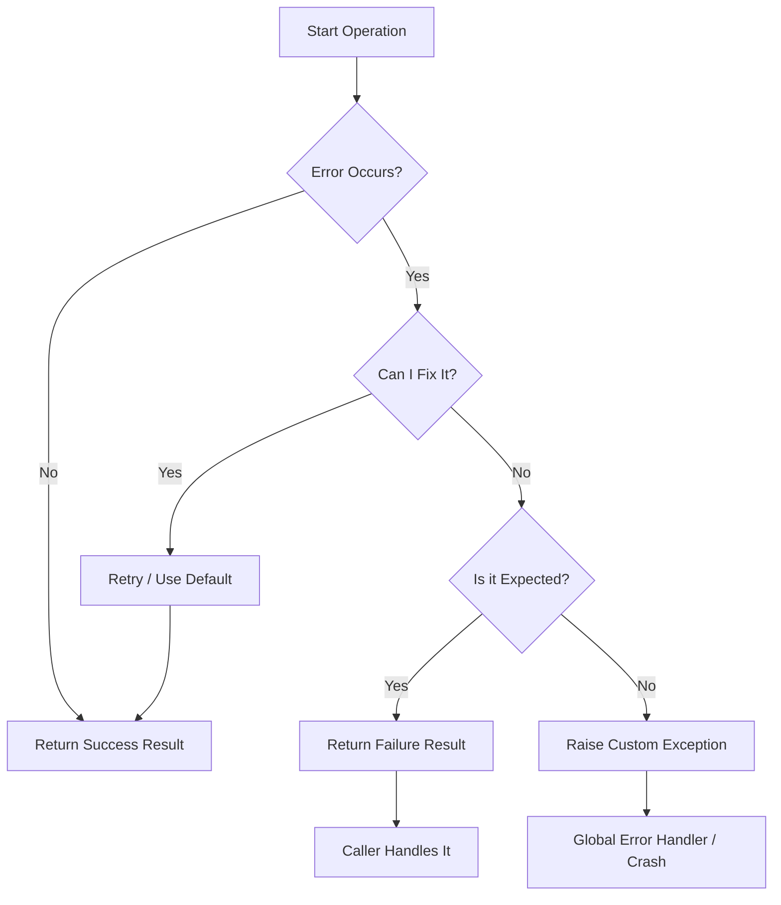

# Chapter 6B: Error Handling Patterns — Making Your Code Bulletproof

<!--
METADATA
Phase: Python Bridge Module 1 (PBM-1)
Time: 1.5 hours (30 minutes reading + 60 minutes hands-on)
Difficulty: ⭐⭐
Type: Foundation (Python Intermediate)
Prerequisites: Chapters 1-6, 6A (Decorators, Basic try/except)
Builds Toward: Chapters 7-12 (LLM error handling), 39-40 (Testing & Production)
Correctness Properties: Error propagation, Graceful degradation, Observability

NAVIGATION
→ Quick Reference: #quick-reference-card
→ Verification: #verification-test-your-knowledge
→ What's Next: #whats-next
-->

---

## ☕ Coffee Shop Intro

> **Imagine this**: You're building an AI chatbot for a coffee shop. It's a busy Monday morning, and the line is out the door. A customer asks for recommendations, and your app calls an LLM API... but the API is down. 💥
>
> The espresso machine hisses in the background. The customer taps their phone impatiently. The barista looks at you expectantly. What happens next?
>
> **Option A**: Your entire app crashes with a cryptic error message. The customer sees a white screen. The barista has to manually take the order. You lose the sale.
>
> **Option B**: The app silently fails. The customer sees a loading spinner forever. They give up, frustrated, and leave. You lose the customer.
>
> **Option C**: The app gracefully says "Sorry, AI recommendations are temporarily unavailable. Here's our full menu instead!" The customer browses the menu, orders a latte, and the day continues smoothly.
>
> The difference between these scenarios? **Professional error handling** - and it's what separates amateur code from production-ready systems that users trust.
>
> **By the end of this chapter**, you'll build robust error handling that makes your code self-healing, informative when things go wrong, and trustworthy for production use. You'll learn to anticipate failures, handle them gracefully, and keep your users happy even when things break

---

## Prerequisites Check

Let's ensure your foundation is solid before we start triaging.

```bash
# Run this quick check in your terminal
python -c "try: x = 1/0\nexcept ZeroDivisionError as e: print(f'✓ Caught: {e}')"
```

**If this prints "✓ Caught: division by zero"**, you're ready! ✅

**If it fails**, pause here. Go back to **Chapter 5** and review basic `try/except` blocks. You need that foundation to build what comes next.

---

### 🔄 Quick Recall: Chapters 1-6A Concepts

Before we dive deep, let's refresh the tools we'll be using.

**Question 1**: What is the danger of `except:` (without an Exception class)?

<details>
<summary>Click to reveal answer</summary>
It catches **EVERYTHING**, including `SystemExit` (when you try to quit) and `KeyboardInterrupt` (Ctrl+C). It's like locking the hospital doors so no one can leave, not even during a fire drill. Always use `except Exception:` instead!
</details>

**Question 2**: From Chapter 6A, what does `@wraps` do?

<details>
<summary>Click to reveal answer</summary>
It copies the metadata (name, docstring) from the original function to the decorated one. Without it, your error logs might say `wrapper` instead of `process_payment`, making debugging a nightmare.
</details>

**Question 3**: What is a "Traceback"?

<details>
<summary>Click to reveal answer</summary>
It's the "crime scene photo" of your crash. It shows exactly which line of code failed and the sequence of calls that led there.
</details>

---

## 🎓 Scaffolding Level: Guided → Semi-Independent

**Where we've been**:
In Chapters 1-6, we held your hand through every line of code. We gave you the exact implementation.

**Where we are now**:
In this chapter, we give you the **Patterns** (The "What"), but you must decide the **Application** (The "When").

- We provide the `Result` class.
- You decide _when_ to use it vs. throwing an exception.
- We provide the logging setup.
- You decide _what_ is a `WARNING` vs. an `ERROR`.

**Where we're going**:
By Chapter 12, you will be designing your own error recovery systems for complex AI agents without any template code.

**This is intentional.** Real engineering is about making decisions under uncertainty. If you feel a bit unsure about "Is this the right error to catch?", that means you're learning!

---

## 🗺️ Concept Map: The Flow of Failure

Understanding error handling is about visualizing the flow of data when things go wrong.



**You are here**: Chapter 6B. We are mastering nodes **F, G, and H**—deciding when to return a failure object and when to raise a loud exception.

---

### 🗺️ Concept Map: How This Chapter Connects

```
Chapter 5: Basic try/except → Chapter 6B: Error Patterns → Chapter 7-12: LLM Error Handling
        ↓                              ↓                            ↓
Catch exceptions              Custom exceptions          Production-ready APIs
        ↓                       Result types                      ↓
Chapter 6A: Decorators ← Chapter 6B: Error Decorators ← Chapter 39-40: Production Systems
```

**You are here**: Chapter 6B - Learning professional error handling patterns

**What you've learned**:

- Basic try/except (Ch 5)
- Decorators for code reuse (Ch 6A)
- Function composition (Ch 2-3)

**What you're learning**:

- Custom exceptions with context
- Result type for explicit success/failure
- Error propagation strategies
- Production logging

**What's coming next**:

- Chapter 7-12: Apply these patterns to LLM API calls
- Chapter 17-22: Error handling in RAG systems
- Chapter 39-40: Production monitoring and error tracking

**The big picture**: Error handling is what makes code production-ready.
These patterns will be in EVERY professional project you build!

---

## Part 1: Custom Exception Classes (Making Errors Meaningful) 📖💻

### What is a Custom Exception? 📖

**Analogy: The Check Engine Light** 🚗

A generic `Exception` is like a "Check Engine" light. It tells you _something_ is wrong, but not _what_. Is the engine on fire? Or is the gas cap loose? You have to pull over and check.

A **Custom Exception** is like a modern dashboard display: "TIRE PRESSURE LOW: REAR LEFT".
Now you know exactly what to do. You don't need to panic; you just need air.

**In Python terms**:

- `raise Exception("Auth failed")` → Generic, hard to catch specifically.
- `raise AuthenticationError("Invalid API Key")` → Specific, actionable.

### The Hierarchy of Failure 👁️

Exceptions in Python work like a family tree.

```python
BaseException
 └── Exception
      ├── ArithmeticError
      │    └── ZeroDivisionError
      └── YourCustomBaseError
           ├── NetworkError
           │    ├── TimeoutError
           │    └── DNSLookupError
           └── LogicError
                └── InvalidInputError
```

**Why this matters**:
If you catch `NetworkError`, you automatically catch `TimeoutError` and `DNSLookupError` too. It allows you to handle "categories" of problems.

### 🔬 Try This! (Hands-On Practice #1) 💻

Let's build a hierarchy for our AI application.

**Challenge**: Create a family of exceptions for an LLM Service.

**Step 1: Create `shared/errors.py`** (if it doesn't exist)

```python
class LLMError(Exception):
    """Base class for all LLM-related errors."""
    pass

class AuthenticationError(LLMError):
    """Raised when API keys are invalid."""
    pass

class RateLimitError(LLMError):
    """Raised when we hit the API limit."""
    pass

class ContextLimitError(LLMError):
    """Raised when the prompt is too long for the model."""
    pass
```

**Step 2: Use them in a script**
Create `test_exceptions.py`:

```python
from shared.errors import LLMError, RateLimitError, AuthenticationError
import time

def simulate_llm_call(prompt: str, api_key: str):
    if not api_key:
        raise AuthenticationError("Missing API Key")
    if len(prompt) > 1000:
        raise ContextLimitError("Prompt too long")
    # Simulate random failure
    raise RateLimitError("Rate limit exceeded. Retry in 20s.")

# The Triage Block
try:
    simulate_llm_call("Hello", "key123")
except AuthenticationError:
    print("🚨 Security Alert: Please refresh your credentials.")
except RateLimitError as e:
    print(f"⏳ System busy. {e}")
    # Logic to sleep and retry could go here
except LLMError as e:
    # Catch-all for other LLM errors (like ContextLimitError)
    print(f"❌ General LLM Failure: {e}")
except Exception as e:
    # Catch-all for unforeseen bugs (like memory errors)
    print(f"💥 CRITICAL: Unexpected crash: {e}")
```

**Run it**. You should see the `RateLimitError` path trigger.

---

> 🤔 **Metacognitive Checkpoint #1: Exception Design**
>
> Before we continue, pause and reflect:
>
> - When should you create a custom exception vs using Python's built-in ones?
> - How do you decide what context to include in your exception?
> - What's the difference between catching a base exception vs a specific one?
>
> Write down your reasoning - we'll build on this understanding!

---

**Analogy: Emergency Response System** 🚨

Think of exception hierarchy like emergency services:

- **Exception** (base) = "Call 911" (general emergency)
- **APIError** (your base) = "Technical emergency" (specific category)
  - **AuthError** = "Security breach" (specific type)
  - **RateLimitError** = "System overload" (specific type)
  - **TimeoutError** = "Communication failure" (specific type)

When you catch `APIError`, you're saying "handle any technical emergency".
When you catch `AuthError`, you're saying "handle only security breaches".

Just like 911 dispatches the right team (police, fire, ambulance), your exception hierarchy routes errors to the right handler!

---

### 🔍 Error Prediction Challenge #1

Look at this code. What will happen when you run it?

```python
class APIError(Exception):
    pass

class AuthError(APIError):
    pass

class RateLimitError(APIError):
    pass

try:
    raise RateLimitError("Too many requests")
except APIError as e:
    print(f"Caught: {type(e).__name__}")
except RateLimitError as e:
    print("Rate limit specific handling")
```

**Your prediction**: **\*\***\_\_\_**\*\***

<details>
<summary>Click to reveal what happens</summary>

**Output**: `Caught: RateLimitError`

**Why**: The first `except APIError` catches it! Python checks exception handlers top-to-bottom and stops at the first match. Since `RateLimitError` inherits from `APIError`, it matches the first handler.

**The second handler is unreachable** - it will never execute!

**The fix**: Put specific exceptions BEFORE general ones:

```python
try:
    raise RateLimitError("Too many requests")
except RateLimitError as e:  # ← Specific first
    print("Rate limit specific handling")
except APIError as e:  # ← General second
    print(f"Caught: {type(e).__name__}")
```

**Lesson**: Always catch specific exceptions before their base classes!

</details>

---

### 🔍 Error Prediction Challenge #1B

**Stop and Predict**: What happens if we swap the order of the `except` blocks?

```python
try:
    raise RateLimitError("Too many requests")
except LLMError:
    print("Caught by Base Class")
except RateLimitError:
    print("Caught by Specific Class")
```

**Your prediction**: Will it print "Caught by Specific Class"?

<details>
<summary>Click to reveal answer</summary>

**NO!** It will print **"Caught by Base Class"**.

**Why?** Python checks `except` blocks from top to bottom. Since `RateLimitError` _is a_ `LLMError` (inheritance), the first block matches and executes. The specific block is never reached!

**Rule**: Always put the **most specific** exceptions first, and the **most general** ones last.

</details>

---

## Part 2: The Result Type Pattern (Explicit Success) 📖💻

### Why Exceptions Aren't Enough 📖

**Analogy: Package Delivery** 📦

Traditional exceptions:

> You order a package. Either it arrives (success) or the delivery person throws it at your window and runs away (exception thrown!).

Result type:

> Every delivery comes with a tracking label: "DELIVERED: Package inside" or "FAILED: Reason attached".
> You know the outcome before opening the box.

**In code**:

```python
# Traditional: Surprise!
value = risky_operation()  # Might work, might explode

# Result type: Explicit
result = risky_operation()  # Always returns Result
if result.success:
    value = result.data  # Safe to use
else:
    print(result.error)  # Know what went wrong
```

---

**Analogy: The Jack-in-the-Box vs. The Sealed Package** 📦

- **Exceptions** are like a Jack-in-the-Box. You wind the crank (call the function), and _POP_! A clown punches you in the face. You didn't expect it, and now you're hurt.
- **Result Types** are like a sealed Amazon package. It arrives safely. You look at the label. It either says "Contents: Your Item" or "Status: Damaged - Return to Sender". You handle the package _before_ opening it.

**Metacognitive Prompt**:

> 🤔 Have you ever used a library function that returned `None` when it failed? And then later, your code crashed with `AttributeError: 'NoneType' object has no attribute 'data'`?
> That's because `None` is a "silent failure". It destroys the evidence of _why_ it failed.

### The Result Class 💻

We are going to define a generic class that can hold _either_ a success value _or_ an error message.

**Create `shared/utils/result.py`**:

```python
from dataclasses import dataclass
from typing import Generic, TypeVar, Optional

# T is a "Generic Type". It means "This Result can hold Any Type of data"
# (Int, String, User Object, etc.)
T = TypeVar('T')

@dataclass
class Result(Generic[T]):
    success: bool
    data: Optional[T] = None
    error: Optional[str] = None

    @staticmethod
    def ok(data: T) -> "Result[T]":
        """Create a Success Result."""
        return Result(success=True, data=data)

    @staticmethod
    def fail(error: str) -> "Result[T]":
        """Create a Failure Result."""
        return Result(success=False, error=error)

    def unwrap(self) -> T:
        """Unsafe! Get data or crash if failed."""
        if not self.success:
            raise ValueError(f"Called unwrap on failed Result: {self.error}")
        return self.data
```

### 🔬 Try This! (Hands-On Practice #2)

Let's rewrite our `simulate_llm_call` to use `Result`.

**Update `test_exceptions.py`**:

```python
from shared.utils.result import Result

def safe_llm_call(prompt: str) -> Result[str]:
    if not prompt:
        return Result.fail("Prompt cannot be empty")

    try:
        # Imagine this is a real risky API call
        response = "AI Generated Response"
        return Result.ok(response)
    except Exception as e:
        return Result.fail(str(e))

# Usage
outcome = safe_llm_call("Hello")

if outcome.success:
    print(f"🎉 Success: {outcome.data}")
else:
    print(f"🛑 Failed: {outcome.error}")
```

**Why this is better**:

1. You **MUST** check `if outcome.success`. You can't accidentally use the data if it failed.
2. The function signature `-> Result[str]` tells you: "I might fail."
3. No try/except block needed in the calling code!

---

> 🤔 **Metacognitive Checkpoint #2: Exceptions vs Results**
>
> Now that you've seen both patterns, think about:
>
> - When would you use exceptions vs Result types?
> - What are the trade-offs of each approach?
> - Can you think of a situation where you'd use BOTH together?
>
> Understanding the "when" is as important as the "how"!

---

### 🔍 Error Prediction Challenge #2

What will this code print?

```python
def divide(a: int, b: int) -> Result[float]:
    if b == 0:
        return Result.fail("Division by zero")
    return Result.ok(a / b)

result = divide(10, 0)
print(result.data * 2)  # What happens here?
```

**Your prediction**: **\*\***\_\_\_**\*\***

<details>
<summary>Click to reveal the answer</summary>

**Output**: `TypeError: unsupported operand type(s) for *: 'NoneType' and 'int'`

**Why**: When Result fails, `data` is `None`. We tried to multiply `None * 2`!

**The problem**: We didn't check `result.success` before using `result.data`.

**The fix**:

```python
result = divide(10, 0)
if result.success:
    print(result.data * 2)
else:
    print(f"Error: {result.error}")
```

Or use the safe method:

```python
value = result.unwrap_or(0.0)  # Returns 0.0 if failed
print(value * 2)  # Safe!
```

**Lesson**: ALWAYS check `success` before accessing `data`, or use `unwrap_or()` for a safe default!

</details>

---

> ⚠️ **Production War Story: The Mixed Return Type Disaster**
>
> A junior engineer wrote a function like this:
>
> ```python
> def get_user(id):
>     if not found: return False
>     if error: raise Exception("DB Error")
>     return {"name": "Ahmed"}
> ```
>
> The calling code expected a dictionary.
> When it returned `False`, the code `get_user(1)["name"]` crashed with `TypeError: 'bool' object is not subscriptable`.
> When the DB failed, it crashed with an unhandled exception.
> **The Fix**: `Result[User]`. It forces the caller to handle all cases explicitly. No surprises.

---

## Part 3: Propagation Strategies (Traffic Control) 🎧

**Analogy: Restaurant Kitchen** 🍳

**Strategy 1 (Handle Immediately)**: Out of tomatoes?

> Chef substitutes with red peppers. Customer never knows. Problem solved locally.

**Strategy 2 (Propagate Up)**: Oven breaks?

> Chef tells manager. Manager decides: close kitchen? Order takeout? Use backup oven?
> Problem needs higher-level decision.

**Strategy 3 (Transform)**: Supplier delivers wrong ingredient?

> Chef tells waiter "Menu item unavailable" (not "Supplier sent wrong SKU #12345").
> Convert technical error to customer-friendly message.

**Strategy 4 (Log and Continue)**: Garnish unavailable?

> Chef logs it, serves dish without garnish. Optional feature, don't stop service.

**In code**: Choose strategy based on who can best handle the problem!

---

When you catch an error, you have 4 choices. Think of this as Traffic Control.

1.  **Handle (The Mechanic)**: Fix it right there.
    - _Example_: File missing? Create it.
2.  **Propagate (The Messenger)**: Tell your boss (the caller).
    - _Example_: "I can't save this file because the disk is full." (I can't fix disk space).
3.  **Transform (The Translator)**: Translate technical jargon to human language.
    - _Example_: Catch `sqlite3.IntegrityError` → Raise `UserAlreadyExistsError`.
4.  **Log & Ignore (The Stoic)**: Note it and move on.
    - _Example_: "Could not send analytics ping." (Don't stop the app for this).

---

> 🤔 **Metacognitive Checkpoint #3: Propagation Decisions**
>
> Reflect on the four strategies you just learned:
>
> - Which strategy would you use for a missing config file?
> - Which for a failed API call in a web request handler?
> - Which for an optional feature like AI-generated summaries?
>
> The right choice depends on context - practice thinking through these decisions!

---

> ⚠️ **Production War Story #2: The Cascading Failure**
>
> A SaaS company's app called 5 microservices in sequence. One service (analytics) was optional but they didn't handle its failure gracefully:
>
> ```python
> user_data = fetch_user()  # Critical
> orders = fetch_orders()   # Critical
> analytics = fetch_analytics()  # Optional - but treated as critical!
> recommendations = fetch_recommendations()  # Critical
> ```
>
> When analytics service went down, the ENTIRE user dashboard crashed. Users couldn't see their orders or recommendations.
>
> **The result**: 2-hour outage, 10,000 angry users, support tickets flooded in.
>
> **The fix**: Use Strategy 4 (Log and Continue) for optional features:
>
> ```python
> analytics = None
> try:
>     analytics = fetch_analytics()
> except Exception as e:
>     logger.warning(f"Analytics unavailable: {e}")
>     # Continue without analytics
> ```
>
> **Lesson**: Distinguish between critical and optional features. Don't let optional features crash critical functionality!

---

**Confidence Calibration**:

> Rate yourself (1-5): How confident are you in deciding when to _Handle_ vs _Propagate_?
> Most beginners default to "Propagate" (let it crash). Seniors lean towards "Transform".

---

## Part 4: Logging (The Black Box) 👁️

When a plane crashes, we look for the Black Box.
When your code crashes on a server 3,000 miles away, **Logs** are your Black Box.

### The Levels of Urgency

| Level      | Meaning                    | Analogy                           |
| ---------- | -------------------------- | --------------------------------- |
| `DEBUG`    | Fine-grained info          | "Heartbeat check... still alive." |
| `INFO`     | Normal events              | "User logged in."                 |
| `WARNING`  | Something odd, but working | "Disk 85% full."                  |
| `ERROR`    | Operation failed           | "Could not save file."            |
| `CRITICAL` | App is dying               | "Database on fire."               |

---

**Analogy: Hospital Monitoring** 🏥

- **DEBUG**: "Patient's heart rate: 72 bpm" (detailed vitals for doctors)
- **INFO**: "Patient admitted to room 204" (normal operations)
- **WARNING**: "Patient's temperature slightly elevated" (watch this)
- **ERROR**: "Patient's blood pressure critically low" (immediate attention needed)
- **CRITICAL**: "Patient cardiac arrest!" (emergency!)

Just like hospitals monitor different severity levels, your logs should reflect urgency.

**In code**:

```python
logger.debug(f"Calling API with params: {params}")  # Detailed trace
logger.info("API call succeeded")  # Normal operation
logger.warning("API slow, took 5s")  # Potential issue
logger.error("API call failed")  # Serious problem
logger.critical("All API endpoints down!")  # System emergency
```

---

### 🔬 Try This! (Hands-On Practice #3)

Let's set up a professional logger.

**Step 1: Create `shared/utils/logger.py`**

```python
import logging
import sys

def setup_logger(name: str) -> logging.Logger:
    logger = logging.getLogger(name)
    logger.setLevel(logging.INFO) # Default level

    # Prevent adding multiple handlers if called multiple times
    if not logger.handlers:
        # Create console handler
        handler = logging.StreamHandler(sys.stdout)
        formatter = logging.Formatter(
            '%(asctime)s - %(name)s - %(levelname)s - %(message)s'
        )
        handler.setFormatter(formatter)
        logger.addHandler(handler)

    return logger
```

**Step 2: Use it**

```python
from shared.utils.logger import setup_logger

log = setup_logger("app_core")

try:
    log.info("Starting process...")
    x = 1 / 0
except ZeroDivisionError:
    log.error("Calculation failed!", exc_info=True) # exc_info adds the traceback!
```

**Pro Tip**: `exc_info=True` (or `log.exception(...)`) is magic. It prints the full stack trace inside the log, so you can debug it later.

---

> ⚠️ **Production War Story: The Ghost Bug**
>
> A team had a bug where users were randomly logged out.
> Their code:
>
> ```python
> try:
>     verify_token(token)
> except Exception:
>     logout_user()
> ```
>
> Because they didn't log the exception, they had **zero clue** why `verify_token` was failing.
> Was it expired? Malformed? Database down?
> It took 2 weeks to find the bug.
> **One log line** (`log.exception("Token verification failed")`) would have solved it in 5 minutes.

---

> ⚠️ **Production War Story #1: The Silent Failure**
>
> A fintech startup built a payment processing system. They caught all exceptions but didn't log them:
>
> ```python
> try:
>     process_payment(amount, card)
> except Exception:
>     return {"status": "error"}  # No logging!
> ```
>
> **The result**: Payments failed silently. Customers were charged but orders weren't processed.
> The team had NO LOGS to debug what went wrong. It took 3 days to find the bug.
>
> **The cost**: $50,000 in refunds, angry customers, damaged reputation.
>
> **The fix**: Add logging:
>
> ```python
> except Exception as e:
>     logger.exception(f"Payment failed for amount={amount}")
>     return {"status": "error", "message": str(e)}
> ```
>
> **Lesson**: Catching exceptions without logging is like closing your eyes during surgery.
> You MUST log errors to debug production issues!

---

## 🎯 Confidence Calibration Check

Before we build the final project, let's calibrate your understanding.

### Before the Final Exercise

Rate your confidence (1-5) on these skills:

1. **Creating custom exception hierarchies**: \_\_\_/5
   - 1: No idea how to structure exceptions
   - 2: Can create basic exceptions but unsure about hierarchy
   - 3: Can create hierarchy with heavy reference
   - 4: Can design hierarchy with light reference
   - 5: Can design exception hierarchy without help

2. **Using Result type pattern**: \_\_\_/5

3. **Choosing error propagation strategies**: \_\_\_/5

4. **Setting up proper logging**: \_\_\_/5

5. **Handling errors in production code**: \_\_\_/5

**Your average confidence**: \_\_\_/5

---

### After the Final Exercise

Now rate yourself again after completing the project:

1. **Creating custom exception hierarchies**: \_\_\_/5
2. **Using Result type pattern**: \_\_\_/5
3. **Choosing error propagation strategies**: \_\_\_/5
4. **Setting up proper logging**: \_\_\_/5
5. **Handling errors in production code**: \_\_\_/5

**Your new average**: \_\_\_/5

---

### Calibration Insight

**If your confidence went UP**: Great! The practice solidified your understanding.

**If your confidence went DOWN**: Even better! You discovered what you don't know yet.
This is the "conscious incompetence" stage - you're aware of gaps, which means you can fill them.

**If your confidence stayed the same**: You might be overconfident OR underconfident.
Try implementing error handling in a real project to test yourself.

**Typical pattern**: Most learners rate themselves 3-4 before, then realize they're actually 2-3 after trying.
Error handling looks simple until you face production edge cases!

---

## Verification (Test Your Knowledge)

Let's verify your mastery. Create `verify_error_handling.py`:

```python
from shared.utils.result import Result
from shared.errors import LLMError, AuthenticationError
from shared.utils.logger import setup_logger
import logging

print("🧪 Running Error Handling Verification...\n")

# Test 1: Result Type Logic
print("Test 1: Result Type Logic...")
res = Result.ok(100)
assert res.success is True
assert res.unwrap() == 100

fail = Result.fail("Broken")
try:
    fail.unwrap()
    print("❌ Failed: Unwrap should crash on failure")
except ValueError:
    print("✅ Result.unwrap protected us!")

# Test 2: Exception Hierarchy
print("\nTest 2: Exception Hierarchy...")
try:
    raise AuthenticationError("Auth fail")
except LLMError:
    print("✅ AuthenticationError was correctly caught as LLMError")
except Exception:
    print("❌ Failed: Should have been caught by specific base class")

# Test 3: Logging
print("\nTest 3: Logging...")
log = setup_logger("test_logger")
log.setLevel(logging.INFO) # Ensure INFO level is captured

# Capture log output to verify
import io
from contextlib import redirect_stdout

s = io.StringIO()
with redirect_stdout(s):
    try:
        1/0
    except ZeroDivisionError:
        log.error("Test error message", exc_info=True)

log_output = s.getvalue()
assert "Test error message" in log_output
assert "Traceback (most recent call last):" in log_output
print("✅ Logging with traceback works!")

print("\n🎉 Chapter 6B Complete! Your code is now bulletproof.")
```

---

## Summary

**What you learned:**

1.  **Custom Exceptions**: The "Triage Nurse" that categorizes errors so you can handle them specifically.
2.  **Result Type**: The "Sealed Package" that forces you to check for success before using data.
3.  **Propagation Strategies**: The decision framework for "Fix it here" vs "Tell the boss".
4.  **Logging**: The "Black Box" that saves you when things break in production.

**Key Takeaway**:
Amateurs let programs crash. Professionals anticipate failure and design for it.
You now have the tools to ensure that when your AI stumbles, it doesn't fall. 🛡️

**Skills unlocked**: 🎯

- Resilience Engineering
- Defensive Programming
- Production Observability

**Looking ahead**: In **Chapter 6C**, we'll dive into **Intermediate OOP** to structure our agents!

---

**Next**: [Chapter 6C: OOP Intermediate →](chapter-06C-oop-intermediate.md)

_Great job mastering error handling! You're becoming a professional developer!_ 💪

```

```
