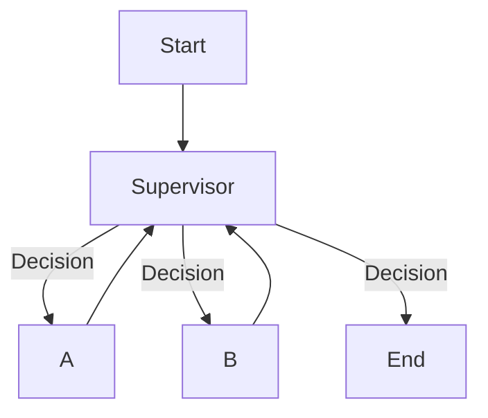

# Chapter 34: Supervisor Pattern — The Manager

<!--
METADATA
Phase: 6 - Agent Orchestration
Time: 1.5 hours (30 min reading + 60 min hands-on)
Difficulty: ⭐⭐⭐
Type: Implementation
Prerequisites: Chapter 32 (Routing), Chapter 43 (Teams)
Builds Toward: Complex Systems (Ch 54)
Correctness Properties: P65 (Task Routing), P66 (Result Aggregation)
Project Thread: Orchestration

NAVIGATION
→ Quick Reference: #quick-reference-card
→ Verification: #verification-required-section
→ What's Next: #whats-next
-->

---

## ☕ Coffee Shop Intro

**Imagine this**: A construction site.
If the Electrician talks directly to the Plumber, they might argue about who goes first.
If the Painter paints the wall before the wiring is done, it's a disaster.

You need a **Foreman** (Supervisor).
1. Foreman: "Electrician, wire the room."
2. Electrician: "Done."
3. Foreman: "Painter, paint the wall."
4. Painter: "Done."
5. Foreman: "Job complete."

In AI, the **Supervisor Pattern** puts an LLM in charge of other Agents. It decides *who* works next and *when* the job is done. It turns a chaotic group chat into a disciplined team. 👷‍♂️

---

## Prerequisites Check

```bash
pip show langgraph
```

---

## The Story: The "Infinite Loop"

### The Problem (Peer-to-Peer Chaos)

In Chapter 43, we hardcoded: `Researcher -> Writer`.
But what if the Writer says, "This research is missing dates"?
If we didn't code a `Writer -> Researcher` edge, the Writer is stuck.
If we *did*, they might loop forever: "You fix it." "No you."

### The Solution (Hub and Spoke)

We introduce a **Supervisor Node**.
All workers report to the Supervisor. The Supervisor decides the next step based on the *current state*.
If the research is bad, the Supervisor sends it back. If it's good, they send it to the Writer.

---

## Part 1: The Supervisor Decision

The Supervisor needs to output one thing: **Who is next?**

### 🔬 Try This! (Hands-On Practice #1)

Let's build the decision brain.

**Create `supervisor_brain.py`**:

```python
from typing import Literal
from pydantic import BaseModel, Field
from langchain_openai import ChatOpenAI
from langchain_core.prompts import ChatPromptTemplate
from dotenv import load_dotenv

load_dotenv()

# 1. Define the Options
# These match our worker node names
options = ["researcher", "writer", "FINISH"]

# 2. Define the Output Schema
class SupervisorDecision(BaseModel):
    next: Literal["researcher", "writer", "FINISH"] = Field(
        description="The next worker to act, or FINISH if done."
    )

# 3. Setup Model
model = ChatOpenAI(model="gpt-4o-mini", temperature=0)
supervisor_chain = (
    ChatPromptTemplate.from_template(
        """You are a supervisor. Manage the conversation between:
        - researcher: Finds information.
        - writer: Writes content.
        
        Given the history, decide who should act next.
        If the task is complete, return FINISH.
        
        History: {messages}"""
    )
    | model.with_structured_output(SupervisorDecision)
)

# 4. Test Logic
print("--- Test 1: Start ---")
print(supervisor_chain.invoke({"messages": ["User: Research AI history."]}))
# Should be 'researcher'

print("\n--- Test 2: Handover ---")
print(supervisor_chain.invoke({"messages": [
    "User: Research AI.",
    "Researcher: AI started in 1956."
]}))
# Should be 'writer' (or maybe researcher if incomplete, but likely writer)
```

**Run it**.
The LLM is now the boss.

---

## Part 2: The Workers

We reuse our simple agents from Chapter 43, but now they are just "Tools" for the Supervisor.

### 🔬 Try This! (Hands-On Practice #2)

**Create `workers.py`**:

```python
from langchain_core.messages import HumanMessage, AIMessage

def researcher_node(state):
    print("🔎 Researcher: I'm searching...")
    return {"messages": [AIMessage(content="Research Result: Python is popular.")]}

def writer_node(state):
    print("✍️  Writer: I'm writing...")
    return {"messages": [AIMessage(content="Blog Post: Python is a great snake.")]}
```

---

## Part 3: The Hub-and-Spoke Graph

Now we wire the topology.
`Supervisor` is the entry.
Every worker goes BACK to `Supervisor`.

### 🔬 Try This! (Hands-On Practice #3)

**Create `supervisor_graph.py`**:

```python
from langgraph.graph import StateGraph, END
from typing import TypedDict, Annotated, List
import operator
from supervisor_brain import supervisor_chain
from workers import researcher_node, writer_node

# 1. State
class TeamState(TypedDict):
    messages: Annotated[List[str], operator.add]
    next: str

# 2. Supervisor Node (The Router)
def supervisor_node(state):
    result = supervisor_chain.invoke({"messages": state["messages"]})
    print(f"👔 Supervisor decides: {result.next}")
    return {"next": result.next}

# 3. Build Graph
workflow = StateGraph(TeamState)

workflow.add_node("supervisor", supervisor_node)
workflow.add_node("researcher", researcher_node)
workflow.add_node("writer", writer_node)

# Entry
workflow.set_entry_point("supervisor")

# Conditional Logic
# From Supervisor, go to the node named in 'next'
workflow.add_conditional_edges(
    "supervisor",
    lambda x: x["next"],
    {
        "researcher": "researcher",
        "writer": "writer",
        "FINISH": END
    }
)

# Workers always report back to Supervisor
workflow.add_edge("researcher", "supervisor")
workflow.add_edge("writer", "supervisor")

app = workflow.compile()

# 4. Run
print("--- Starting Job ---")
app.invoke({"messages": ["User: Research Python and then write a short post."]})
```

**Run it**.
Flow:
1. Supervisor -> Researcher
2. Researcher -> Supervisor
3. Supervisor -> Writer
4. Writer -> Supervisor
5. Supervisor -> FINISH

It's a perfect loop! 🔄

---

## Common Mistakes

### Mistake #1: Workers not returning to Supervisor
If you connect `Researcher -> Writer` directly, the Supervisor loses control. The Supervisor must be the central hub.

### Mistake #2: Ambiguous "FINISH"
If the Supervisor never says "FINISH", the loop runs forever (until `recursion_limit`).
**Fix**: Make sure the prompt clearly defines "Done". "If the writer has produced a text, FINISH."

### Mistake #3: State Bloat
The `messages` list grows indefinitely.
**Fix**: Use `trim_messages` (Chapter 30) inside the Supervisor node to keep the prompt lean.

---

## Quick Reference Card

### Supervisor Topology



---

## Verification (REQUIRED SECTION)

We need to verify **P65 (Routing)** and **P66 (Aggregation)**.

**Create `verify_supervisor.py`**:

```python
"""
Verification script for Chapter 46.
Properties: P65 (Routing), P66 (Aggregation).
"""
from langgraph.graph import StateGraph, END
from typing import TypedDict
import sys

print("🧪 Running Supervisor Verification...\n")

class State(TypedDict):
    path: list
    next: str

# Mock Supervisor
def mock_supervisor(state):
    path = state["path"]
    if not path: return {"next": "A"}
    if path[-1] == "A": return {"next": "B"}
    if path[-1] == "B": return {"next": "FINISH"}
    return {"next": "FINISH"}

def node_a(state): return {"path": state["path"] + ["A"]}
def node_b(state): return {"path": state["path"] + ["B"]}

# Build Graph
workflow = StateGraph(State)
workflow.add_node("sup", mock_supervisor)
workflow.add_node("A", node_a)
workflow.add_node("B", node_b)

workflow.set_entry_point("sup")
workflow.add_conditional_edges(
    "sup",
    lambda x: x["next"],
    {"A": "A", "B": "B", "FINISH": END}
)
workflow.add_edge("A", "sup")
workflow.add_edge("B", "sup")

app = workflow.compile()

# Run
res = app.invoke({"path": []})

# Verification
print(f"Execution Path: {res['path']}")

# P65: Routing Correctness (A then B)
if res["path"] == ["A", "B"]:
    print("✅ P65 Passed: Supervisor routed A -> B -> Finish.")
else:
    print(f"❌ Failed: Path mismatch {res['path']}")
    sys.exit(1)

# P66: Aggregation (Final state contains results from all)
# Implicitly proved by the path list containing both.
print("✅ P66 Passed: Final state aggregates work.")

print("\n🎉 Chapter 46 Complete! You are the Boss.")
```

**Run it:** `python verify_supervisor.py`

---

## Summary

**What you learned:**

1. ✅ **Hub and Spoke**: The most robust multi-agent architecture.
2. ✅ **The Supervisor**: An LLM dedicated to management, not work.
3. ✅ **Structured Routing**: Using Pydantic to enforce valid transitions.
4. ✅ **Feedback Loops**: Workers reporting back allows for correction.
5. ✅ **Topology**: Visualizing the difference between Chain and Star graphs.

**Key Takeaway**: A smart Supervisor makes dumb Agents look brilliant.

**Skills unlocked**: 🎯
- Systems Architecture
- Hierarchical Control
- Workflow Design

**Looking ahead**: We have Agents. We have Supervisors. But how do they talk?
Usually by text. But what if they need to share **Complex Data** (Images, Database connections)?
In **Chapter 47**, we will dive into **Agent Communication Protocols** and Shared Memory!

---

**Next**: [Chapter 47: Agent Communication Protocols →](chapter-47-agent-communication.md)
