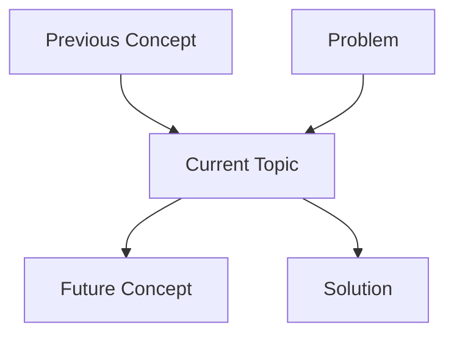

# Master Chapter Template v2.1 — The Enhanced Cafe-Style Approach with Pedagogical Principles

## Ultimate Guide for Creating Exceptional Educational Content

**Last Updated**: 2026-01-20 (Enhanced with 23 Pedagogical Principles)  
**Status**: ✅ PRODUCTION READY  
**Version**: v2.2 (Enhanced Framework)  
**Based On**: Educational Philosophy Enhancements 2026-01-20 (Extended)  
**Applies To**: All chapters in Path D curriculum (Ch 1-54 + Python Bridges)  
**Related**: See `EDUCATIONAL-PHILOSOPHY-ENHANCEMENTS-2026-01-20.md` for complete philosophy

---

## 🎯 Core Philosophy: "More is More in Education"

### The Zero-to-Hero Teaching Approach

Every chapter should feel like:

- ☕ **A conversation over coffee** with a knowledgeable friend who explains thoroughly
- 🎓 **A patient mentor** who explains concepts multiple ways with progressive complexity
- 💪 **A supportive coach** celebrating your progress and normalizing struggle
- 🛠️ **A practical guide** showing real code you'll write professionally
- 🧠 **A comprehensive learning experience** that anticipates questions and addresses them
- 🤔 **A metacognitive journey** that helps you think about your thinking
- 📊 **A confidence builder** that calibrates self-assessment with actual performance

### NOT like:

- ❌ A dry textbook with minimal explanation
- ❌ An intimidating technical manual with jargon
- ❌ A "figure it out yourself" resource
- ❌ A rushed tutorial that assumes prior knowledge
- ❌ Abbreviated content that leaves gaps

### The 23 Pedagogical Principles (Apply 10-15 per Chapter)

#### Core Principles (1-15) - Original Framework

1. **Progressive Complexity Layering** - Simple → Nuanced → Complete
2. **Anticipatory Question Addressing** - Answer before they ask
3. **Failure-Forward Learning** - Show mistakes, explain why they fail
4. **Contextual Bridges** - Connect to 2-3 prior concepts explicitly
5. **Emotional Checkpoints** - Acknowledge difficulty, celebrate progress
6. **Multi-Modal Explanations** - Visual + Code + Scenario + Technical
7. **Spaced Repetition** - Callback to earlier chapters
8. **Practical Application Hooks** - "You could build..." scenarios
9. **Cognitive Load Management** - "Let's pause here" moments
10. **Conversational Asides** - Insider knowledge, fun facts
11. **Expand Language** - No abbreviations, complete sentences
12. **Increase Descriptiveness** - Motivation + mechanism for each concept
13. **Enhance Analogies** - 5-7 per chapter, varied complexity
14. **Reduce Bullets** - 70% narrative, 30% bullets
15. **Expand Sections** - Coffee Shop Intros: 250-350 words

#### Enhanced Principles (16-23) - Extended Framework (Added 2026-01-20)

16. **Metacognitive Prompts** ⭐ - "Pause and Reflect" boxes (2-3 per chapter)
17. **Error Prediction Exercises** ⭐ - Predict errors before revealing (1-2 per chapter)
18. **Real-World War Stories** ⭐ - Production anecdotes showing consequences (1-2 per chapter)
19. **Confidence Calibration** ⭐ - Before/after self-assessment (1 per chapter)
20. **Spaced Repetition Callbacks** - Mini-quizzes testing earlier concepts (2-3 every 3-4 chapters)
21. **Graduated Scaffolding** - Explicit "training wheels coming off" markers
22. **Concept Mapping** - Visual diagram showing chapter connections (1 per chapter)
23. **Learning Style Indicators** - Mark sections with icons (📖 👁️ 💻 🎧 🤝)

**Priority**: Implement Tier 1 principles (⭐) first for maximum impact

**See**: `curriculum/guides/LANGUAGE-EXPANSION-GUIDE.md` for detailed implementation patterns  
**See**: `curriculum/guides/QUALITY-CHECKLIST.md` for 70-item quality verification

---

## 📐 Chapter Structure Template

### Complete Chapter Skeleton

```markdown
# Chapter [N][Letter]: [Title] — [Engaging Subtitle]

<!--
METADATA
Phase: [Phase Name or Python Bridge Module]
Time: [X] hours ([Y] minutes reading + [Z] minutes hands-on)
Difficulty: ⭐ / ⭐⭐ / ⭐⭐⭐
Type: Foundation / Concept / Implementation / Application
Prerequisites: Chapters [X, Y, Z]
Builds Toward: Chapters [A, B, C]
Correctness Properties: [P1, P5, P9]
Project Thread: [Mini-project name - connects to Ch X, Y, Z]

NAVIGATION
→ Quick Reference: #quick-reference
→ Verification: #verification
→ What's Next: #whats-next

TEMPLATE VERSION: v2.2 (2026-01-20 - Enhanced Framework with 23 Principles)
-->

---

## ☕ Coffee Shop Intro

[RELATABLE SCENARIO with emotional hook]

## Prerequisites Check

[VERIFICATION COMMANDS with encouraging language]

## What You Already Know 🧩

[CONNECTION TABLE to previous chapters]

## The Story: Why [Topic] Matters

### 🗺️ Concept Map: Where We Are



### The Problem (Paint the Pain)

### The Naive Solution (Show What Doesn't Work)

### The Elegant Solution (The "Aha!" Moment)

## Part 1: [Main Concept] - [Approachable Title]

### Concept Intro (Start Simple)

### 🔬 Try This! (Practice #1) - REQUIRED

### 🔍 Error Prediction Challenge #1

[Code snippet that looks correct but has a subtle bug]

**Question**: What happens when you run this?
1. Option A
2. Option B
3. Option C

<details>
<summary>Reveal Answer</summary>
[Explanation]
</details>

### Build Complexity (Add One Layer)

### > 🤔 Metacognitive Checkpoint
>
> Stop and think:
> 1. Why did we use X instead of Y?
> 2. How does this connect to [Previous Concept]?
>
> [Brief reflection space]

### Practical Example (Real-World Use)

### 🔬 Try This! (Practice #2) - REQUIRED

### Advanced Topic (Final Layer)

### 🔬 Try This! (Practice #3) - OPTIONAL (but encouraged)

## [Transition Section]

[SMOOTH BRIDGE to next major topic]

## Part 2: [Second Concept] - [Approachable Title]

[REPEAT PROGRESSIVE STRUCTURE]

## Bringing It All Together

[COMPREHENSIVE PROJECT using both concepts]

## Common Mistakes

[LEARN FROM OTHERS with ❌/✅ comparisons]

## Quick Reference Card

[COPY-PASTE TEMPLATES]

## Verification (REQUIRED)

[AUTOMATED TEST SCRIPTS - This section is MANDATORY for all chapters]

## Assessment

### Quick Check Questions (5)

### Coding Challenge

## What's Next?

[PREVIEW next chapters]

## Summary (REQUIRED)

[KEY TAKEAWAYS - Minimum 7 bullet points + key takeaway. This section is MANDATORY for all chapters]
```

---

## 🎨 Writing Style Guidelines

### 1. Conversational Tone Patterns

#### Opening Phrases (Use These Liberally)

```
✅ "Okay, let's break this down..."
✅ "Alright, deep breath..."
✅ "Picture this scenario..."
✅ "Here's the thing..."
✅ "Let me paint you a picture..."
✅ "Now here's where it gets interesting..."
✅ "Stay with me on this one..."
✅ "Trust me, this is simpler than it sounds..."
```

#### Transition Phrases

```
✅ "Alright, now that you've mastered X, let's shift gears..."
✅ "Okay, you're getting the hang of this! Now let's level up..."
✅ "Before we move on, let's make sure this sticks..."
✅ "So far so good? Great! Now here's where it gets real..."
✅ "Let's pause for a second and see this in action..."
```

#### Encouragement Phrases (Sprinkle Throughout)

```
✅ "You got this!" 💪
✅ "See? That wasn't so bad!"
✅ "Don't worry, I'll walk you through it step by step" 😊
✅ "Take your time with this one - the struggle is where the learning happens" 🧠
✅ "If you're feeling confused, that's totally normal!"
✅ "Seriously, run this code. The muscle memory helps!"
✅ "This will make you feel like a professional developer!"
✅ "Trust the process - it'll click soon!"
```

#### Empathy Phrases (Acknowledge Difficulty)

```
✅ "I know this looks complicated, but..."
✅ "This confuses everyone at first!"
✅ "Don't stress if some concepts are fuzzy..."
✅ "This is the tricky part, so stay with me..."
✅ "Yeah, this is mind-bending - bear with me!"
```

---

---

### 2. Language Expansion Guidelines (Crucial for Completeness)

> **Core Principle**: Educational content benefits from expansion, repetition, and thorough explanation. **More is more.**

#### 🚫 Avoid Abbreviated Patterns

❌ **Fragment**: "Vector stores = indexed DBs for semantic search."
❌ **Bullet Wall**: Long lists without context.
❌ **Minimal Comments**: `retry_delay *= 2 # Exponential backoff`

#### ✅ Use Comprehensive Patterns

✅ **Full Sentences**: "A vector store is a specialized database designed to store embeddings..."
✅ **Narrative Flow**: "Let's discuss why RAG matters. First, it improves accuracy because..."
✅ **Explanatory Comments**:

```python
# Double the delay (exponential backoff). This means:
# - Retry 1: 1s, Retry 2: 2s, Retry 3: 4s
# This gives the API time to recover if overloaded.
retry_delay *= 2
```

#### 📏 Word Count Targets (Aim High!)

- **Coffee Shop Intro**: 250-350 words (Paint a full picture!)
- **Concept Explanation**: 150-250 words per concept (Explain "Why" & "How")
- **Code Comments**: 15-30 words per non-trivial line
- **Verification**: 150-250 words (Explain what success looks like)

👉 **See the full guide**: `curriculum/guides/LANGUAGE-EXPANSION-GUIDE.md`

---

### 3. Analogy Creation Framework

#### How to Create Effective Analogies

**Pattern**: [Technical Concept] is like [Real-World Thing]

**Examples from Chapter 6A**:

- Decorators = Gift wrapping 🎁
- Context Managers = Library book checkout 📚
- `*args, **kwargs` = Universal adapter 🔌
- Three-level decorators = Nesting dolls 🪆
- Python resource management = Babysitting 👶

**Guidelines**:

1. Use universally understood concepts (food, daily tasks, common objects)
2. Make the analogy visual (use emojis!)
3. Explain the parallel explicitly: "Just like X does Y, our code does Z"
4. Don't overextend the analogy - one clear parallel is enough

#### Analogy Template

```markdown
**Analogy: [Title]** [Emoji]

[1-2 sentences explaining the real-world thing]

**In Python terms**:

- [Real-world element 1] = [Code concept 1]
- [Real-world element 2] = [Code concept 2]
- [Real-world element 3] = [Code concept 3]

[One sentence tying it back to the code]
```

---

### 3. Progressive Complexity Build-Up

#### The Ladder Approach

**Don't jump from Step 1 to Step 5!** Build incrementally:

```
Step 1: Simplest possible version (no arguments, no edge cases)
   ↓
   [🔬 Try This! - Practice the simple version]
   ↓
Step 2: Add ONE layer of complexity (e.g., function arguments)
   ↓
   [Explain why we need this additional complexity]
   ↓
   [Show before/after comparison]
   ↓
   [🔬 Try This! - Practice with arguments]
   ↓
Step 3: Add practical application (real-world example)
   ↓
   [Show logging, timing, or other useful pattern]
   ↓
   [🔬 Try This! - Build something practical]
   ↓
Step 4: Add important detail (e.g., @wraps decorator)
   ↓
   [Show the problem it solves]
   ↓
Step 5: Final complexity layer (e.g., decorators with arguments)
   ↓
   [Acknowledge it's tricky: "This is the final boss!"]
   ↓
   [🔬 Try This! - Master the advanced pattern]
```

**Key Rule**: Each step should be **digestible independently**. Student should feel "I got this step!" before moving forward.

---

### 4. "Try This!" Practice Section Format

#### Structure Every Practice Like This:

````markdown
### 🔬 Try This! (Hands-On Practice #N)

[ONE SENTENCE describing what they'll build]

**Challenge**: [Clear goal statement]

**Starter code**:

```python
# Commented template with hints about what goes where
def your_function():
    # Your code here: [specific hint about what to do]
    pass

# Test code
[Example usage]
```
````

**Question** (optional): [Prediction question before running]

<details>
<summary>💡 Hint (click if you need help)</summary>

[PROGRESSIVE HINTS - start small]

1. First hint (high-level approach)
2. Second hint (specific function/method to use)

</details>

<details>
<summary>✅ Solution (check after you try!)</summary>

```python
[COMPLETE SOLUTION with comments explaining key parts]
```

[Optional: Explanation of solution]

</details>

_[ENCOURAGEMENT MESSAGE]_ [Emoji]

````

**Placement Guidelines**:
- Practice #1: After introducing the basic concept
- Practice #2: After adding first layer of complexity
- Practice #3: After showing practical application
- Practice #4+: For advanced topics or combinations

**Difficulty Progression**:
- Early practices: Fill in 2-3 lines
- Middle practices: Implement full function
- Later practices: Combine multiple concepts

---

### 5. Smooth Transitions Between Topics

#### Transition Types

**Type 1: Celebration → New Topic**
```markdown
Okay, you've mastered [Topic A]! Give yourself a pat on the back. 🎉

Now let's shift gears to a different problem: [describe new problem domain]
````

**Type 2: Natural Progression**

```markdown
So far our [concept] only works with [simple case]. But what about [complex case]?

[Show the problem with current approach]

The solution: [new concept]. Let's dive in...
```

**Type 3: Connect the Dots**

```markdown
Alright, we've learned [Concept A] and [Concept B] separately.

But here's where it gets really powerful: what if we COMBINE them?

[Show combined power]
```

**Type 4: Acknowledge Difficulty**

```markdown
Okay, this next part gets a bit mind-bending, but stay with me! ☕

[Acknowledge complexity]

Let me break it down step by step...
```

---

### 6. Code Example Best Practices

#### The Three-Stage Code Pattern

**Stage 1: Broken/Naive Code** (Show the Problem)

```python
# ❌ Naive approach
def bad_example():
    # This breaks because...
    pass

# Why this doesn't work:
# - ❌ Problem 1
# - ❌ Problem 2
```

**Stage 2: Improved Code** (Show the Solution)

```python
# ✅ Better approach
def good_example():
    # This works because...
    pass

# Benefits:
# - ✅ Benefit 1
# - ✅ Benefit 2
```

**Stage 3: Annotated Code** (Show Understanding)

```python
def example():
    """Clear docstring"""

    # Step 1: Setup
    setup_code()  # ← Inline comment explaining why

    # Step 2: Core logic
    result = do_work()  # ← What this achieves

    # Step 3: Cleanup
    cleanup()  # ← Why cleanup matters

    return result
```

#### Output Formatting

```python
# Show expected output with comments
result = my_function()

# Output:
# Line 1 of output
# Line 2 of output
```

Or with actual formatting:

```python
result = my_function()
```

**Output**:

```
Line 1 of output
Line 2 of output
```

---

### 7. Explanation Depth Framework

#### The "Explain It Three Ways" Pattern

When introducing complex concepts, explain using all three levels:

**Level 1: Plain English (What)**

> "A decorator wraps a function to add behavior without changing its code."

**Level 2: Analogy (Why)**

> "It's like gift wrapping - the gift inside stays the same, but now it looks prettier!"

**Level 3: Technical (How)**

```python
@decorator
def my_function():
    pass

# Equivalent to:
my_function = decorator(my_function)
```

**Always use this order**: What → Why → How

---

## 🔧 Section-Specific Guidelines

### Coffee Shop Intro

**Purpose**: Hook the student emotionally BEFORE diving into code

**Formula**:

```
1. Relatable scenario (2-3 sentences)
   - Use "Imagine this..." or "Picture this..."
   - Make it concrete and specific
   - Connect to student's world

2. The problem (1-2 sentences)
   - Show pain/frustration
   - Use emojis: 😱 🤯 😫

3. The promise (1 sentence)
   - "By the end of this chapter, you'll..."
   - Make it tangible and exciting
```

**Good Example**:

```markdown
> **Imagine this**: You're running a coffee shop app. Every time a customer
> places an order, you need to log it, time it, and handle errors.
>
> You could copy-paste this code into EVERY function... but imagine doing
> that for 50 functions! One tiny bug means fixing it 50 times. 😱
>
> **By the end of this chapter**, you'll add features to functions in one
> line, and never worry about forgetting to close files again.
```

**Bad Example** (too dry):

```markdown
> This chapter covers decorators and context managers, which are important
> Python features for code reuse and resource management.
```

---

### Prerequisites Check

**Purpose**: Ensure student can proceed confidently

**Formula**:

```
1. Verification command with friendly intro
2. Success criteria with emoji ✅
3. Failure guidance (link to earlier chapter)
4. List what they should be comfortable with
5. Reassurance message
```

**Template**:

````markdown
Let's make sure your Python is ready:

```bash
[verification command]
```
````

**If this prints "[expected output]"**, you're good to go! ✅

**If it fails**, head back to Chapter [X] to set up [prerequisite] properly.

**You should feel comfortable with**:

- [Prerequisite skill 1]
- [Prerequisite skill 2]
- [Prerequisite skill 3]

_Don't stress if some concepts are fuzzy - we'll build them up step by step!_ 😊

````

---

### What You Already Know 🧩

**Purpose**: Build confidence by connecting to prior knowledge

**Format**: Use a visual table

```markdown
### 📌 From Previous Chapters

Think of this chapter as building on top of what you've learned:

<table>
<tr>
<th>Concept You Know</th>
<th>How We'll Level It Up</th>
</tr>
<tr>
<td>[Previous concept]</td>
<td>[What we'll add] (use engaging language!)</td>
</tr>
</table>

### 🔮 Where This Leads

You'll use these skills in:
- **Chapter [X]**: [How it's used - be specific!]
- **Chapter [Y]**: [How it's used - be specific!]
- **Final Project (Ch 54)**: [How it contributes to capstone]

*Trust me, this stuff will make you feel like a professional developer!* 💪
````

---

### The Story: Why [Topic] Matters

**Purpose**: Show the problem → naive solution → elegant solution journey

**Structure**:

#### Part 1: The Problem (Paint the Pain)

````markdown
### The Problem (This Gets Messy Fast)

Okay, picture this scenario. [Concrete example]

Every single [operation] needs the same stuff:

- [Pain point 1]
- [Pain point 2]
- [Pain point 3]

So your code looks like this... _and I'm warning you, it's painful to look at_:

```python
# 😫 START OF PAINFUL CODE
[Show actually painful, repetitive code]
# 😫 END OF PAINFUL CODE
```
````

**See the problem?**

- ❌ [Specific pain 1]
- ❌ [Specific pain 2]
- ❌ [Specific pain 3]
- ❌ [General assessment: "This is the definition of code smell"]

_If you're thinking "there HAS to be a better way," you're absolutely right!_

````

#### Part 2: The Naive Solution (Optional)
```markdown
### The Naive Solution

> "Let's just [obvious but flawed approach]!"

[Show the obvious attempt]

**Why This Breaks**:
- ❌ [Reason 1]
- ❌ [Reason 2]
````

#### Part 3: The Elegant Solution (The Big Reveal)

````markdown
### The Elegant Solution (Here Comes the Magic!)

Alright, deep breath. Let me show you the beautiful solution.

**With [new concept]**, your code transforms into this:

```python
# ✨ BEAUTIFUL CODE
[Show the clean version]
```
````

**Holy moly, look at that!** 🤩

- ✅ [Benefit 1 with specific metric]
- ✅ [Benefit 2]
- ✅ [Benefit 3]

> **The Big Insight**:
> [Core concept in one sentence]
>
> [Why it matters in one sentence]

_Now let's learn how to build these! Don't worry, I'll walk you through it step by step._ 😊

````

---

### Part 1/2: Main Content Sections

**Progressive Structure** (repeat for each major topic):

```markdown
## Part [N]: [Topic] (Let's Start Simple)

### What's a [Concept], Really?

Okay, let's break this down with a real-world analogy.

**Analogy: [Title]** [Emoji]
[Analogy content]

*Let's see this in action with the simplest possible example...*

---

### Your First [Thing]: Hello World Style

Let's create [simplest version]:

```python
[Simple code example with inline comments]
````

**Output**:

```
[Show output]
```

**Let's break down what just happened** (because this is important!):

1. [Step 1 explanation]
2. [Step 2 explanation]
3. [Step 3 explanation]

_See? [Key insight]!_

---

### 🔬 Try This! (Hands-On Practice #N)

[Practice section - see format above]

---

### [Add Complexity]: Here's Where It Gets Real

Okay, so far our [thing] only works with [simple case]. But what about [complex case]?

**The problem**:
[Show broken code]

**The solution**: [Introduce new concept]

[Explain new concept in plain English]

[Show fixed code]

**[Explain the fix]**:

- [Point 1]
- [Point 2]

**Think of it like [analogy]** [emoji]

---

### 🔬 Try This! (Hands-On Practice #N+1)

[Practice section]

---

### A Practical Example: [Real-World Use]

Alright, now let's build something USEFUL - [describe practical application]:

[Code example]

**See how powerful this is?** [Benefit]! 🎯

---

### Another Practical Example: [Second Real-World Use]

[Repeat pattern]

_Imagine using this on [concrete use case] - you'll instantly see [benefit]!_ [emoji]

---

### 🔬 Try This! (Hands-On Practice #N+2)

[Practice section]

---

### [Important Detail] (Important Detail!)

Okay, here's [important thing you need to know].

[Show problem without the detail]

**Why does this matter?** [Consequence]

**The fix**: [Show solution]

**Rule of thumb**: [Make it memorable!]

---

### [Advanced Topic] (The Final Boss!)

Alright, this is where [concept] get a bit mind-bending, but stay with me! ☕

[Acknowledge difficulty]

**How do we build this?** [Explain structure]

[Show code with clear step annotations]

**Let me explain the [complex part]**:

1. [Level 1]
2. [Level 2]
3. [Level 3]

Think of it like [analogy] [emoji]: [Explanation]!

**Let me show you the pattern more clearly**:

[Template code]

_I know this looks complicated, but you'll get used to the pattern. Copy this template whenever you need it!_

---

### 🔬 Try This! (Hands-On Practice #N+3)

[Advanced practice]

---

### Real-World Power Example: [Professional Use Case]

Okay, now let's build something you'll ACTUALLY use in [real project context]:

[Professional-quality code example]

**Possible output**:

```
[Show realistic output]
```

_This [thing] will save you HOURS when [real situation]!_ 🎯

````

---

### Transition Section

**Use one of these patterns**:

```markdown
## Transition: From [Topic A] to [Topic B]

Okay, you've mastered [Topic A]! Give yourself a pat on the back. 🎉

Now let's shift gears to a different problem: [describe new problem]

**The setup**: [Topic A] is great for [use case]. But what about situations where you need to:
- [New requirement 1]
- [New requirement 2]
- [New requirement 3]

These all follow the same pattern: [pattern description].

And here's the critical part: [key constraint].

That's where [Topic B] comes in! Let's dive in...
````

---

### Bringing It All Together

**Purpose**: Comprehensive project using multiple concepts

**Structure**:

````markdown
## Bringing It All Together: [Project Name]

Alright, let's build something REAL that combines everything you've learned!

**What it will do**:

- [Feature 1]
- [Feature 2]
- [Feature 3]
- [Feature 4]

This is the kind of code you'll write in professional projects!

---

### Step 1: Create `[file_name.py]`

[Code with extensive comments]

**Look at what we used**:

- ✅ [Concept 1 from earlier]
- ✅ [Concept 2 from earlier]
- ✅ [Concept 3 from earlier]
- ✅ [Concept 4 from earlier]

_This is professional-level code using everything you learned!_ 🏆

---

### Step 2: Create `[another_file.py]`

Now let's use [the thing we just built]:

[Usage code]

---

### Step 3: Create `[config/data file]`

[JSON/YAML/etc content]

---

### Step 4: Run It!

```bash
python [file_name.py]
```
````

**Expected output**:

```
[Complete output]
```

**Amazing, right?** Look at what you've built:

- ✅ [Achievement 1]
- ✅ [Achievement 2]
- ✅ [Achievement 3]
- ✅ [Achievement 4]

_This is the kind of code you'll write in Chapters [X-Y]!_ 🎉

````

---

### Common Mistakes

**Purpose**: Learn from others' errors

**Format**:
```markdown
## Common Mistakes (Learn from Others!)

### Mistake #1: [Descriptive Name]

```python
# ❌ WRONG - [Why it's wrong]
[Bad code]

# ✅ CORRECT - [Why it's right]
[Good code]
````

**Why it matters**: [Consequence of the mistake]

---

### Mistake #2: [Descriptive Name]

[Repeat pattern]

---

[Continue for 4-5 common mistakes]

````

---

### Quick Reference Card

**Purpose**: Copy-paste templates for future use

```markdown
## Quick Reference Card

### [Pattern Name] Template (Copy This!)

```python
[Minimal template with comments]
````

### [Another Pattern] Template

[Repeat for all key patterns]

````

---

### Verification (REQUIRED SECTION)

**Purpose**: Automated confidence check that validates learning

**This section is MANDATORY for all chapters. It must include:**
- Minimum 3 automated tests
- Clear test descriptions
- Expected output examples
- Pass/fail assertions

```markdown
## Verification (Test Your Knowledge!)

Let's make sure everything stuck! Run these tests to verify your implementation.

**Option 1: Quick Inline Tests**
```python
# test_chapter_[N]_quick.py
"""Quick verification tests for Chapter [N]"""

print("🧪 Running verification tests...\n")

# Test 1: [What it tests]
print("Test 1: [Description]")
[Test code]
assert [condition], "❌ [Failure message]!"
print("✅ Passed! [Success message]\n")

# Test 2: [What it tests]
print("Test 2: [Description]")
[Test code]
assert [condition], "❌ [Failure message]!"
print("✅ Passed! [Success message]\n")

# Test 3: [What it tests]
print("Test 3: [Description]")
[Test code]
assert [condition], "❌ [Failure message]!"
print("✅ Passed! [Success message]\n")

print("🎉 All tests passed! You understand [topic]!")
````

**Option 2: Pytest Suite**

```python
# tests/test_chapter_[N].py
"""Automated test suite for Chapter [N]"""

import pytest

def test_[feature_1]():
    """Test that [feature 1] works correctly"""
    # Arrange
    [setup code]

    # Act
    result = [function call]

    # Assert
    assert result == expected, "[failure message]"

def test_[feature_2]():
    """Test that [feature 2] handles edge cases"""
    # Arrange
    [setup code]

    # Act & Assert
    [test code]

def test_[feature_3]():
    """Test that [feature 3] validates correctly"""
    [test code]
```

**Running the tests:**

```bash
# Quick inline tests
python test_chapter_[N]_quick.py

# Or pytest suite
pytest tests/test_chapter_[N].py -v
```

**Expected output:**

```
🧪 Running verification tests...

Test 1: [Description]
✅ Passed! [Success message]

Test 2: [Description]
✅ Passed! [Success message]

Test 3: [Description]
✅ Passed! [Success message]

🎉 All tests passed! You understand [topic]!
```

````

---

### Assessment

**Purpose**: Check understanding through questions and coding

```markdown
## Assessment

### Quick Check Questions

1. **[Question about key concept 1]?**

2. **[Question about key concept 2]?**

3. **[Question about key concept 3]?**

4. **[Question about edge case/detail]?**

5. **[Question about application/when to use]?**

<details>
<summary>Click to see answers</summary>

1. [Answer 1 with brief explanation]

2. [Answer 2 with brief explanation]

3. [Answer 3 with brief explanation]

4. [Answer 4 with brief explanation]

5. [Answer 5 with brief explanation]

</details>

---

### Coding Challenge

**Challenge**: [Clear goal statement]

**Requirements**:
- [Requirement 1]
- [Requirement 2]
- [Requirement 3]
- [Requirement 4]

**Starter code**:
```python
[Template with hints]
````

<details>
<summary>💡 Hint 1</summary>

[High-level approach]

</details>

<details>
<summary>💡 Hint 2</summary>

[More specific hint]

</details>

<details>
<summary>✅ Full Solution</summary>

```python
[Complete solution]
```

[Optional: Explanation of how it works]

**Try it and see [specific benefit]!** [Metric/comparison] 🚀

</details>
```

---

### What's Next?

**Purpose**: Preview and motivate future learning

```markdown
## What's Next?

Congratulations, [Student Name]! You just learned [skills summary]! 🎉

### In Chapter [N+1]: [Next Chapter Title], you'll learn:

- [Topic 1] - [Why it matters]
- [Topic 2] - [Why it matters]
- [Topic 3] - [Why it matters]
- [Topic 4] - [Why it matters]

### In Chapter [N+2]: [Chapter After], you'll learn:

- [Topic 1]
- [Topic 2]
- [Topic 3]

### In Chapter [X]: [Later Application], you'll USE [current topic] for:

- [Specific application 1]
- [Specific application 2]
- [Specific application 3]
- [Specific application 4]

_Everything you learned here will make Chapters [X-Y] feel natural!_
```

---

### Summary (REQUIRED SECTION)

**Purpose**: Crystallize key takeaways and learning outcomes

**This section is MANDATORY for all chapters. It must include:**

- Minimum 7 bullet points covering what was learned
- One key takeaway statement
- Skills unlocked summary
- Connection to future chapters

```markdown
## Summary

**What you learned:**

1. ✅ **[Key concept 1]** — [One sentence description]
2. ✅ **[Key concept 2]** — [One sentence description]
3. ✅ **[Key concept 3]** — [One sentence description]
4. ✅ **[Key concept 4]** — [One sentence description]
5. ✅ **[Key concept 5]** — [One sentence description]
6. ✅ **[Key concept 6]** — [One sentence description]
7. ✅ **[Key concept 7]** — [One sentence description]

**Key takeaway:** [One powerful sentence that captures the essence of the chapter - this is what students should remember 6 months later] 🧠

**Skills unlocked:** 🎯

- [Practical skill 1]
- [Practical skill 2]
- [Practical skill 3]

**Looking ahead:** In the next chapters, you'll use [this concept] to build [specific application]. This foundation is critical for [future milestone].

---

**Next**: [Chapter [N+1]: [Title] →](chapter-[N+1]-[slug].md)

_Great job making it through Chapter [N]! You're building professional developer skills!_ 💪
```

---

## 📊 Quality Checklist

### Before Publishing a Chapter, Verify:

#### ✅ Tone & Accessibility

- [ ] Conversational language throughout (use "you", "we", "let's")
- [ ] At least 5 encouragement messages
- [ ] At least 3 analogies with emojis
- [ ] No unexplained jargon
- [ ] Smooth transitions between sections

#### ✅ Structure & Flow

- [ ] Coffee Shop Intro hooks emotionally
- [ ] Prerequisites clearly stated
- [ ] Progressive complexity (simple → complex)
- [ ] Each concept explained three ways (What/Why/How)
- [ ] Smooth transition to Part 2

#### ✅ Practice & Engagement

- [ ] **MINIMUM 2 "Try This!" sections** (required)
- [ ] Each practice has hints and solutions
- [ ] Comprehensive final project
- [ ] **Verification tests included** (required)

#### ✅ Code Quality

- [ ] All code examples tested and working
- [ ] Inline comments explain "why", not "what"
- [ ] ❌/✅ comparisons for mistakes
- [ ] Expected output shown for all examples

#### ✅ Learning Support

- [ ] Common Mistakes section (4-5 mistakes)
- [ ] Quick Reference with copy-paste templates
- [ ] 5 assessment questions
- [ ] 1 coding challenge with hints
- [ ] **Summary section with 7+ bullets** (required)
- [ ] Clear connection to future chapters

#### ✅ Professional Finish

- [ ] All markdown formatting correct
- [ ] Consistent emoji usage
- [ ] All code blocks have language tags
- [ ] Links to previous/next chapters work
- [ ] Metadata complete

---

## 🎨 Enhanced Elements Inventory

### Enhancements from Chapter 6A

| Enhancement               | Purpose              | Frequency            | Example                          |
| ------------------------- | -------------------- | -------------------- | -------------------------------- |
| **Cafe-style intros**     | Hook emotionally     | Every section        | "Okay, let's break this down..." |
| **Analogies**             | Simplify complex     | 3-5 per chapter      | Decorators = Gift wrapping 🎁    |
| **Try This! sections**    | Hands-on learning    | 4-7 per chapter      | With hints & solutions           |
| **Encouragement**         | Build confidence     | 10-15 per chapter    | "You got this!" 💪               |
| **Smooth transitions**    | Maintain flow        | Between all parts    | "Now let's shift gears..."       |
| **Pain → Solution**       | Show value first     | In "The Story"       | Show bad code → good code        |
| **Three-way explain**     | Multi-angle learning | For complex concepts | What → Why → How                 |
| **Visual ❌/✅**          | Quick comparison     | Common Mistakes      | Bad vs Good side-by-side         |
| **Comprehensive project** | Integrate concepts   | End of chapter       | Uses everything learned          |
| **Quick Reference**       | Future use           | End of chapter       | Copy-paste templates             |

---

## 🎯 Chapter Type Variations

### Foundation Chapters (Ch 1-6, Python Bridges)

**Focus**: Building blocks and fundamentals
**Tone**: Extra patient, assume zero knowledge
**Practice**: More hand-holding, smaller steps
**Examples**: Universal (no domain-specific)

**Adjustments**:

- Add more analogies (5-7)
- Shorter code examples
- More encouragement messages
- Extra verification steps

---

### Implementation Chapters (Ch 7-30)

**Focus**: Building real applications
**Tone**: Still supportive, but assume foundation solid
**Practice**: More independent, realistic projects
**Examples**: Start universal, hint at Civil Engineering

**Adjustments**:

- Fewer analogies (3-4)
- Longer code examples
- Reference earlier chapters
- Show professional patterns

---

### Application Chapters (Ch 31-54)

**Focus**: Civil Engineering domain
**Tone**: Professional but approachable
**Practice**: Full mini-projects
**Examples**: All Civil Engineering focused

**Adjustments**:

- Domain-specific analogies
- Complete application code
- Integration with previous chapters
- Production-ready patterns

---

## 🔧 Special Section Types

### Python Bridge Module Chapters (6A-6C, 12A-12B, 22A-22C)

**Purpose**: Fill Python knowledge gaps
**Special consideration**: Students may have partial knowledge

**Required additions**:

- "You might already know this..." acknowledgment
- "If you're comfortable with X, this will be review" language
- Links to external Python resources
- Extra practice for those who need it

---

### "Lite" Chapters (12-Lite, 25-Lite)

**Purpose**: Simplified version of complex topic
**Special consideration**: Full version exists in Enhancement track

**Required sections**:

```markdown
## What's Missing (And That's OK!)

This "Lite" version teaches the essentials for [use case].

**What you're learning**: [Core concepts]
**What we're skipping**: [Advanced topics]
**Why that's fine**: [For now explanation]

**When you're ready** for the full version, Chapter [X] adds:

- [Advanced feature 1]
- [Advanced feature 2]
- [Advanced feature 3]
```

---

## 📚 Example Transformations

### Before Enhancement (Dry Style)

````markdown
## Decorators

A decorator is a function that takes another function and extends its behavior.

```python
def my_decorator(func):
    def wrapper():
        func()
    return wrapper
```
````

Use @syntax to apply decorators.

````

### After Enhancement (Cafe Style)

```markdown
## Part 1: Decorators (Let's Start Simple)

### What's a Decorator, Really?

Okay, let's break this down with a real-world analogy.

**Analogy: Gift Wrapping** 🎁

Imagine you have a gift (your function). A decorator is like gift wrap - it goes AROUND the gift without changing what's inside. When someone opens the wrapping, they still get the original gift, but now it looks prettier!

In Python terms:
- **Original gift** = Your function (e.g., `add(5, 3)`)
- **Gift wrap** = Decorator (adds logging, timing, etc.)
- **Wrapped gift** = Enhanced function (still does `add`, but now logs it too!)

**Here's the syntax**:
```python
@decorator_name
def my_function():
    pass
````

That little `@` symbol is Python's way of saying "wrap this function with this decorator."

_Let's see this in action with the simplest possible decorator..._

---

### Your First Decorator: Hello World Style

Let's create a decorator that just says "Hi!" before calling your function:

```python
def say_hello(func):
    """A decorator that greets before calling the function"""

    def wrapper():
        print("👋 Hello! About to call the function...")
        func()  # Call the original function
        print("✅ Function finished!")

    return wrapper  # Return the wrapper (don't call it!)

# Now let's use it
@say_hello
def make_coffee():
    print("☕ Making coffee...")

# When we call make_coffee(), what happens?
make_coffee()
```

**Output**:

```
👋 Hello! About to call the function...
☕ Making coffee...
✅ Function finished!
```

**Let's break down what just happened** (because this is important!):

1. **`@say_hello`** wraps `make_coffee` - it's like Python saying: `make_coffee = say_hello(make_coffee)`
2. When you call `make_coffee()`, you're actually calling `wrapper()`
3. `wrapper()` says hello, calls the ORIGINAL `make_coffee`, then says finished

_See? The original function still works - we just added behavior around it!_

---

### 🔬 Try This! (Hands-On Practice #1)

Let's make sure you understand by trying it yourself!

**Challenge**: Create a decorator called `@shout` that makes any function print in ALL CAPS.

**Starter code**:

```python
def shout(func):
    def wrapper():
        # Your code here: call func(), get result, return it in uppercase
        pass
    return wrapper

@shout
def greet():
    return "hello world"

print(greet())  # Should print: HELLO WORLD
```

<details>
<summary>💡 Hint (click if you need help)</summary>

You need to:

1. Call `func()` to get the result
2. Convert result to uppercase with `.upper()`
3. Return the uppercase result

</details>

<details>
<summary>✅ Solution (check after you try!)</summary>

```python
def shout(func):
    def wrapper():
        result = func()           # Call original function
        return result.upper()     # Return uppercase version
    return wrapper

@shout
def greet():
    return "hello world"

print(greet())  # Prints: HELLO WORLD
```

</details>

_Take a moment to actually type this out and run it. Seriously! The muscle memory helps._ 💪

````

---

## 🎓 Learning Psychology Principles

### 1. Confidence Building
- Start with success (simple examples that work immediately)
- Celebrate progress ("You got this!")
- Acknowledge difficulty ("This confuses everyone at first")
- Show growth ("Look how far you've come!")

### 2. Cognitive Load Management
- One new concept at a time
- Build on prior knowledge explicitly
- Use analogies to leverage existing mental models
- Break complex into digestible chunks

### 3. Active Learning
- "Try This!" forces hands-on practice
- Predict-then-verify pattern
- Make mistakes in safe environment
- Build real projects

### 4. Motivation Maintenance
- Show practical value early
- Connect to real-world use cases
- Preview exciting future applications
- Make it feel achievable

---

## 🚀 Quick Start: Creating a New Chapter

### Step 1: Copy Template Structure
```bash
cp MASTER-CHAPTER-TEMPLATE-V2.md chapter-XX-topic-name.md
````

### Step 2: Fill in Metadata

- Chapter number and title
- Time estimate (reading + hands-on)
- Difficulty level
- Prerequisites and forward links

### Step 3: Write Coffee Shop Intro

- Relatable scenario (2-3 sentences)
- Pain point with emoji
- Promise ("By the end...")

### Step 4: Build "The Story"

- Show painful code (❌)
- Show elegant code (✅)
- Make the contrast dramatic

### Step 5: Progressive Content

- Simple version first
- Add Try This! after each layer
- Use analogies for complex parts
- Smooth transitions between sections

### Step 6: Comprehensive Project

- Combines all concepts
- Multi-file if realistic
- Show complete output
- Celebrate achievement

### Step 7: Support Materials

- Common Mistakes (4-5)
- Quick Reference (templates)
- Verification tests
- Assessment (5 questions + challenge)

### Step 8: Quality Check

- Run through checklist
- Test all code
- Read aloud (does it sound conversational?)
- Get feedback from beginner

---

## 📝 Final Notes

### Tone Calibration

**Too Dry** ❌:

> "Decorators modify function behavior through wrapping."

**Too Casual** ❌:

> "Yo! Decorators are like totally awesome wrappers that make your funcs do crazy stuff! 🤪"

**Just Right** ✅:

> "Okay, let's break this down. A decorator wraps your function to add behavior - it's like gift wrapping! The gift inside (your function) stays the same, but now it has extra features. Pretty cool, right?"

---

### When to Deviate

This template is a **guide, not a prison**. Deviate when:

- Chapter content doesn't fit the structure naturally
- Topic is simpler/more complex than usual
- Student feedback suggests different approach
- You have a better way to explain something

**But always maintain**:

- Conversational tone
- Progressive complexity
- Hands-on practice
- Smooth transitions
- Encouragement & support

---

## ✅ Template Verification

Use this chapter checklist:

```markdown
- [ ] Coffee Shop Intro (relatable + emotional hook)
- [ ] Prerequisites Check (verification + reassurance)
- [ ] Connection table (prior knowledge)
- [ ] "The Story" (problem → solution journey)
- [ ] Progressive build-up (simple → complex)
- [ ] **MINIMUM 2 "Try This!" sections** (with hints & solutions) - REQUIRED
- [ ] 3-5 analogies with emojis
- [ ] Smooth transitions (between all major sections)
- [ ] 10-15 encouragement messages
- [ ] Comprehensive final project (multi-concept integration)
- [ ] Common Mistakes section (4-5 mistakes, ❌/✅ format)
- [ ] Quick Reference Card (copy-paste templates)
- [ ] **Verification tests** (automated checks) - REQUIRED
- [ ] Assessment (5 questions + coding challenge)
- [ ] "What's Next?" section (preview future)
- [ ] **Summary** (7+ key takeaways + key insight) - REQUIRED
- [ ] **Metadata block** (complete with Project Thread) - REQUIRED
- [ ] All code tested and working
- [ ] Conversational tone throughout
```

---

**END OF MASTER TEMPLATE**

This template ensures every chapter in the Path D curriculum maintains the same high-quality, beginner-friendly, engaging approach that made Chapter 6A successful.

Use it as your guide for chapters 6B, 6C, 7-54, and all Python Bridge Modules! 🚀
